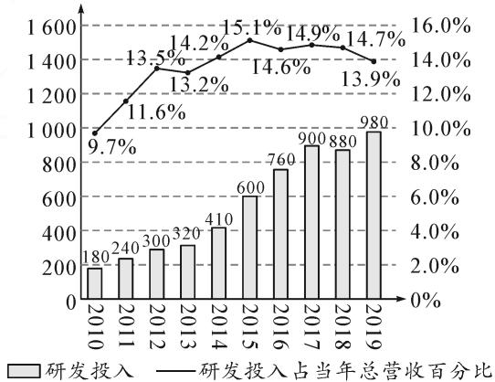

# 借助概率统计知识,科学决策开放性问题

# ●甘肃省武山县第一高级中学 马青湖

借助概率、统计中的相关知识,科学决策现实生活中的开放性问题,是近年高考中比较常见的一类创新性应用问题.此类开放性决策问题,要用数据说话,根据相应的数据支撑,计算事件发生的概率或者均值等数据;同时表达要准确,开放性决策的理由陈述不能偏离主旨,要加以合理科学决策.

# 1 根据概率合理决策

例 1 （2021 届山东省德州市高三一模数学试题）2021 年春晚首次采用“云”传播，“云”互动形式，实现隔空连线心意相通，全球华人心连心“云团圆”，共享新春氛围，“云课堂”亦是一种真正完全突破时空限制的全方位互动性学习模式。某市随机抽取 200 人对“云课堂”倡议的了解情况进行了问卷调查，记 Y 表示了解，N 表示不了解，统计结果如表 1,2 所示：

表 1

<table><tr><td>了解情况</td><td>Y</td><td>N</td></tr><tr><td>人数</td><td>140</td><td>60</td></tr></table>

表 2

<table><tr><td></td><td>男</td><td>女</td><td>合计</td></tr><tr><td>Y</td><td>80</td><td></td><td></td></tr><tr><td>N</td><td></td><td>40</td><td></td></tr><tr><td>合计</td><td></td><td></td><td></td></tr></table>

(1)请根据所提供的数据,完成上面的 $2 \times 2$ 列联表(表 2),并判断是否有 99% 的把握认为对“云课堂”倡议的了解情况与性别有关系;  
(2)用样本估计总体,将频率视为概率,在男性市民和女性市民中各随机抽取4人,记“4名男性中恰有3人了解云课堂倡议”的概率为 $P_{1}$ ,“4名女性中恰有3人了解云课堂倡议”的概率为 $P_{2}$ .试求出 $P_{1}$ 与 $P_{2}$ ,并判断二者哪个更优秀.

附:临界值参考表及参考公式:

<table><tr><td> $P(K^{2} \geqslant K_{0})$ </td><td>0.10</td><td>0.05</td><td>0.025</td><td>0.010</td><td>0.005</td><td>0.001</td></tr><tr><td> $K_{0}$ </td><td>2.706</td><td>3.841</td><td>5.024</td><td>6.635</td><td>7.879</td><td>10.828</td></tr></table>

$K^{2}=\frac{n(ad-bc)^{2}}{(a+b)(c+d)(a+c)(b+d)}$ ，其中 $n=a+b+c+d$ .

解析:(1)列联表的填写结果如表3.

表 3

<table><tr><td></td><td>男</td><td>女</td><td>合计</td></tr><tr><td>Y</td><td>80</td><td>60</td><td>140</td></tr><tr><td>N</td><td>20</td><td>40</td><td>60</td></tr><tr><td>合计</td><td>100</td><td>100</td><td>200</td></tr></table>

$$
K ^ {2} = \frac {2 0 0 (8 0 \times 4 0 - 6 0 \times 2 0) ^ {2}}{1 0 0 \times 1 0 0 \times 1 4 0 \times 6 0} = \frac {2 0 0}{2 1} \approx 9. 5 2 4 >
$$

6.635.

对照临界值表知,有99%的把握认为对“云课堂”倡议了解情况与性别有关系.

(2)用样本估计总体,将频率视为概率,根据 $2\times2$ 列联表得出,男性了解“云课堂”倡议的概率为 $\frac{80}{100}=\frac{4}{5}$ ,女性了解“云课堂”倡议的概率为 $\frac{60}{100}=\frac{3}{5}$ .

故 $P_{1} = C_{4}^{3}\cdot \left(\frac{4}{5}\right)^{3}\cdot \left(\frac{1}{5}\right)^{1} = \frac{256}{625},P_{2} = C_{4}^{3}\cdot$ $\left(\frac{3}{5}\right)^{3}\cdot \left(\frac{2}{5}\right)^{1} = \frac{216}{625}.$

显然 $P_{1}>P_{2}$ ，第一种更优秀。

点评:借助概率合理决策实际应用问题,根据不同问题所对应的事件概率的求解,借助代数运算,利用概率大小的比较与分析,作出合理科学的决策.

# 2 根据样本估计合理决策

例 2 数据统计图 1 中, 折线图是某公司从 2010 年到 2019 年这 10 年研发投入占当年总营收的百分比, 条形图是当年研发投入的确切数值(单位: 亿元).

bar_line

| Year | 研发投入 | 研发投入占当年总营收百分比 |
|------|----------|-----------------------------|
| 2010 | 180      | 9.7%                        |
| 2011 | 240      | 11.6%                       |
| 2012 | 300      | 13.5%                       |
| 2013 | 320      | 13.2%                       |
| 2014 | 410      | 14.2%                       |
| 2015 | 600      | 15.1%                       |
| 2016 | 760      | 14.6%                       |
| 2017 | 900      | 14.9%                       |
| 2018 | 880      | 14.7%                       |
| 2019 | 980      | 13.9%                       |

图1

(1)从 2010 年至 2019 年中随机选取两个年份,设 X 表示其中研发投入超过 500 亿元的年份的个数,求 X 的分布列和数学期望;  
(2) 据统计图中的信息, 结合统计学知识, 判断该公司在发展过程中是否重视研发投入, 并说明理由.

解析:(1)由条形图知,从2010年至2019年的10年间有5年的研发投入超过500亿元,故X的所有可能取值为0,1,2,则 $P(X=0)=\frac{C_{5}^{2}}{C_{10}^{2}}=\frac{2}{9},P(X=1)=$

$$
\frac {\mathrm{C} _ {5} ^ {1} \mathrm{C} _ {5} ^ {1}}{\mathrm{C} _ {1 0} ^ {2}} = \frac {5}{9}, P (X = 2) = \frac {\mathrm{C} _ {5} ^ {2}}{\mathrm{C} _ {1 0} ^ {2}} = \frac {2}{9}.
$$

所以 X 的分布列为：

<table><tr><td>X</td><td>0</td><td>1</td><td>2</td></tr><tr><td>P</td><td> $\frac{2}{9}$ </td><td> $\frac{5}{9}$ </td><td> $\frac{2}{9}$ </td></tr></table>

故 $E(X)=0\times\frac{2}{9}+1\times\frac{5}{9}+2\times\frac{2}{9}=1.$

(2)从两个方面可以看出,该公司是比较重视研发投入的:

①从 2010 年至 2019 年,每年的研发投入是逐年增加的(2018 年除外),并且增加的幅度总体上逐渐加大;  
②研发投入占当年总营收的比例总体上也是逐渐增加的，虽然2015年以后有些波动，但是总体占比还是较高的。

点评:借助样本估计合理决策实际应用问题.通过样本的平均值、众数、中位数等数据信息的运算,或利用图表信息,直观、合理比较,科学决策.

# 3 根据期望方差合理决策

例 3 [2021 届山东省淄博市高三上学期教学质量摸底检测(零模)数学试题]某商场在“双十二”进行促销活动,现有甲、乙两个盒子,甲盒中有 3 红 2 白共 5 个小球,乙盒中有 1 红 4 白共 5 个小球,这些小球除颜色外完全相同.有两种活动规则:

规则一:顾客先从甲盒中随机摸取一个小球,从第二次摸球起,若前一次摸到红球,则还从该盒中摸取一个球,若前一次摸到白球,则从另一个盒中摸取一个球,每摸出1个红球奖励100元,每个顾客只有3次摸球机会(每次摸球都不放回);

规则二:顾客先从甲盒中随机摸取一个小球,从第二次摸球起,若前一次摸到红球,则要从甲盒中摸球一个,若前一次摸到白球,则要从乙盒中摸球一个,每摸出1个红球奖励100元,每个顾客只有3次摸球机会(每次摸球都不放回).

(1) 按照“规则一”，求一名顾客摸球获奖励金额的数学期望；

(2)请问顾客选择哪种规则进行抽奖更有利,并说明理由.

解析:(1)按照规则一,设顾客经过3次摸球后摸取的红球个数为X,则X可以取0,1,2,3,有 $P(X=0)=\frac{2}{5}\times\frac{4}{5}\times\frac{1}{4}=\frac{2}{25},P(X=1)=\frac{3}{5}\times\frac{4}{5}\times\frac{2}{4}+\frac{2}{5}\times\frac{1}{5}\times\frac{4}{4}+\frac{2}{5}\times\frac{4}{5}\times\frac{3}{4}=\frac{14}{25},P(X=2)=\frac{3}{5}\times\frac{2}{4}\times\frac{2}{3}+\frac{3}{5}\times\frac{1}{5}\times\frac{2}{4}=\frac{13}{50},P(X=3)=\frac{3}{5}\times\frac{2}{4}\times\frac{1}{3}=\frac{1}{10}.$

随机变量 X 的分布列为：

<table><tr><td>X</td><td>0</td><td>1</td><td>2</td><td>3</td></tr><tr><td>P</td><td> $\frac{2}{25}$ </td><td> $\frac{14}{25}$ </td><td> $\frac{13}{50}$ </td><td> $\frac{1}{10}$ </td></tr></table>

故在规则一下,顾客摸球获奖励金额的数学期望 $E(100X)=100(0\times\frac{2}{25}+1\times\frac{14}{25}+2\times\frac{13}{50}+3\times\frac{1}{10})=138$ （元）.  
(2) 若选规则二, 设顾客经过 3 次摸球后摸取的红球个数为 Y, 则 Y 可以取 0, 1, 2, 3, 有

$$
P (Y = 0) = \frac {2}{5} \times \frac {4}{5} \times \frac {3}{4} = \frac {6}{2 5}, P (Y = 1) = \frac {3}{5} \times
$$

$$
\frac {4}{5} \times \frac {2}{4} + \frac {2}{5} \times \frac {1}{5} \times \frac {1}{4} + \frac {2}{5} \times \frac {4}{5} \times \frac {1}{4} = \frac {1 7}{5 0}, P (Y = 2) =
$$

$$
\frac {3}{5} \times \frac {2}{4} \times \frac {2}{3} + \frac {3}{5} \times \frac {1}{5} \times \frac {2}{4} + \frac {2}{5} \times \frac {1}{5} \times \frac {3}{4} = \frac {8}{2 5},
$$

$$
P (Y = 3) = \frac {3}{5} \times \frac {2}{4} \times \frac {1}{3} = \frac {1}{1 0}.
$$

随机变量 Y 的分布列为：

<table><tr><td>X</td><td>0</td><td>1</td><td>2</td><td>3</td></tr><tr><td>P</td><td>6/25</td><td>17/50</td><td>8/25</td><td>1/10</td></tr></table>

故在规则二下,顾客摸球获奖励金额的数学期望为 $E(100Y)=100\left(0\times\frac{6}{25}+1\times\frac{17}{50}+2\times\frac{8}{25}+3\times\frac{1}{10}\right)=128$ (元).

因为 $E(100X) > E(100Y)$ ，所以选择规则一更有利.

点评:根据实际问题合理选择,利用问题中数学期望最大(或最小)的方案作为最优决策方案,在数学期望相同的情况下,则进一步选择方差值最小(或最大)的方案作为最优决策方案.

借助概率统计知识,在解决日常生活、社会活动和经济活动等中的开放性应用问题时,选择科学的最佳的决策方案,体现创新意识与创新应用,提升数学能力,培养数学核心素养. Z