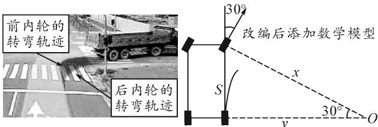

# 借助竞赛试题提高学生数学知识的应用能力

●南京航空航天大学苏州附属中学 卢芳

# 1 高中数学知识应用竞赛概述

高中数学知识应用竞赛是在众多数学家和教育家的共同倡导下举办起来的，该竞赛致力于促进高中数学课堂教学改革，培养学生发现问题、解决问题的能力，引导学生深化对数学知识的理解，体验数学知识在生活实践中的重要作用。竞赛分为初赛和决赛两部分。初赛部分为开卷考试，要求学生通过查阅相关资料、利用相关工具来完成解题；决赛部分为闭卷考试，不仅要求学生能够完成试卷，还要求学生撰写小论文。不论是初赛还是决赛，所有题目都与生活实践密切相关，注重利用数学知识来解决现实问题。新课程改革背景下，高中数学课堂教学更应该注重学生对数学知识应用能力的培养，提高学生的社会适应能力。借助高中数学知识应用竞赛试题，围绕竞赛知识题目的本质特点，将其进行改编，降低题目难度，使其符合多数学生的认知水平，是发展学生数学知识应用能力的最为行之有效的手段之一。

# 2 高中数学知识应用竞赛试题分析

从题目设置的背景来看,高中数学知识应用竞赛试题的背景以生活背景和科学背景为主,在命题的过程中,为了兼顾学生的认知水平,竞赛题目主要以生活背景为主,科学背景为辅.另外,部分题目的背景还会涉及到其他学科的知识,会体现出学科融合的特点,以此来引导学生,在日常的数学学习中,有意识地注意学科融合,提高利用数学知识解决生活实际问题的能力.

从题目参数设置和运算水平上来看,高中数学知识应用竞赛参数题目相对较少,这主要与该竞赛“发展学生利用数学知识解决问题”的宗旨有关.因为,在我们的生活实践当中,很少有问题会涉及到参数,因此,参数问题不会影响题目的难度.另外,高中数学知识竞赛题目对运算水平的要求并不高,大多是简单的符号运算,其应用场景更加贴近现实生活.

从推理能力和知识含量的设置来看,高中数学知识应用竞赛更加注重学生推理能力的考查,尤其是复杂推理能力占据了绝大多数,这是导致题目难度较大的重要因素.另外,从知识含量的设置上来看,高中数学知识应用竞赛试题主要以对某个知识点的考查为主,题目设置的综合性不强.这也从另一个角度说明在生活实践中解决问题时,并不是都需要将很多知识综合起来运用,而是选择更合适的知识来解决问题.

从解题思维的设置上来看,高中数学知识应用竞赛题目对学生顺向思维的考查大于逆向思维的考查,这与我们的生活实践极为贴近.另外,注重分析水平的题目要多于运用水平的题目,学生在解题过程中,能够直接利用的已知条件并不多,需要学生深入分析给出的已知条件,将它们作进一步的转化才能够用来解题.

例 1 通过研究人员的观察,鲑鱼在河水中逆流游动时所消耗的能量为 $E = cv^{3}T$ , 其中 v 是相对于河水的速度, T 为行进的时间(单位: h), c 为常数, 如果水流的速度为 4 km/h, 那么鲑鱼要在河水中逆流行进 200 km, 要选择怎样的速度才能够使消耗的能量最少?

题目分析:该题目以科学为背景,结合生物和物理部分的相关知识,含有常值参数,其中运算主要包含了加、减、乘、除、乘方和开方等简单的数值运算,还需要经过三步以上的推理.第一步,要借助已知条件确定出鲑鱼相对于河岸的速度.第二步,要确定出鲑鱼在运动过程中相对于河水的速度v与时间之间的关系.第三步,根据推理写出鲑鱼消耗的能量E与相对于河水的速度v的关系式.最后,根据前面的推理解决问题.题目中暗含的条件较多,需要学生进行深入分析,通过顺向思维来完成解题.

# 3 借助竞赛试题提高学生知识应用能力的策略

高中数学知识应用竞赛试题主要以发展学生数学知识应用能力来设计的，在高中数学教学中引入高中数学知识应用竞赛试题能够有效提升学生的数学知识应用能力及数学核心素养。但是，高中数学知识应用竞赛原题难度较大，并不适合多数的高中学生。这就要求我们对高中数学知识应用竞赛原题进行改编，使其适合普通学生的认知水平，从而发挥出高中数学知识应用竞赛试题在提高学生数学知识应用能力过程

中的重要作用.

# 3.1 对题目中已有的关键陌生词汇给予适当提示

高中数学知识应用竞赛具有一定的时代性,信息前沿性较为明显.在试题中,很多关键信息都是学生没有接触过的,部分词汇学生会感觉很陌生,而这些词汇恰恰是解决问题的关键,学生如果不理解就会导致解题障碍,影响解题效果.此时,我们就可以对原有题目中的陌生关键词汇进行解释,帮助学生理解题意,从而降低题目的难度,使其符合多数学生的认知水平.

例 2 内轮差是车辆在转弯的过程中,前内轮的转弯半径和后内轮的转弯半径之差.在生活实践中,车辆在转弯的过程中前后轮的运动轨迹是不重合的,相对于前轮,后轮的转弯轨迹会向所转方向的内侧发生偏移,产生内轮差.车辆的轴距越大,偏移量就越大,内轮差就越大.在行车转弯过程当中,如果我们只关注前轮的运动轨迹而忘记内轮差,就会导致车辆前轮顺利通过,而后轮会驶出路面或发生碰撞.如图1所示,为一辆右转弯时大货车前后轮的运动轨迹,如果该车辆前后轴距为5 m,前轮的转向角为30°,请求出右前轮与右后轮的内轮差,并对站在路边等待通行的行人依次提出安全建议.

text_image

前内轮的
转弯轨迹
后内轮的
转弯轨迹
30°
改编后添加数学模型
x
S
v
30°
O

图 1  
图 2

问题分析: 在该题目中, 结合图片和文字信息, 寻找和理解转向角是重点, 尤其是如何表示转向角, 寻找前后内轮的转弯半径和转向角的关系是关键. 在对这一题目进行改编时, 可以将转向角这一概念通过数学模型(如图 2)的形式给出, 降低学生的理解难度; 还能够使学生在阅读题目和观察数学模型的过程中, 提高对数学模型的认识, 加深对数学模型与生活实践之间关系的理解.

# 3.2 替换试题背景

试题背景信息也是影响试题难度的一个重要因素.如果选择的试题信息背景较为陌生,学生在阅读过程中就会产生陌生感,无形之中就会增加题目的难度.因此,在对高中数学知识应用竞赛试题进行改编时,可以在保留题目原有考查知识点的基础上换成学生熟悉的问题背景,从而降低题目难度.

例 3 春节期间为了活跃气氛,大家喜欢在微信群里玩抢红包的游戏.该游戏共有10人参与,每人在群内发一次额度一样的红包,每发一次红包系统都会将其拆分成10个金额不等的红包,抢到手之前谁也不知道自己手中红包的金额.在一次派发红包的过程中,我们将抢到红包金额最小的称之为“手气最差”,将抢到红包金额最大的称之为“手气最佳”,参与10次抢红包后,请计算出:

(1)全部抢到“手气最差”的概率；  
(2) 至少抢一次“手气最佳”的概率；  
(3)如果将抢到红包的金额由大到小依次排序，列出第一名到第十名，那么抢到红包的最高名次为第五名的概率是多少？

问题分析:该题目的背景选自微信群红包问题,对很多家庭较为贫困,父母平时管教严格的学生来说,这个生活场景他们较为陌生.我们可以选择体育比赛场景来替换微信群红包.

# 3.3 加入引导性问题

层层递进的问题引导能够激活学生的思维,有效降低问题的难度.我们对高中数学知识应用竞赛试题进行改编的时候,可以适当加入引导性问题,降低题目的难度.

例 4 我们在晚上卖鞋的时候经常看到这样的尺码对照表(表 1):

表 1 尺码对照表

<table><tr><td>中国鞋码实际标注(同国际码)/mm</td><td>220</td><td>225</td><td>230</td><td>235</td><td>240</td><td>245</td><td>250</td><td>255</td><td>260</td><td>265</td></tr><tr><td>中国鞋码习惯叫法(同欧码)</td><td>34</td><td>35</td><td>36</td><td>37</td><td>38</td><td>39</td><td>40</td><td>41</td><td>42</td><td>43</td></tr></table>

(1) 寻找满足上面条件的计算公式, 通过实际脚长 x 计算出鞋号 y.  
(2)“30号”童鞋对应的脚实际尺寸是多少?   
(3)某篮球运动员的脚长为 282 mm, 他应该选购多大号的鞋子?

问题分析:题目中的问题有三问,我们可以将其拆分为五问.(1)观察表1的第一行数据,用通项式公式表示出国际码的规律.(2)观察第二行数据,用通项式公式表示出欧码的规律.(3)寻找二者的关系,根据实际脚长x计算鞋号y.(4)“30号”童鞋的尺寸是多少?(5)某篮球运动员的脚长为282 mm,他应该选购多大号的鞋子?Z