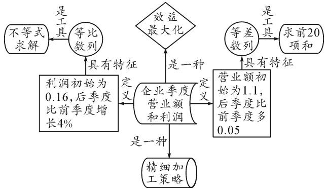
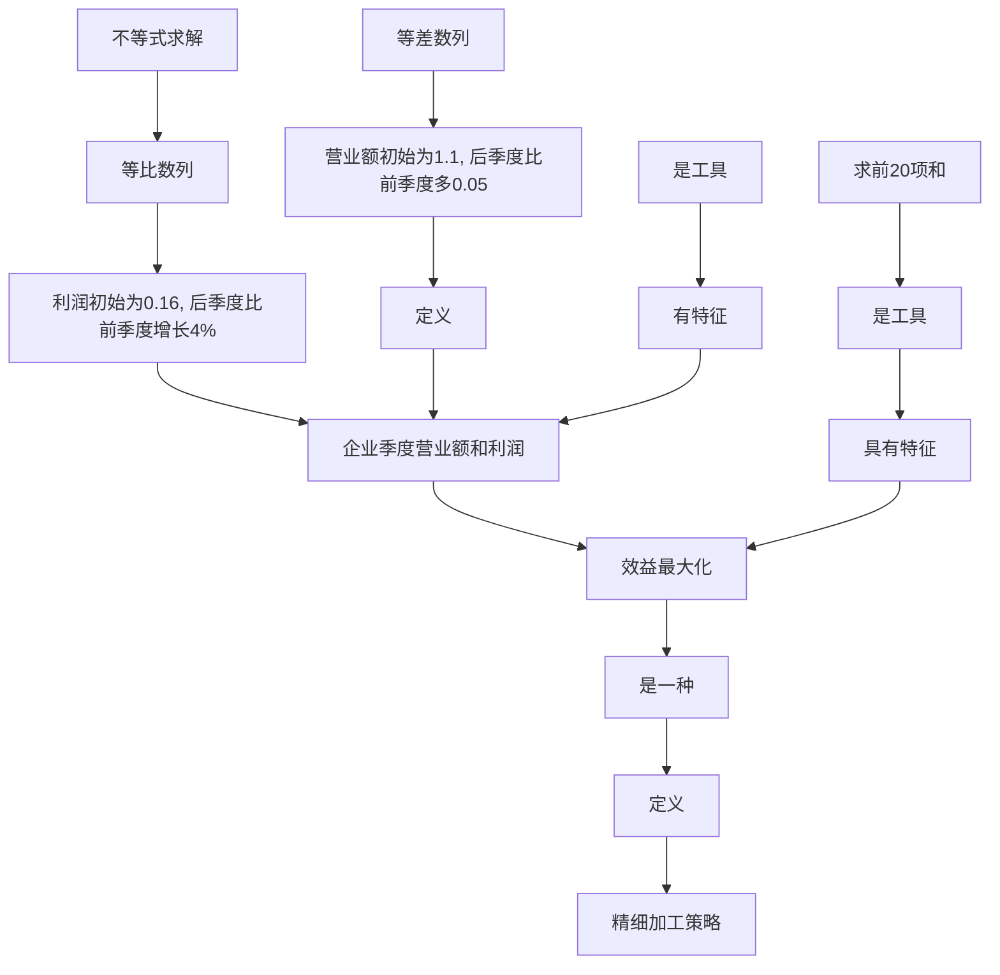
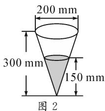
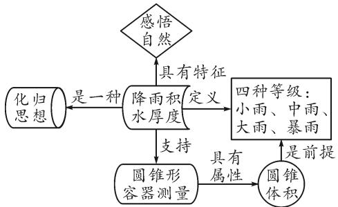
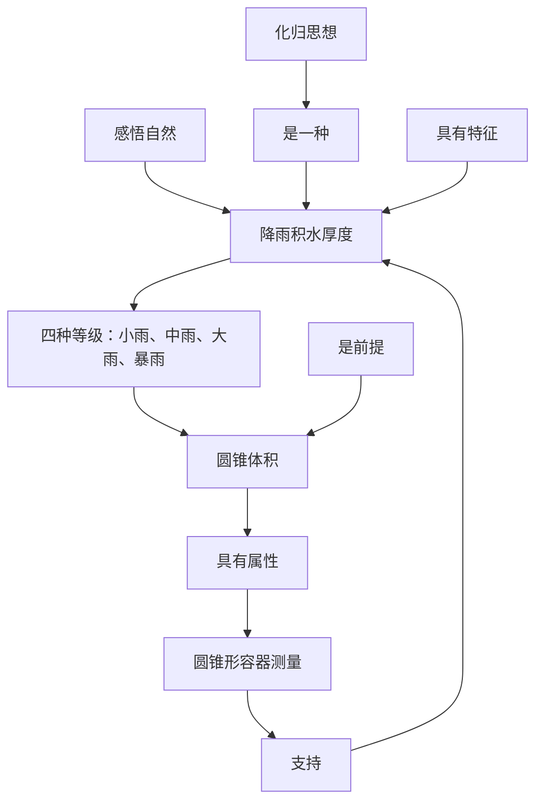
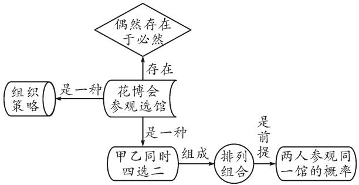
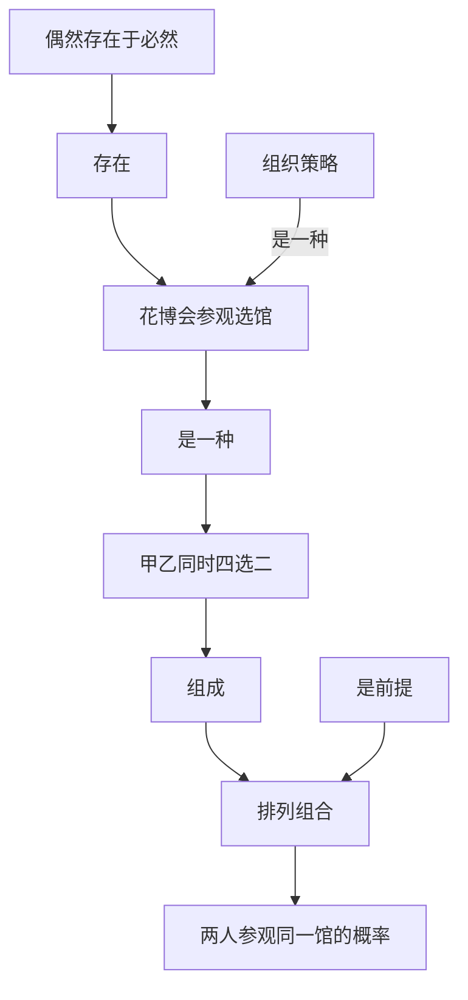

# 基于知识建模图的数学建模素养的应用分析

——以 2021 年高考题为例

●广西师范大学数学与统计学院 王素素 张映辉 罗瑶

摘要: 数学建模素养能够促进学生建构数学模型、解决生活实际问题, 是数学六大核心素养之一. 本文中基于知识建模图的理论对 2021 年数学高考题中的建模题目进行分析, 探究数学建模素养在现实中的应用价值, 并提出培养学生数学建模素养的教学建议, 致力于推动素质教育的改革和发展.

关键词: 知识建模图; 数学建模; 高考题; 素质教育

# 1 数学建模与知识建模图

数学建模素养是促进学生有效进行数学研究性学习的重要因素之一,具有深刻的现实应用性,是数学六大核心素养之一.在数学教学方面,王俊杰[1]和吴幼林[2]均指出数学建模是搭建数学与生活的关键性桥梁,数学建模素养可以提升学生的探究能力和创新能力,进而对学生数学核心素养的培养与发展有深刻的影响和意义.在数学学习方面,何江[3]认为数学建模题目可以激发学生的想象力,有效地培养学生严密的数学逻辑思维,在数学建模的过程中提高学生的综合能力;唐费颖[4]指出数学建模实践活动可以增强学生学习主动性,并推动学生在建模体验中感悟与反思,不断累积解决生活中数学问题的经验.在数学评价方面,兰小银[5]提出对学生数学建模素养的评价须要改进教学活动中评价工具和评判标准,在试题的难度和背景等方面要进一步加强高考数学建模试题的有效性,巩固高考对数学建模素养的测验功能.因此,从2021年数学高考题中深入探究其数学建模相关题目将会对数学教学、学习与评价具有很大的指导意义.但以往的文章大都是直接从题目入手,简单抽离出题目所蕴含的重要概念,进行题目的常规分析与解答,缺乏对题目隐含的数学建模素养进行深度解析.

知识建模图是依据特有的标准,用不同的图形符号表示各个类型的知识点,并使用特定规范的语言描述各个类型知识点之间的关系,从而将知识体系的结构直观明了地表现出来 $^{[6]}$ .本研究利用知识建模图,构建高考数学建模试题隐含的知识脉络与框架,引导教师在课堂教学中利用知识建模图将数学知识串联与归类,在课堂中形成研究性学习氛围,推动学生从知识建模图中培养数学建模核心素养.

# 2 建构知识建模图的 2021 年高考题分析

从课程标准对数学建模的定义出发,解析2021年的数学高考卷总共8套10份试卷(全国甲卷文理、全国乙卷文理、新高考Ⅰ卷),数学建模类的题目总共只有22道题(包含选修题),占比7.67%,大多是在概率统计题目中有所涉及.所占比例比较小的数学建模类高考题,表现出明显的题目难度较小、区分度不高的特征.越是难的题目越不容易披上“现实应用”的外衣.如何促进数学建模类高考题的改革与发展是一个持续性的教学发展问题.

本研究将从函数、几何、概率三个方面构建例题的知识建模图，并依据知识建模图的输出结果进行例题的思路分析。知识建模图用六种图形分别表示不同的知识类型：第一种是用○表示知识的概念与定义；第二种是用□表示知识的原理及格式；第三种是用□表示知识连接的过程和方法；第四种是用□表示学习过程中的认知策略；第五种是用□表示题目外显的事实范例；第六种是用◇表示题目隐含的价值观。不同的知识点之间定义了十种关系：(1)包含；(2)构成、组成；(3)是一种；(4)具有属性；(5)具有特征；(6)定义；(7)并列；(8)是前提；(9)是工具；(10)支持[7]。将高考应用题按照知识点再分类，依据类别分别对所选例题进行知识建模图的构建，有利于培养学生“依题构图，用图解题”的解题习惯，促进学生数学建模素养的形成与发展。

# 2.1 紧抓函数主线,解答数学建模问题

函数是高中数学最基础的数学概念,贯穿高中数学学习的整个过程之中.以函数为主线的数学建模试题,具有清晰的数学关系和严密的解题步骤.数学建模试题中隐含的函数概念,需要学生进行简单的梳理和归类,从而针对性地对函数类的数学建模题进行建模与解答.

例 1 [2021 年高考数学上海卷(夏季)第 19 题] 已知某企业今年(2021 年)第一季度的营业额为 1.1 亿元,以后每个季度(一年有四个季度)营业额都比前一季度多 0.05 亿元,该企业第一季度利润为 0.16 亿元,以后每一季度的利润都比前一季度增长 4%.

(1) 求 2021 第一季度起 20 季度的营业额总和；  
(2)问哪一年哪个季度的利润首次超过该季度营业额的 18%?

思路分析:由例1建构知识建模图如图1,以计算企业季度营业额和利润为事实范例进行题目导入.第(1)问中定义企业营业额的增长幅度,其增长幅度具有等差数列的函数思想,利用精细加工策略驱动学生从头脑中调动等差数列相关知识点,用等差数列中的前n项和公式 $S_{n}=na_{1}+\frac{n\times(n-1)}{2}d$ 作为运算工具,利用题干中“1.1为等差数列的首项 $a_{1}$ ,0.05为公差d”的信息,求解前20项的和 $S_{20}$ ,最后得出前20季度营业额为 $S_{20}=20a_{1}+\frac{20\times19}{2}\times d=31.5$ (亿元);第(2)问中定义企业利润的增长走势,其增长走势具有等比数列的函数思想,同样利用精细加工策略驱动学生从头脑中调动等差、等比数列相关知识点,用等差、等比数列通项公式 $a_{n}=a_{1}+(n-1)d,b_{n}=b_{1}q^{n-1}$ 作为运算工具,利用题干中“0.16为等比数列的首项 $b_{1}$ ,0.04为公比q”和“1.1为等差数列的首项 $a_{1}$ ,0.05为公差d”的信息,得到 $a_{n}=1.1+0.05(n-1),b_{n}=0.16\times0.04^{n-1}$ ,建立不等式 $a_{n}\times0.18<b_{n}$ ,求解得出 $n_{min}=26$ .此题考验学生对等差、等比数列概念的理解与应用,以及等差数列与等比数列的区别,是较为典型且难度中等的数列题目.借用企业季度的营业额和利润为事实背景,使学生更加清晰地去理解题目所外显的意义,刺激学生对数学经济的敏感度,从而促进学生在生活实际应用中,从效益最大化的角度去考虑和解决问题.

flowchart

图 1 “企业季度营业额和利润”知识建模图

# 2.2 以立体几何为模型,转换条件进行解题

立体几何题目对学生的空间想象能力具有较高的要求,但数学建模试题通常会对模型进行简要的文字描述,使题目难度降低.学生只需对立体几何类题目进行条件转换,以繁化简,输出所学知识点即可解答该类题目.

例 2 （2021 年高考数学北京卷第 8 题）定义: 气象学中 24 小时内降水在平地上积水厚度(mm)来判断降雨程度. 其中小雨（<10 mm），中雨(10 mm～25 mm)，大雨(25 mm～50 mm)，暴雨

text_image

200 mm
300 mm
150 mm
图 2

(50 mm\~100 mm), 小明用一个圆锥形容器接了 24 小时的雨水, 如图 2, 则这天降雨属于哪个等级().

A. 小雨

B. 中雨

C. 大雨

D. 暴雨

思路分析:由例2建构知识建模图如图3,以测量降雨积水厚度来判断降雨等级为事实范例进行题目导入,定义四种降雨等级(小雨、中雨、大雨、暴雨).根据信息中圆锥形容器的集水量,促使学生从知识体系中提取圆锥体积公式 $V=\frac{1}{3}\pi r^{2}h$ ,利用相似三角形对应边成比例计算出圆锥阴影部分的底面半径 $r=\frac{200}{2}\times\frac{150}{300}=50(\mathrm{mm})$ ,用圆锥阴影部分的体积与大圆锥的底面面积相除得到积水厚度 $d=\frac{\frac{1}{3}\pi\times50^{2}\times150}{\pi\times100^{2}}=12.5(\mathrm{mm})$ ,最终与四种降雨类型匹配得出降雨属于中雨.此题目中蕴含的化归思想作为一种思想工具,关键是要学会利用圆锥体积计算公式去转换所求的问题,是较为典型的几何图形的题目.借用降雨积水厚度的测量背景,使学生更加深刻地感悟自然中的事物,从而能使其在生活实际应用中,利用几何模型解答生活中的疑惑.

flowchart

图 3 “降雨积水厚度”知识建模图

# 2.3 巧用时事政治,理解概率统计相关知识

以时事政治为背景的数学建模试题通常是概率统计类题目,其中排列组合是此类题的难点.学生需对题目进行剖析,准确定位题目所属的概率问题,对排列的不同情况进行分类讨论,凸显学生解题的细心与耐心.

例 3 [2021 年高考数学上海卷(夏季)第 10 题] 甲、乙两人在花博会的 A, B, C, D 不同展馆中各选 2 个去参观，则两人选择中恰有一个馆相同的概率为 \_\_\_\_.

思路分析:由例3建构知识建模图如图4,以参观花博会为题目背景,给出甲乙两人需同时在四个馆中选择两个馆去参观的事实范例,由此构成了排列组合问题,这是较为典型的古典概率问题.利用组织策略梳理解题脉络,甲、乙两人四选二共有 $C_{4}^{2}\cdot C_{4}^{2}=36$ 种参观情况,甲、乙两人恰好参观同一个馆共有 $C_{4}^{1}\cdot C_{3}^{1}\cdot C_{2}^{1}=24$ 种参观情况,因此两人恰好参观同一馆的概率为 $\frac{24}{36}=\frac{2}{3}$ ,将“偶然存在于必然之中”的观念应用到生活实际中.此题巧用时事政治的背景,贴近学生的感知生活,使得学生解答这类题目时更加有代入感,将数学作为问题解决的工具,实现生活与数学的融会贯通.

flowchart

图 4 “花博会参观选馆”知识建模图

# 3 教学建议

2021年的数学高考题仍旧以应试题目为主,数学建模类考题占比很低,且题目难度为中等,试题可抽象出简单的函数或公式问题,对培养学生的数学核心素养具有一定的指导意义.问题是数学的心脏,但是数学问题来源于生活实践.离开生活实践、缺少数学建模的试题难以培养学生多元化的探究思维能力和创新实践能力.当今教育改革大力倡导素质教育,着重培养学生的实践能力和创新能力,数学高考题需从数量、讲解、应用性的角度培养学生的数学建模素养,加强学生在生活中应用数学的能力.基于此,笔者提出以下三点建议.

# 3.1 适当增大数学建模类高考试题的数量

高考试题的内容和类型很大程度上影响着教师在课堂中教授的知识内容.2021年全国各个地区的高考题从实时政治、生活情境中间接考查学生的理性思维，符合新课标的要求.但是数学建模类高考试题的数量偏少，使得学生把数学学习的重心转向盲目刷题、死记硬背上.数学建模试题考查学生“用数学”的基本能力，需要学生具有较强的逻辑思维.因此，只有提高高考数学建模试题的数量,才能使学生转变“应试”思维,加强数学建模素养的培养.

# 3.2 注重数学建模类例题的讲解

“双减”政策的提出与实施，为数学课堂注入了新的活力与动力。义务教育“减负”之余，提高了学生的成才质量，同时对其核心素养的要求也会不断提高。教师要注重对学生研究性学习习惯的培养，从例题中解读数学问题的一般化，并推广至同一个类型的题目，以此培养学生探究问题、研究实例、创新方法的能力[8]。因此在基础教育阶段，教师在讲解建模类例题时，可以充分运用知识建模图，在建构的过程中培养学生的数学建模素养。

# 3.3 促进生活中的数学与课堂中的数学有机结合

目前大多数人对数学建模题产生了误解,即认为数学建模题目解答的过程与数学应用题的求解过程是一模一样的[9],其实不然.数学建模题侧重于用严密的数学工具去解决生活中的现实问题,并非简单的求解数学应用题.在数学教学过程中,唯有将生活中的数学与课堂中的数学良好地结合在一起,学生在数学学习与探究中才会感受到数学的美与趣.这便要求教师在教学过程中要注重“五化”策略——背景化、探究化、经验化、迁移化、直觉化的实施[10].通过“五化”策略构建知识建模图,展现系统的知识结构与框架,提高学生探究数学问题的能力,促进学生形成有深度的数学建模素养.

# 参考文献：

[1] 王俊杰. 谈核心素养下数学建模思想在解高考数学题中的应用策略 [J]. 数学学习与研究, 2021(23): 84-85.  
[2]吴幼林,蒋瑞,汪玲君.高考改革背景下高中数学建模教学研究[J].新课程研究,2021(22):37-38.  
[3]何江.基于核心素养下的初中数学课堂教学策略——以数学建模为例[J].数学学习与研究,2021(30):34-35.  
[4]唐费颖.高中生数学基本活动经验与数学建模核心素养的关系研究[J].数学通报,2021,60(9):12-19.  
[5]兰小银，张德兴，胡彬.从“高考真题”看“核心素养”的考查——对2020年高考数学中数学建模素养试题的探讨[J].中学数学，2021(11)：25-27,29.  
[6]何文涛,李梦晴,路璐,等.基于知识建模图的教材知识内容分析理路与应用价值[J].远程教育杂志,2021,39(1):104-112.  
[7]杨开城,孙双.一项基于知识建模的课程分析个案研究[J].现代教育技术,2010,20(12):20-25.  
[8]赵思林,王佩.一道高考不等式题引发的研究性学习[J].数学通报,2018,57(11):40-42.  
[9] 王颖喆. 关于中学数学建模教与学的思考 [J]. 数学通报, 2020, 59(11): 1-3, 30.  
[10]赵思林，汪洋，王佩，等.实施教育数学的“五化”策略[J].数学通报，2021,60(4):30-34.Z