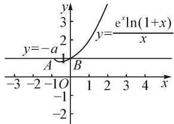
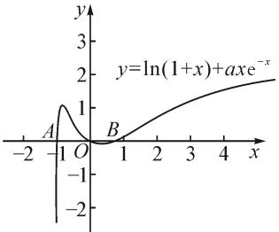

# 对一道高考题的解法研究\*

# ●合肥师范学院数学与统计学院 方晶 张新全

摘要:通过对2022年全国高考乙卷理科数学第21题的研究,给出了试题的多种解法并剖析其解题思路,总结了函数压轴题的常见解题思路与教学策略,提出了高中数学教学建议,以期促进数学教学的改进和学生数学核心素养的达成.

关键词: 导数; 函数零点; 参变分离; 数学核心素养

# 1 试题呈现

2022年全国高考数学乙卷理科第21题如下：

已知函数 $f(x)=\ln(1+x)+axe^{-x}$ .

(1) 当 a=1 时, 求曲线 $y=f(x)$ 在 $(0,f(0))$ 处的切线方程;  
(2) 若 $f(x)$ 在区间 $(-1,0), (0, +\infty)$ 各恰有一个零点，求 $a$ 的取值范围.

该题背景熟悉,题干简约,问题明确,以对数函数和指数函数为载体,考查了曲线在一点处切线的求法,以及利用导数研究函数零点的方法,对考生综合运用数学知识解决问题的能力要求较高.作为一道导数及其应用的压轴题,涵盖的知识点多且解题思路也多,深入考查了学生的数学抽象、逻辑推理、数学运算和直观想象等数学核心素养,是一道经典且有新意的试题.

# 2 解法探究

该题秉承了压轴题的一贯命题思路,作为导数及其应用的压轴题,第(1)问的求解较为简单,考查了曲线在一点处切线方程的求法,为后续解答作铺垫.第(2)问难度比较大,通过限定零点的范围求参数的取值范围,需要综合运用数形结合、参变分离和分类讨论等思想方法,通过函数图象的交点、函数的零点及其性质和零点转化为方程的根等思路求解 $^{[1]}$ .研究该类试题的解法,有助于教师与学生提升解决综合性问题的能力,并进一步改善教与学.因此,下面我们重点研究第(2)问的解法.

# 2.1 第(1)问的简要解答

当 a=1 时， $f(x)=\ln(1+x)+xe^{-x}$ ， $f'(x)=\frac{1}{1+x}+(1-x)e^{-x}$ ，则 $f(0)=0$ ， $f'(0)=2$ 。因此，曲线 $y=f(x)$ 在 $(0,f(0))$ 处的切线方程为 y=2x。

# 2.2 第(2)问的解法探究

方法一:仔细观察函数 $f(x)$ ，可利用变量分离法研究函数的零点问题。分离后的参变量是关于 x 的函数，可利用其导数分析函数的性态，以其驻点作为分界点进一步进行讨论，求解过程中还利用了极限逼近的思想，最终求得符合条件的 a 的取值范围。

解法1:分离参变量,得 $-a=\frac{\mathrm{e}^{x}\ln(1+x)}{x}$ , 则直线
y = -a 与曲线 $y = \frac{\mathrm{e}^{x}\ln(1+x)}{x}$ 在区间 $(-1, 0), (0, +\infty)$ 各恰有一个交

line

| Point | x | y |
|---|---|---|
| A | -1 | 0 |
| B | 1 | 2 |
| Point A (y=-a) | 1 | 2 |
| Point B (y=ex) | 1 | 3 |
The graph is a line plot of the function y = e^x ln(1 + x) over the interval [0, 4]. The x-axis ranges from -3 to 4 and the y-axis ranges from -2 to 3. The function is defined as: y = e^x ln(1 + x) / x. The chart is in the upper left corner.

图 1

点(如图1).下面利用导数研究函数 $y=\frac{\mathrm{e}^{x}\ln(1+x)}{x}$ 的性态.

记 $g(x) = \frac{\mathrm{e}^x\ln(1 + x)}{x}$ , 则 $g'(x) = \frac{\mathrm{e}^x}{x^2(x + 1)} \cdot [(x^2 - 1)\ln(1 + x) + x]$ . 令 $h(x) = (x^2 - 1)\ln(1 + x) + x$ , 则 $h'(x) = x[1 + 2\ln(1 + x)]$ , 令 $h'(x) = 0$ , 解得 $x = 0$ 或 $x = \mathrm{e}^{-\frac{1}{2}} - 1$ .

所以，当 $x \in (-1, \mathrm{e}^{-\frac{1}{2}} - 1)$ 时， $h'(x) > 0, h(x)$ 单调递增；当 $x \in (\mathrm{e}^{-\frac{1}{2}} - 1, 0)$ 时， $h'(x) < 0, h(x)$ 单调递减；当 $x > 0$ 时， $h'(x) > 0, h(x)$ 单调递增；当 $x \to -1^{+}$ 时， $h(x) \to -1$ ，且 $h(0) = 0$ 。故存在 $x_0 \in (-1, e^{-\frac{1}{2}} - 1)$ ，使得 $h(x_0) = 0$ 。所以当 $x \in (-1, x_0)$ 时， $h(x) < 0, g(x)$ 在 $(-1, x_0)$ 内单调递减；当 $x \in (x_0, 0)$ 时， $h(x) > 0, g(x)$ 在 $(x_0, 0)$ 内单调递增；当 $x > 0$ 时， $h(x) > 0, g(x)$ 在 $(0, +\infty)$ 内单调递增。又当 $x \to -1^{+}$ 时， $g(x) \to +\infty$ ，当 $x \to 0$ 时， $g(x) \to 1$ ，当 $x \to +\infty$ 时， $g(x) \to +\infty$ 。由题意可得 $-a > 1$ ，即 $a < -1$ 。

故 a 的取值范围为 $(-∞,-1)$ .

评注:上述解法是较为常见的分离参数法,往往涉及的数学思想比较丰富,比如极限思想、分类思想等.在分离参数求解的过程中,还可以融入数形结合思想,此时可以引导学生通过绘制两个函数的图象,先大致判断a的取值范围,有助于学生求解其准确范围,并且二者之间可以相互验证.该题的求解有助于学生数学抽象、逻辑推理等核心素养的达成.

方法二: 利用求导的方式, 用单调区间分析推出参数的取值范围. 观察导函数的特征并探讨分界点 a = -1, 结合函数的单调性, 判断情形一和情形二与题意矛盾, 即利用反证法再次缩小范围, 借助零点定理和特殊值法求得缩小后的区间, 通过不断缩小区间, 验证 a 的取值范围的合理性.

解法 2: 由题意可得 $f'(x)=\frac{\mathrm{e}^{x}+a(1-x^{2})}{\mathrm{e}^{x}(1+x)}$ , $f'(0)=1+a$ . 设 $g(x)=\mathrm{e}^{x}+a(1-x^{2})$ , 则 $g(0)=1+a$ , 因此讨论分界点 a=-1.

情形一: 若 $a \geqslant 0$ ，则当 x > 0 时， $f(x) > 0, f(x)$ 在 $(0, +\infty)$ 内无零点，这与 $f(x)$ 在 $(0, +\infty)$ 内恰有一个零点矛盾，故不可能有 $a \geqslant 0$ .

情形二: 若 $-1 \leqslant a < 0$ ，则当 x > 0 时， $g(x) > g(0) = 1 + a \geqslant 0$ ，从而 $f'(x) > 0$ ，故 $f(x)$ 在 $(0, +\infty)$ 上单调递增。所以当 x > 0 时， $f(x) > f(0) = 0$ ， $f(x)$ 在 $(0, +\infty)$ 内无零点。故不可能有 $-1 \leqslant a < 0$ 。

情形三: 若 a<-1，则 $g(x)$ 在 $(0,+\infty)$ 内单调递增，且 $g(0)=1+a<0, g(1)>0$ ，故由零点定理可得 $g(x)$ 在 $(0,1)$ 存在唯一零点 $x_{1}$ ，所以 $f(x)$ 在 $(0,x_{1})$ 内单调递减，在 $(x_{1},+\infty)$ 内单调递增，如图2.又因为 $f(0) = 0$ ，所以 $f(x)$ 在 $(0,x_{1})$ 无零点，且 $f(x_{1}) < 0$ ，又 $\mathrm{e}^x >1 + x > x(x > 0)$ ，所以 $0<$ $\frac{x}{\mathrm{e}^x} < \frac{x}{x} = 1$ ，则有 $\frac{ax}{\mathrm{e}^x} >a$ ，于是， $f(x) = \ln (1 + x) +$

line

| x    | y         |
| ---- | --------- |
| -2   | -2        |
| -1   | 1         |
| 0    | 0         |
| 1    | 1         |
| 2    | 2         |
| 3    | 3         |
| 4    | 4         |

图2

$ax\mathrm{e}^{-x}>\ln(1+x)+a$ ，取 $m=\mathrm{e}^{-a}$ ，则 $f(\mathrm{e}^{-a})>\ln(1+\mathrm{e}^{-a})+a>\ln\mathrm{e}^{-a}+a=0$ ，故 $f(x)$ 在 $(0,+\infty)$ 内恰有一个零点.

又因为 $g'(x)=\mathrm{e}^{x}-2ax$ ，所以当 a<-1 时， $g'(x)$ 为增函数，且 $g'(-1)=\frac{1}{\mathrm{e}}+2a<0, g'(0)=1>0$ ，故由零点定理可得 $g'(x)$ 在 $(-1,0)$ 内存在唯一零点 $x_{2}$ 。所以 $g(x)$ 在 $(-1,x_{2})$ 内单调递减，在 $(x_{2},0)$ 内单调递增，于是， $g(x_{2})<g(0)=a+1<0$ ，而 $g(-1)=\frac{1}{\mathrm{e}}>0$ ，则由零点定理可得，存在唯一零点 $x_{3}\in(-1,x_{2})$ ，使得 $g(x_{3})=0$ 。所以 $f(x)$ 在 $(-1,x_{3})$ 内单调递增，在 $(x_{3},0)$ 内单调递减。因为 $f(0)=0$ ，所以 $f(x)$ 在 $(x_{3},0)$ 内无零点，且 $f(x_{3})>0$ 。取 $n=e^{3a}-1$ ，则 -1<n<0， $f(n)=\ln(1+n)+ane^{-n}<a(3-e)<0$ ，故 $f(x)$ 在 $(-1,0)$ 内恰有一个零点。

综上所述，a 的取值范围是 $(-∞,-1)$ .

评析: 我们可以通过导数确定分界点, 进而借助其判断各区间是否满足题意. 这种解法的亮点是通过特殊值来运用零点定理缩小猜想的范围, 通过三次缩小范围, 进而确定 $f(x)$ 在 2 个区间内分别恰有一个零点的合理性. 同样, 在数学教学中, 我们可以引导学生通过取特殊值的方式, 大胆猜想结论, 这样解题的难度将会有所减小 $^{[2]}$ .

方法三:在方法二的基础上,进一步采用极限思想和逼近思想进行求解.确定参数 a 的取值范围问题往往涵盖了函数值域、求导、极值和单调性等知识点,综合考查了极限思想,数形结合和分类讨论等思想方法,进而求得 a 的取值范围.解决这样一类有难度的数学问题,可以通过高等数学中根的存在性定理、极限的保不等式性、极值分析法和夹逼准则等,以更开阔的视角来解决函数压轴题 $^{[3]}$ .

解法 3: 情形一: 若 $a \geqslant 0$ 时, $f'(x) = \frac{1}{1 + x} + \frac{a(1 - x)}{\mathrm{e}^x} = \frac{1}{1 + x} \left[ 1 + \frac{a(1 - x^2)}{\mathrm{e}^x} \right]$ , 令 $g(x) = 1 + \frac{a(1 - x^2)}{\mathrm{e}^x}$ , 则 $g'(x) = a \mathrm{e}^{-x}(x^2 - 2x - 1)$ , 令 $g'(x) = 0$ , 可解得驻点 $x_1 = 1 - \sqrt{2}, x_2 = 1 + \sqrt{2}$ , 由一阶导数的符号可以得出, $g(x)$ 在 $(-1, 1 - \sqrt{2})$ 内单调递减, 在 $(1 - \sqrt{2}, 1 + \sqrt{2})$ 内单调递增, 在 $(1 + \sqrt{2}, +\infty)$ 内单调递减.

情形二：若 $-1 \leqslant a < 0$ 时，当 $x \in (0, 1 + \sqrt{2})$ 时， $g(x) > g(0) = 1 + a \geqslant 0$ ，又 $\lim_{x \to +\infty} g(x) > 0$ 时，所以 $f(x)$ 在 $(0, 1 + \sqrt{2})$ 上单调递增，在 $(1 + \sqrt{2}, +\infty)$ 上单调递增，即 $f(x)$ 在 $(0, +\infty)$ 内单调递增，又 $f(x) > f(0) = 0$ ，这与 $f(x)$ 在 $(0, +\infty)$ 内恰有一个零点矛盾.

情形三：当 $a < -1$ 时，①先讨论 $f(x)$ 在 $(-1,0)$ 上恰有一个零点，因为 $g(0) = a + 1 < 0, g(-1) = 1 > 0$ ，且 $g(x)$ 在 $(-1,0)$ 内单调递减，故由零点定理可得，存在唯一的一点 $x_0$ ，使得 $g(x_0) = 0.$ 且当 $x \in (-1, x_0)$ 时， $g(x) > 0$ ，即 $f'(x) > 0$ ，亦即 $f(x)$ 在 $(-1, x_0)$ 内单调递增；同理可得，当 $x \in (x_0, 0)$ 时， $f(x)$ 在 $(x_0, 0)$ 内单调递减。又 $f(0) = 0$ ，故 $f(x_0) > 0$ ，当 $x \in (-1, x_0)$ 时， $g(x) > g(x_0) = 0$ ，即 $f'(x) > 0$ ，又 $\lim_{x \to -1^+} f(x) = -\infty$ ，所以 $f(x)$ 在 $(-1,0)$ 内恰有一个零点。

②下面讨论 $f(x)$ 在 $(0, +\infty)$ 内恰有一个零点，因为 $g(0) = a + 1 < 0, g(1) = 1 > 0$ ，又 $g(x)$ 在 $(0, 1)$ 内单调递增，故由零点定理可得，存在唯一的一点 $x_{1} \in (0, 1)$ ，使得 $g(x_{1}) = 0$ 。当 $x \in (0, x_{1})$ 时， $g(x) < 0$ ，即 $f'(x) < 0$ ，所以 $f(x_{1}) < 0$ ，当 $x \in (x_{1}, 1)$ 时， $g(x) > 0$ ，即 $f'(x) > 0$ 。

又当 $x \geqslant 1$ 时， $f'(x) = \frac{1 + a\mathrm{e}^{-x}(1 - x^2)}{1 + x} > \frac{1}{1 + x} > 0$ ，故 $f(x)$ 在 $(0, x_1)$ 内单调递减，在 $(x_1, +\infty)$ 内单调递增，又 $f(x_1) < 0$ ， $\lim_{x \to +\infty} f(x) = +\infty$ ，故 $f(x)$ 在 $(0, +\infty)$ 内恰有一个零点。

综上所述，a 的取值范围是 $(-∞,-1)$ .

评析:这种方法同方法二均采用了求导和分类讨论的方式求解,但又区别于方法二,更加强调了对导数 $f'(x)$ 中 $g(x)$ 的探讨,其中所蕴含的极限思想也更加有利于理解其阐述的含义.因此,也使得思维愈加深入地接近数学问题的本质,而站在更前瞻更高端的数学视角求解函数压轴题,有助于学生找到解决数学问题的突破口,这既是传承也是发展,高中数学的课程体系也因此注入了新鲜的活力.

# 3 教学启示

# 3.1 立足教材,重视基础

高中数学教学以发展学生数学学科核心素养为导向，引导学生把握数学内容的本质[4].压轴题往往涉及的知识点较多，把握数学问题的核心原理和思想方法，立足于课本教材，将新旧问题串联起来，那么问题求解的思路就可以本源化，通过解决基于源问题的新改编试题的过程，促进了学生创新能力和应用能力的发展.夯实数学的基础知识，注重常见的图象，以及作差、放缩和参变分离等方法的运用，那么压轴题的解答也不是片面认知中的无中生有而来，而是有迹可循的.

# 3.2 培养思维, 提升能力

压轴题的命制往往让人耳目一新,其中蕴含了较为巧妙的构造思路,既可以利用高中的基本知识进行求解,也可以利用高等数学的背景进行分析,掌握各种解法的优化和对比,并将其可取之处渗透在数学课堂教学中,其中包括了数学分析、高等代数等知识均可以有意地融入课堂教学中.同时,跨学科的知识也有助于数学的学习和解题,这样才能以数学为主线,加强数学与其他学科的联系,培养高中学生数学综合应用能力(包含了实践能力、猜想能力、化归能力和反思能力等),从而促进学生数学思维的发展以及数学核心素养的达成.

# 3.3 感悟思想,注重反思

数学知识承载着思想方法,领悟数学思想,提升核心素养,是数学学习的根本所在.高中数学教学更多地将目光的聚焦从解题训练与知识讲解,转向关注数学反思,即关注学生学习经验的积累.另外,数学思想不仅仅只依赖于教师在课堂上的渗透,还需要学生对数学学习的感悟,适当留白可以给学生更多的思考空间.数学解题是“活”的,对于经典的有价值的数学问题,要有批判性的数学思维并养成自主思考的学习习惯,这样才能促进学生发散思维的提升,实现对压轴题的有效解决.

# 3.4 学科融合,注重素养

随着人工智能、互联网、大数据等的迅猛发展，数学的研究得到了更大的拓展空间，这对数学与其他学科的融合提出了更高的要求。数学教学不是孤立地只教数学，可以适当地融入其他学科知识形成数学学习的问题链，同时，也可渗透数学文化于数学教学中，推动数学的人文和科学价值的发展。因此，基于跨学科的知识背景融入数学问题，学生的数学学习不断经历并实现数学的“再创造”，也能将压轴题的研究意义及价值最大化。

# 参考文献：

[1]刘富裕.解决一类函数与导数压轴题的基本策略——以2021年浙江省高考压轴题解析为例[J].中学数学,2022(9):45-48.  
[2]龚艳辉.用“特殊值法”妙解“压轴题”[J].数学教学通讯，2014(26):40-41.  
[3]华东师范大学数学系.数学分析[M].4版.北京:高等教育出版社,2010.  
[4]中华人民共和国教育部.普通高中数学课程标准(2017年版2020年修订)[S].北京:人民教育出版社,2020.Z