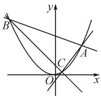

# 巧用齐次化,解决一类圆锥曲线问题

●广东省中山市第一中学 高建

摘要:本文中利用齐次化方法解决解析几何中有关斜率的问题,在一定程度上可以提高学生的运算效率,简化解题过程,帮助学生更加深刻了解解析几何的魅力,培养学生数学运算的核心素养.

关键词: 解析几何; 齐次化; 斜率之和; 斜率之积; 定点

解析几何一直是高考必考的内容,尤其是涉及到定点、定值的问题,经常在高考题中出现,其中一类题目常常以斜率之和或者之积是定值为背景,即过一定点引两条直线与圆锥曲线相交,引出两个斜率的关系,通过斜率之间关系找到解决问题的方向.其经典方法就是设直线方程,然后通过与圆锥曲线方程联立,整理得出一元二次方程;设点写出斜率关系式,利用韦达定理,求解出相应的斜率.这种方法并不是很难,但是计算量相对较大,使得很多学生望而却步.本文中通过对比通法和齐次化方法在解决圆锥曲线的定值、定点问题中的应用,让学生了解齐次化方法的优点,进而培养学生一题多解的能力,提升学习圆锥曲线的乐趣.

# 1 齐次化解决与角度有关问题

例 1 设椭圆 $C: \frac{x^{2}}{2} + y^{2} = 1$ 的右焦点为 F，过 F 的直线 l 与 C 交于 A, B 两点，点 M 的坐标为 $(2,0)$ .

(1) 当 l 与 x 轴垂直时, 求直线 AM 的方程;  
(2) 设 O 为坐标原点, 证明: $\angle OMA = \angle OMB$ .

分析:本题考查的问题,就是过定点作两条直线形成的斜率问题.主要难点是把角度问题转变成斜率.原答案使用的是设方程联立的方法,然后设而不求,利用韦达定理解决问题,难度不大.第(1)问比较简单,第(2)问,我们对比通法和齐次化方法的优劣.

解析:(1)第(1)小问,常规思路,过程略.

(2) 方法一: 首先把角度问题转化成斜率问题.

当直线 l 斜率不存在时, 显然命题成立.

当直线 l 斜率存在时，不妨设直线 l 的方程为 $y = k(x - 1)$ ，与椭圆 $C: \frac{x^{2}}{2} + y^{2} = 1$ 联立，得 $(1 + 2k^{2})x^{2} - 4k^{2}x + 2k^{2} - 2 = 0$ ，只需证明 $k_{AM} + k_{BM} = 0$ 即可，根据韦达定理，代入化简易得.

方法二:利用齐次化.把椭圆向左平移2个单位,得到平移后的椭圆方程为 $\frac{(x+2)^{2}}{2}+y^{2}=1$ ,对应焦点F的坐标变为 $F'(-1,0)$ ,点M的坐标变为 $M'(0,0)$ .设平移后的直线方程为 $mx+ny=1$ ,由直线过 $(-1,0)$ ,易知m=-1,所以平移后的直线方程为 $-x+ny=1$ .将直线 $-x+ny=1$ 代入椭圆方程 $\frac{(x+2)^{2}}{2}+y^{2}=1$ ,得 $x^{2}+2y^{2}+4x(-x+ny)+2(-x+ny)^{2}=0$ ,即 $-x^{2}+2(1+n^{2})y^{2}=0$ .若x=0,则所证两个角相等;若 $x\neq0$ ,则有 $\frac{y^{2}}{x^{2}}=\frac{1}{2(1+n^{2})}$ ,这两条直线的斜率显然互为相反数,命题得证!

本题是一道高考题,难度中等,但是对比两种做法,我们不难发现经典方法更注重代数运算,计算量相对较大,而齐次化的方法,考虑到了 $\frac{y}{x}$ 的几何意义,这样更体现了解析几何的本质.

# 2 齐次化解决斜率之积为定值问题

例 2 已知椭圆 $C: \frac{x^{2}}{a^{2}} + \frac{y^{2}}{b^{2}} = 1 (a > b > 0)$ 过点 $P(2,1)$ ，且该椭圆的一个短轴端点与两焦点 $F_{1}, F_{2}$ 为等腰直角三角形的三个顶点.

(1)求椭圆 C 的方程；  
(2)设直线 l 不经过 P 点且与椭圆 C 相交于 A, B 两点, 若直线 PA 与直线 PB 的斜率之积为 1, 证明: 直线 l 过定点.

分析:本题第(2)问考查圆锥曲线中的定点问题,经典方法是设出直线方程,进行联立,得到一元二次方程,再把两个斜率都表示出来,利用韦达定理表示出斜率与截距的关系,进而找到定点.这个通法思路简单,易于学生掌握,但是运算量太大,个别同类型题目还涉及到比较复杂的因式分解问题,可能会给学生造成一定的影响,我们看下齐次化的方法会不会有更好的效果.

解析:(1)易得椭圆方程 $\frac{x^{2}}{6}+\frac{y^{2}}{3}=1$ ,过程略.

(2)方法一:若直线 l 的斜率不存在,不妨设直线 l 的方程为 $x=t(t\neq2)$ , 与椭圆方程联立, 得到 $y=\pm\sqrt{3-\frac{t^{2}}{2}}$ , 所以由 $k_{PA}k_{PB}=\frac{\left(\sqrt{3-\frac{t^{2}}{2}}-1\right)\left(-\sqrt{3-\frac{t^{2}}{2}}-1\right)}{(t-2)^{2}}=1$ , 解得 t=2, 或 t=6, 均不合题意, 故舍去.

若直线直线 l 的斜率存在, 设直线 l 的方程为 $y = kx + b$ , 联立 $\left\{\begin{aligned} y &= kx + b, \\ \frac{x^{2}}{6} + \frac{y^{2}}{3} &= 1, \end{aligned}\right.$ 消元得到方程 $(1 + 2k^{2})x^{2} + 4kbx + 2b^{2} - 6 = 0$ . 不妨设 $A(x_{1}, y_{1})B(x_{2}, y_{2})$ , 则 $x_{1} + x_{2} = -\frac{4kb}{1 + 2k^{2}}, x_{1}x_{2} = \frac{2b^{2} - 6}{1 + 2k^{2}}$ .

根据题意 $k_{AP} \cdot k_{PB} = \frac{y_1 - 1}{x_1 - 2} \cdot \frac{y_2 - 1}{x_2 - 2} = \frac{kx_1 + b - 1}{x_1 - 2} \cdot \frac{kx_2 + b - 1}{x_2 - 2} = 1$ ，即 $(k^2 - 1)x_1x_2 + (kb - k + 2)(x_1 + x_2) + (b - 1)^2 - 4 = 0$ ，结合韦达定理得 $12k^2 + 8kb + b^2 + 2b - 3 = 0$ ，即 $(6k + b + 3)(2k + b - 1) = 0$ ，故 $b = -6k - 3$ 或 $b = -2k + 1$ （舍去），此时直线 $l$ 为 $y = kx - 6k - 3$ ，故直线恒过定点 $(6, -3)$ .

方法二: 椭圆 C 的方程为 $\frac{x^{2}}{6} + \frac{y^{2}}{3} = 1$ ，将其向左平移 2 个单位，向下平移 1 个单位，得到平移后的椭圆方程为 $\frac{(x+2)^{2}}{6} + \frac{(y+1)^{2}}{3} = 1$ ，化简可得 $x^{2} + 2y^{2} + 4(x+y) = 0$ .

设直线 l 平移后的方程为 $mx + ny = 1$ ，将其代入到平移后的椭圆方程，得 $x^{2} + 2y^{2} + 4(x + y)(mx + ny) = 0$ ，化简可得 $(1 + 4m)x^{2} + (4n + 2)y^{2} + 4(n + m)xy = 0$ ，即 $(4n + 2)\frac{y^{2}}{x^{2}} + 4(n + m)\frac{y}{x} + (1 + 4m) = 0$ 。由题干可知，若直线 PA 与直线 PB 的斜率之积为 1，平移后斜率是没有变化的，则有 $\frac{1 + 4m}{2 + 4n} = 1$ ，即 4m - 4n = 1，代入 $mx + ny = 1$ 可得 $x - 4 + 4n(x + y) = 0$ 。所以平移后的直线过定点 $(4, -4)$ ，再平移回去得到直线 l 过定点 $(6, -3)$ 。

本题的背景就是两个斜率之积为定值,对比上述两种方法,我们不难发现齐次化方法的优势,但是这里需要拓展平移后的圆锥曲线方程,也要注意最后的结果是不是平移回去了.

# 3 齐次化解决双斜率问题

例 3 如图 1, 过顶点在原点、对称轴为 y 轴的抛物线 E 上的点 A(2,1) 作斜率分别为 $k_{1}, k_{2}$ 的直线, 分别交抛物线 E 于 B, C 两点.

(1) 求抛物线 E 的标准方程和准线方程；  
(2) 若 $k_{1} + k_{2} = k_{1}k_{2}$ ，证明：直线 BC 恒过定点.

分析:本题第(2)问考查与抛物线有关的直线斜率问题,通法还

text_image

y
B
C
O
A
x

图1

是通联立方程,但必须面临利用 $k_{1}+k_{2}=k_{1}k_{2}$ 表示出相关量,然后再化简,运算量不算小.下面我们看下齐次化的威力.

解析:(1)易知抛物线方程为 $x^{2}=4y$ , 准线方程为 y=-1. 过程略.

(2) 方法一: 设直线 AB 的直线方程为 $y - 1 = k_{1}(x - 2)$ ，联立 $\left\{\begin{aligned}y - 1 &= k_{1}(x - 2), \\ x^{2} &= 4y,\end{aligned}\right.$ 解得 B 的坐标为 $(4k_{1} - 2, (2k_{1} - 1)^{2})$ 。设直线 AC 的斜率为 $k_{2}$ ，同理可得 $C(4k_{2} - 2, (2k_{2} - 1)^{2})$ 。所以直线 BC 的斜率 $k = \frac{(2k_{1} - 1)^{2} - (2k_{2} - 1)^{2}}{4(k_{1} - k_{2})} = k_{1} + k_{2} - 1$ 。由 $k_{1} + k_{2} = k_{1}k_{2}$ ，得 $k = k_{1}k_{2} - 1$ ，所以直线 BC 的方程为 $y - (2k_{1} - 1)^{2} = (k_{1}k_{2} - 1)[x - (4k_{1} - 2)]$ ，化简可得 $y = (k_{1}k_{2} - 1)(x - 2) - 3$ ，故直线 BC 恒过定点 $(2, -3)$ 。

方法二: 易知抛物线的方程为 $x^{2}=4y$ ，把点 A 平移到原点，得到平移后的抛物线方程为 $(x+2)^{2}=4(y+1)$ ，化简得 $x^{2}+4x-4y=0$ 。设直线 BC 平移后的方程为 $mx+ny=1$ ，代入平移后的抛物线方程可得 $x^{2}+4(x-y)(mx+ny)=0$ ，化简得 $(1+4m)x^{2}-4ny^{2}-4(m-n)xy=0$ ，即 $4n\frac{y^{2}}{x^{2}}+4(m-n)\frac{y}{x}-(1+4m)=0$ 。因为平移后的直线斜率没有变化，所以由 $k_{1}+k_{2}=k_{1}k_{2}$ ，得 $-\frac{4(m-n)}{4n}=-\frac{1+4m}{4n}$ ，则 $n=-\frac{1}{4}$ ，代入 $mx+ny=1$ 得 $mx-\frac{1}{4}y=1$ 。所以平移后的直线恒过 $(0,-4)$ ，再平移回去得到直线 BC 恒过定点 $(2,-3)$ 。

# 4 齐次化解决斜率之和为定值问题

例 4 已知椭圆 $C: \frac{x^{2}}{a^{2}} + \frac{y^{2}}{b^{2}} = 1 (a > b > 0)$ ，四点 $P_{1}(1,1), P_{2}(0,1), P_{3} \left(-1, \frac{\sqrt{3}}{2}\right), P_{4} \left(1, \frac{\sqrt{3}}{2}\right)$ 中恰有三点在椭圆 C 上.

(1) 求 C 的方程；  
(2) 设直线 l 不经过点 $P_{2}$ 且与 C 相交于 A, B 两点，若直线 $P_{2}A$ 与直线 $P_{2}B$ 的斜率的和为 -1，证明：l 过定点.

分析: 此题为高考题中的定点问题, 依然是双斜率问题, 可以使用齐次化的方法解决.

解析:(1)易知椭圆的方程为 $\frac{x^{2}}{4}+y^{2}=1$ ,过程略.

（2）方法一：设直线 $l:y = kx + b$ ，联立 $\left\{ \begin{array}{ll}y = kx + b,\\ \frac{x^2}{4} +y^2 = 1, \end{array} \right.$ 得 $(1 + 4k^{2})x^{2} + 8kbx + 4b^{2} - 4 = 0,\Delta =$ $16(4k^{2} - b^{2} + 1) > 0.$ 设 $A(x_{1},y_{1}),B(x_{2},y_{2})$ ，由韦达定理，得 $x_{1} + x_{2} = -\frac{8kb}{1 + 4k^{2}},x_{1}x_{2} = \frac{4b^{2} - 4}{1 + 4k^{2}}.$

设直线 $P_{2}A, P_{2}B$ 的斜率分别为 $k_{1}, k_{2}$ . 由 $k_{1} + k_{2} = -1$ , 得 $k_{1} + k_{2} = \frac{y_{1} - 1}{x_{1}} + \frac{y_{2} - 1}{x_{2}} = \frac{kx_{1} + b - 1}{x_{1}} + \frac{kx_{2} + b - 1}{x_{2}}$ , 通分后结合韦达定理, 得 $(2k + 1) \cdot \left(\frac{4b^{2} - 4}{1 + 4k^{2}}\right) + (b - 1)\left(\frac{-8kb}{1 + 4k^{2}}\right) = 0$ , 则 $k = -\frac{b + 1}{2}$ , 从而直线 l 的方程为 $y = \left(-\frac{b + 1}{2}\right)x + b$ , 故直线 l 恒过定点 $(2, -1)$ .

方法二: 易知椭圆 C 的方程为 $\frac{x^{2}}{4} + y^{2} = 1$ ，将椭圆向下平移 1 个单位得到平移后的椭圆方程为 $\frac{x^{2}}{4} + (y + 1)^{2} = 1$ ，化简得 $x^{2} + 4y^{2} + 8y = 0$ 。设直线 AB 平移后的方程为 $mx + ny = 1$ ，代入平移后的椭圆方程得 $x^{2} + 4y^{2} + 8y (mx + ny) = 0$ ，化简得 $(8n + 4)\left(\frac{y}{x}\right)^{2} + 8m\frac{y}{x} + 1 = 0$ 。因为直线 $P_{2}A$ 与直线 $P_{2}B$ 的斜率的和为 -1。所以 $-\frac{8m}{8n+4} = -1$ ，则 $2m = 2n + 1$ ，代入 $my +$

ny=1 可得平移后的直线恒过定点 $(2,-2)$ . 故直线 l 恒过定点 $(2,-1)$ .

本题的背景就是斜率之和为定值,求直线过定点的问题,对比之下我们可以轻易发现齐次化方法的优点.

# 5 方法归纳

齐次化方法可以解决解析几何中斜率之和为定值、斜率之积为定值等问题.它的一般操作方法是对于椭圆方程 $\frac{x^2}{a^2} +\frac{y^2}{b^2} = 1$ 或双曲线方程 $\frac{x^2}{a^2} -\frac{y^2}{b^2} = 1$ ，设直线方程为 $mx + ny = 1$ ，代入到圆锥曲线方程中得到 $\frac{x^2}{a^2} +\frac{y^2}{b^2} = (mx + ny)^2$ ，整理为 $A\left(\frac{y}{x}\right)^2 +B\frac{y}{x} +C = 0$ 的形式，这个一元二次方程的两个根就是圆锥曲线上的点与原点连线的斜率，进而找到两个斜率的关系，可以解决圆锥曲线中双斜率的一些问题；若曲线是抛物线 $y^{2} = 2px$ ，则可由直线方程 $mx + ny = 1$ ，整理为 $y^{2} = 2px(mx + ny)$ ，进一步整理可得形如方程 $A\left(\frac{y}{x}\right)^2 +B\frac{y}{x} +C = 0$ ，这样齐次化就完成了.然而，这样构造的都是圆锥曲线上的点与原点连线的斜率，那么像例题中的问题，是圆锥曲线上的点与其他定点连线的斜率，我们该怎么处理呢？我们可将圆锥曲线进行平移，把圆锥曲线上定点 $(u,v)$ 平移到坐标原点.以椭圆 $\frac{x^2}{a^2} +\frac{y^2}{b^2} = 1$ 为例，平移后椭圆的方程变为 $\frac{(x + u)^2}{a^2} +\frac{(y + v)^2}{b^2} = 1$ ，此时就可以重复上述方法进行齐次化，进而解决与该点连线的斜率问题.当然很多资料中都给出了斜率之和或斜率之积为定值时，定点求解的二级结论，但是公式很难记住，这里就不在重复了.

解析几何是培养学生计算能力的重要载体,蕴含着丰富的数学思想.本文中提到的齐次化方法,在一定程度上可以起到简化运算的效果,让学生深刻体会解析几何的魅力.通过齐次化方法的学习,学生学会了处理斜率之和为定值、斜率之积为定值问题的另一种解法,提高了解题效率,也让学生明白数学方法的多样性.但遗憾的是,有些问题使用齐次化方法,计算量并不会减少,甚至更为复杂,对于常规的解析几何问题,齐次化方法也不一定能起到很好的作用,所以在教学中我们更应该重视基础知识和通法通解的学习.Z