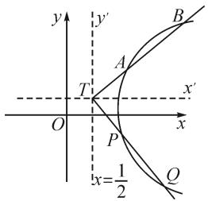
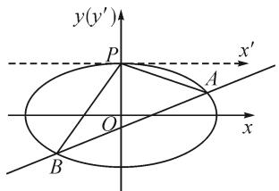
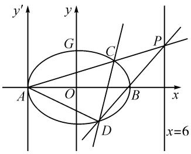

# 平移、齐次化在圆锥曲线高考题中的应用

# ●湖北省随州市第一中学 韩川

摘要: 圆锥曲线是历年高考命题中的重点也是难点, 经常涉及到斜率之和、斜率之积等问题, 对学生分析问题及运算能力有较高要求. 很多学生在知道思路的情况下, 往往因为计算复杂而无果而终. 2021 年高考乙卷第 21 大题及近三年高考题中多次出现可以转化为斜率之积或之和的问题, 以及涉及直线过定点的问题, 等等. 有没有一种方法能避开复杂计算来解决有关斜率之和、斜率之积的问题呢? 本文中从 2021 年全国高考乙卷第 21 大题说起.

关键词: 平移化; 齐次化; 斜率之积; 斜率之和; 圆锥曲线

# 1 真题呈现

引例（2021年全国高考数学乙卷第21题）在平面直角坐标系 $xOy$ 中，已知点 $F_{1}(-\sqrt{17},0), F_{2}(\sqrt{17},0)$ ，点 $M$ 满足 $|MF_{1}| - |MF_{2}| = 2.$ 记 $M$ 的轨迹为 $C$ .

(1) 求 C 的方程；

(2)设点 T 在直线 $x=\frac{1}{2}$ 上, 过 T 的两条直线分别交 C 于 A, B 和 P, Q 两点, 且 $\left|TA\right|\cdot\left|TB\right|=\left|TP\right|\cdot\left|TQ\right|$ , 求直线 AB 的斜率与直线 PQ 斜率之和.

原创解法:平移坐标系法.

解:(1) $x^{2}-\frac{y^{2}}{16}=1(x\geqslant1)$ .过程略.

(2)如图1,将坐标系平移到以 $T\left(\frac{1}{2},t\right)$ 为原点的新坐标系中,则在新坐标系下,曲线 C 的方程为

text_image

y
y'
B
A
T'
x'
O
P
x
Q
x=1/2

图1

$$
\left(x + \frac {1}{2}\right) ^ {2} - \frac {(y + t) ^ {2}}{1 6} = 1. (\text {平移化})
$$

设直线 TA 的方程为 $y=k_{1}x$ ，直线 TP 的方程为 $y=k_{2}x$ 。

设 $A(x_{1},y_{1}), B(x_{2},y_{2}), P(x_{3},y_{3}), Q(x_{4},y_{4})$ .

由 $\left\{ \begin{array}{l} \left( x + \frac{1}{2} \right)^2 - \frac{(y + t)^2}{16} = 1, \\ y = k_1x \end{array} \right.$ 消去 $y$ ，得

$$
(1 6 - k _ {1} ^ {2}) x ^ {2} + (1 6 - 2 t k _ {1}) x - t ^ {2} - 1 2 = 0.
$$

线段平移之后长度不变,线段所在的直线斜率也不变,所以有

$$
\mid T A \mid = \sqrt {1 + k _ {1} ^ {2}} (x _ {1} - 0) = \sqrt {1 + k _ {1} ^ {2}} x _ {1},
$$

$$
\mid T B \mid = \sqrt {1 + k _ {1} ^ {2}} (x _ {2} - 0) = \sqrt {1 + k _ {1} ^ {2}} x _ {2}.
$$

所以，得 $|TA|\cdot |TB| = (1 + k_1^2)x_1x_2 = (1 + k_1^2)\frac{-t^2 - 12}{16 - k_1^2}.$

同理，可得 $|TP|\cdot |TQ| = (1 + k_2^2)x_3x_4 = (1 + k_2^2)\frac{-t^2 - 12}{16 - k_2^2}.$

因为 $|TA| \cdot |TB| = |TP| \cdot |TQ|$ ，所以令

$$
(1 + k _ {1} ^ {2}) \frac {- t ^ {2} - 1 2}{1 6 - k _ {1} ^ {2}} = (1 + k _ {2} ^ {2}) \frac {- t ^ {2} - 1 2}{1 6 - k _ {2} ^ {2}} = m. \tag {①}
$$

由①式得， $k_{1}$ 和 $k_{2}$ 为方程 $(1+k^{2})\frac{-t^{2}-12}{16-k^{2}}=m$ 的两个根，则 $k_{1}$ 和 $k_{2}$ 为方程 $(12+t^{2}-m)k^{2}+16m+12+t^{2}=0$ 的两根，由韦达定理知 $k_{1}+k_{2}=0$ .

因为平移不影响斜率,所以直线 AB 与直线 PQ 斜率之和为 0.

点评:上述解法用平移坐标系的方法避免了复杂的计算,很快解出了答案.事实上,可以考虑特殊位置,当T为 $\left(\frac{1}{2},0\right)$ 时,由对称性很容易得 $k_{1}+k_{2}=0$ .其结论本质是,由 $|TA|\cdot|TB|=|TP|\cdot|TQ|$ ,即圆的割线定理可知A,B,P,Q四点共圆,该圆锥曲线上四点共圆时直线倾斜角互补.

# 2 平移、齐次化在解圆锥曲线类高考试题中的应用

从以上 2021 年高考真题的解法中可以看出,平移坐标系的方法给斜率之积、斜率之和的表达带来了便捷,下面我们进一步感受平移和齐次化在高考解题中的应用.

例 1 （2017 全国卷Ⅰ理科第 20 题）已知椭圆 C: $\frac{x^{2}}{4} + y^{2} = 1$ ，点 $P(0,1)$ ，设直线 l 不经过 P 点且与椭圆 C 交于 A, B 两点，若直线 PA, PB 斜率之和为 -1，证明直线 l 过定点.

证明:如图2,将坐标原点平移到点P,在新坐标系中椭圆方程为 $\frac{x'^{2}}{4}+(y'+1)^{2}=1$ .

设 $A'(x_{1}', y_{1}')$ , $B'(x_{2}', y_{2}')$ , 直线 $A'B'$ 方程为 $mx' + ny' = 1$ ，则在新坐标系下联立直线与椭圆方程，得

text_image

y(y')
P
x'
A
O
x
B

图 2

$$
\left\{ \begin{array}{l l} \frac {x ^ {\prime 2}}{4} + (y ^ {\prime} + 1) ^ {2} = 1, & \\ m x ^ {\prime} + n y ^ {\prime} = 1. & \end{array} \right. \tag {②}
$$

由②式化简得

$$
y ^ {\prime 2} + 2 y ^ {\prime} + \frac {x ^ {\prime 2}}{4} = 0. \tag {④}
$$

④式中有一次项,二次项,次数不齐,把④式中各项化为次数相同的项,也就是齐次化.观察③式,可以对1进行妙用.

$$
y ^ {\prime 2} + 2 y ^ {\prime} (m x ^ {\prime} + n y ^ {\prime}) + \frac {x ^ {\prime 2}}{4} = 0. (\text {齐次化}) \tag {⑤}
$$

⑤式化简得 $(2n + 1)y'^{2} + 2mx'y' + \frac{x'^{2}}{4} = 0$ ，因为 $x_{1}^{\prime},x_{2}^{\prime}$ 都不为0，等式两边同除以 $x^{\prime 2}$ ，得

$$
(2 n + 1) \left(\frac {y ^ {\prime}}{x ^ {\prime}}\right) ^ {2} + 2 m \frac {y ^ {\prime}}{x ^ {\prime}} + \frac {1}{4} = 0. \tag {6}
$$

因为平移不影响直线斜率,所以

$$
k _ {P A} = k _ {P ^ {\prime} A ^ {\prime}} = \frac {y _ {1} ^ {\prime}}{x _ {1} ^ {\prime}}, k _ {P B} = k _ {P ^ {\prime} B ^ {\prime}} = \frac {y _ {2} ^ {\prime}}{x _ {2} ^ {\prime}}.
$$

$\frac{y_1'}{x_1'}$ 和 $\frac{y_2'}{x_2'}$ 可以看作方程⑥的两根，由韦达定理知 $k_{P'A'} + k_{P'B'} = \frac{y_1'}{x_1'} + \frac{y_2'}{x_2'} = -1 = \frac{-2m}{2n + 1}$ ，则 $m = n + \frac{1}{2}$ ，代入直线方程 $mx' + ny' = 1$ ，化简可以得到

$$
(x ^ {\prime} + y ^ {\prime}) n + \frac {x ^ {\prime}}{2} - 1 = 0. \tag {7}
$$

在⑦式中，令 $\left\{\begin{aligned}x^{\prime}+y^{\prime}=0,\\ \frac{x^{\prime}}{2}-1=0,\end{aligned}\right.$ 解得 $\left\{\begin{aligned}x^{\prime}=2,\\ y^{\prime}=-2.\end{aligned}\right.$

所以，直线在新坐标中过定点 $(2,-2)$ .

故直线 l 过定点 $(2, -1)$ .

总结:由引例和例1,我们总结出平移、齐次化解圆锥曲线相关问题的步骤.

第一步: 将坐标系平移到定点 P (当然也可以平移二次曲线).

第二步:设新坐标系直线方程为 $mx' + ny' = 1$ .

第三步: 在新坐标系下, 联立直线与曲线, 注意不是消去 $x'$ 或 $y'$ , 用 $mx' + ny' = 1$ 进行 1 的代换, 对新圆锥曲线进行齐次化, 一次项乘 1, 常数项用 1 的平方进行齐次化.

第四步:方程各项同除 $x^{'2}$ ，转换成关于 $\frac{y'}{x'}$ 的二次方程，即关于两条直线斜率的方程.

第五步:运用韦达定理,找到 m,n 的关系,求出新坐标系下的直线过定点.

第六步: 注意不要忘记将新坐标系中的定点转化成原坐标系中的定点.

转化规则:新坐标转旧坐标时横纵坐标是加,旧坐标转新坐标时横纵坐标是减,但是求圆锥曲线方程恰好相反.

例 2 （2020 全国Ⅰ卷第 20 题）如图 3，已知 A, B 分别为椭圆 E: $\frac{x^{2}}{a^{2}} + y^{2} = 1 (a > 1)$ 的左、右顶点，G 为 E 的上顶点， $\overrightarrow{AG} \cdot \overrightarrow{GB} = 8, P$ 为直线 x = 6 上的动点，PA

text_image

y'
G
C
P
A
O
B
x
x=6
D

图3

与 E 的另一交点为 C, PB 与 E 的另一交点为 D.

(1) 求 E 的方程；  
(2) 证明: 直线 CD 过定点.

解:(1) $\frac{x^{2}}{9}+y^{2}=1.$

(2)由 $A(-3,0), B(3,0)$ 和 $x = 6$ 可得

$$
k _ {B D} = 3 k _ {A C}.
$$

由椭圆第三定义,且 $e=\frac{8}{9}$ , 可知

$$
k _ {D B} \cdot k _ {D A} = e ^ {2} - 1 = - \frac {1}{9}.
$$

由以上两式可得，

$$
k _ {A C} \cdot k _ {A D} = - \frac {1}{2 7}. \tag {8}
$$

⑧式明显符合平移齐次化的特点,将坐标系原点平移到点 A,为方便书写,以下 x,y 代表新坐标系的 $x',y'$ .

新坐标系下,椭圆方程为 $\frac{(x-3)^{2}}{9}+y^{2}=1$ .设直

线 $C'D': mx + ny = 1$ ，将椭圆方程化为 $9y^{2} - 6x + x^{2} = 0$ ，齐次化得 $9y^{2} - 6x (mx + ny) + x^{2} = 0$ ，化简得

$$
9 y ^ {2} - 6 n x y + (1 - 6 m) x ^ {2} = 0.
$$

将上式同除以 $x^{2}$ ，得

$$
9 \left(\frac {y}{x}\right) ^ {2} - 6 n \frac {y}{x} + 1 - 6 m = 0.
$$

由于平移不改变斜率和韦达定理，则有 $k_{A'C'} \cdot k_{A'D'} = -\frac{1}{27} = \frac{1 - 6m}{9}$ ，解得 $m = \frac{2}{9}$ 。把 $m = \frac{2}{9}$ 代入 $mx + ny = 1$ ，易得直线 $C'D'$ 过定点 $\left(\frac{9}{2}, 0\right)$ 。

故直线 CD 过定点 $\left(\frac{3}{2},0\right)$ .

点评:从例 2 可以看出,我们往往要利用圆锥曲线第三定义(读者自行了解圆锥曲线第三定义)、题设条件将问题等价转化成两条直线斜率之和或斜率之积的问题,进而转化成可以平移齐次化来解决的问题,充分体现了数学中的等价转化、化归等数学思想.

例 3 （原创题）已知 $P(x_{0}, y_{0})$ 为椭圆上任意一点，椭圆 $\frac{x^{2}}{a^{2}} + \frac{y^{2}}{b^{2}} = 1 (a > b > 0)$ 中有以 P 为直角顶点的内接直角三角形 PBC. 求证：斜边 BC 过定点 $\left(\frac{c^{2}x_{0}}{a^{2}+b^{2}}, \frac{-c^{2}y_{0}}{a^{2}+b^{2}}\right)$ .

证明: 将坐标系坐标原点平移到 $P(x_{0}, y_{0})$ ，则 $P'(0, 0)$ ，为书写方便起见，以下 x, y 表示新坐标系中的 $x', y'$ ，特此备注。则新坐标系中椭圆方程为 $\frac{(x + x_{0})^{2}}{a^{2}} + \frac{(y + y_{0})^{2}}{b^{2}} = 1$ ，设 $B'C': mx + ny = 1$ ，且点 $P(x_{0}, y_{0})$ 满足

$$
\frac {x _ {0} ^ {2}}{a ^ {2}} + \frac {y _ {0} ^ {2}}{b ^ {2}} = 1. \tag {⑨}
$$

将新椭圆方程化为 $b^{2}(x + x_{0})^{2} + a^{2}(y + y_{0})^{2} = a^{2}b^{2}$ ，展开得

$$
\begin{array}{c} b ^ {2} x ^ {2} + a ^ {2} y ^ {2} + 2 x _ {0} b ^ {2} x + 2 y _ {0} a ^ {2} y + b ^ {2} x _ {0} ^ {2} + a ^ {2} y _ {0} ^ {2} - \\ a ^ {2} b ^ {2} = 0. \end{array} \tag {10}
$$

由⑨式可得 $b^{2}x_{0}^{2} + a^{2}y_{0}^{2} - a^{2}b^{2} = 0$ ，代入⑩式中可得

$$
b ^ {2} x ^ {2} + a ^ {2} y ^ {2} + 2 x _ {0} b ^ {2} x + 2 y _ {0} a ^ {2} y = 0. \tag {11}
$$

把直线 $B^{\prime}C^{\prime}: mx + ny = 1$ 代入⑩中进行齐次化，得到 $b^{2}x^{2} + a^{2}y^{2} + 2x_{0}b^{2}x (mx + ny) + 2y_{0}a^{2}y \cdot (mx + ny) = 0.$

整理得 $(b^{2}+2x_{0}mb^{2})x^{2}+(a^{2}+2y_{0}na^{2})y^{2}+(2x_{0}nb^{2}+2y_{0}ma^{2})xy=0$ ，两边同除以 $x^{2}$ ，得

$$
\left(a ^ {2} + 2 y _ {0} n a ^ {2}\right) \left(\frac {y}{x}\right) ^ {2} + \left(2 x _ {0} n b ^ {2} + 2 y _ {0} m a ^ {2}\right) \frac {y}{x} +
$$

$$
(b ^ {2} + 2 x _ {0} m b ^ {2}) = 0. \tag {12}
$$

设 $B^{\prime}(x_{1},y_{1}),C^{\prime}(x_{2},y_{2})$ .因为 $PB\bot PC$ ，新坐标系垂直性不变，所以 $k_{P'C'}\cdot k_{P'B'} = \frac{y_1}{x_1}\cdot \frac{y_2}{x_2} = -1.\frac{y_1}{x_1},\frac{y_2}{x_2}$ 是方程⑫的两根，由韦达定理，得 $\frac{b^2 + 2x_0mb^2}{a^2 + 2y_0na^2} = -1$ ，化简得 $n = \frac{-a^2 - b^2 - 2x_0mb^2}{2y_0a^2}$ ，代入到直线 $mx + ny = 1$ 中，得到只含 $m$ 的直线方程为

$$
(2 y _ {0} a ^ {2} x - 2 x _ {0} b ^ {2} y) m - (a ^ {2} + b ^ {2}) y - 2 y _ {0} a ^ {2} = 0.
$$

令 $\left\{\begin{aligned}2y_{0}a^{2}x-2x_{0}b^{2}y=0,\\ (a^{2}+b^{2})y+2y_{0}a^{2}=0,\end{aligned}\right.$ 解得 $\left\{\begin{aligned}x&=\frac{-2x_{0}b^{2}}{a^{2}+b^{2}},\\ y&=\frac{-2y_{0}a^{2}}{a^{2}+b^{2}},\end{aligned}\right.$ 从
而新坐标系中直线 $B^{\prime}C^{\prime}$ 过定点 $\left(\frac{-2x_{0}b^{2}}{a^{2}+b^{2}},\frac{-2y_{0}a^{2}}{a^{2}+b^{2}}\right)$ .

(温馨提示:千万不要忘记要转到原坐标系中!)

所以，原坐标系中直线过定点 $\left(\frac{-2x_0b^2}{a^2 + b^2} + x_0, \frac{-2y_0a^2}{a^2 + b^2} + y_0\right)$ ，化简得 $\left(\frac{c^2x_0}{a^2 + b^2}, \frac{-c^2y_0}{a^2 + b^2}\right)$ .

故直线 BC 过定点 $\left(\frac{c^{2}x_{0}}{a^{2}+b^{2}},\frac{-c^{2}y_{0}}{a^{2}+b^{2}}\right)$ ，命题得证.

评析:从例 2 的特殊性、例 3 的一般性可以深层挖掘出一个结论:P 为平面内任意一点,A,B 为二次曲线上不同的两点,P,A,B 三点不共线,过点 P 且斜率之积或斜率之和为定值的两条直线 PA,PB 与二次曲线交于点 M,N,那么直线 MN,AN,BM,AB 必过定点,反之亦然(提示:常数项用直线方程 1 的平方进行齐次化,证明留给读者).

练习 （原创经典结论）抛物线 $y^{2}=2px$ 中， $P(x_{0},y_{0})$ 是抛物线上任意一点，直线 PA, PB 交抛物线于 A, B 两点，且斜率分别为 $k_{1}, k_{2}$ ，直线 AB 斜率为 $k_{3}$ ，证明： $\frac{1}{k_{1}}+\frac{1}{k_{2}}=\frac{1}{k_{3}}+\frac{y_{0}}{p}$ .

# 3 结束语

利用平移、齐次化手段来解圆锥曲线中有关斜率之和或之积问题的理论基础是平移坐标系只是改变了点、线、曲线的坐标位置，其几何属性如长度、直线斜率，直线间垂直、夹角都不会改变。但并不是所有的圆锥曲线都适合平移、齐次化，只有涉及或者可以转化成两直线斜率之和、斜率之积的问题才适合，方法虽好，高考可用，但要慎用！最后温馨提示：切记要把定点转化到原坐标系！Z