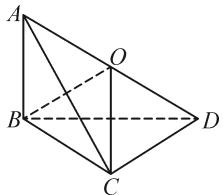
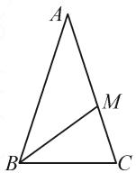

# 渗透数学文化,创新情境命题

# ● 江苏省启东中学 彭剑平

摘要: 数学文化类试题中不同的创新情境为数学问题的设置提供沃土, 借助合理设置创新情境问题, 从数学名著、数学故事、数学名题等方面来渗透数学文化, 巧妙融合数学知识, 交汇思想方法, 构建数学模型, 形成创新试题, 引领并指导教学改革与复习备考.

关键词: 数学文化; 数学名著; 数学故事; 数学名题; 创新

数学文化类试题是新高考数学试卷中命题的热点之一.数学文化是国家文化素质教育的重要组成部分,其内涵是在实践过程中不断探索形成的数学史、数学精神及其应用等.对数学文化的考查主要借助数学名著、数学故事以及数学名题等视角来创新设置,通过对数学文化的渗透,有效增强考生的理性思维与应用意识,培养爱国主义情怀.

# 1 数学名著

通过中国古代数学名著或世界数学名著等渗透数学文化,如我国古代的《数书九章》《张丘建算经》《孙子算经》等.

例 1 （2022 年山东省潍坊市高考数学三模试卷）我国古代数学名著《九章算术》中给出了很多立体几何的结论，其中提到的多面体“鳖臑”是四个面都是直角三角形的三棱锥。若一个“鳖臑”的所有顶点都在球 O 的球面上，且该“鳖臑”的高为 2，底面是腰长为 2 的等腰直角三角形。则球 O 的表面积为（）.

A. $12\pi$

B. $4\sqrt{3}\pi$

C. $6\pi$

D. $2\sqrt{6}\pi$

分析: 根据题目条件, 作出图形, 设在三棱锥 A-BCD 中, $AB \perp$ 平面 BCD, $BC \perp CD$ 且 BC = CD = 2, AB = 2, 证明出该三棱锥的四个面均为直角三角形, 求出该三棱锥的外接球半径, 结合球体表面积公式可得结果.

解析: 如图 1 所示, 在三棱锥 A-BCD 中, $AB \perp$ 平面 BCD, $BC \perp CD$ 且 BC = CD = 2, AB = 2.

因为 $AB \perp$ 平面 BCD, BC, BD, CD ⊂ 平面 BCD, 所以 $AB \perp BC$ , $AB \perp BD$ , $CD \perp AB$ .

又 $CD \perp BC, AB \cap BC = B$ ，图 $AB,BC\subset$ 平面ABC，所以 $CD\bot$ 平面ABC.

text_image

Geometric diagram of a tetrahedron with labeled vertices A, B, C, D and O, showing solid and dashed edges.

图 1

因为 $AC \subset$ 平面 ABC，所以 $AC \perp CD$ .

故三棱锥 A-BCD 的四个面都是直角三角形，且 $BD = \sqrt{BC^{2} + CD^{2}} = 2\sqrt{2}$ ， $AD = \sqrt{AB^{2} + BD^{2}} = 2\sqrt{3}$ .

设线段 AD 的中点为 O，则 $OB = OC = \frac{1}{2}AD = OA = OD$ 。所以，点 O 为三棱锥 A-BCD 外接球的球心。设球 O 的半径为 R，则 $R = \frac{1}{2}AD = \sqrt{3}$ ，因此，球 O 的表面积为 $4\pi R^{2} = 12\pi$ 。故正确答案为 A。

例 2 意大利数学家斐波那契的《算盘全书》中记载了一个有趣的问题: 如果一对兔子每月能生 1 对小兔子(一雄一雌), 不考虑其他因素, 而每 1 对小兔子在它出生后的第三个月里, 又能生 1 对小兔子. 在特殊情况下, 假定兔子都不发生死亡, 那么由 1 对初生的小兔子开始, 50 个月后总共会有多少对兔子?

根据以上记载,从第1个月开始,以后每个月的兔子总对数依次为1,1,2,3,5,8,13,21,34,55,89,……,这个数列就是著名的“斐波那契数列”,它的递推公式是 $a_{n}=a_{n-1}+a_{n-2}(n\geqslant3,n\in\mathbf{N}^{*})$ ,其中 $a_{1}=1,a_{2}=1$ .若从该数列的前100项中随机抽取一个数,则这个数是偶数的概率为().

A. $\frac{1}{3}$

B. $\frac{33}{100}$

C. $\frac{1}{2}$

D. $\frac{67}{100}$

分析:根据斐波那契数列中项的分布规律以及递推公式加以归纳总结,确定每相邻3个数中有1个偶数,进而得到该数列的前100项中有33个偶数,利用古典概型的概率公式求解.

解析:由 1,1,2,3,5,8,13,21,34,55,89,……是斐波那契数列,可知每相邻 3 个数中有 1 个偶数,易知该数列的前 100 项中有 33 个偶数,所以从该数列的前 100 项中随机抽取一个数,这个数是偶数的概率为 $\frac{33}{100}$ .故正确答案为 B.

点评: 涉及数学名著中的数学文化创新试题, 关键是理解数学名著中对应创新情境的叙述与表达, 综合题目所要求解的结论加以对比分析, 构建相应的数学模型, 利用相关的数学知识、思想方法来分析与解决相关的数学文化问题.

# 2 数学故事

通过数学家或数学故事渗透数学文化,如开普勒、毕达哥拉斯、斐波那契、希波克拉底、陈景润、黎曼等.

例 3 我国古代数学家刘徽提出的割圆术为“割之弥细，所失弥少，割之又割，以至于不可割，则与圆周合体而无所失矣”。其体现的是一种无限与有限的转化过程，比如在 $\sqrt{2+\sqrt{2+\sqrt{2+\cdots\cdots}}}$ 中“……”表示相同类型的无限次重复进行，可以整体化思维，设为相应的定值 x，合理构建对应的方程 $\sqrt{2+x}=x$ ，利用解方程思维来确定定值 x=2。类似地，不难得到 $1+\frac{1}{1+\frac{1}{1+\cdots\cdots}}=(\quad)$ 。

A. $\frac{-\sqrt{5}-1}{2}$

B. $\frac{\sqrt{5}-1}{2}$

C. $\frac{\sqrt{5}+1}{2}$

D. $\frac{-\sqrt{5}+1}{2}$

分析:根据题目条件,借助数学思想方法中的无限与有限的转化,通过无限根式的定值求解方法的应用与类比,转化为无限分式的定值求解,通过构建方程、解方程来确定无限分式的定值.

解析:依题意得 $1+\frac{1}{x}=x(x>0)$ ，解得 $x=\frac{\sqrt{5}+1}{2}$ 或 $x=\frac{-\sqrt{5}+1}{2}$ （舍去），所以 $1+\frac{1}{1+\frac{1}{1+\cdots\cdots}}=\frac{\sqrt{5}+1}{2}$ 。故正确答案为 C.

例 4 （湖南省三湘名校教育联盟2022届高三第二次大联考数学试卷·7)公元前5世纪，毕达哥拉斯学派利用顶角为 $36^{\circ}$ 的等腰三角形研究黄金分割，如图2，在 $\triangle ABC$ 中，AB=AC， $\angle A=36^{\circ}$ ， $\angle ABC$ 的平分线交AC于M，依此图形可求得 $\cos36^{\circ}=(\quad)$ .

  
图2

A. $\frac{3}{5}$

B. $\frac{\sqrt{15}}{6}$

C. $\frac{\sqrt{5}-1}{2}$

D. $\frac{\sqrt{5}+1}{4}$

分析: 利用等腰三角形的性质、三角形边与角之

间的关系、三角形相似的判定与性质、一元二次方程的解、正弦定理以及二倍角公式等的综合，合理转化，巧妙应用.

解析:由 $\angle A=36^{\circ}$ ，可得 $\angle ABC=\angle ACB=72^{\circ}$ 。所以 $\angle ACB=\angle BMC=72^{\circ}$ ， $\angle MBC=\angle MBA=\angle A=36^{\circ}$ 。

设 AB = x, BC = y = BM = AM.

由 $\triangle BMC \sim \triangle ABC$ ，可得 $\frac{x - y}{y} = \frac{y}{x}$ ，整理得 $\left(\frac{x}{y}\right)^2 - \frac{x}{y} - 1 = 0$ ，解得 $\frac{x}{y} = \frac{1 + \sqrt{5}}{2}$ 或 $\frac{x}{y} = \frac{1 - \sqrt{5}}{2}$ （舍去）。结合正弦定理，有 $\frac{x}{y} = \frac{\sin 72^\circ}{\sin 36^\circ} = 2\cos 36^\circ = \frac{1 + \sqrt{5}}{2}$ ，则 $\cos 36^\circ = \frac{1 + \sqrt{5}}{4}$ 。故正确答案为 D.

点评:涉及数学故事中的数学文化创新试题,关键是理解故事情境以及问题的设置情况,借助数学故事或问题表达中的思想方法、思路技巧等加以归纳、类比等推理与分析,结合数学运算、逻辑推理的综合应用,达到解决数学文化问题的目的.

# 3 数学名题

通过数学名题渗透数学文化,如勾股定理、阿波罗尼斯圆、哥德巴赫猜想、费马猜想或费马点等.

例 5 “哥德巴赫猜想”被誉为数学皇冠上的一颗明珠, 是数学界尚未解决的三大难题之一, 其内容是: “任意一个大于 2 的偶数都可以写成两个素数(质数)之和。”若我们将 12 拆成两个正整数的和, 则拆成的和式中, 在加数都大于 3 的条件下, 两个加数均为素数的概率是().

A. $\frac{2}{5}$

B. $\frac{2}{3}$

C. $\frac{2}{11}$

D. $\frac{1}{6}$

分析:根据题目条件,在对12进行拆分时,罗列出所有加数都大于3以及两加数均为素数的拆分,进而利用古典概型的概率公式求解.

解析: 将 12 拆成两个正整数的和, 则拆成的和式中, 加数都大于 3 的所有拆分为 $12 = 4 + 8$ , $12 = 8 + 4$ , $12 = 5 + 7$ , $12 = 7 + 5$ , $12 = 6 + 6$ , 共计 5 个; 而两个加数均为素数的拆分为 $12 = 7 + 5$ , $12 = 5 + 7$ , 共 2 个.

根据古典概型的概率公式,可得所求概率 $P=\frac{2}{5}$ . 故正确答案为 A.

(下转第29页)

题目特点:问题背景新潮实际,题目篇幅长、信息数据多;正态分布的均值与方差的应用.

选题立意:(1)本题以统计思想为引导,从统计角度求得概率,让概率为统计服务,考查样本估计总体的思想,体现了数学的应用价值.

(2)本题是例1和例2用均值和方差作为决策依据的延伸,考查等价转换和数形结合思想.

(3)考查正态分布的含义.

# 3 教学反思

有关概率统计应用部分的教学选题,要侧重关注以下三个方面:

(1)关注阅读,培养读功

高考越来越重视对数学阅读能力的考查.理解数学语言是数学阅读的核心问题,需加强三种类型数学语言的阅读:一是图表语言;二是实际生活语言;三是复杂的数学关系.培养学生在短时间内用统计的眼光阅读材料,整合数据,进而解决问题的能力.

(2)关注运算,培养算功

从课标卷来看,概率计算问题,既注重计算概率的基本根据——计数原理的应用,更注重从统计的观点来计算概率,尤其在统计与概率的解答题中体现地淋漓尽致,是新课标理念的极致体现.一方面要加强必备知识和主线核心内容,熟练使用公式和常用数学模型,注意运算技巧;另一方面也要关注统计图表的本质,在一些决策问题上能多想一点、少算一点.

(3)关注表达,培养说功

增加对数据解释的开放性,包容多种解释,学生只要给出一种解释,或者其他合理的解释都可以.鼓励学生创造性地回答问题,体会评价的满意原则和加分原则.培养学生用统计语言去表达实际问题和形成决策知识的能力,体现统计的应用价值.Z

# (上接第16页)

例 6 （2022 年河北省唐山市高考数学三模试卷）
角谷猜想又称冰雹猜想，是指任取一个正整数，如果它是奇数，就将它乘3再加1；如果它是偶数，则将它除以2.反复进行上述两种运算，经过有限次步骤后，必进入循环圈 $1\rightarrow4\rightarrow2\rightarrow1$ .如取正整数m=6，根据上述运算法则得出 $6\rightarrow3\rightarrow10\rightarrow5\rightarrow16\rightarrow8\rightarrow4\rightarrow2\rightarrow1$ ，共需要经过8个步骤变成1（简称为8步“雹程”），已知数列 $\{a_{n}\}$ 满足 $a_{1}=m(m$ 为正整数 $)$ ， $a_{n+1}=\left\{\begin{aligned}&\frac{a_{n}}{2}, 当 a_{n} 为偶数时,\\ &3a_{n}+1, 当 a_{n} 为奇数时.\end{aligned}\right.$

(1) 若 m=13，则使得 $a_{n}=1$ 至少需要 \_\_\_\_ 步雹程；

(2) 若 $a_{9}=1$ ，则 m 所有可能取值的和为 \_\_\_\_.

分析:根据创新定义,借助相应的步骤加以运算与推理,通过逐步计算即可求解.

解析:(1)若 m=13, 依题意, 得 $3m+1=40\rightarrow20$ $\rightarrow10\rightarrow5\rightarrow16\rightarrow8\rightarrow4\rightarrow2\rightarrow1$ , 共需 9 个雹程.

(2) 若 $a_{9} = 1$ ，则 $a_{8} = 2, a_{7} = 4, a_{6} = 8$ 或 $a_{6} = 1$ .

若 $a_6 = 8$ ，则

$$
a _ {5} = 1 6 \left\{ \begin{array}{l} a _ {4} = 3 2, a _ {3} = 6 4 \left\{ \begin{array}{l} a _ {2} = 1 2 8, a _ {1} = 2 5 6 \\ a _ {2} = 2 1, a _ {1} = 4 2 \end{array} \right. \\ a _ {4} = 5, a _ {3} = 1 0 \left\{ \begin{array}{l} a _ {2} = 2 0, a _ {1} = 4 0 \\ a _ {2} = 3, a _ {1} = 6 \end{array} \right. \end{array} \right.
$$

若 $a_{6} = 1$ ，则 $a_5 = 2, a_4 = 4\left\{ \begin{array}{l} a_3 = 8, a_2 = 16 \\ a_3 = 1, a_2 = 2, a_1 = 4 \end{array} \right.$

所以， $a_1$ 的集合为 $\{256,42,40,6,32,5,4\}$ ， $m$ 的和为385.

故答案为:9;385.

点评:涉及数学名题中的数学文化创新试题,关键是理解此类数学名题的内容,掌握其内涵与实质,结合题目条件构建合理的数学模型,综合相关的数学知识、思想方法等进行解决.

合理关注一些古今中外的数学名著、数学故事以及数学名题等,巧妙融入相关的数学知识,通过对数学文化加以创新与渗透,提升考生的应用意识与创新意识等,进一步拓展视野,提升数学能力,养成优良品质.Z