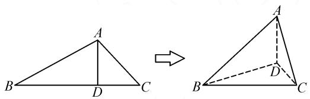
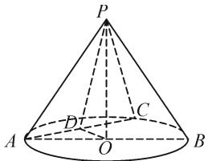
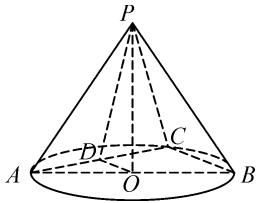
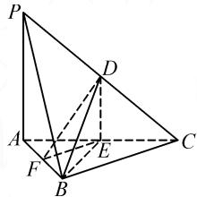
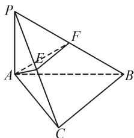

# 立体几何中垂直关系典例解析

# ●甘肃省平凉市静宁县界石铺中学 周建军

摘要:高中立体几何中线与面、面与面垂直关系的推理,最终都可以转化为线与线的垂直关系.判定定理和性质定理模型体系构成解决问题的核心,将图形语言、文字语言转化为数学符号语言,快速、严谨、准确地表述推理过程,一方面展示学生的逻辑推理能力,另一方面也考查学生的空间想象能力.但学生的空间想象和逻辑推理能力有强有弱,通过归纳、训练,并整理、构建模型体系,可以让学生在立体几何的垂直证明中快速进步.

关键词: 立体几何; 垂直; 模型

# 1 引言

立体几何证明中，课本上的概念、性质定理、判定定理是处理文字、图形和数学符号之间关系的最好工具，线与面、面与面的垂直可转化为线与线的垂直。线与线的垂直关系模型常见的有：①等腰（等边）三角形中“三线合一”性质的应用模型；②菱形（正方形）对角线互相垂直性质的应用模型；③线面垂直的定义模型；④满足勾股定理的三角形模型；⑤直径所对的圆周角是 $90^{\circ}$ ；⑥墙角模型（三条直线两两垂直）；⑦拐弯模型；⑧两平行直线中的一条直线垂直于第三条直线，则另一条直线也垂直于这条直线。只要熟练运用好上面的几种垂直模型，立体几何中的垂直关系便可迎刃而解。

# 2 例题解析

# 2.1 空间折叠题型和墙角模型的应用

例 1 如图 1, 已知 $\triangle ABC$ 中, AD 是边 BC 上的高, 以 AD 为折痕折叠 $\triangle ABC$ , 使 $\angle BDC$ 为直角. 求证: (1) 平面 $ABD \perp$ 平面 BDC; (2) 平面 $ADC \perp$ 平面 ABD.

text_image

Geometric diagram showing triangle transformation from original triangle ABC to transformed triangle ABCD with point D on BC

图1

分析:该题是由平面图形折叠成立体图形,不管 $\triangle ABD$ 折叠到哪个位置,AD始终与BD,CD保持垂直关系,这也是这道题的题眼.

证明:(1) $\because AD\perp BD,AD\perp DC,BD\cap CD=D,$

$\therefore AD \perp$ 平面 BDC.

$\because AD \subset$ 平面 ABD,

∴平面 ABD⊥平面 BDC.

(2) $\because\angle BDC=90^{\circ},$

$\therefore CD \perp BD.$

又∵CD⊥AD,AD∩BD=D,

$\therefore AD \perp CD.$

又 $\angle BDC = 90^{\circ}$ ，且 $AD\cap BD = D$

$\therefore CD \perp$ 平面 ABD.

$\because CD \subset$ 平面 ADC,

∴平面 ADC⊥平面 ABD.

点评:证明线面垂直的关键是在所证平面内找到两条相交直线分别与已知直线垂直,墙角模型恰好可以提供这种关系,以解决该题.面面垂直是通过转化思想,在线面垂直的基础上,找到一个平面经过另一个平面的垂线,则这两个平面垂直.

# 2.2 几何体结构特征的应用

例 2 如图 2, 在圆锥 PO 中, C 是 AB 弧上一点 (异于 A, B), D 为 AC 的中点.

求证: 平面 $POD \perp$ 平面 PAC.

分析:①该题涉及到几何体的基本结构,PO为圆锥的高线,所以PO垂直于底面圆所在平面;②利用线面垂直的定义,PO垂直于底面圆,则PO垂直于底面圆内的所有直线；③圆的直径所对的圆周角等于 $90^{\circ}$ ;④添加辅助线.

text_image

P
A
O
B
C
D

图2

证明:如图3,连接BC.

∵AB 是⊙O 的直径，

$\therefore \angle ACB = 90^{\circ}.$

∵点 O, D 是 AB, AC 的中点，

$\therefore OD//BC.$

$\therefore AC \perp OD.$

text_image

P
A
O
B
C
D

图3

又在圆锥 PO 中，PO 垂直于 $\odot O$ 所在的平面，

$$
\therefore P O \perp A C.
$$

$$
\because O D \cap P O = O,
$$

$$
\therefore A C \perp \text { 平面 } P O D.
$$

$$
\because A C \subset \text { 平   面 } P A C,
$$

$$
\therefore \text { 平面 } P O D \perp \text { 平面 } P A C.
$$

点评:立体几何垂直证明的推理过程,培养了学生的逻辑推理能力,更培养了学生的几何观察能力 $^{[1]}$ .通过对图形的观察,运用数学符号语言进行合情推理,印证了垂直的性质定理和判定定理在实际问题中的合理应用,加强了学生在推理活动中的观察、操作、分析、论证能力.

# 2.3 三角形中边长满足勾股定理的垂直模型的应用

例 3 如图 4, 在三棱锥 P-ABC 中, D, E, F 分别为棱 PC, AC, AB 的中点, 已知 $PA \perp AC$ , PA = 6, BC = 8, DF = 5. 求证: 平面 $BDE \perp$ 平面 ABC.

分析:由题意易证 $DE \perp AC$ ，根据图形利用三角形的边长，结合勾股定理可证 $DE \perp EF$ ，根据两个平面垂直的判定定理证明.

证明：∵ PA ⊥ AC，且 DE // PA，

text_image

Geometric diagram of a pyramid with labeled vertices and internal points, used for spatial geometry problems.

图4

$$
\therefore D E \perp A C.
$$

由中位线, 可知 $EF=\frac{1}{2}BC=4, DE=\frac{1}{2}PA=3.$ 又 DF=5，则有 $EF^{2}+DE^{2}=DF^{2}$ ，故 $DE \perp EF$ .

$$
\text { 又 } E F / / B C,
$$

$$
\therefore D E \perp B C.
$$

$$
\text { 又 } A C \cap B C = C,
$$

$$
\therefore D E \perp \text { 平面 } A B C.
$$

又 $DE \subset$ 平面 BDE，

$$
\therefore \text { 平面 } B D E \perp \text { 平面 } A B C.
$$

点评: 当证明线线垂直的条件不足时, 就要认真阅读题目中给出的边长条件, 善于观察, 结合勾股定理构造直角三角形, 从而完成逻辑推理证明, 激发学习数学、解决问题的热情.

# 2.4 多重垂直证明

例 4 如图 5, 空间四边形 PABC 中, $\angle ACB = 90^{\circ}$ , $PA \perp$ 平面 ABC, E, F 分别是 PC 和 PB 上的点, 且满足 $AE \perp PC$ , $AF \perp PB$ , 求证: $PB \perp$ 平面 AEF.

分析:这道题中涉及到“拐弯垂直模型”和多重垂直的证明.

text_image

Geometric diagram of a pyramid with labeled vertices and internal points, used for spatial geometry problems.

图5

“拐弯垂直模型”，如图5中的“ $PA \perp AC \rightarrow AC \perp BC$ ”，这种模型在很多题目中出现，需要学生熟练掌握.

多重垂直证明, 是不断地通过垂直关系, 找到新的垂直条件. 可从结论出发, 逆向寻找成立条件, 即 “ $PB \perp$ 平面 $AEF \rightarrow AE \perp PB \rightarrow AE \perp$ 平面 $PBC \rightarrow AE \perp BC \rightarrow BC \perp$ 平面 $PAC \rightarrow BC \perp PA \rightarrow PA \perp$ 平面 $ABC$ ”, 最终向已知靠近, 需要反复应用直线与平面垂直的定义和判定定理.

证明：∵PA⊥平面ABC，且BC⊂平面ABC，

$$
\therefore P A \perp B C.
$$

$$
\because \angle A C B = 9 0 ^ {\circ},
$$

$$
\therefore A C \perp B C.
$$

又 $PA \cap AC = A$ ,

$$
\therefore B C \perp \text { 平面 } P A C.
$$

$$
\because A E \subset \text { 平面 } P A C,
$$

$$
\therefore B C \perp A E.
$$

又 $AE \perp PC, PC \cap BC = C,$

$$
\therefore A E \perp \text { 平面 } P B C.
$$

$$
\because P B \subset \text { 平   面 } P B C,
$$

$$
\therefore A E \perp P B.
$$

$$
\because A F \perp P B, A E \cap A F = A,
$$

$$
\therefore P B \perp \text { 平面 } A E F.
$$

点评: 当题目中涉及多重垂直时, 考查学生观察图形、系统整合、快速转化的能力 $^{[2]}$ . 我们可以从结论出发, 逆向推理寻找所需条件, 从一个垂直到另一个垂直关系的转化中, 要时刻保持清醒, 明确在转化的过程中哪些条件变了, 哪些条件没有改变, 这些条件之间有什么联系, 必须保持严密性, 逐步寻找结论成立的充分条件, 向已知靠拢, 最后应用综合法, 规范表述因果关系.

# 3 结束语

立体几何中垂直关系的学习,是通过对简单几何体模型的观察到模型画图,再到识图.从点、线、面的位置关系的表述,到依据定义、定理运用逻辑推理方法正确表达几何图形语言和数学符号语言,这是一个系统的工程,需要学生多看、多想、多练,多总结经验,以强化空间思维能力和逻辑推理能力.

# 参考文献：

[1]魏立珍.如何学好立体几何[J].数学大世界(下旬),2019(6):89.  
[2] 李明. 高中数学立体几何垂直关系教学策略初探 [J]. 理科爱好者 (教育教学), 2020(4): 74-75. Z