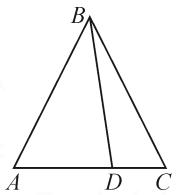
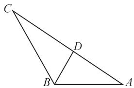
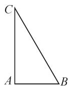
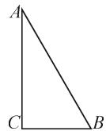

# 高考解三角形试题中“算两次”原理的应用举例

# ●湖北省枣阳市第一中学 陈刚明

摘要：“算两次”原理是一个重要的原理，能较好培养学生的发散思维能力。本文中通过角度算两次、长度算两次、面积算两次、位置算两次的方法揭示了“算两次”原理在高考解三角形试题中的应用，提升学生思维品质。

关键词: 解三角形; 算两次

波利亚说：“为了得到一个方程，我们必须把同一个量以两种不同的方法表示出来，即将一个量算两次，从而建立相等关系。”这就是“算两次”原理，又称富比尼原理。近几年高考解三角形试题中多次出现了“算两次”原理的应用，并从多个角度“算两次”，现举例说明。

# 1 角度算两次,破解三边关系问题

例 1(2021 全国新高考第 19 题) 记 $\triangle ABC$ 的内角 A, B, C 的对边分别为 a, b, c. 已知 $b^{2} = ac$ ，点 D 在边 AC 上， $BD \sin \angle ABC = a \sin C$ .

(1) 证明: BD = b;   
(2) 若 AD=2DC，求 $\cos\angle ABC$ .

例 1 的第(1)问比较简单, 过程略. 下面主要针对第(2)问进行解析.

解法 1: 如图 1, $AD = \frac{2}{3}b$ , $DC = \frac{b}{3}$ .

在 $\triangle ABD$ 中，

$$
\cos A = \frac {A D ^ {2} + A B ^ {2} - B D ^ {2}}{2 A D \cdot A B} =
$$

$$
\frac {\frac {4}{9} b ^ {2} + c ^ {2} - b ^ {2}}{2 \times \frac {2}{3} b c} = \frac {c ^ {2} - \frac {5}{9} b ^ {2}}{\frac {4}{3} b c}.
$$

  
图1

在 $\triangle ABC$ 中， $\cos A = \frac{b^2 + c^2 - a^2}{2bc}$ .

所以 $\frac{c^2 - \frac{5}{9} b^2}{\frac{4}{3} bc} = \frac{b^2 + c^2 - a^2}{2bc}$ .

化简, 可得 $3c^{2}-11b^{2}+6a^{2}=0$ .

又 $b^{2}=ac$ ，所以 $3c^{2}-11ac+6a^{2}=0$ 。

即 $(c-3a)(3c-2a)=0.$

所以 c=3a 或 $c=\frac{2}{3}a$ .

当 c=3a 时， $b^{2}=ac=3a^{2}$ ，则 $b=\sqrt{3}a$ 。此时 $a+b<c$ ，故 a,b,c 不能构成三角形。

当 $c = \frac{2}{3} a$ 时， $b^2 = ac = \frac{2}{3} a^2$ ，则 $b = \frac{\sqrt{6}}{3} a$ . 此时可以构成三角形，故 $c = \frac{2}{3} a, b = \frac{\sqrt{6}}{3} a$ .

所以，在 $\triangle ABC$ 中，

$$
\cos \angle A B C = \frac {a ^ {2} + c ^ {2} - b ^ {2}}{2 a c} = \frac {a ^ {2} + \frac {4}{9} a ^ {2} - \frac {2}{3} a ^ {2}}{2 a \cdot \frac {2}{3} a} = \frac {7}{1 2}.
$$

解法 2: 如图 1, BD=b, $AD=\frac{2}{3}b$ , $DC=\frac{b}{3}$ , 则

$$
\cos \angle A D B = \frac {B D ^ {2} + A D ^ {2} - A B ^ {2}}{2 B D \cdot A D} = \frac {\frac {1 3}{9} b ^ {2} - c ^ {2}}{\frac {4}{3} b ^ {2}}.
$$

同理，可得

$$
\cos \angle C D B = \frac {B D ^ {2} + C D ^ {2} - B C ^ {2}}{2 B D \cdot C D} = \frac {\frac {1 0}{9} b ^ {2} - a ^ {2}}{\frac {2}{3} b ^ {2}}.
$$

由 $\angle ADB = \pi -\angle CDB$ ，得 $\cos \angle ADB =$ $-\cos \angle CDB$ ，即 $\frac{\frac{13}{9}b^2 - c^2}{\frac{4}{3}b^2} = \frac{a^2 - \frac{10}{9}b^2}{\frac{2}{3}b^2}.$

整理, 得 $2a^{2} + c^{2} = \frac{11}{3}b^{2}$ .

以下同解法 1.

点评:本题解法1中分别在两个三角形中运用余弦定理对角A的余弦“算两次”,找出了三边之间的等量关系.解法2中运用互补角的余弦值互为相反数(互补角的余弦“算两次”)找出等量关系.

# 2 长度算两次,速解边角关系问题

例 2 （2020 全国课标文第 17 题）记 $\triangle ABC$ 的内角 A, B, C 的对边分别为 a, b, c. 已知 $\cos^{2}\left(\frac{\pi}{2}+A\right)+\cos A=\frac{5}{4}$ .

(1) 求 A;   
(2) 若 $b - c = \frac{\sqrt{3}}{3} a$ ，证明： $\triangle ABC$ 是直角三角形.

解:(1) $A=\frac{\pi}{3}$ .

(2)由余弦定理,可得

$$
b ^ {2} + c ^ {2} - a ^ {2} = 2 b c \cos A = b c. \tag {①}
$$

由 $b - c = \frac{\sqrt{3}}{3} a$ ，得 $a = \sqrt{3}(b - c)$

代入①式,可得 b=2c,或 $b=\frac{1}{2}c$ (舍去).

所以 $a=\sqrt{3}c$ ，从而 $a^{2}+c^{2}=b^{2}$ .

因此角 B 为直角, 即 $\triangle ABC$ 是直角三角形.

点评:本题第(2)问中,题目已经给出了一个长度关系,此解法中运用余弦定理再得到另一个长度关系(长度“算两次”),联立两个长度关系的方程,得出三角形三边的关系,命题得以证明.

# 3 面积算两次,化解角平分线问题

例 3 （2018 江苏第 13 题）在 $\triangle ABC$ 中，角 A, B, C 所对的边分别为 a, b, c, $\angle ABC = 120^{\circ}$ , $\angle ABC$ 的平分线交 AC 于点 D，且 BD = 1，则 $4a + c$ 的最小值为 \_\_\_\_.

解法 1: 如图 2, 由 $S_{\triangle ABD} + S_{\triangle CBD} = S_{\triangle ABC}$ , 结合 BD = 1, 得

$$
\frac {1}{2} c \cdot \sin 6 0 ^ {\circ} + \frac {1}{2} a \cdot
$$

$$
\sin 6 0 ^ {\circ} = \frac {1}{2} a c \cdot \sin 1 2 0 ^ {\circ}.
$$

text_image

Geometric diagram of triangle ABC with point D on side BC and segment BD drawn

图 2

即 $a+c=ac$ ，则 $\frac{1}{a}+\frac{1}{c}=1$ 。

所以 $4a+c=(4a+c)\left(\frac{1}{a}+\frac{1}{c}\right)=5+\frac{c}{a}+\frac{4a}{c}\geqslant$

$5+2\sqrt{\frac{c}{a}\cdot\frac{4a}{c}}=9$ ，当且仅当 c=2a=3 时，等号成立.
所以 $4a + c$ 的最小值为 9.

点评:本题充分利用角平分线的性质,从一个大三角形的面积与将其分割成的两个小三角形面积之和两个方面进行“算两次”.也可用长度算两次

解法 2: 在 $\triangle ABD$ 与 $\triangle BCD$ 中, 由正弦定理得

$$
\frac {A D}{\sin 6 0 ^ {\circ}} = \frac {1}{\sin A}, \frac {C D}{\sin 6 0 ^ {\circ}} = \frac {1}{\sin C}.
$$

所以 $AD=\frac{\sin60^{\circ}}{\sin A}, CD=\frac{\sin60^{\circ}}{\sin C}.$

在 $\triangle ABC$ 中，由正弦定理得 $\frac{a}{\sin A}=\frac{b}{\sin B}$ ，所以

$$
b = \frac {a \sin B}{\sin A} = \frac {a \sin 1 2 0 ^ {\circ}}{\sin A}.
$$

又因为 $b=AD+CD=\frac{\sin60^{\circ}}{\sin A}+\frac{\sin60^{\circ}}{\sin C}$ ，所以

$$
\frac {a \sin 1 2 0 ^ {\circ}}{\sin A} = \frac {\sin 6 0 ^ {\circ}}{\sin A} + \frac {\sin 6 0 ^ {\circ}}{\sin C}.
$$

故 $\frac{a}{\sin A}=\frac{1}{\sin A}+\frac{1}{\sin C}.$

由正弦定理, 得 $1=\frac{a}{a}=\frac{1}{a}+\frac{1}{c}$ ，即 $ac=a+c$ ，下同解法 1.

# 4 位置关系算两次,巧解面积最值问题

例 4 （2019 全国课标理第 18 题） $\triangle ABC$ 的内角 A, B, C 的对边分别为 a, b, c. 已知 $a \sin \frac{A + C}{2} = b \sin A$ .

(1) 求 B;

(2) 若 $\triangle ABC$ 为锐角三角形, 且 c=1, 求 $\triangle ABC$ 面积的取值范围.

解:(1) $B=\frac{\pi}{3}$ .

(2) 分两种极限情况.

当角 A 为直角时, 如图 3 所示.

由 $a = 2, b = \sqrt{3}$ , 可得

$$
S _ {\triangle A B C} = \frac {1}{2} \times 1 \times \sqrt {3} = \frac {\sqrt {3}}{2}.
$$

  
图3

当角 C 为直角时, 如图 4, 由 $a=\frac{1}{2}$ ,

$b=\frac{\sqrt{3}}{2}$ ，可得

$$
S _ {\triangle A B C} = \frac {1}{2} \times \frac {1}{2} \times \frac {\sqrt {3}}{2} = \frac {\sqrt {3}}{8}.
$$

  
图 4

所以 $\frac{\sqrt{3}}{8}<S_{\triangle ABC}<\frac{\sqrt{3}}{2}.$

点评:本题采用了分类讨论的思想,找出了所求面积的极限位置,利用位置关系“算两次”.Z