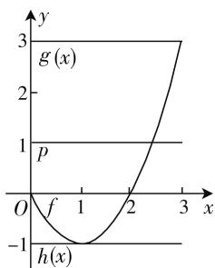
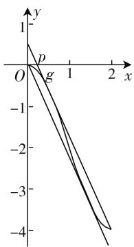
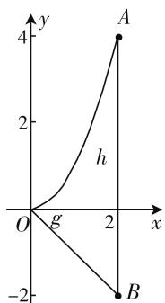

# “以形辅数话最值”

—— 小议一类绝对值函数的最值求解

● 浙江省湖州市菱湖中学 张战桥  
● 湖州市属沈恒高中数学名师工作室 沈 恒

首先给出本文中纵向距离的定义: 已知函数 $y = g(x)$ 与 $y = ax + b$ ，当两个函数图像上存在两点横坐标相同时，则称两点的纵坐标之差的绝对值为纵向距离。特别地平行线的纵向距离为两直线在 y 轴上截距之差的绝对值。要解决诸如 $\left|f(x)\right| = \left|g(x) - (ax + b)\right|$ 形式的函数最值，首先要对函数进行一定的分析，笔者从下面几个方面逐步深入，与大家共同探讨。

# 一、曲直分离的合理选择

要解决绝对值函数 $\left|f(x)\right|=\left|g(x)-(ax+b)\right|$ 的最值，首先分析此类函数模型的特征：该函数往往含有一个参数或者两个参数，可以从上述纵向距离的视角，将函数模型进行分拆组合，一般来说，可以将 $f(x)$ 分成 $g(x)-(ax+b)$ ，即某种曲线型函数和一次函数的差，分离过程尽可能将参量留给后者，意图比较明显：即一次函数的图像是一条直线，当参量变化时，其参数的几何意义容易理解，便于后续利用图像研究纵向距离的最值——这体现该问题解决的第一层次，曲直分离的合理性.

# 二、纵向距离的函数模型

有了曲直分离的方向, 自然将对其做何种函数模型匹配是关键. 我们知道, 如函数 $\left|f(x)\right| = \left|x^{2} - 2x - t\right|$ , 此时是把 $\left|(x^{2}) - (2x + t)\right|$ 作为研究对象, 还是把 $\left|(x^{2} - 2x) - (t)\right|$ 作为研究对象? 这就需要我们在实际问题解决中积累经验, 笔者将此类绝对值函数的最值考题从条件入手分成三类: (1) 曲线和定斜率的一次函数(或常数函数); (2) 曲线和无限制的一次函数; (3) 曲线和过定点的一次函数. 下面结合案例逐一分析.

# 1. 曲线和定斜率的一次函数(或常数函数)

案例 1 已知 t 为常数, 函数 $y = |x^{2} - 2x - t|$ 在区间 $[0, 3]$ 上的最大值为 2, 则 t = \_\_\_\_.

解析: 利用纵向距离可以这样解决: 令 $g(x) = x^{2} - 2x$ , $h(x) = t$ , 则 $y = |x^{2} - 2x - t|$ 表示 $y = g(x)$ 与 y = t 之间的纵向距离. 由图1可知, $y=g(x)$ 夹在y=3和y=-1两条平行线之间, 所以在 $[0,3]$ 上, $\left|x^{2}-2x-t\right|_{\max}\geqslant2$ , 当且仅当t=1时, 取等号. 又根据已知条件 $\left|x^{2}-2x-t\right|_{\max}=2$ , 所以t=1.

line

| x   | g(x) | h(x) |
| --- | ---- | ---- |
| 0   | 0    | 0    |
| f   | 0    | -1   |
| 1   | 0    | -1   |
| 2   | 1    | 0    |
| 3   | 3    | 1    |

图1

说明: 如果 $y=f(x)$ 在闭区间 D 上被两条平行线 $L_{1}:y=ax+b_{1}$ 与 $L_{2}:y=ax+b_{2}$ 所夹, 那么 $\left|f(x)-(ax+b)\right|_{\max}\geqslant\frac{b_{1}-b_{2}}{2}$ , 当且仅当 $b=\frac{b_{1}+b_{2}}{2}$ 时, 取等号. 此题是当 a=0 时的特殊情况. 本题也可以从换元的角度, 进而利用绝对值的几何意义求解.

# 2. 曲线和无限制的一次函数

案例 2 （2013 年浙江高考第 22 题改编）已知 $a \in R$ ，函数 $f(x) = x^{3} - 3x^{2} + 3ax - 3a + b$ ，当 $x \in [0, 2]$ 时，求 $|f(x)|$ 的最大值的最小值.

解析: 令 $g(x)=x^{3}-3x^{2}$ ， $h(x)=-3ax+3a-b$ ，则 $\left|f(x)\right|$ 表示 $g(x)$ 与 $h(x)$ 的纵向距离，根据图 2 观察当 $g(x)=x^{3}-$ $3x^{2}$ 被两条斜率为 -3a 的直线所夹时, 这两条平行线的中间直线与 $g(x)$ 的纵向距离即为 $\left|f(x)\right|$ 的最大值的最小值，即若两平行直线的纵截距分别是 $c_{1}, c_{2}$ ，则 $\left(\left|f(x)\right|_{\max}\right)_{\min} = \frac{\left|c_{1} - c_{2}\right|}{2}$ .

text_image

y
1
p
O
g
1
2
x
-1
-2
-3
-4

图2

由 $g'(x)=3x^{2}-6x=-3a$ ，得 $x=1\pm\sqrt{1-a}$ ，取 $x=1-\sqrt{1-a}$ 。设过点 $(2,-4)$ 且与 $y=g(x)$ 相切的直线方程 $y_{1}=-3ax+6a-4$ ，切点坐标 $(1-\sqrt{1-a},2\sqrt{1-a}+a\sqrt{1-a}-2)$ 代入切线方程得 $a=\frac{3}{4}$ ，所以切线方程 $y_{1}=-\frac{9}{4}x+\frac{1}{2}$ ，再取 $x=1+\sqrt{1-a}$ 。设过点 $(0,0)$ 且与 $y=g(x)$ 相切的直线方程 $y_{2}=-3ax$ ，切点坐标 $(1+\sqrt{1-a},-2-2\sqrt{1-a}-a\sqrt{1-a})$ 代入切线方程得 $a=\frac{3}{4}$ ，所以切线方程 $y_{2}=-\frac{9}{4}x$ ，所以 $(|f(x)|_{\max})_{\min}=\frac{\frac{1}{2}-0}{2}=\frac{1}{4}$ 。

说明: 函数的选择是关键——本题将其分解为 $g(x)=x^{3}-3x^{2}$ 与 $h(x)=-3ax+3a-b$ ，从纵向距离的视角分析何时最大值最小，图形的直观性显得较为方便.

# 3. 曲线与过定点的一次函数

案例 3 （2020 年湖州二模）已知任意 $a \in [-1, 2]$ ，若存在实数 b 使不等式 $\left|x^{2}-ax\right| \leqslant b$ 对任意的 $x \in [0, 2]$ 恒成立，则 b 的最小值是 \_\_\_\_.

解析：令 $g(x)=x^{2}, h(x)=ax$ ，则 $\left|x^{2}-ax\right|$ 表示 $g(x)=x^{2}$ 与 $h(x)=ax$ 的纵向距离，由图3可知，取 a = -1, x = 2 时， $\left|x^{2} - ax\right|$ 取得最大值，即 $\left|AB\right| = 6$ ，所以 $b \geqslant 6$ 。从而 b 的最小值为 6。

说明:对斜率有一定的限制条件,需要在纵向距离研究过程中加入其限制条件,利用其几何特征,寻求图形中量的变化,从而获得正确的解决途径.

line

| Point | x | y |
|---|---|---|
| A | 2 | 4 |
| B | 2 | -2 |
| g | 0 | 0 |

图 3

# 三、数形结合的直观体现

<table><tr><td></td><td>案例1</td><td>案例2</td><td>案例4</td></tr><tr><td>特点</td><td>用确定的二次函数和常数函数进行分离,符合大多数学生的认知</td><td>思维含量高,将其分解为确定的三次函数和无限制的一次函数,从图像中寻求纵向距离最小值</td><td>理解容易,线性函数过定点,则图形的几何意义突出,纵向距离跃然纸上</td></tr><tr><td>共性</td><td colspan="3">数形结合思想和核心素养之直观想象的重要体现</td></tr><tr><td>备注</td><td>也可以寻求整体换元,利用绝对值的几何意义</td><td>分类讨论是解决本题的基本方法,教学要关注</td><td>考虑纵向距离的方式优势明显</td></tr></table>

华罗庚说过：“数缺形时少直观，形缺数时难入微。”笔者认为利用绝对值的几何意义——距离，能够形象直观地解决一类绝对值函数 $|f(x)-(ax+b)|$ 的最大值（最小值）或最大值里的最小值问题。这恰是直观想象核心素养的重要体现。“数”和“形”一直是中学数学的两大特点，从中学数学的特征来说，利用“形”解决问题更符合学生的认知心理，因此教学中要努力挖掘数形结合思想，力求简洁直观。

本文中对直线的特征做了分门别类: 若 $y=ax+b$ 中 a, b 是没有条件限制的, 那么它的问题只能考查函数绝对值最大值的最小值问题, 那么我们可以去寻找两条平行直线 $y=ax+b_{1}$ 与 $y=ax+b_{2}$ , 利用两边夹思想将 $f(x)$ “夹住”, 则 $\left(\left|f(x)-\left(ax+b\right)\right|_{\max}\right)_{\min}=\frac{\left|b_{1}-b_{2}\right|}{2}$ ; 若 $y=ax+b$ 中 a, b 有限制条件 (一般有两种: 限定斜率——a 一定, 限定点——b 一定), 当限定斜率时, 问题的解法和前者类似, 只是两条平行线斜率也固定了, 当限定点时, $\left|f(x)-\left(ax+b\right)\right|_{\max}$ 的取得在端点处或者是极值点处, 可利用纵向距离结合图像取得.

# 参考文献：

[1] 高考数学研究组. 浙江高考数学 2004 一路走来 [M]. 浙江: 浙江大学出版社, 2016.  
[2] 李润洲. 指向学科核心素养的教学设计 [J]. 课程·教材·教法, 2018(7).  
[3] 沈恒. 数形结合的三重境界 [J]. 数学教学, 2009(10). W