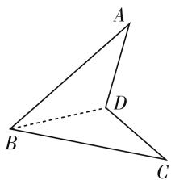
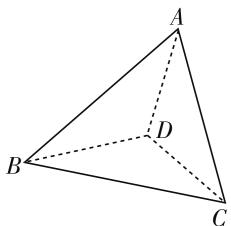
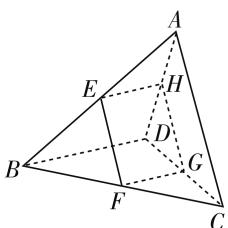
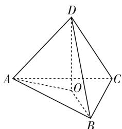
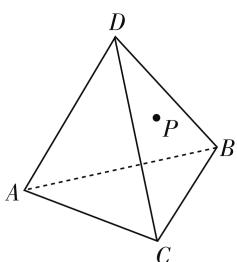

# 一道立体几何例题开放性拓展

# ● 安徽省安庆市第一中学 金怡双

一个问题价值的大小可以从学生、教师、知识发展三个方面来衡量: 是否有利于学生思维能力的发展; 是否有利于教学节奏的把握; 是否有利于知识系统的建立 $^{[1]}$ . 人教社《数学》教科书上不少例、习题具有可拓展性. 本文对《数学(必修)第二册》(A版)中一道立体几何例题进行开放性拓展研究, 旨在促进学生思维能力的发展和提高. 例题如下:

空间四边形 ABCD 中, E, F, G, H 分别是边 AB, BC, CD, DA 的中点, 求证: 四边形 EFGH 是平行四边形 $^{[2]}$ .

这道例题考查线面平行的位置关系、线面平行判定定理及其应用,考查了自然语言、符号语言及图形语言的相互转化能力和转化与化归的数学思想方法.该例题是发展学生思维能力的良好素材,为知识链的搭建提供了一个承前启后的平台.

开放性问题的开放性特征,要求学生全面观察,广泛地联想,多方向、多角度、多层次地思考,有利于发展学生高层次思维品质,能加深对数学本质的理解.数学命题一般可以根据思维形式分成“假设—推理—判断”三个部分.从数学命题要素出发,数学开放题可以分成四类 $^{[3]}$ :条件开放题、策略开放题、结论开放题、综合开放题.下面从命题要素角度对例题进行开放性拓展.

# 一、条件开放题

若一个数学开放题的未知要素是假设,则称它为条件开发题.具体而言,解决条件开放题,即寻找问题成立的充分条件,考查解题者逆向思维、分析与解决问题的能力.这类开放题的解决需要有扎实的基础知识,并对概念、定理、性质等数学知识的正逆运用熟练.

问题 1: 如图 1, 已知点 E, F 是空间四边形 ABCD 两边上的两点, 且 \_\_\_\_ (设置 E, F 满足某一条件), 求证: EF // 平面 BCD.

问题 1 的结论已经暗示点 E, F 在分别边 AB,AD(或AD,AB)上,自由度广阔.
连结空间四边形 ABCD 的对角线,得一四面体 ABCD,

在问题 1 中, 如果将点 E, F 限制在四面体 ABCD 的某两个面内, 其变化空间更广, 思维的空间也更加开阔, 因而得到另一条件开放题.

问题 2: 如图 2, 已知点 E, F 是四面体 ABCD 某两面内的点, 且 \_\_\_\_ (设置 E, F 满足某一条件), 求证: EF // 平面 BCD.

通过改变限制条件,思维可以从三个角度切入:一是找两点E,F和表示平面BCD的三角形BCD 某边平行;二是在平面 BCD 内任作一条直线 l, 确定两点 E, F, 使得 $EF \parallel l$ ; 三是找平面 BCD 的平行平面 $\alpha$ , 再在其内作满足条件的点 E, F, 满足 $EF \parallel l$ .

natural_image

Geometric diagram of a tetrahedron with vertices labeled A, B, C, and D (no text or symbols present)

图1

text_image

Geometric diagram of a tetrahedron with labeled vertices A, B, C, and D, showing solid and dashed edges.

图2

思维被逐渐打开后,不妨思考如果作和某一(或二,甚至更多的)直线平行的平面,又该如何?于是就有了下列条件开放性拓展.

问题 3: 已知四面体 ABCD, 点 E 在 BC 上, 点 F, G 在其他棱上, 且 \_\_\_\_ (设置 F, G 满足某一条件), 求证: BD // 平面 EFG.

问题 4: 已知四面体 ABCD, 点 E 在 BC 上, 点 F, G 在其他棱上, 且 \_\_\_\_ (设置 F, G 满足某一条件), 求证: BD // 平面 EFG, 且 AC // 平面 EFG.

条件开放题的解决,反映了思维的深刻性品质,即能分清实质的能力.这种能力表现为解题者能洞察研究的每一个事实的实质及其相互联系,能从所研究的材料中揭示被隐含的某些特殊情况,并能组合成具体的模式.条件开放题为教学过程中的师生之间相互交流,提供了一种基本途径,教师通过把要教学的内容进行预设,借助提问,促使生成;学生亦可通过提问,达到排疑解惑之目标.它又是能借助师生间的相互作用,促进思维、巩同知识、运用知识、检查学习、实现教学目标的一种有效的教学方式,它还能直接影响课堂学习活动的开展,影响数学活动效果的提高.

# 二、结论开放题

若一个数学开放题的未知要素是判断(即问题的结论),就称它为结论开放题. 结论开放题的解决过程,就是将先前获得的知识用于新的、不熟悉的情境过程,它是一个发现的过程、探索的过程、创新的过程. 数学解题思维活动的出发点依赖于已有的知识和经验,而知识结构的优化与题意本质的理解、条件的灵活组合是成功发现结论的条件.

问题 5: 如图 3, 已知点 E 是空间四边形 ABCD 边 AB 的中点, 过点 E 的平面 $\alpha$ 和空间四边形的对角线 AC, BD, 并与边 BC, CD, DA 依次交于点 F, G, H. 请补充一个结论并证明.

text_image

Geometric diagram of a tetrahedron with labeled vertices and internal points, used for spatial geometry problems.

图3

将例题的条件稍作变化,并隐去结论,问题就变成一个起点低,结论多样化的开放题.但本题由于点E位置确定,因而F,G,H三点的位置也确定,如图3所示.

分析: 本题主要考查线面平行的位置关系知识点, 考查直观想象数学素养. 解题的关键作出截面图形; 在思维上, 引导学生利用线面平行的性质定理, 将空间问题转化为平面问题, 进行降维处理, 依次作出有公共边的平面截线. 问题目标可选择从位置关系与数量关系方向在截面图形内部考虑结论, 也可以在图形之间或几何体之间探索结论.

# 参考答案:

(1) 点 F, G, H 分别为 BC, CD, DA 的中点.  
(2) $EH \underline{\underline{\underline{\underline{\underline{1}}}}} \frac{1}{2} BD \left( FG \underline{\underline{\underline{\underline{1}}}} \frac{1}{2} BD, \text{或} EF \underline{\underline{\underline{\underline{1}}}} \frac{1}{2} AC, \text{或} HG \underline{\underline{\underline{\underline{1}}}} \frac{1}{2} AC \right).$   
(3) $EH \parallel$ 平面 $BCD(FG \parallel$ 平面 $ABD$ , 或 $EF \parallel$ 平面 $ACD$ , 或 $GH \parallel$ 平面 $ABC$ ).  
(4) 四边形 EFGH 为平行四边形.  
(5) 四边形 EFGH 的内角为异面直线 AC、BD 所成的角(或其补角).

(6) 四边形 EFGH 的面积为 $\frac{1}{4}AC \cdot BD \cdot \sin\theta$ (其中 $\theta$ 为异面直线 AC、BD 所成的角).  
(7) $V_{BEF-DHG}:V_{ACEFGH}=1:1.$

问题6: 四面体ABCD如图4所示, 已知侧棱DA, DB, DC两两互相垂直, 请你尽可能多地得出这个四面体的性质.

# 分析与参考答案:

通过多角度思考, 可逐步得出以下各个结论:

text_image

Geometric diagram of a tetrahedron with labeled vertices A, B, C, D and center O

图4

(1) 四面体 ABCD 的三个侧面 DAB, DAC, DBC 两两垂直;  
(2) 底面 $\triangle ABC$ 是锐角三角形；  
(3) 顶点 D 在底面内的射影 O 是 $\triangle ABC$ 的垂心， $\triangle DAB$ 的面积是 $\triangle OAB$ 的面积和 $\triangle ABC$ 的面积的比例中项；  
(4) $S_{\triangle ABC}^{2}=S_{\triangle DAB}^{2}+S_{\triangle DBC}^{2}+S_{\triangle DAC}^{2};$   
（5）设 $\alpha, \beta, \gamma$ 分别为高与各侧棱所成的角，则有： $\cos^{2}\alpha+\cos^{2}\beta+\cos^{2}\gamma=1,\sin^{2}\alpha+\sin^{2}\beta+\sin^{2}\gamma=2,\cos\alpha$ $\cdot\cos\beta\cdot\cos\gamma\leqslant\frac{\sqrt{3}}{9},\sin\alpha\cdot\sin\beta\cdot\sin\gamma\leqslant\frac{2\sqrt{6}}{9}.$

结论开放性题的解决与否、结论的证明难度系数大小,反映解题者思维的广阔性品质.这种思维品质表现为既能从整体角度把握数学问题,又能抓住其基本特征;既能抓住细节,又能关注特殊因素,多角度、多层次的探索与发现.

# 三、策略开放题

若一个数学开放题的未知要素是推理(即问题的解决策略),则称它为策略开放题.这类开放题,往往要求给出设计方案解决问题,展现了策划人的处理问题的宏观和微观的调控能力,以及优化解决问题的能力.

问题 7: 一个小木块如图 5 所示, 点 P 在平面 DBC 内, 过点 P 将木块锯开, 使截面平行直线 DA 和 DB, 应该怎样画线?

问题 8: 欲制作一四面体, 其中共一个顶点的三条棱两两相互垂直,且长度分别是40cm,40cm,20cm,现在只有一块两直角边长分别是80cm,70cm的三角形纸版,怎样裁剪,可以拼成所需要的四面体?

text_image

D
P
A
B
C

图5

策略性开放题不是仅仅凭靠课堂提问数量的增加,促进教学质量的提高,而是以它的有效性高低,影响教学活动完成的进度与完成的质量.一般说来,它的有效性应具有以下几个特征:

(1) 可及性: 开放题的设计要符合学生一般认知规律、身心发展规律等;  
(2) 开放性: 开放题有层次感, 入手较易, 开放性强, 解决方案多, 学生思维与创造的空间较大;  
(3) 挑战性: 能引起学生的认知冲突和学习心向, 能激发兴趣, 促进学生积极参与, 接受问题的挑战;  
(4) 体验性: 能给学生提供深刻体验, 人人有所得, 包括操作、探究的机会或替代性经验, 学生能够感受、体验数学 $^{[4]}$ .

# 四、综合开放题

有些问题只给出它的情境,而其条件、解题策略与结论都要求主体在情境中自行设定与寻探索,则称这类问题为综合开放题.

问题 9: 设计一个呈空间四边形撑架, 在其上安装一块矩形太阳能吸光板, 要求吸光板的吸光量最大.

这道开放题背景源自于生活中的太阳能安装设计,但有变化. 设计时应考虑空间四边形支架的设计要求(材料限制、边长设计要求等)、矩形太阳能光板的安置、矩形太阳能吸光板的面积最值等具体问题.

问题 9 的解决,需要将问题中涉及到的数量关系和内在联系与图形模式有效地连接起来,引进变量表示太阳能吸光板的面积,从而揭示问题的条件和结论间的内在联系,使问题化难为易,化繁为简,体现了思维的灵活性和创造性.

一道好例习题的教学,不仅起到加深知识点的理解,还应促进知识网络结构的形成、思维的培养和思维品质的提高.例题的变式研究、开放性研究与拓展均能有效地达成教学目标和提升教学效率,也是数学教学的新模式,研究前景广阔、意义深远.

# 参考文献：

[1] 张文峰.“好问题”的标准[J]. 新课程,2010(9).  
[2] 人民教育出版社等编. 数学(必修 A 版) 第二册 [M]. 人民教育出版社 2019 版, 第 134 页.  
[3] 戴再平等著. 数学开放题研究 [M], 广西教育出版社, 2012 年版第 23-24 页.  
[4] 谢尚志, 林光来. 试论数学课堂提问的“立体优化”[J]. 数学教学通讯, 2006(9). F

# (上接第42页)

评注:在高三备考中,利用曲线方程的定义,适当拓展学生知识面,也是有益于学生思维能力培养的.

# 方法五:巧用平面几何知识,减少计算量

关于直线 AB, AC 的斜率, 大家基本上都是利用直线和圆相切, 通过圆心到直线的距离等于半径获得. 事实上, 如果在审题时注意到圆 $(x-2)^{2} + y^{2} = 1$ 的圆心坐标 $M(2,0)$ , $A(2,2)$ , 不难得到 $MA \perp x$ 轴, 由圆的半径为 1, 直接得出 $k_{AB}, k_{AC} = \pm\sqrt{3}$ , 接下来解题思路同方法一～四.

# 三、教学启示

此题背景很基础,也没有用到“秒杀”“套路”,回到解决解析几何问题的根本思路上去优化运算过程，真正体现了将数学学科核心素养“数学运算”“逻辑推理”通过学生的解题反映出来。不同学生在审题时调动的知识储备不一样，解题经验不一样，思维角度不一样，就会导致在具体运算过程中选择运算思路不一样，这也体现了命题者“低起点，多层次，高落差”科学命题策略。

值得一提的是,一题多解要考虑教师和学生的角色差异.教师不能将自己的解题价值观强灌输给学生,而是引导学生通过分析题目给出的条件,紧盯解题目标,调动题目涉及的“源知识”及其研究方法,探寻出解题思路,才能真正地通过一题多解训练学生的思维,发展数学运算能力等核心素养.F