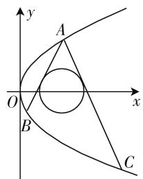

# 一题多解促进学生思维发展\*

—— 以 2021 年八省、市高考模拟演练数学第 7 题为例

# 湖北省襄阳市第四中学 马海俊

2020年1月23日至25日，由教育部考试中心组织命题，广东、辽宁、湖南、湖北、河北、福建、江苏和重庆8个省、市的高三学子参加了新高考模拟演练考试。对于数学学科第7题，以抛物线、圆和直线的位置关系为背景，考查学生的数学运算、逻辑推理能力。本文以此题为例，提供多种解题思路，引领学生进行解题反思，通过探究运算思路，促进数学思维发展，形成规范化思考问题的品质，养成一丝不苟、严谨求实的科学精神。

# 一、试题呈现

（2021年普通高等学校招生全国统一考试模拟演练·7）已知抛物线 $y^{2} = 2px$ 上三点 $A(2,2), B, C$ ，直线 $AB, AC$ 是圆 $(x - 2)^{2} + y^{2} = 1$ 的两条切线，则直线 $BC$ 的方程为（ ）.

A. $x + 2y + 1 = 0$

B. $3x + 6y + 4 = 0$

C. $2x + 6y + 3 = 0$

D. $x + 3y + 2 = 0$

# 二、解法探究

# 方法一:硬算也是硬实力

点 $A(2,2)$ 在抛物线 $y^{2}=2px$ 上，故 $2^{2}=2p\times2$ ，即p=1，抛物线方程为 $y^{2}=2x$ ，设过点 $A(2,2)$ 与圆 $(x-2)^{2}+y^{2}=1$ 相切的直线的方程为 $y-2=k(x-2)$ ，即 $kx-y+2-2k=0$ ，则圆心 $(2,0)$ 到切线的距离 $d=\frac{|2k-0+2-2k|}{\sqrt{k^{2}+1}}$

=1, 解得 $k = \pm\sqrt{3}$ . 如图 1, 直线 AB: $y - 2 = \sqrt{3} (x -$ 2), 直线 $AC: y - 2 = -\sqrt{3}(x - 2)$ .

text_image

y
A
O
x
B
C

图1

联立 $\left\{\begin{aligned}y-2&=\sqrt{3}(x-2),\\ y^{2}&=2x,\end{aligned}\right.$ 得 $3x^{2}+(4\sqrt{3}-14)x+16-8\sqrt{3}=0$ ，故 $x_{A}x_{B}=\frac{16-8\sqrt{3}}{3}.$

由 $x_{A}=2$ ，得 $x_{B}=\frac{8-4\sqrt{3}}{3}$ ，故 $y_{B}=\frac{2\sqrt{3}-6}{3}$ .

联立 $\left\{\begin{aligned}y-2&=-\sqrt{3}(x-2),\\ y^{2}&=2x,\end{aligned}\right.$ 得 $3x^{2}-(4\sqrt{3}+14)x+16+8\sqrt{3}=0$ ，故 $x_{A}x_{C}=\frac{16+8\sqrt{3}}{3}.$

由 $x_{A} = 2$ ，得 $x_{C} = \frac{8 + 4\sqrt{3}}{3}$

故 $y_{C} = \frac{-2\sqrt{3} - 6}{3}$ ，故 $y_{B} + y_{C} = \frac{2\sqrt{3} - 6}{3} + \frac{-2\sqrt{3} - 6}{3} = -4.$

又由点 B, C 在抛物线上可知, 直线 BC 的斜率为 $k_{BC}=\frac{y_{B}-y_{C}}{x_{B}-x_{C}}=\frac{y_{B}-y_{C}}{\frac{1}{2}y_{B}^{2}-\frac{1}{2}y_{C}^{2}}=\frac{2}{y_{B}+y_{C}}=\frac{2}{-4}=$ $=-\frac{1}{2}$ ，故直线 BC 的方程为 $y-\frac{2\sqrt{3}-6}{3}=-\frac{1}{2}\cdot\left(x-\frac{8-4\sqrt{3}}{3}\right)$ ，即 $3x+6y+4=0$ .

故选 B.

评注: 此法是试题出现后, 大家普遍采用的解题思路. 根据直线和圆的位置关系, 得出直线 AB, AC 斜率, 联立直线和抛物线方程得交点坐标, 由两点坐标得 BC 方程. 思路自然, 只是在计算点 B, C 坐标时计算量有点大, 不仅考查学生的细心和耐心, 对学生心理素质也是个极大考验.

# 方法二:齐次化处理简化运算量

同方法一先得抛物线方程为 $y^{2}=2x$ . 直线 AB, AC 的斜率为 $k=\pm\sqrt{3}$ ，选择项告诉我们直线 BC 斜率存在，设直线 BC 的方程为 $y=kx+m$ ，则有 $y-2=k(x-2)+m-2+2k$ , $A(2,2)$ 不在直线 BC 上，故 $m-2+2k\neq0$ ，且 $\frac{y-2-k(x-2)}{m-2+2k}=1$ .

将抛物线方程 $y^{2}=2x$ 转化为 $(y-2+2)^{2}=2(x-2)+4$ ，即 $(y-2)^{2}+4(y-2)=2(x-2)$ ，则 $(y-2)^{2}+4(y-2)\cdot\frac{y-2-k(x-2)}{m+2k-2}=2(x-2)\cdot\frac{y-2-k(x-2)}{m+2k-2}$ ，化简整理得 $(y-2)^{2}(m+2k+2)-(4k+2)\cdot(y-2)\cdot(x-2)+2k\cdot(x-2)^{2}=0$ ，即 $\left(\frac{y-2}{x-2}\right)^{2}(m+2k+2)-(4k+2)\cdot\left(\frac{y-2}{x-2}\right)+2k=0$ ，当 $m+2k+2=0$ 时，直线 BC 过 $(2,-2)$ 点，不合题意，舍去.

当 $m+2k+2\neq0$ 时，直线 AB, AC 的斜率满足 $k_{AB} + k_{AC} = \frac{4k + 2}{m + 2k + 2}, k_{AB} \cdot k_{AC} = \frac{2k}{m + 2k + 2}$ ，所以 $k_{AB} + k_{AC} = \frac{4k + 2}{m + 2k + 2} = 0, k_{AB} \cdot k_{AC} = \frac{2k}{m + 2k + 2} = -3$ ，解得 $k = -\frac{1}{2}, m = -\frac{2}{3}$ ，故直线 BC 方程为 $3x + 6y + 4 = 0$ .

故选 B.

评注:利用直线和圆的位置关系找到斜率之后,敏锐地察觉到 $k_{AB}+k_{AC}=\frac{4k+2}{m+2k+2}=0$ , $k_{AB}\cdot k_{AC}=\frac{2k}{m+2k+2}=-3$ ,通过构造齐次式简化运算.这是审题的突破口,发散思维的结果.

# 方法三:巧用方程思想

同方法一得抛物线方程为 $y^{2}=2x$ . 设 $B(x_{1},y_{1}), C(x_{2},y_{2})$ ，则直线 AB 方程为 $2x-(2+y_{1})y+2y_{1}=0$ ，（注意过抛物线上两点的直线方程 $2px+(y_{1}+y_{2})y+y_{1}y_{2}=0$ ）与圆 $(x-2)^{2}+y^{2}=1$ 相切，所以圆心 $(2,0)$ 到切线的距离 $d=\frac{|4+2y_{1}|}{\sqrt{4+(2+y_{1})^{2}}}=1$ ，化简得 $3y_{1}^{2}+12y_{1}+8=0$ ，又 $y_{1}^{2}=2x_{1}$ ，代入得 $6x_{1}$ $+12y_{1}+8=0$ ，即 $3x_{1}+6y_{1}+4=0$ ，同理C点坐标满足 $3x_{2}+6y_{2}+4=0$ ，所以直线BC方程为 $3x+6y+4=0$ 。

故选 B.

评注: 过抛物线两点的直线方程形式比较特殊, 在平时训练中, 学生接触过, 甚至掌握的较好. 准确理解直线方程的一般式是此法致胜的关键.

# 方法四:二次曲线系

同方法一得抛物线方程为 $y^{2}=2x$ . 直线 AB, AC 斜率为 $\pm\sqrt{3}$ . 不妨设直线 AB: $y-2=\sqrt{3}(x-2)$ , 直线 AC: $y-2=-\sqrt{3}(x-2)$ , 则由 AB, AC 构成的二次曲线方程为 $\left[2-y+\sqrt{3}(x-2)\right]\cdot\left[2-y-\sqrt{3}(x-2)\right]=0$ , 化简得 $3(x-2)^{2}-(y-2)^{2}=0$ .

由 $y^{2}=2x$ ，得 $x=\frac{y^{2}}{2}$ ，代入上式得 $(y-2)^{2}(3y^{2}+12y+8)=0$ ，即 $(y^{2}-4y+4)\cdot(3y^{2}+12y+8)=0$ ，将 $y^{2}=2x$ 代入得 $(2x-4y+4)\cdot(6x+12y+8)=0$ ，过 A 点的切线为 $x-2y+2=0$ ，AB，AC 构成的曲线与抛物线的交点是 A，B，C 三点，所以直线 BC 的方程为 $3x+6y+4=0$ 。

故选 B.

二次曲线系的另一种证明过程: 同方法一得抛物线方程为 $y^{2}=2x$ . 直线 AB, AC 斜率为 $\pm\sqrt{3}$ . 不妨设直线 AB: $y-2=\sqrt{3}(x-2)$ , 直线 AC: $y-2=-\sqrt{3}(x-2)$ , 则由抛物线, AB, AC 构成的二次曲线方程为 $\mu(y^{2}-2x)+\lambda[2-y+\sqrt{3}(x-2)]\cdot[2-y-\sqrt{3}(x-2)]=0$ , 化简整理得 $-3\lambda x^{2}+(\lambda+\mu)y^{2}+(12\lambda-2\mu)x-4\lambda y-8\lambda=0$ . ①

过 A 点的切线方程为 $2y = x + 2$ ，设直线 BC: $ax + by + c = 0$ ，则由点 A、直线 BC 构成的二次曲线方程可设为 $[x - 2y + 2] \cdot [ax + by + c] = 0$ ，化简整理得 $ax^{2} - 2by^{2} + (b - 2a)xy + (c + 2a)x + (2b - 2c)y + 2c = 0.$ ②

比较 ①② 系数, 得 $\left\{\begin{aligned}-3\lambda &= a, \\ \lambda + \mu &= -2b, \\ 12\lambda - 2\mu &= c + 2a,\end{aligned}\right.$

$\left\{ \begin{array}{l} b - 2a = 0, \\ -4\lambda = 2b - 2c, \text{得} b = 2a, c = \frac{4}{3} a, \text{所以直线} BC:ax \\ -8\lambda = 2c, \end{array} \right.$ $+2ay + \frac{4}{3} a = 0$ ，即 $3x + 6y + 4 = 0.$

(下转第50页)

相互垂直,且长度分别是40cm,40cm,20cm,现在只有一块两直角边长分别是80cm,70cm的三角形纸版,怎样裁剪,可以拼成所需要的四面体?

策略性开放题不是仅仅凭靠课堂提问数量的增加,促进教学质量的提高,而是以它的有效性高低,影响教学活动完成的进度与完成的质量.一般说来,它的有效性应具有以下几个特征:

(1) 可及性: 开放题的设计要符合学生一般认知规律、身心发展规律等;  
(2) 开放性: 开放题有层次感, 入手较易, 开放性强, 解决方案多, 学生思维与创造的空间较大;  
(3) 挑战性: 能引起学生的认知冲突和学习心向, 能激发兴趣, 促进学生积极参与, 接受问题的挑战;  
(4) 体验性: 能给学生提供深刻体验, 人人有所得, 包括操作、探究的机会或替代性经验, 学生能够感受、体验数学 $^{[4]}$ .

# 四、综合开放题

有些问题只给出它的情境,而其条件、解题策略与结论都要求主体在情境中自行设定与寻探索,则称这类问题为综合开放题.

问题 9: 设计一个呈空间四边形撑架, 在其上安装一块矩形太阳能吸光板, 要求吸光板的吸光量最大.

这道开放题背景源自于生活中的太阳能安装设计,但有变化. 设计时应考虑空间四边形支架的设计要求(材料限制、边长设计要求等)、矩形太阳能光板的安置、矩形太阳能吸光板的面积最值等具体问题.

问题 9 的解决,需要将问题中涉及到的数量关系和内在联系与图形模式有效地连接起来,引进变量表示太阳能吸光板的面积,从而揭示问题的条件和结论间的内在联系,使问题化难为易,化繁为简,体现了思维的灵活性和创造性.

一道好例习题的教学,不仅起到加深知识点的理解,还应促进知识网络结构的形成、思维的培养和思维品质的提高.例题的变式研究、开放性研究与拓展均能有效地达成教学目标和提升教学效率,也是数学教学的新模式,研究前景广阔、意义深远.

# 参考文献：

[1] 张文峰.“好问题”的标准[J]. 新课程,2010(9).  
[2] 人民教育出版社等编. 数学(必修 A 版) 第二册 [M]. 人民教育出版社 2019 版, 第 134 页.  
[3] 戴再平等著. 数学开放题研究 [M], 广西教育出版社, 2012 年版第 23-24 页.  
[4] 谢尚志, 林光来. 试论数学课堂提问的“立体优化”[J]. 数学教学通讯, 2006(9). F

# (上接第42页)

评注:在高三备考中,利用曲线方程的定义,适当拓展学生知识面,也是有益于学生思维能力培养的.

# 方法五:巧用平面几何知识,减少计算量

关于直线 AB, AC 的斜率, 大家基本上都是利用直线和圆相切, 通过圆心到直线的距离等于半径获得. 事实上, 如果在审题时注意到圆 $(x-2)^{2} + y^{2} = 1$ 的圆心坐标 $M(2,0)$ , $A(2,2)$ , 不难得到 $MA \perp x$ 轴, 由圆的半径为 1, 直接得出 $k_{AB}, k_{AC} = \pm\sqrt{3}$ , 接下来解题思路同方法一～四.

# 三、教学启示

此题背景很基础,也没有用到“秒杀”“套路”,回到解决解析几何问题的根本思路上去优化运算过程，真正体现了将数学学科核心素养“数学运算”“逻辑推理”通过学生的解题反映出来。不同学生在审题时调动的知识储备不一样，解题经验不一样，思维角度不一样，就会导致在具体运算过程中选择运算思路不一样，这也体现了命题者“低起点，多层次，高落差”科学命题策略。

值得一提的是,一题多解要考虑教师和学生的角色差异.教师不能将自己的解题价值观强灌输给学生,而是引导学生通过分析题目给出的条件,紧盯解题目标,调动题目涉及的“源知识”及其研究方法,探寻出解题思路,才能真正地通过一题多解训练学生的思维,发展数学运算能力等核心素养.F