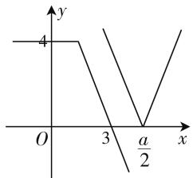
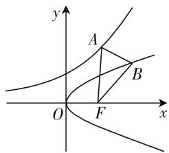
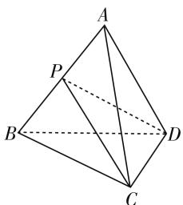

# 例谈数学核心素养在解题中的体现

# ● 甘肃省古浪县第一中学 王玺洲

在高考数学中,新课标培养学生的终极目标是让学生逐步培养六大核心素养.那么,在解题过程中六大核心素养又是怎样体现的呢?请结合典例解析,认真领会,以便不断提升!

# 类型一、体现“数学抽象与直观想象”的核心素养

高考对数学抽象的考查,包括实际应用、构造函数等方面的试题;高考对直观想象的考查,包括平面几何、立体几何、圆锥曲线、函数图像、几何概型、线性规划等方面的试题.值得关注的是,在高考真题中往往将数学抽象与直观想象这两种核心素养加以综合考查,侧重考查考生的抽象思维能力以及数形结合能力.

1. 求解与平面图形、立体图形以及函数图像有关的数学问题时,往往需要充分利用数形结合的思想,将“数”和“形”结合起来加以具体考查,以便获得巧思妙解,优化解题思维,有利于提升直观想象的核心素养.

例 1 已知函数 $f(x)=|2x-a|+|x-1|$ ，若 $f(x)\geqslant5-x$ 对 $x\in R$ 恒成立，求实数 a 的取值范围.

解析: $f(x) \geqslant 5 - x$ 对 $x \in R$ 恒成立，即 $|2x - a| + |x - 1| \geqslant 5 - x$ 对 $x \in R$ 恒成立，令 $g(x) = 5 - x - |x - 1| = \begin{cases} 6 - 2x & x \geqslant 1, \\ 4 & x < 1, \end{cases}$ 则 $|2x - a|$ $\geqslant g(x)$ 对 $x \in R$ 恒成立.

line

| x | y |
|---|---|
| 0 | 4 |
| 3 | 0 |
| a/2 | 0 |

图1

令 $h(x)=|2x-a|$ ，在同一坐标系中作出 $g(x), h(x)$ 的图像，如图1. 由图像可知， $\frac{a}{2} \geqslant 3$ ，所以 $a \geqslant 6$ ，

即 a 的取值范围是 $[6, +\infty)$ .

2. 以下两类问题, 主要体现数学抽象的核心素养: 一是求解有关实际应用问题时, 往往需要在弄清楚题意的基础上, 从中抽象概括获得具体的纯数学问题; 二是为了便于分析、解决一些不等式问题或最值问题等,往往需要构造函数,灵活运用函数的性质加以求解.

例 2 设 $\varphi(a,b)=\sqrt{\left(a-\frac{b^{2}}{4}\right)^{2}+(\mathrm{e}^{a}-b)^{2}}+\frac{b^{2}}{4}$ ，其中 $a\in R, b\in R, e$ 是自然对数的底数，则当 a, b 变化时， $\varphi(a,b)$ 的最小值是（）.

A. $\sqrt{2}-1$

B. $\sqrt{3}-1$

C. 1

D. $\sqrt{3}-\sqrt{2}$

解析：构造点 $A(a, e^{a})$ ， $B\left(\frac{b^{2}}{4}, b\right)$ ，则易知点 A 在函数 $y = e^{x}$ 的图像上，点 B 在抛物线 $y^{2} = 4x$ 上。如图 2，在同一坐标系内分别画出 $y = e^{x}$ 和 $y^{2} = 4x$ 对应的图形。设抛物线 $y^{2} = 4x$ 的焦点为 F，因为准线方程为 x = -1，所以由抛物线的定义得 $\left|BF\right| = \frac{b^{2}}{4} + 1$ ，所以 $\varphi(a, b) = |AB| + |BF| - 1 \geqslant |AF| - 1$ （当且仅当点 B 在线段 AF 上时，不等式取等号）.

text_image

y
A
B
O
F
x

图 2

因为 $A(a, e^{a}), F(1,0)$ ，所以 $\left|AF\right| = \sqrt{(a-1)^{2} + (e^{a})^{2}} = \sqrt{e^{2a} + a^{2} - 2a + 1}$ 。设函数 $f(a) = e^{2a} + a^{2} - 2a + 1$ ，则 $f'(a) = 2e^{2a} + 2a - 2$ 。因为易知导函数 $f'(a)$ 在 R 上单调递增，且 $f'(0) = 0$ ，所以可知：当 a < 0 时， $f'(a) < 0$ ；当 a > 0 时， $f'(a) > 0$ 。

于是,函数 $f(a)$ 在 $(-∞,0)$ 上单调递减,在 $(0,+∞)$ 上单调递增.

从而， $f(a)_{\min} = f(0) = 2.$ 故所求 $\varphi (a,b)_{\min} = |AF|_{\min} - 1 = \sqrt{2} -1.$ 故选A.

# 类型二、体现“逻辑推理与数学运算”的核心素养

高考对逻辑推理的考查,包括推理与证明、逻辑推断、立体几何证明、程序框图等方面的试题;高考对数学运算的考查,包括数列、圆锥曲线、导数、三角函数、直线与圆等方面的试题. 值得关注的是, 在高考真题中往往将逻辑推理与数学运算这两种核心素养加以综合考查, 侧重考查考生的推理论证能力以及运算求解能力.

1. 逻辑推理题是近年高考中的一个新的热点题型,往往需要先审清题意,找准切入点,再灵活运用“假设推理法”加以求解.  
2. 数学中许多问题(例如求值问题、求范围问题等)往往涉及化简、运算,这一很重要的解题过程,侧重考查了运算求解能力,体现的是数学运算的核心素养.

例 3 已知在三棱锥 A-BCD 中, 棱长 AD=DB=AC=CB=1, 则该三棱锥体积的最大值等于 \_\_\_\_.

解析: 如图 3 所示, 取线段 AB 的中点 P, 并连接 PC, PD, 则根据 AD = DB, AC = CB, 可知 $AB \perp PD$ , $AB \perp PC$ . 又因为 $PC \cap PD = P$ , 从而可得 $AB \perp$ 平面 PCD.

令 $AB=2x(0<x<1)$ ，则
可知 $PC = PD = \sqrt{1 - x^{2}}$ .

text_image

Geometric diagram of a tetrahedron with labeled vertices A, B, C, D and point P, showing solid and dashed edges.

图3

$$
\begin{array}{r l} & {\text {于是}, V _ {A - B C D} = V _ {A - P C D} + V _ {B - P C D} = \frac {1}{3} \bullet S _ {\triangle P C D} \bullet A P} \\ & {+ \frac {1}{3} \bullet S _ {\triangle P C D} \bullet B P = \frac {1}{3} \bullet S _ {\triangle P C D} \bullet A B = \frac {1}{3} \bullet 2 x \bullet} \\ & {\frac {1}{2} (\sqrt {1 - x ^ {2}}) ^ {2} \sin \angle C P D \leqslant \frac {1}{3} x \bullet (\sqrt {1 - x ^ {2}}) ^ {2}.} \end{array}
$$

设函数 $f(x) = \frac{1}{3} x \cdot (\sqrt{1 - x^2})^2 = \frac{1}{3}(x - x^3)$ , $0 < x < 1$ , 则 $f'(x) = \frac{1}{3} - x^2$ , 所以当 $0 < x < \frac{\sqrt{3}}{3}$ 时, $f'(x) > 0$ ; 当 $\frac{\sqrt{3}}{3} < x < 1$ 时, $f'(x) < 0$ .

于是，函数 $f(x)$ 在 $\left(0, \frac{\sqrt{3}}{3}\right)$ 上单调递增，在 $\left(\frac{\sqrt{3}}{3}, 1\right)$ 上单调递减，所以 $f(x)_{\max} = f\left(\frac{\sqrt{3}}{3}\right) = \frac{2\sqrt{3}}{27}$ .

从而，可得 $V_{A - BCD} \leqslant \frac{2\sqrt{3}}{27}$ ，当且仅当 $\sin \angle CPD = 1$ 且 $x = \frac{\sqrt{3}}{3}$ ，即平面 $ABD \perp$ 平面 $ABC$ 且 $AB = \frac{2\sqrt{3}}{3}$ 时，不等式取等号。故三棱锥体积的最大值为 $\frac{2\sqrt{3}}{27}$ 。

# 类型三、体现“数学建模与数据分析”的核心素养

高考对数学建模的考查,包括函数实际应用、函数与方程、线性规划实际应用等方面的试题;高考对数据分析的考查,包括回归分析、统计案例等方面的试题.值得关注的是,在高考真题中往往将数学建模与数据分析这两种核心素养加以综合考查,侧重考查考生利用数学思维分析、解决实际问题的能力(即数学建模能力)以及数据分析能力.

例 4 从某高级中学随机抽取 16 名高三学生, 经校医利用对数视力表具体检查, 获得了每位学生的视力情况, 其中“好视力”(不低于 5.0) 一共有 4 人.

(1) 现从这 16 人中不放回地任意抽取 3 人, 求抽到“好视力”学生的人数 X 的分布列及数学期望;  
(2) 现从这 16 人中有放回地任意抽取 3 次, 每次取 1 人, 求抽到“好视力”学生的人数 Y 的分布列及数学期望.

解析:(1)根据题意可知,X服从超几何分布,其中参数N=16,M=4,n=3. 易知X=0,1,2,3,且 $P(X=k)=\frac{C_{4}^{k}C_{12}^{3-k}}{C_{16}^{3}},k=0,1,2,3.$ 所以X的分布列为:

<table><tr><td>X=k</td><td>0</td><td>1</td><td>2</td><td>3</td></tr><tr><td>P(X=k)</td><td> $\frac{11}{28}$ </td><td> $\frac{33}{70}$ </td><td> $\frac{9}{70}$ </td><td> $\frac{1}{140}$ </td></tr></table>

故所求数学期望 $EX=0\times\frac{11}{28}+1\times\frac{33}{70}+2\times\frac{9}{70}+3\times\frac{1}{140}=\frac{3}{4}$ .

(2) 因为抽取时“有放回”，所以每抽取 1 次抽到“好视力”学生的概率均为 $\frac{4}{16} = \frac{1}{4}$ ，从而根据题意可知 $Y \sim B\left(3, \frac{1}{4}\right)$ 。其分布列为 $P(Y = k) = C_{3}^{k} \cdot \left(\frac{1}{4}\right)^{k} \cdot \left(\frac{3}{4}\right)^{3-k}$ ，k = 0, 1, 2, 3，即：

<table><tr><td>Y=k</td><td>0</td><td>1</td><td>2</td><td>3</td></tr><tr><td>P(Y=k)</td><td> $\frac{27}{64}$ </td><td> $\frac{27}{64}$ </td><td> $\frac{9}{64}$ </td><td> $\frac{1}{64}$ </td></tr></table>

故所求数学期望 $EY=3\times\frac{1}{4}=\frac{3}{4}$ .

总之,通过以上例题的解析可知:关注数学六大核心素养在解题中的具体体现,有利于帮助同学们迅速寻找解题的切入点,在解题思路上给予理论指导,进而提高处理问题的能力. W