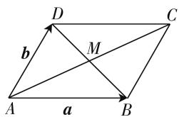
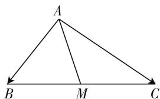
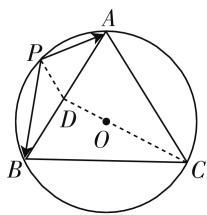
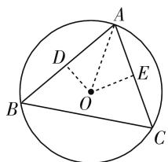
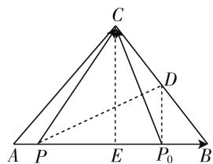

# 例谈极化恒等式在解题中的应用

# ● 江苏省西亭高级中学 金 鑫

处理平面向量中涉及具有共同起点的两个向量的数量积问题时,如果能够灵活运用极化恒等式,那么往往可迅速获得比较简洁、明了的解答过程,令人耳目一新!

# 一、认识极化恒等式

如图1,设向量 $a=\overrightarrow{AB},b=\overrightarrow{AD}$ ，现以AB,AD为邻边作平行四边形ABCD，则因为 $\overrightarrow{AC}=\overrightarrow{AB}+\overrightarrow{AD}=a+b$ ，所以 $AC^{2}=|\overrightarrow{AC}|^{2}=(a+b)^{2}=a^{2}+b^{2}+2a\cdot b.$ ①

text_image

D
b
M
A
a
B
C

图 1

因为 $\overrightarrow{DB} = \overrightarrow{AB} -\overrightarrow{AD} = \boldsymbol {a} - \boldsymbol {b}$ ，所以 $DB^{2} =$ $|\overrightarrow{DB}|^2 = (a - b)^2 = a^2 +b^2 -2a\cdot b.$ ②

于是，由 ①-② 可得 $a \cdot b = \frac{1}{4} (\overrightarrow{AC^2} - \overrightarrow{BD^2})$ .

该等式称为极化恒等式的平行四边形模式,其几何意义可叙述为:具有共同起点的两个向量的数量积,能够表示为以这组向量为邻边的平行四边形的“和对角线”与“差对角线”平方差的四分之一.

设 $AC \cap BD = M$ ，则由于平行四边形的对角线互相平分，所以点 $M$ 是线段 $AC$ 的中点，所以 $\overrightarrow{AC} = 2\overrightarrow{AM}$ 。于是， $a \cdot b = \frac{1}{4} (\overrightarrow{AC^2} - \overrightarrow{BD^2}) = \frac{1}{4} (4\overrightarrow{AM^2} - \overrightarrow{BD^2}) = \overrightarrow{AM^2} - \frac{1}{4}\overrightarrow{BD^2}$ 。又易知点 $M$ 是线段 $DB$ 的中点，从而可得如下结论：在 $\triangle ABD$ 中，若点 $M$ 是线段 $DB$ 的中点，则 $\overrightarrow{AB} \cdot \overrightarrow{AD} = \overrightarrow{AM^2} - \frac{1}{4}\overrightarrow{BD^2}$ 。该等式称为极化恒等式的三角形模式，其几何意义可叙述为：具有共同起点的两个向量的数量积，能够表示为以这组向量为邻边的三角形的第三边上的中线的平方与第三边平方的四分之一的差。

# 二、运用极化恒等式

# 1. 解决求数量积的值问题

例 1 在 $\triangle ABC$ 中, M 是 BC 的中点, AM = 3, BC=10,则 $\overrightarrow{AB}\cdot\overrightarrow{AC}=$ \_\_\_\_.

解析:如图2,因为M是BC的中点,且AM=3,BC=10,所以根据极化恒等式的三角形模式可得所求 $\overrightarrow{AB}$

$$
\cdot \overrightarrow {A C} = \overrightarrow {A M ^ {2}} - \frac {1}{4} \overrightarrow {B C ^ {2}} = 3 ^ {2} -
$$

$$
\frac {1}{4} \times 1 0 ^ {2} = - 1 6.
$$

text_image

A
B M C

图 2

评注:利用极化恒等式的三角形模式时,必须关注两个前提条件:一是进行数量积运算的两个向量必须具有共同的起点;二是必须涉及三角形一边的“中点”.

# 2. 解决求数量积的最值问题

例 2 已知正三角形 ABC 内接于半径为 2 的圆 O，点 P 是圆 O 上的一个动点，则 $\overrightarrow{PA} \cdot \overrightarrow{PB}$ 的最大值是 \_\_\_\_，最小值是 \_\_\_\_。

解析: 如图 3, 取 AB 的中点 D, 连接 PD, CD, 则根据 $\triangle ABC$ 是正三角形以及圆 O 是 $\triangle ABC$ 的外接圆, 易知: C, O, D 三点共线, 且 OC = 2OD = 2, 所以 OD = 1.

根据题意及正弦定理知 $\frac{AB}{\sin 60^{\circ}} = 2\times 2$ ，解得 $AB = 2\sqrt{3}$ ，所以由极化恒等式的三角形模式可得 $\overrightarrow{PA} \cdot \overrightarrow{PB} = PD^2 - \frac{1}{4} AB^2 = PD^2 - \frac{1}{4} \times (2\sqrt{3})^2 = PD^2 - 3.$

text_image

A
P
D
O
B
C

图3

又结合图形易知: 当动点 P 在点 C 处时, $PD_{\max}=2+1=3$ ; 当动点 P 在线段 CO 的延长线与圆 O 的交点处时, $PD_{\min}=2-1=1$ .

从而, 可知所求 $\overrightarrow{PA} \cdot \overrightarrow{PB}$ 的最大值是 $3^{2} - 3 = 6$ , 最小值是 $1^{2} - 3 = -2$ .

评注: 涉及数量积的范围或最值时, 可以先利用极化恒等式将多变量问题转变为单变量问题, 再利用数形结合等方法求出单变量的最值即可顺利解决目

标问题.

# 3. 解决求数量积的取值范围问题

例 3 设 O 是 $\triangle ABC$ 外接圆的圆心, a, b, c 分别为角 A, B, C 对应的边, 已知 $b^{2} - 2b + c^{2} = 0$ , 则 $\overrightarrow{BC} \cdot \overrightarrow{AO}$ 的取值范围是 \_\_\_\_.

解析:如图4,作 $OD \perp AB$ , $OE \perp AC$ , 垂足分别为 D, E, 则易知 D, E 分别为线段 AB, AC 的中点. 于是, 根据极化恒等式的三角形模式可得 $\overrightarrow{OA} \cdot \overrightarrow{OB} = OD^{2} - \frac{1}{4} AB^{2} = OA^{2} - \left(\frac{1}{2} AB\right)^{2} - \frac{1}{4} AB^{2} = OA^{2} - \frac{1}{2} AB^{2}$ .

text_image

A
D
E
B
O
C

图 4

同理可得 $\overrightarrow{OA} \cdot \overrightarrow{OC} = OA^2 - \frac{1}{2} AC^2$ .

从而，可知 $\overrightarrow{BC} \cdot \overrightarrow{AO} = (\overrightarrow{OC} - \overrightarrow{OB}) \cdot \overrightarrow{AO} = \overrightarrow{OA} \cdot \overrightarrow{OB} - \overrightarrow{OA} \cdot \overrightarrow{OC} = \left(OA^2 - \frac{1}{2} AB^2\right) - \left(OA^2 - \frac{1}{2} AC^2\right) = \frac{1}{2} AC^2 - \frac{1}{2} AB^2 = \frac{1}{2}(b^2 - c^2)$ .

又由已知 $b^{2}-2b+c^{2}=0$ ，移项得 $c^{2}=2b-b^{2}>0$ ，解得 0<b<2.

于是， $\overrightarrow{BC}\cdot\overrightarrow{AO}=\frac{1}{2}(b^{2}-c^{2})=\frac{1}{2}[b^{2}-(2b-b^{2})]$ $=b^{2}-b=\left(b-\frac{1}{2}\right)^{2}-\frac{1}{4}\in\left[-\frac{1}{4},2\right).$

故所求 $\overrightarrow{BC} \cdot \overrightarrow{AO}$ 的取值范围是 $\left[-\frac{1}{4}, 2\right)$ .

评注:本题求解的关键在于以下两点:一是通过巧作辅助线,可灵活运用圆的垂径定理以及极化恒等式的三角形模式;二是通过“消元”,可将含有两个变量的代数式的取值范围问题,等价转化为含单变量的代数式的取值范围问题,从而便于借助函数观点加以灵活求解.

此外,本题还可以这样巧解:设 BC 的中点为 P, 连接 OP, AP, 则易知 $OP \perp BC$ , 所以 $\overrightarrow{BC} \cdot \overrightarrow{AO} = \overrightarrow{BC} \cdot (\overrightarrow{AP} + \overrightarrow{PO}) = \overrightarrow{BC} \cdot \overrightarrow{AP} = (\overrightarrow{AC} - \overrightarrow{AB}) \cdot \frac{1}{2} (\overrightarrow{AC} + \overrightarrow{AB}) = \frac{1}{2} (AC^2 - AB^2) = \frac{1}{2} (b^2 - c^2)$ , 以下过程与上述解析相同, 略.

# 4. 解决与数量积有关的综合问题

例 4 （2013 年浙江卷理科第 7 题）在 $\triangle ABC$ 中， $P_{0}$ 是边 AB 上一定点，满足 $P_{0}B = \frac{1}{4}AB$ ，且对于边 AB 上任一点 P，恒有 $\overrightarrow{PB} \cdot \overrightarrow{PC} \geqslant \overrightarrow{P_{0}B} \cdot \overrightarrow{P_{0}C}$ ，则（）.

A. $\angle ABC = 90^{\circ}$

B. $\angle BAC = 90^{\circ}$

C. AB = AC

D. AC = BC

解析:如图5,取BC的中点D,连接PD, $P_{0}D$ ,则由极化恒等式的三角形模式可得 $\overrightarrow{PB}\cdot\overrightarrow{PC}=PD^{2}-\frac{1}{4}BC^{2}$ , $\overrightarrow{P_{0}B}\cdot\overrightarrow{P_{0}C}=P_{0}D^{2}-\frac{1}{4}BC^{2}$ , 所以根据 $\overrightarrow{PB}\cdot\overrightarrow{PC}$ $\geqslant\overrightarrow{P_{0}B}\cdot\overrightarrow{P_{0}C}$ 恒成立，即得 $PD \geqslant P_{0}D$ ，从而必有 $DP_{0} \perp AB.$ (\*)

text_image

C
D
A P E P₀ B

图 5

设 AB 的中点为 E，连接 CE，则结合 $P_{0}B=\frac{1}{4}AB$ 可知 $P_{0}$ 是线段 EB 的中点，又 D 是线段 BC 的中点，所以 $DP_{0}$ 是 $\triangle CBE$ 的中位线。于是，考虑 (\*) 可得 $CE \perp AB$ 。从而，结合 E 为线段 AB 的中点，则知 AC = BC。故选 D。

评注:本题具有一定的综合性,以平面向量为载体,考查了不等式恒成立问题.求解的关键是两次灵活运用极化恒等式的三角形模式,将题设条件中的 $\overrightarrow{PB}\cdot\overrightarrow{PC}\geqslant\overrightarrow{P_{0}B}\cdot\overrightarrow{P_{0}C}$ 恒成立等价转化 $PD\geqslant P_{0}D$ 恒成立,从而便于运用“数形结合法”,结合相关平面几何知识作进一步的分析处理.

综上,结合举例解析可知,灵活运用极化恒等式可顺利求解具有共同起点的两个向量的数量积问题.具体解题时,往往需要借助线段的“中点”巧作辅助线,以便创造有利条件.

# 参考文献：

[1] 石向阳. 巧用极化恒等式求数量积范围 [J], 高中生, 2017(27).  
[2] 袁青. 巧用极化恒等式解决两类平面向量数量积问题 [J], 数学通讯, 2016(3). W