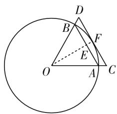

# 关注新老高考,明确复习方向

—— 高考数学一轮复习策略

● 江苏省锡山高级中学 唐婷婷

2020 年新高考数学试卷主要是以山东卷、海南卷为主的新高考卷，以及北京卷、天津卷为主的文理合一的高考新卷。这些新高考试卷，都充分根据数学学科特点，切实贯彻了新课标大纲中“低起点，多层次，高落差”的科学调控策略，有效发挥了数学考试的选拔功能和中学数学教学的良好导向作用，具有很好的区分度、信度与效度，值得好好品味与认真研究。而随着新课标改革的不断深入与推进，越来越多的省份将加入新高考模式，合理关注新老高考的差异与变化，明确高三数学复习的基本方向就显得非常重要。

# 一、注重幂、指、对运算的转化

高考中涉及幂、指、对运算的转化与应用问题，是考查基本初等函数部分知识最常见的一种考查方式。幂、指、对运算是高中数学中代数运算的主要体现方式之一，相互之间合理转化，巧妙变形，结合等式或不等式的转化，借助逻辑推理，可以设置变化多端，难度各异的精彩试题，很好考查考生的数学知识与数学能力，备受高考命题者的青睐。

例 1 （2020 年全国卷 I 文科第 8 题）设 $a \log_{3} 4 = 2$ ，则 $4^{-a} = (\quad)$ .

A. $\frac{1}{16}$

B. $\frac{1}{9}$

C. $\frac{1}{8}$

D. $\frac{1}{6}$

分析:根据已知对数关系式,合理利用指数式与对数式的相互转化,以及指数、对数的相关运算性质的应用来综合处理,从不同角度切入,合理借助指对数的运算来正确化简与运算处理.

解法1:由 $a\log_{3}4=2$ ，可得 $2a\log_{3}2=2$ ，则有 $a=\frac{1}{\log_{3}2}=\log_{2}3$ ，所以有 $4^{-a}=(2^{a})^{-2}=3^{-2}=\frac{1}{9}$ .

故选择答案:B.

解法 2: 由 $a \log_{3}4 = 2$ ，可得 $\log_{3}4^{a} = 2$ ，则有 $4^{a} = 3^{2} = 9$ ，所以有 $4^{-a} = \frac{1}{9}$ .

故选择答案:B.

# 二、注重阅读理解能力的提高

阅读与理解能力既是获取知识的一种能力,又是影响思维和认识的一种重要能力.高考数学中对阅读与理解能力的考查与应用无处不在.推理证明靠的是逻辑,创新发明靠的是直觉.而数学阅读与理解问题中,同时兼有逻辑与直觉的双重作用,是基于思维的一种基本认识活动,其结果直接影响着人们发现问题和解决问题的能力.因而,注意数学阅读与理解能力的提高,有效增强对问题的认识与思考.

例 2 （2020 年全国Ⅱ卷理科第 3 题,文科第 4 题）在新冠肺炎疫情防控期间,某超市开通网上销售业务,每天能完成 1200 份订单的配货,由于订单量大幅增加,导致订单积压.为解决困难,许多志愿者踊跃报名参加配货工作.已知该超市某日积压 500 份订单未配货,预计第二天的新订单超过 1600 份的概率为 0.05,志愿者每人每天能完成 50 份订单的配货,为使第二天完成积压订单及当日订单的配货的概率不小于 0.95,则至少需要志愿者( ).

A. 10 名

B. 18 名

C. 24 名

D. 32 名

分析:根据题目条件中的文字信息进行阅读与理解,从中获取新知识,有效建立与之相匹配的数学模型(不等式或代数式),进而结合数学知识来分析与处理相应的问题,并回归实际来综合应用.

解法 1:由题意,第二天新增订单数为 $500 + 1600 - 1200 = 900$ 份,设需要志愿者 x 名,则有 $\frac{50x}{900} \geqslant 0.95$ , 解得 $x \geqslant 17.1$ , 即至少需要志愿者 18 名.

故选择答案:B.

解法 2: 第二天的新订单超过 1600 份的概率为 0.05, 就按 1600 份计算, 第二天完成积压订单及当日订单的配货的概率不小于 0.95 就按 1200 份计算, 因为公司可以完成配货 1200 份订单, 则至少需要志愿者为 $\frac{500 + 1600 - 1200}{50} = 18$ 名.

故选择答案:B.

# 三、注重数学文化的渗透

数学文化巧妙把数学融入语言之中,是数学的一种文化表现形式.随着数学新课标的进一步深入与明确,指导思想的进一步贯彻与落实,有关数学文化的试题越来越成为新高考试卷的一大特色,是数学创新与思维拓展的一大主场所.数学文化包括广义上的数学史话、数学美、数学教育等,以及狭义上的数学思想、数学方法和数学语言的形成和发展等,都是高考试题背景设计的肥沃土壤.

例 3 （2020 年北京卷第 10 题）2020 年 3 月 14 日是全球首个国际圆周率日 ( $\pi$ Day). 历史上, 求圆周率 $\pi$ 的方法有多种, 与中国传统数学中的“割圆术”相似, 数学家阿尔·卡西的方法是: 当正整数 n 充分大时, 计算单位圆的内接正 6n 边形的周长和外切正 6n 边形 (各边均与圆相切的正 6n 边形) 的周长, 将它们的算术平均数作为 $2\pi$ 的近似值. 按照阿尔·卡西的方法, $\pi$ 的近似值的表达式是().

A. $3n\left(\sin \frac{30^{\circ}}{n} + \tan \frac{30^{\circ}}{n}\right)$

B. $6n\left(\sin \frac{30^{\circ}}{n} +\tan \frac{30^{\circ}}{n}\right)$

C. $3n\left(\sin \frac{60^{\circ}}{n} + \tan \frac{60^{\circ}}{n}\right)$

D. $6n\left(\sin \frac{60^{\circ}}{n} +\tan \frac{60^{\circ}}{n}\right)$

分析:借助数学文化的试题背景,结合首个国际圆周率日( $\pi$ Day)介绍圆周率 $\pi$ 的一种求解方法——阿尔·卡西的方法,合理融入平面几何知识,巧妙地把平面几何、算术平均数、三角函数的定义、解三角形等数学知识加以合理综合与应用.

解析: 如图 1 所示, 单位圆的内接正 6n 边形与外切正 6n 边形的一组边长分别为 AB, CD, 结合三角函数的定义, 可得单位圆的内接正 6n 边形的边长为 $AB = a = 2 \sin \frac{30^{\circ}}{n}$ , 单位圆的外切正 6n 边形的边长为 CD = b$= 2\tan \frac{30^{\circ}}{n}$ . 根据阿尔·卡西的方法可得 $2\pi = \frac{1}{2}(6na + 6nb) = 6n\left(\sin \frac{30^{\circ}}{n} + \tan \frac{30^{\circ}}{n}\right)$ , 所以 $\pi = 3n\left(\sin \frac{30^{\circ}}{n} + \tan \frac{30^{\circ}}{n}\right)$ .

text_image

Geometric diagram showing a circle with inscribed triangle ABC and auxiliary points D, E, F, O, including dashed lines and arcs.

图1

故选择答案:A.

# 四、注重创新题型的融合

新高考数学试卷在试卷结构上进行了创新题型的改革,引入了多选题和结构不良试题等新题型.多选题设置新颖,给学生增加了得分机会,增进了数学学习的获得感,提升数学试卷的选择性与区分度,增强了考试的信度和效度;结构不良问题开放创新,对创新能力、探究能力的考查很有指导意义.

例 4 （2020 年新高考卷 I（山东卷）第 11 题，新高考卷 II（海南卷）第 12 题）已知 a > 0, b > 0，且 $a + b = 1$ ，则（）.

A. $a^2 + b^2 \geqslant \frac{1}{2}$

B. $2^{a - b} > \frac{1}{2}$

C. $\log_2a + \log_2b\geqslant -2$

D. $\sqrt{a} +\sqrt{b}\leqslant \sqrt{2}$

分析:给出两个参数的和为定值来简捷设置问题,通过不等式的相关内容,借助多选题方式来设计,起点低,切入容易,结合函数与方程、不等式的性质、基本不等式、对数运算等来综合分析,并根据考生自身的条件以及判断的把握性来实施选择策略,形成各自最优的得分策略与技巧.

解析: 因为 a > 0, b > 0, 且 $a + b = 1$ ,

对于选项 A, $a^{2} + b^{2} = a^{2} + (1 - a)^{2} = 2a^{2} - 2a + 1 = 2\left(a - \frac{1}{2}\right)^{2} + \frac{1}{2} \geqslant \frac{1}{2}$ ，当且仅当 $a = b = \frac{1}{2}$ 时，等号成立，故 A 正确；

对于选项 B, 由于 a-b=2a-1>-1, 所以 $2^{a-b}>2^{-1}=\frac{1}{2}$ , 故 B 正确;

对于选项 C, $\log_{2}a + \log_{2}b = \log_{2}ab \leqslant \log_{2}\left(\frac{a+b}{2}\right)^{2}$ $=\log_{2}\frac{1}{4}=-2$ ，当且仅当 $a=b=\frac{1}{2}$ 时，等号成立，故 C 不正确；

对于选项 D, 因为 $(\sqrt{a} + \sqrt{b})^{2} = 1 + 2\sqrt{ab} \leqslant 1 + a + b = 2$ , 所以 $\sqrt{a} + \sqrt{b} \leqslant \sqrt{2}$ , 当且仅当 $a = b = \frac{1}{2}$ 时, 等号成立, 故 D 正确.

故选择答案: ABD.

结合 2020 年新高考数学试卷的新精神,关注新老高考之间创新与稳定,继承与创新,稳定与改革等的关系,把握改革精神,创新试题设计,优化试卷结构,明确复习方向,全面对学生的数学语言的阅读、理解、转化、表达等能力加以不断深化,紧紧抓住数学基础知识和基本技能,从基础入手,不断深入,扎实提升,有效复习,全面提升.