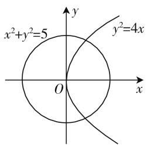
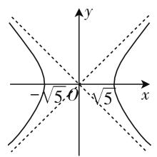
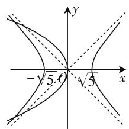
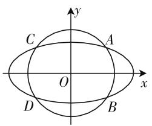
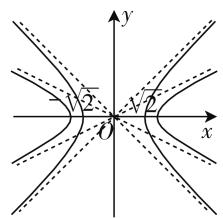
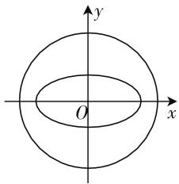

# 再谈两个圆锥曲线增解问题

# ● 安徽省宿城第一中学 贺万一

文1中对两个曲线增解问题的研究让笔者茅塞顿开,也深受鼓舞,在平时教学中也遇到学生问类似的问题,只是回复一句“其中一个是增根”而没有深入研究,这届在高三教学中再次遇到了这个问题,这里也说一下自己的思考.

问题 1: 求抛物线 $y^{2}=4x$ 与圆 $x^{2}+y^{2}=5$ 的交点坐标.

解:两方程联立可得 $x^{2}+4x-5=0$ ，解得 $x_{1}=1$ ， $x_{2}=-5$ 。显然 $x_{1}=1$ 是两曲线交点的横坐标，如图1所示。

text_image

x²+y²=5
y²=4x
O

图1

而 $x_{2} = -5$ 是增根，怎样解释增根的意义呢？文1中介绍了椭圆、圆与双曲线的伴随关系.在这里好像不太好用，所以笔者考虑了复数解的可能.因为显然 $(-5, 2\sqrt{5}\mathrm{i}), (-5, -2\sqrt{5}\mathrm{i})$ 都能满足两个方程.

对于圆 $x^{2}+y^{2}=5$ ，当 $x^{2}>5$ 时，在复平面内 $y^{2}=5-x^{2}$ 有 $y=\pm\sqrt{x^{2}-5}i$ （这里是不妨取 y 轴为虚轴，在复平面内方程为 $x^{2}-y^{2}=5$ ，也可以取 x 轴为虚轴，则 $y^{2}>5$ 时有 $x=\pm\sqrt{y^{2}-5}i$ ）表示复平面内的双曲线，如图 2 所示.

text_image

-√5 O √5
x
y

图 2

text_image

-√5
√5

图3

那么抛物线在复数意义下的图像是怎样的呢？

当 x<0 时，有 $y=\pm\sqrt{-4x}i$ ，即以 y 轴为虚轴，复数意义下的 $y^{2}=-4x$ 。如图 3 所示。

在图 3 中很明显,两条曲线的交点坐标即是我们方程中的增根的几何解释.那么圆与椭圆交点问题中产生的增根也可以用复数意义下的方程进行解释吗?我们来看一下.

问题 2: 求圆 $x^{2} + y^{2} = 2$ 和椭圆 $\frac{x^{2}}{4} + y^{2} = 1$ 的交点坐标.

解:联立两方程可得 $\frac{3}{4}x^{2}=1$ ，即 $x=\pm\frac{2\sqrt{3}}{3}$ ，所以可得交点坐标为 $A\left(\frac{2\sqrt{3}}{3},\frac{\sqrt{6}}{3}\right),B\left(\frac{2\sqrt{3}}{3},-\frac{\sqrt{6}}{3}\right)$ ， $C\left(-\frac{2\sqrt{3}}{3},\frac{\sqrt{6}}{3}\right),D\left(-\frac{2\sqrt{3}}{3},-\frac{\sqrt{6}}{3}\right)$ ，如图4所示.

text_image

y
C
A
O
x
D
B

图 4

text_image

y
√2
O
√2
x

图 5

此时没有增根,那么复数意义下的图像会不会有交点呢?如前所述,取 y 轴为虚轴.在复平面内圆 $x^{2} + y^{2} = 2$ 在 $x^{2} > 2$ 时为 $y = \pm \sqrt{x^{2} - 2}i$ ,椭圆 $\frac{x^{2}}{4} + y^{2} = 1$ 在 $x^{2} > 4$ 时为 $y = \pm \sqrt{\frac{x^{2}}{4} - 1}i$ ,都表示双曲线,位置关系如图5所示.

显然两曲线没有交点,因为在实数意义下无增根,那么有增根的情况下呢?

问题 3: 解方程组 $\left\{\begin{aligned}x^{2}+y^{2}&=7,\\ \frac{x^{2}}{4}+y^{2}&=1.\end{aligned}\right.$

解: 消去 y 可得 $x^{2}=8$ , 即 $x=\pm2\sqrt{2}$ , 这简直是匪夷所思, 因为两条曲线的位置关系如图 6 所示.

text_image

y
O
x

图6

text_image

-√7
O
√7
x
y

图 7

椭圆 $\frac{x^{2}}{4}+y^{2}=1$ 完全被圆 $x^{2}+y^{2}=7$ “包住”，怎么可能会有解呢？还得向复数意义下的表示找答案。圆在复数意义下的方程为 $x^{2}-y^{2}=7$ ，椭圆在复数意义下的方程为 $\frac{x^{2}}{4}-y^{2}=1$ ，恰好表示原方程组的解为

$(2\sqrt{2},\mathrm{i}),(2\sqrt{2},-\mathrm{i}),(-2\sqrt{2},\mathrm{i}),(-2\sqrt{2},-\mathrm{i})$ .位置关系如图7所示.

由此可见，在复数意义下，文1所列举的问题也都能够解释，正如作者所说，作为教师，在平时多一点思考，既能够给学生一个满意的解答，又能够使自己的研究能力提升，一举两得.

# 参考文献：

[1] 李文东. 对两个圆锥曲线增解问题的思考 [J]. 中学数学月刊, 2020(5).  
[2] 王志豪, 苏凡文. 双曲线化圆的两个视角及其应用 [J]. 中学数学教学, 2016(2). W

(上接第 82 页) 在 R 是单调增函数. 不满足条件.

(2) 当 $a \in (2,4]$ 时, 分类讨论:

①x > a 时, 函数 $f(x)$ 的对称轴 $x = \frac{a - 2}{2} < a$ , 则函数 $f(x)$ 在 $(a, +\infty)$ 单调增函数, 函数 $f(x)$ 值域为 $(f(a), +\infty)$ 即 $(2a, +\infty)$ .  
② $x \leqslant a$ 时，函数 $f(x)$ 的对称轴 $x = \frac{a + 2}{2} < a$ ，函数 $f(x)$ 在 $\left(-\infty, \frac{a + 2}{2}\right)$ 是单调增函数，其值域为 $\left(-\infty, \frac{(a + 2)^2}{4}\right)$ ，在 $\left[\frac{a + 2}{2}, a\right]$ 是单调减函数，其值域为 $\left[2a, \frac{(a + 2)^2}{4}\right]$ .

这时函数 $f(x)$ 的大致图象如图 4 所示：

存在 $a \in (2,4]$ ，使得关于 x 的方程 $f(x) - mf(a) = 0$ 有三个不同零点，

由图像知: $2ma \in \left(2a, \frac{(a+2)^{2}}{4}\right)$ ，即存在 $a \in (2,4]$ ，使得 $m \in \left(1, \frac{(a+2)^{2}}{8a}\right)$ .

line

| x | y |
|---|---|
| 0 | 0 |
| a+2/2 | 2a |
| a | 2a |
| a+2 | 2a |

图4

令 $h(a) = \frac{(a + 2)^2}{8a} = \frac{1}{8}\left(a + \frac{4}{a} + 4\right)$ , 只要 $m < (h(a))_{\max} = h(4) = \frac{9}{8}$ 故 $m \in \left(1, \frac{9}{8}\right)$ .

(3) 当 $a \in [-4, -2)$ 时，讨论方法同上述(2)，可得到 $m \in \left(1, \frac{9}{8}\right)$ .

综上所述: $m \in \left(1, \frac{9}{8}\right)$ .

函数多零点问题,作为函数、方程、图像的交汇点,充分体现了函数与方程的联系.蕴含了丰富的数形结合、分类讨论、转化与化归等数学思想.学会求解这类问题,无形中锻炼学生分析问题、解决问题的能力,不自觉地提升了他们的数学核心素养.

# 参考文献：

[1] 谢琼珠, 詹欣豪. 高考"函数零点"题型的分类剖析[J]. 福建中学数学, 2012(9).  
[2] 沈丽群, 浦仁宏. 函数零点的几种常见题型 [J]. 中学数学教与学, 2015(4).  
[3] 杏望春. 函数中含参数零点问题的求解 [J]. 中学教学研究, 2016(12). W