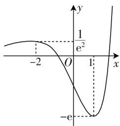
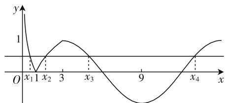
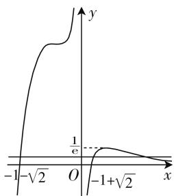
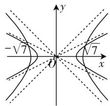
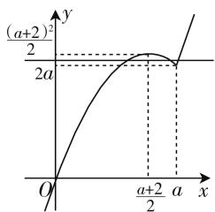

# 函数多零点问题探究\*

● 江苏省盐城市亭湖高级中学 薛振鸿  
- 江苏省盐城市亭湖高级中学 王莹颖

数学核心素养是一个高度抽象的思维产物,数学问题是核心素养的载体,数学问题求解是数学思想、数学方法的体现.

函数多零点指一个函数有三个或三个以上的零点. 函数的零点实际上就是方程的解. 解好此类问题, 不仅能让学生掌握函数多零点问题的方法和技巧, 更能提升他们的数学核心素养. 本文就函数多零点时: 零点的个数判定、代数式的取值范围、相关参数的取值范围等问题进行探究.

# 一、函数多零点时零点的个数判定问题

例 1 已知函数 $f(x)=(x^{2}-x-1)\mathrm{e}^{x}$ ，设关于 x 的方程 $f^{2}(x)-mf(x)=\frac{5}{\mathrm{e}}(m\in\mathbf{R})$ 有 n 个不同的实数解，则 n 的所有可能的值为（）.

A. 3 B. 1 或 3 C. 4 或 6 D. 3 或 4

分析: $f(x)=(x^{2}-x-1)e^{x}$ 是一个超越函数,我们利用导数研究函数 $f(x)$ 的单调性和极值,画出函数 $f(x)$ 的大致图像.然后采用换元法进行转化为一元二次方程问题求解.

设 $f(x) = t$ ，原方程 $f^2 (x) - mf(x) = \frac{5}{\mathrm{e}} (m\in$ R)转化为 $t^2 -mt - \frac{5}{\mathrm{e}} = 0.$ 这是关于 $t$ 的一元二次方程，这个方程的 $\Delta = m^2 +\frac{20}{\mathrm{e}} >0$ 恒成立.所以关于 $t$ 的一元二次方程有二个不同解 $t_1,t_2$ ，再根据 $t$ 的取值，结合函数 $f(x)$ 的图像，分类讨论确定 $f(x) = t$ 中 $x$ 解的个数.

解析: $f'(x)=\mathrm{e}^{x}(2x-1)+(x^{2}-x-1)\mathrm{e}^{x}=\mathrm{e}^{x}(x^{2}+x-2)$ ,

<table><tr><td>x</td><td> $(-\infty,-2)$ </td><td>-2</td><td> $(-2,1)$ </td><td>1</td><td> $(1,+\infty)$ </td></tr><tr><td> $f'(x)>0$ </td><td>+</td><td>0</td><td>-</td><td>0</td><td>+</td></tr><tr><td> $f(x)$ </td><td>↗</td><td>极大值 $f(-2)$ </td><td>↘</td><td>极小值 $f(1)$ </td><td>↗</td></tr></table>

因此，当 $x = -2$ 时， $f(x)$ 的极大值为 $f(-2) = \frac{5}{\mathrm{e}^2}$ ；当 $x = 1$ 时， $f(x)$ 的极小值为 $f(1) = -\mathrm{e}$ .

注意: $x\in(-\infty,-2)$ 时, $f(x)>0$ 恒成立,所以 $f(x)$ 在 $(-∞,-2)$ 上的图像在x轴的上方.

函数 $y=f(x)$ 的大致图像如图 1 所示:

又因为 $f^{2}(x)-mf(x)=$

$\frac{5}{\mathrm{e}}(m\in\mathbf{R})$ ，所以 $f^{2}(x)-mf(x)-\frac{5}{\mathrm{e}}=0.$

令 $f(x) = t$ ，代入原方程得 $t^2 - mt - \frac{5}{\mathrm{e}} = 0$ ，这个方程的 $\Delta = m^2 +\frac{20}{\mathrm{e}} >0.$

line

| x    | y       |
| ---- | ------- |
| -2   | 1/e²    |
| 0    | -e      |
| 1    | 1/e²    |

图1

设关于 t 的方程的两个根为 $t_{1}, t_{2}$ 则 $t_{1}t_{2} = -\frac{5}{e}$ . 不妨设 $t_{1} < 0 < t_{2}$ ,

(1) 若 $t_{1} < -e$ ，由于 $t_{1}t_{2} = -\frac{5}{e}$ ，则 $0 < t_{2} < \frac{5}{e^{2}}$ ，此时 $f(x) = t_{1}$ 关于 x 无解， $f(x) = t_{2}$ 关于 x 有三解；  
(2) 若 $t_{1} = -e$ ，由于 $t_{1}t_{2} = -\frac{5}{e}$ ，则 $t_{2} = \frac{5}{e^{2}}$ ，此时 $f(x) = t_{1}$ 关于 x 有一解， $f(x) = t_{2}$ 关于 x 有两解；  
(3) 若 $-e < t_{1} < 0$ ，由于 $t_{1}t_{2} = -\frac{5}{e}$ ，则 $t_{2} > \frac{5}{e^{2}}$ ，

此时 $f(x)=t_{1}$ 关于 x 有两解， $f(x)=t_{2}$ 关于 x 有一解.

综上,关于 x 的方程 $f^{2}(x)-mf(x)=\frac{5}{\mathrm{e}}$ 有三个不同的实数解.

故选 A.

# 二、函数多零点时代数式的范围问题

例2 已知函数 $f(x) = \begin{cases} |\log_3 x|, & 0 < x < 3, \\ \sin \left(\frac{\pi}{6} x\right), & 3 \leqslant x \leqslant 15, \end{cases}$ 若存在实数 $x_1, x_2, x_3, x_4$ ，满足 $x_1 < x_2 < x_3 < x_4$ ，且 $f(x_1) = f(x_2) = f(x_3) = f(x_4)$ ，则 $\frac{(x_3 - 3)(x_4 - 3)}{x_1x_2}$ 的取值范围是 \_\_\_\_.

分析: $f(x)$ 是一个分段函数, 画出 $f(x)$ 的大致图像, 因为 $f(x_{1}) = f(x_{2}) = f(x_{3}) = f(x_{4})$ , 由图像得到 $x_{1} \cdot x_{2} = 1, x_{3} + x_{4} = 18$ , 且 $3 < x_{3} < 6$ . 将 $\frac{(x_{3} - 3)(x_{4} - 3)}{x_{1}x_{2}}$ 的取值范围问题转化为关于变量 $x_{3}$ 的函数的值域问题求出解.

解析: 函数 $f(x)$ 的图像如图 2 所示:

line

| x    | y    |
| ---- | ---- |
| 0    | 1    |
| x₁   | 0    |
| x₂   | 1    |
| x₃   | 0    |
| x₄   | 1    |

图2

因为 $f(x_{1}) = f(x_{2}) = f(x_{3}) = f(x_{4})$ ，其中 $x_{1} < x_{2} < x_{3} < x_{4}$ ，由图像可知， $0 < x_{1} < 1, 1 < x_{2} < 3$ ，且 $\log_3 x_1 = -\log_3 x_2$ ，即 $\log_3 x_1 + \log_3 x_2 = \log_3 x_1 x_2 = 0$ ，得 $x_{1}x_{2} = 1$ ，由图像可得 $x_{3} \in (3,6), x_{4} \in (12,15)$ ，且 $x_{3}, x_{4}$ 关于 $x = 9$ 对称，得 $x_{3} + x_{4} = 18$ ，即 $x_{4} = 18 - x_{3}$ ，所以 $\frac{(x_3 - 3)(x_4 - 3)}{x_1x_2} = x_3x_4 - 3(x_3 + x_4) + 9 = -x_3^2 + 18x_3 - 45 = -(x_3 - 9)^2 + 36.$

因为 $x_{3} \in (3,6)$ ，所以 $-(x_{3}-9)^{2} + 36 \in (0,27)$ ，即 $\frac{(x_{3}-3)(x_{4}-3)}{x_{1}x_{2}} \in (0,27)$ .

答案:(0,27).

# 三、函数多零点时参数的范围问题

例3 已知方程 $\frac{x^2 + 2x - 1}{xe^x} - m = 0$ 有三个不同

解,求实数 m 的取值范围.

分析:由于方程左边是一个超越函数,这类问题一般是构造新函数,题目转化为研究函数的零点问题,通过导数研究函数的单调性及最值,画出大致图像,结合函数图像可得解答.

解析: $f(x)=\frac{x^{2}+2x-1}{xe^{x}}$ ,则 $f'(x)=\frac{(x+1)^{2}(1-x)}{x^{2}e^{x}}$ .

<table><tr><td>x</td><td> $f'(x)$ </td><td> $f(x)$ </td></tr><tr><td> $(-\infty,-1)$ </td><td>+</td><td>↗</td></tr><tr><td>-1</td><td>0</td><td> $f(-1)=2e^{2}$ </td></tr><tr><td> $(-1,0)$ </td><td>+</td><td>↗</td></tr><tr><td> $(0,1)$ </td><td>+</td><td>↗</td></tr><tr><td>1</td><td>0</td><td>极大值 $f(1)=\frac{2}{e}$ </td></tr><tr><td> $(1,+\infty)$ </td><td>-</td><td>↘</td></tr></table>

$f(x) = 0$ ，得 $x^{2} + 2x - 1 = 0,x_{1} = -1 - \sqrt{2},x_{2}$ $= -1 + \sqrt{2}.$

当 $x \to 0^{-}$ 时， $f(x) \to +\infty$ ；

当 $x \to 0^{+}$ 时， $f(x) \to -\infty$ ；

当 $x \to +\infty$ 时， $f(x) \to 0$ ；且当 $x \in (1, +\infty)$ 时， $f(x) > 0$ .

函数 $f(x)$ 的大致图像如图 3 所示.

由图像知, 方程 $f(x)=$ m 有三个解, 则 $0 < m < \frac{2}{e}$ .

例 4 已知函数 $f(x)=x|x-a|+2x$ ，若存在 $a\in[-4,4]$ ，使得关于 x 的方程 $f(x)-mf(a)=0$ 有三个不同零点，求 m 的取值范围.

line

| x         | y          |
| --------- | ---------- |
| -1√2      | 0          |
| 0         | 1/e        |
| -1+√2     | 0          |

图 3

分析:由于 $f(a)=2a$ , 方

程 $f(x) - mf(a) = 0$ 实际上是 $f(x) = 2ma$ . 对于函数 $f(x) = x|x - a| + 2x$ ，分 $x > a$ 和 $x \leqslant a$ ，进行分类讨论，将绝对值符号去掉，函数 $f(x)$ 变成分段函数. 每段是一个二次函数，开口方向是确定的，对称轴随 $a$ 的变化而变化的，根据对称轴分类讨论，确定函数值域，结合图形可得到解答.

解析: $f(x)=\left\{\begin{aligned}-x^{2}+(a+2)x&x\leqslant a,\\ x^{2}+(2-a)x&x>a.\end{aligned}\right.$

(1) 当 $-2 \leqslant a \leqslant 2$ 时，

$f(x)=\left\{\begin{aligned}-x^{2}+(a+2)x&x\leqslant a,\\ x^{2}+(2-a)x&x>a\end{aligned}\right.$ (下转第88页)

解: 消去 y 可得 $x^{2}=8$ ，即 $x=\pm2\sqrt{2}$ ，这简直是匪夷所思，因为两条曲线的位置关系如图 6 所示.

text_image

y
O
x

图6

text_image

-√7
O
√7
x
y

图 7

椭圆 $\frac{x^{2}}{4}+y^{2}=1$ 完全被圆 $x^{2}+y^{2}=7$ “包住”，怎么可能会有解呢？还得向复数意义下的表示找答案。圆在复数意义下的方程为 $x^{2}-y^{2}=7$ ，椭圆在复数意义下的方程为 $\frac{x^{2}}{4}-y^{2}=1$ ，恰好表示原方程组的解为

$(2\sqrt{2},\mathrm{i}),(2\sqrt{2},-\mathrm{i}),(-2\sqrt{2},\mathrm{i}),(-2\sqrt{2},-\mathrm{i})$ .位置关系如图7所示.

由此可见，在复数意义下，文1所列举的问题也都能够解释，正如作者所说，作为教师，在平时多一点思考，既能够给学生一个满意的解答，又能够使自己的研究能力提升，一举两得.

# 参考文献：

[1] 李文东. 对两个圆锥曲线增解问题的思考 [J]. 中学数学月刊, 2020(5).  
[2] 王志豪, 苏凡文. 双曲线化圆的两个视角及其应用 [J]. 中学数学教学, 2016(2). W

(上接第82页) 在 $\mathbf{R}$ 是单调增函数. 不满足条件.

(2) 当 $a \in (2,4]$ 时, 分类讨论:

①x > a 时，函数 $f(x)$ 的对称轴 $x = \frac{a - 2}{2} < a$ ，则函数 $f(x)$ 在 $(a, +\infty)$ 单调增函数，函数 $f(x)$ 值域为 $(f(a), +\infty)$ 即 $(2a, +\infty)$ .  
② $x \leqslant a$ 时，函数 $f(x)$ 的对称轴 $x = \frac{a + 2}{2} < a$ ，函数 $f(x)$ 在 $\left(-\infty, \frac{a + 2}{2}\right)$ 是单调增函数，其值域为 $\left(-\infty, \frac{(a + 2)^2}{4}\right)$ ，在 $\left[\frac{a + 2}{2}, a\right]$ 是单调减函数，其值域为 $\left[2a, \frac{(a + 2)^2}{4}\right]$ .

这时函数 $f(x)$ 的大致图象如图 4 所示：

存在 $a \in (2,4]$ ，使得关于 x 的方程 $f(x) - mf(a) = 0$ 有三个不同零点，

由图像知: $2ma \in \left(2a, \frac{(a+2)^{2}}{4}\right)$ ，即存在 $a \in (2,4]$ ，使得 $m \in \left(1, \frac{(a+2)^{2}}{8a}\right)$ .

line

| x | y |
|---|---|
| 0 | 0 |
| a+2/2 | 2a |
| a | 2a |
| a+2 | 2a |

图4

令 $h(a) = \frac{(a + 2)^2}{8a} = \frac{1}{8}\left(a + \frac{4}{a} + 4\right)$ , 只要 $m < (h(a))_{\max} = h(4) = \frac{9}{8}$ 故 $m \in \left(1, \frac{9}{8}\right)$ .

(3) 当 $a \in [-4, -2)$ 时，讨论方法同上述(2)，可得到 $m \in \left(1, \frac{9}{8}\right)$ .

综上所述: $m \in \left(1, \frac{9}{8}\right)$ .

函数多零点问题,作为函数、方程、图像的交汇点,充分体现了函数与方程的联系.蕴含了丰富的数形结合、分类讨论、转化与化归等数学思想.学会求解这类问题,无形中锻炼学生分析问题、解决问题的能力,不自觉地提升了他们的数学核心素养.

# 参考文献：

[1] 谢琼珠, 詹欣豪. 高考"函数零点"题型的分类剖析[J]. 福建中学数学, 2012(9).  
[2] 沈丽群, 浦仁宏. 函数零点的几种常见题型 [J]. 中学数学教与学, 2015(4).  
[3] 杏望春. 函数中含参数零点问题的求解 [J]. 中学教学研究, 2016(12). W