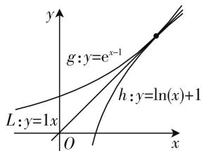
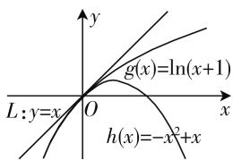
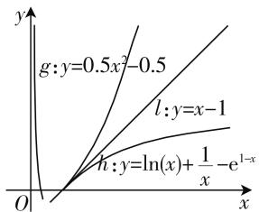

# 切线法在高考导数压轴题中的应用举例

# 湖北省武汉市关山中学 田 艳

导数压轴题历来是高考数学的重点考查对象,也是学生学习的难点之一.本文对2020年山东省数学高考第21题第(2)问进行了探究,对标准答案的来龙去脉追本溯源——切线法确定参数端点取值范围,并对切线法的局限性及其在导数压轴题中的应用题型进行拓展研究.

# 一、试题呈现与分析

例 1 （2020 年新高考卷 I（山东卷））已知函数 $f(x)=a\mathrm{e}^{x-1}-\ln x+\ln a$ .

(1) 当 a=e 时, 求曲线 $y=f(x)$ 在点 $(1,f(1))$ 处的切线与两坐标轴围成的三角形的面积;  
(2) 若 $f(x) \geqslant 1$ ，求 a 的取值范围.

(1) 略.

解法1:(2)当0<a<1时, $f(1)=a+\ln a<1$ . 当a=1时, $f(x)=\mathrm{e}^{x-1}-\ln x$ , $f'(x)=\mathrm{e}^{x-1}-\frac{1}{x}$ . 当 $x\in(0,1)$ 时, $f'(x)<0$ ; 当 $x\in(1,+\infty)$ 时, $f'(x)>0$ . 所以当x=1时, $f(x)$ 取得最小值, 最小值 $f(1)=1$ , 从而 $f(x)\geqslant1$ . 当a>1时, $f(x)=ae^{x-1}-\ln x+\ln a\geqslant e^{x-1}-\ln x\geqslant1$ .

综上，a 的取值范围是 $[1, +\infty)$ .

当大家看到这道题的巧妙解法时,可能会感到疑惑,为什么要取1?为什么对a与1的大小进行分类讨论后刚好能得到a的取值范围?实际上,这是破解恒成立问题的一种方法——必要性探路法,也叫切线法.纵观大量的教辅资料,在使用必要性探路法破解恒成立问题时,参考答案往往只是完美地呈现最后的结果,对于思路的来龙去脉却只字不提.所以会引起一些学生的质疑,质疑的是探路时取定义域里面的哪个数?为什么取某个数的时候正好得到参数的取值范围?因此这种解决数学问题的方法一直不被广大学生所接受和通用.作为教师,我们必须帮助学生梳理清楚问题的来龙去脉,让逻辑推理素养在学生心中生根发芽!下面让我们一起探个明白,为学生传道授业解惑也!

思路探求: 观察函数特征, 由 $f(x)=ae^{x-1}-\ln x+\ln a \geqslant 1$ 转化为 $ae^{x-1}+\ln a \geqslant \ln x+1$ 在 $(0,+\infty)$ 恒成立, 不妨设两函数 $g(x)=ae^{x-1}+\ln a$ 与 $h(x)=\ln x+1$ 的公切线为 $y=kx+b$ , 对应的公切点为 $(x_{0},y_{0})$ , $g'(x)=ae^{x-1}, h'(x)=\frac{1}{x}$ , 则 $\left\{\begin{aligned}a e^{x_{0}-1}+\ln a&=\ln x_{0}+1,\\ a e^{x_{0}-1}&=\frac{1}{x_{0}},\end{aligned}\right.$

化简可得 $x_{0}+2\ln x_{0}-\frac{1}{x_{0}}=0$ . 令 $t(x)=x+2\ln x-\frac{1}{x}(x>0)$ , $t'(x)=1+\frac{2}{x}+\frac{1}{x^{2}}>0$ , 所以 $t(x)$ 在 $(0,+\infty)$ 上单调递增, 而 $t(1)=1$ , 所以 $x_{0}=1, a=1$ .

此时,我们画出两个函数图像如图1所示,当x=1时显然是两条曲线的临界值,如果x取其他值, $g(x)$ 函数图像在 $h(x)$ 函数图像上方,有 $f(x)=ae^{x-1}-\ln x+\ln a>1$ ,故a=1是取值

text_image

y
g: y=e^{x-1}
h: y=ln(x)+1
L: y=1x
O
x

图1

范围的一个子集. 故在本题中 $x$ 应该取 1, 从而缩小 $a$ 的取值范围, 只是出题人隐去了这一思维步骤, 结合图像和解答我们就明白为什么 $x$ 取 1, 而不是其他数了.

解法2: 显然 $a > 0, f(x) = a e^{x-1} - \ln x + \ln a \geqslant 1$ 等价于 $a e^{x-1} + \ln a \geqslant \ln x + 1$ ，设 $g(x) = a e^{x-1} + \ln a, h(x) = \ln x + 1$ ，并设公切线为 $y = kx + b$ ，对应的公切点为 $(x_0, y_0), g'(x) = a e^{x-1}, h'(x) = \frac{1}{x}$ ，则有 $\left\{\begin{aligned}&a\mathrm{e}^{x_{0}-1}+\ln a=\ln x_{0}+1,\\ &a\mathrm{e}^{x_{0}-1}=\frac{1}{x_{0}},\end{aligned}\right.$ 解得 $x_{0}=1,y_{0}=1,a=1$ ，公切线方程为 y = x.

当 $a \geqslant 1$ 时, $g(x) \geqslant \mathrm{e}^{x - 1}$ , 令 $t(x) = \mathrm{e}^{x - 1} - x$ , $t'(x) = \mathrm{e}^{x - 1} - 1$ , 当 $x \in (0,1)$ 时, $t'(x) < 0$ , $t(x)$ 单调递减, 当 $x \in (1, +\infty)$ 时, $t'(x) > 0$ , $t(x)$ 单调递增, 所以 $t(x) \geqslant t(1) = 0$ , 所以 $\mathrm{e}^{x - 1} \geqslant x$ .

令 $m(x) = x - (\ln x + 1)$ ，同理可得 $m(x) \geqslant t(1) = 0$ ，所以 $x \geqslant \ln x + 1$ ，所以 $\mathrm{e}^{x - 1} \geqslant x \geqslant \ln x + 1$ ，所以 $g(x) \geqslant h(x)$ ，即 $f(x) \geqslant 1$ .

当 0 < a < 1 时， $g(1) = a + \ln a < h(1) = 1$ ，即 $f(x) < 1$ 。综上，a 的取值范围是 $[1, +\infty)$ 。

评注:通过上面的分析,我们知道必要性探路所取的值并不是随意的,而是有“预谋”的,是经过对不等式的等价转化分析,寻找切点,确定临界值然后利用切线放缩证明其充分性成立.既然切线法能够直达问题结论,简化分类讨论过程,那么使用切线法是否有限制条件呢?切线法能否应用到别的题型中去?下面对切线法的局限性及其应用进行拓展!

# 二、“失效”的切线法

高考题中有关恒成立的大多数题目是通过缩小端点或者特殊点的范围,但是如果不对此进行一番深入探讨,仅仅靠猜是难以让人信服的,而切线法可以帮助我们找出探路点,而非直接猜测再验证.那么,切线法是否是“万能”的呢?我们不妨用切线法试解例2.

真题探究（2015年山东卷）设函数 $f(x) = \ln (x + 1) + a(x^2 - x)$ ，其中 $a \in \mathbf{R}$ .

(1) 讨论函数 $f(x)$ 极值点的个数, 并说明理由;  
(2) 若 $\forall x > 0, f(x) \geqslant 0$ 成立，求 a 的取值范围.

思路探求: $f(x) \geqslant 0$ 在 $(0, +\infty)$ 上恒成立转化为 $\ln(x+1) \geqslant -a(x^{2}-x)$ 在 $(0, +\infty)$ 恒成立. 不妨设两函数 $g(x) = \ln(x+1)$ 与 $h(x) = -a(x^{2}-x)$ 的公切线为 $y = kx + b$ , 对应的公切点为 $(x_{0}, y_{0})$ , $g'(x) = \frac{1}{x+1}$ , $h'(x) = -a(2x-1)$ , 则有$\left\{ \begin{array}{l} \ln (x_0 + 1) = -a(x_0^2 - x_0), \\ \frac{1}{x_0 + 1} = -a(2x_0 - 1), \end{array} \right.$ 化简可得 $(2x_0 -$

$1)\ln(x_{0}+1)=\frac{x_{0}^{2}-x_{0}}{x_{0}+1}$ ，该方程为超越方程，通过验证可得 $x_{0}=0$ ，所以a=1，公切点为 $(0,0)$ ，公切线为y=x。下面只需围绕 $g(x)$ 图像在y=x上方， $h(x)$ 图像在y=x下方展开证明即可。然而，通过构造函数证明却发现y=x图像是在 $g(x)=\ln(x+1)$ 上方，切线法失效了！到底是怎么回事呢？

如图 2 所示, 这两个分离后的函数和例 1 不同, 例 1 的两个函数分别在公切线的上下方, 即两个凹凸性不同的函数,而例 2 的两个函数都在公切线的下方,凹凸性相同导致无法证明,下面对切线法的使用前提展开说明:

定理: 如果 $f(x)$ 在 $[a, b]$ 上连续, 在 $(a, b)$ 内具有一

text_image

y
g(x)=ln(x+1)
L:y=x O x
h(x)=-x²+x

图2

阶和二阶导数，若在 $(a,b)$ 内满足 $f''(x)>0$ （或 $f''(x)<0$ ），则 $f(x)$ 在 $[a,b]$ 上为凹函数（或凸函数）。（注：定理的几何意义是在凹函数（或凸函数）的图像上任取两点，函数图像在这两点之间的部分总在连接这两点的线段下方（或上方）。）

在对原函数分离构造出两个函数后, 当两个函数的二阶导数的正负性不同时, 说明其凹凸性不同, 这时可以使用切线法证明. 若正负性相同时, 则凹凸性相同, 无法使用切线法, 这时候我们应使用常规思路求解.

# 三、切线法的应用拓展

# 1. 切线法在恒成立求参数问题中的应用

恒成立求参数问题历来是高考考查的重难点,常见做法有参变分离、分类讨论等,当常规做法难以奏效时,我们可以对原函数进行分离,构造出两个函数,再利用公切线进行求解.

例 2 （2016 年四川卷）设函数 $f(x)=ax^{2}-a-\ln x$ ，其中 $a \in R$ .

(1) 讨论 $f(x)$ 的单调性;  
(2) 确定 a 的所有可能取值, 使得 $f(x) > \frac{1}{x} - e^{1-x}$ 在区间 $(1, +\infty)$ 内恒成立 (e = 2.718 … 为自然对数的底数).

思路探求: $f(x) > \frac{1}{x} - e^{1-x}$ 在 $(1, +\infty)$ 上恒成立转化为 $ax^2 - a > \ln x + \frac{1}{x} - e^{1-x}$ 在 $(1, +\infty)$ 上恒成立. 不妨设两函数 $g(x) = ax^2 - a$ 与 $h(x) = \ln x + \frac{1}{x} - e^{1-x}$ 在 $[1, +\infty)$ 上的公切线为 $y = kx + b$ , 对应的公切点为 $(x_0, y_0), g'(x) = 2ax, h'(x) = \frac{1}{x} - \frac{1}{x^2} +$

$e^{1-x}$ ，则有 $\left\{\begin{aligned}&2ax_{0}=\frac{1}{x_{0}}-\frac{1}{x_{0}^{2}}+e^{1-x_{0}},\\&ax_{0}^{2}-a=\ln x_{0}+\frac{1}{x_{0}}-e^{1-x_{0}},\end{aligned}\right.$ 解得 $x_{0}=1$ ，

$a=\frac{1}{2},y_{0}=0$ ,公切线为 y=x-1.

解:(1)略.

(2) $f(x) > \frac{1}{x} - e^{1 - x}$

等价于 $a(x^{2} - 1) > \ln x + \frac{1}{x} -\mathrm{e}^{1 - x}$ .设 $g(x) = a(x^2$ $-1),h(x) = \ln x + \frac{1}{x} -$

line

| x    | g: y=0.5x²-0.5 | l: y=x-1 | h: y=ln(x)+1/x - e^(1-x) |
| ---- | -------------- | -------- | ------------------------ |
| 0    | 0              | 0        | 0                        |
| 1    | ~0.2           | ~0.1     | ~0.05                    |
| 2    | ~0.4           | ~0.2     | ~0.1                     |
| 3    | ~0.6           | ~0.3     | ~0.2                     |
| 4    | ~0.8           | ~0.4     | ~0.3                     |
| 5    | ~1.0           | ~0.5     | ~0.4                     |
| 6    | ~1.2           | ~0.6     | ~0.5                     |
| 7    | ~1.4           | ~0.7     | ~0.6                     |
| 8    | ~1.6           | ~0.8     | ~0.7                     |
| 9    | ~1.8           | ~0.9     | ~0.8                     |
| 10   | ~2.0           | ~1.0     | ~0.9                     |
| 11   | ~2.2           | ~1.1     | ~1.0                     |
| 12   | ~2.4           | ~1.2     | ~1.1                     |
| 13   | ~2.6           | ~1.3     | ~1.2                     |
| 14   | ~2.8           | ~1.4     | ~1.3                     |
| 15   | ~3.0           | ~1.5     | ~1.4                     |
| 16   | ~3.2           | ~1.6     | ~1.5                     |
| 17   | ~3.4           | ~1.7     | ~1.6                     |
| 18   | ~3.6           | ~1.8     | ~1.7                     |
| 19   | ~3.8           | ~1.9     | ~1.8                     |
| 20   | ~4.0           | ~2.0     | ~1.9                     |
| 21   | ~4.2           | ~2.1     | ~2.0                     |
| 22   | ~4.4           | ~2.2     | ~2.1                     |
| 23   | ~4.6           | ~2.3     | ~2.2                     |
| 24   | ~4.8           | ~2.4     | ~2.3                     |
| 25   | ~5.0           | ~2.5     | ~2.4                     |
| 26   | ~5.2           | ~2.6     | ~2.5                     |
| 27   | ~5.4           | ~2.7     | ~2.6                     |
| 28   | ~5.6           | ~2.8     | ~2.7                     |
| 29   | ~5.8           | ~2.9     | ~2.8                     |
| 30   | ~6.0           | ~3.0     | ~2.9                     |
| 31   | ~6.2           | ~3.1     | ~3.0                     |
| 32   | ~6.4           | ~3.2     | ~3.1                     |
| 33   | ~6.6           | ~3.3     | ~3.2                     |
| 34   | ~6.8           | ~3.4     | ~3.3                     |
| 35   | ~7.0           | ~3.5     | ~3.4                     |
| 36   | ~7.2           | ~3.6     | ~3.5                     |
| 37   | ~7.4           | ~3.7     | ~3.6                     |
| 38   | ~7.6           | ~3.8     | ~3.7                     |
| 39   | ~7.8           | ~3.9     | ~3.8                     |
| 40   | ~8.0           | ~4.0     | ~3.9                     |
| 41   | ~8.2           | ~4.1     | ~4.0                     |
| 42   | ~8.4           | ~4.2     | ~4.1                     |
| 43   | ~8.6           | ~4.3     | ~4.2                     |
| 44   | ~8.8           | ~4.4     | ~4.3                     |
| 45   | ~9.0           | ~4.5     | ~4.4                     |
| 46   | ~9.2           | ~4.6     | ~4.5                     |
| 47   | ~9.4           | ~4.7     | ~4.6                     |
| 48   | ~9.6           | ~4.8     | ~4.7                     |
| 49   | ~9.8           | ~4.9     | ~4.8                     |
| 50   | >10            | >5       | >5                       |
The chart displays a line graph of a function (y = ln(x) + (ln(x) / x) - e^(x)). The x-axis is labeled 'x' and the y-axis is labeled 'y'. The curves are labeled with mathematical notation.

图3

$e^{1-x}$ ，当 $a\geqslant\frac{1}{2}$ 时， $\forall x>1,g(x)=a(x+1)(x-1)$ $\geqslant\frac{1}{2}(x+1)(x-1)>(x-1)$ ，易证 $x-1>\ln x,e^{x-1}>x$ ，所以 $e^{1-x}<\frac{1}{x},-e^{1-x}>-\frac{1}{x}$ ，令 $m(x)=x-1-\ln x-\frac{1}{x}+e^{1-x}$ ，则 $m'(x)=1-\frac{1}{x}+\frac{1}{x^{2}}-e^{1-x}>1-\frac{1}{x}+\frac{1}{x^{2}}-\frac{1}{x}=\frac{(x-1)^{2}}{x^{2}}>0$ ，所以 $m(x)$ 在(1,+∞)上单调递增， $m(x)>m(1)=0$ ，所以 $x-1>\ln x+\frac{1}{x}-e^{1-x}$ ，即 $f(x)>\frac{1}{x}-e^{1-x}$ .

当 $a \leqslant 0$ 时， $\forall x > 1, g(x) \leqslant 0, h(x) = \ln x + \frac{1}{x} - e^{1 - x} > \ln x + \frac{1}{x} - \frac{1}{x} = \ln x > 0$ ，舍去.

当 $0 < a < \frac{1}{2}$ 时， $\sqrt{\frac{1}{2a}} > 1$ ，由(1)知，当 $x \in \left(1, \sqrt{\frac{1}{2a}}\right)$ 时， $f(x)$ 单调递减，所以 $f(x) < f(1) = 0$ ，而 $\frac{1}{x} - e^{1 - x} > 0$ ，舍去.

综上， $a$ 的取值范围是 $\left[\frac{1}{2}, +\infty\right)$

评注:通过切线法并结合图像,我们可以快速判断a的取值范围,在证明 $a\geqslant\frac{1}{2}$ 的过程中,多次使用了 $e^{1-x}<\frac{1}{x}$ ,然后证明不满足条件的范围 $a<\frac{1}{2}$ (一般涉及取反例排除),熟练运用常用的不等式进行放缩是破解本题的关键.

# 2. 切线法在已知零点个数求参数问题中的应用

解决此类问题一般通过求导分析函数的单调情况,结合零点存在定理判别零点情况.由于函数比较复杂,需要多次求导,层层推理得解,对学生分析问题解决问题的综合应用能力要求都很高,我们可以另辟蹊径,当原函数分解移项后可以得到简单函数时(如一次函数等),可以把问题转化为求两个函数交点个数,利用图像相切的特殊情况求出参数临界值.

例 3 （2018年全国卷Ⅱ理）已知函数 $f(x)=\mathrm{e}^{x}-ax^{2}$ .

(1) 若 a=1，证明：当 $x \geqslant 0$ 时， $f(x) \geqslant 1$ ;  
(2) 若 $f(x)$ 在 $(0, +\infty)$ 只有一个零点，求 a.

解:(1)略.

(2) 由 $f(x) = 0$ ，得 $\mathrm{e}^x = ax^2$ . 令 $g(x) = \mathrm{e}^x, h(x) = ax^2$ ，即 $g(x)$ 与 $h(x)$ 的图像在 $(0, +\infty)$ 上只有一个交点，由函数图像及性质， $g(x)$ 与 $h(x)$ 在 $(0, +\infty)$ 有且只有一条公切线，设公切点为 $(x_0, y_0)$ ， $g'(x) = \mathrm{e}^x, h'(x) = 2ax$ ，则有 $\left\{ \begin{array}{l} \mathrm{e}^{x_0} = 2ax_0, \\ \mathrm{e}^{x_0} = ax_0^2, \end{array} \right.$ 解得 $x_0 = 2, a = \frac{1}{4}\mathrm{e}^2$ .

评注:该题初看很平常,入手很容易,但要用通法“笑到最后”并不容易,思维量和运算操作量都较大.通过切线法能够将复杂的函数化为简单的指数函数与二次函数,避免了不必要的层层讨论,问题迎刃而解!

# 四、小结

数学家波利亚曾说过：“掌握数学就意味着善于解题。”在解题的过程中，我们不仅要帮助学生理解数学问题的本质，更要让学生学会用数学的思维进行反思与回顾。遇到一道经典题目，不能仅仅停留在会解的层面，还要理解题目为什么要这样解？是否还有其他解法？解法能否推广？唯此才能真正激发学生潜在的思考能力与创新精神，春风化雨，让逻辑推理的数学核心素养实实在在地在学生心中生根发芽！

# 参考文献：

[1] 韩智明. 让必要性探路“探”得更明白些 [J]. 中学数学研究 (华南师范大学版), 2019(5).  
[2] 华东师范大学数学系. 数学分析(上)[M] 北京: 高等教育出版社, 2001.  
[3] 闫伟. 一道清华大学自招试题的解法探究及拓展 [J]. 中学数学研究 (华南师范大学版), 2020(1).

W