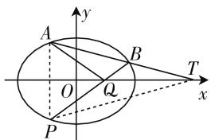
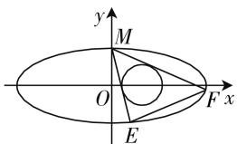
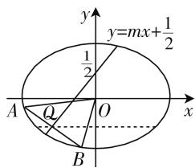

# 圆锥曲线综合问题解题思路

# 湖北省武汉市第一中学 李玉汉

解答圆锥曲线综合问题,需要设计一个有效的方法,如何找到正确的思路,如何简化计算量是我们需要研究的重要问题.例如:遇到面积问题时,我们经常采用面积分割的方式,以达到简化计算量的目的;遇到取值范围的问题时,我们经常需要利用方程的思想求出函数关系;遇到定值、定点问题时,我们经常运用从一般到特殊,从特殊到一般的数学思想,通过先猜后证的方式作探讨;最后在具体的计算过程中,我们经常采用设而不求、整体代入、换元、因式分解等方法运算.

以上是解决圆锥曲线综合问题经常采用的方法，另外，笔者在教学中有些新的感悟，现和大家分享如下，以期对大家有所启发.

# 一、与平面几何结合，切中问题要害

当题目已知条件具有很浓厚的平面几何“色彩”，例如已知条件涉及到等腰三角形、平行四边形、中位线、直角梯形、轴对称或圆时，我们可以充分挖掘平面几何的性质，这样可以对问题的研究站在一个更高的平台上.

例 1 已知椭圆 $C: \frac{x^{2}}{4} + \frac{y^{2}}{3} = 1$ ，过点 $T(4,0)$ 作直线 l 与椭圆 C 交于 A, B 两点，点 A 关于 x 轴的对称点是点 P，连接 BP 交 x 轴于点 Q，求 $\triangle ABQ$ 面积的最大值.

解:如图1,连接PT,由平面几何知识可知:直线AT与直线PT斜率互为相反数,计算可得Q点坐标为(1,0).

text_image

A
y
B
O
Q
T
x
P

图 1

设直线 AB 方程为 x =$my + 4$ ，联立方程组： $\left\{ \begin{array}{l}x = my + 4,\\ 3x^{2} + 4y^{2} - 12 = 0 \end{array} \right.\Rightarrow 3(my+$ $4)^{2} + 4y^{2} - 12 = 0\Rightarrow (3m^{2} + 4)y^{2} + 24my + 36 =$ $0\Rightarrow S_{\triangle ABQ} = \frac{3}{2}\mid y_A - y_B\mid = \frac{18\sqrt{m^2 - 4}}{3m^2 + 4}.$ 令 $\sqrt{m^2 - 4}$

$= t$ ，则 $S_{\triangle ABQ} = \frac{18t}{3t^2 + 16} = \frac{18}{3t + \frac{16}{t}}\leqslant \frac{3\sqrt{3}}{4}$ 当 $t^2 = \frac{16}{3},$

即 $m=\pm\frac{2\sqrt{73}}{3}$ 时， $\triangle ABQ$ 面积取最大值 $\frac{3}{4}\sqrt{3}$ .

例1中由平面几何知识可知，TQ平分 $\angle BTP$ ，由相关定理有 $x_{Q}x_{T} = a^{2} = 4$ ，(a是长半轴长)所以动直线BP过定点 $Q(1,0)$ ，求出点 $Q$ 过定点(1,0)后，后续问题的研究就会显得更加方便.

# 二、营造对称，方便计算

从数的角度看,圆锥曲线的方程结构具有很强的对称性;从形的角度观察,圆锥曲线的图形也具有很强的对称性;从圆锥曲线问题的解答过程看,经常涉及根与系数的关系,而一元二次方程两根之积,两根之和都是对称式,对称式的变形一般还是对称式.基于以上三个角度的分析,我们可以得到如下启发:在设计圆锥曲线问题的解决方案时,如果能够使计算步骤保持很强的对称性,那么通过代数式的变形使之与根与系数关系结合的可能性更大,从而使问题得到解决的概率会高一些.另外对称式能因式分解的概率也很高,便于分式的约分及方程的求解.

例 2 已知椭圆 $C: \frac{x^{2}}{a^{2}} + \frac{y^{2}}{b^{2}} = 1 (a > b > 0)$ 的离心率为 $\frac{\sqrt{15}}{4}$ ， $F_{1}, F_{2}$ 是椭圆的两个焦点，P 是椭圆上任意一点，且 $\triangle PF_{1}F_{2}$ 的周长是 $8 + 2\sqrt{15}$ .

(1) 求椭圆 C 的方程;

(2) 设圆 $T: (x - t)^{2} + y^{2} = \frac{4}{9}$ ，过椭圆的上顶点作圆 T 的两条切线交椭圆于 E, F 两点，当圆心在 x 轴上移动且 $t \in (1,3)$ 时，求 EF 的斜率的取值范围.

解:(1)椭圆方程为 $\frac{x^{2}}{16}+y^{2}=1$ .(步骤略)

(2) 如图 2, 设圆的切线方程为 $y = kx + 1$ , 切线

ME 的斜率为 $k_{1}$ ，切线 MF 的斜率为 $k_{2}$ ，则有 $\frac{|tk+1|}{\sqrt{1+k^{2}}}=\frac{2}{3}$

$$
\Rightarrow (9 t ^ {2} - 4) k ^ {2} + 1 8 t k + 5 = 0
$$

$$
\Rightarrow \left\{ \begin{array}{l} k _ {1} + k _ {2} = - \frac {1 8 t}{9 t ^ {2} - 4}, \\ k _ {1} k _ {2} = \frac {5}{9 t ^ {2} - 4}. \end{array} \right.
$$

text_image

y
M
O
E
F x

图2

联立方程组 $\left\{\begin{aligned}y&=k_{1}x+1,\\ x^{2}&+16y^{2}-16=0\end{aligned}\right.$

$$
\Rightarrow \left\{ \begin{array}{l} x _ {E} = - \frac {3 2}{1 + 1 6 k _ {1} ^ {2}}, \\ y _ {E} = - \frac {3 2 k _ {1}}{1 + 1 6 k _ {1} ^ {2}} + 1. \end{array} \right.
$$

同理 $\left\{\begin{aligned}x_{F}&=-\frac{32}{1+16k_{2}^{2}},\\ y_{F}&=-\frac{32k_{2}}{1+16k_{2}^{2}}+1,\end{aligned}\right.$

所以 $k_{EF}=\frac{\left(-\frac{32k_{1}}{1+16k_{1}^{2}}+1\right)-\left(-\frac{32k_{2}}{1+16k_{2}^{2}}+1\right)}{\left(-\frac{32}{1+16k_{1}^{2}}\right)-\left(-\frac{32}{1+16k_{2}^{2}}\right)}$

$= \frac{k_{1} + k_{2}}{1 - 16k_{1}k_{2}} = \frac{6t}{28 - 3t^{2}} = \frac{6}{\frac{28}{t} - 3t}$ 显然 $k_{EF}$ 是 $t$ 在(1，

3) 上的增函数, 故 $k_{EF} \in \left(\frac{6}{25}, 18\right)$ .

例 2 中的对称性设计为: (1) 两条切线的斜率 $k_{1}$ 与 $k_{2}$ 具有对称性; (2) 切线与椭圆的两交点 E 和 F 具有对称性, 求出了点 E 坐标 $(f(k_{1}), g(k_{1}))$ , 可立即得点 F 坐标 $F(f(k_{2}), g(k_{2}))$ .

# 三、设直线方程为整式方程，尽可能回避分式运算

在圆锥曲线问题的解答过程中,有时我们会发现:设直线方程或点的坐标时,如果带有分式或无理式,计算会相当烦琐,这时可以采取“等待”的方式,即把分式部分直接用一个参数代替,使计算步骤尽量保持对整式进行运算,再寻找恰当时机作整体消参.

例 3 已知椭圆 $\frac{x^{2}}{2} + y^{2} = 1$ 上两个不同的点 A, B 关于直线 $y = mx + \frac{1}{2}$ 对称.

(1) 求实数 m 的取值范围；

(2) 求 $\triangle AOB$ 面积的最大值.

解:(1)如图3,设线段AB中点为 $Q(x_{Q},y_{Q})$ ,由点差法结论得 $-\frac{1}{2}\cdot\frac{x_{Q}}{y_{Q}}=-\frac{1}{m}$ .

又 $\frac{y_{Q}-\frac{1}{2}}{x_{Q}}=m$ ，两式相乘

text_image

y
y=mx+1/2
1/2
A
Q
O
x
B

图3

得 $-\frac{1}{2}\cdot\frac{x_{Q}}{y_{Q}}\cdot\frac{y_{Q}-\frac{1}{2}}{x_{Q}}=-1\Rightarrow y_{Q}-\frac{1}{2}=2y_{Q}\Rightarrow y_{Q}=-\frac{1}{2}$ ，所以 $m=-\frac{1}{x_{Q}}$ ，另外AB弦中点轨迹方程为 $y=-\frac{1}{2}$ ，故有 $-\frac{\sqrt{6}}{2}<x_{Q}<\frac{\sqrt{6}}{2}$ ，所以 $m\in(-\infty,-\frac{\sqrt{6}}{3})\cup(\frac{\sqrt{6}}{3},+\infty)$ .

(2) 设直线 $AB$ 方程为 $x = -my + n$ ，联立方程组 $\left\{ \begin{array}{l} x = -my + n, \\ x^2 + 2y^2 - 2 = 0 \end{array} \right. \Rightarrow (-my + n)^2 + 2y^2 - 2 = 0 \Rightarrow (m^2 + 2)y^2 - 2mny + n^2 - 2 = 0 \Rightarrow \Delta = 4m^2n^2 - 4(m^2 + 2)(n^2 - 2) = 8m^2 - 8n^2 + 16 \Rightarrow |y_A - y_B| = \frac{2\sqrt{2}\sqrt{m^2 - n^2 + 2}}{m^2 + 2}$ . 令 $y = 0$ ，则 $x = n$ ，所以 $S_{\triangle OAB} = \frac{\sqrt{2} \cdot |n| \cdot \sqrt{m^2 - n^2 + 2}}{m^2 + 2} \leqslant \frac{\sqrt{2} \cdot \frac{n^2 + (m^2 - n^2 + 2)}{2}}{m^2 + 2} = \frac{\sqrt{2}}{2}$ .

当 $\left\{\begin{aligned}m^{2}&=2n^{2}-2,\\ -\frac{1}{m}&=\frac{1}{2}m+n\end{aligned}\right.$ 成立时， $\triangle AOB$ 面积取最大值 $\frac{\sqrt{2}}{2}.$

例 3 中直线 AB 可以用仅含一个参数 m 的方程设出来, 从理论上说, 把 $\triangle AOB$ 的面积视为以 m 为自变量的函数完全可行, 但实际的计算过程中, 由于分式的计算很烦琐, 使得计算量很大, 故把直线 AB 的方程用含两个参数 (m 与 n) 的形式表示, 使之成为整系数方程, 虽然含有两个变量, 但最后运用均值不等式可达到整体消参的效果.

以上是笔者研究圆锥曲线解题思路中的一点体会,不足之处,请批评指正. W