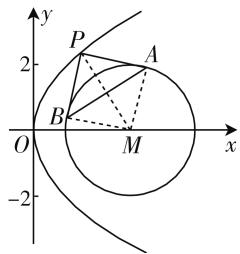
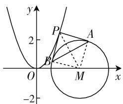
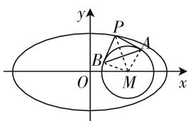

# 多解思维,变式拓展

——一道 2020 年“江南十校”综合素质检测题的探究

# ● 安徽省广德中学 王世龙

“观察可能导致发现,观察将提示某种规则、模式或定律.”

——美国著名的数学教育家 G·波利亚

在破解一些典型数学问题时,不要盲目“刷题”,要深入观察,多角度思维,抓住“以能力为主”的命题本色,综合“在知识网络的交汇点处设计试题”的命题特点,正确破解,深入探究,变式拓展,避免“题海战术”,真正达到“解一题拓一类,拓一类通一片”的美好目的.

# 一、问题呈现

问题 （2020年安徽省“江南十校”综合素质检测数学理科·16）已知抛物线 $C:y^{2}=4x$ ，点P为抛物线C上一动点，过点P作圆 $M:(x-3)^{2}+y^{2}=4$ 的切线，切点分别为A,B，则线段AB长度的取值范围为\_\_\_\_.

此题巧妙把圆与圆锥曲线加以合理融合,同时设置了圆的切线、线段长等相关问题,有效降低了圆锥曲线问题的难度,又合理融入其他相关的解析几何元素,充分体现高考命题中“在知识网络的交汇点处设计试题”的命题特点,抓住“以能力为主”的总方向,综合平面几何、函数、导数等相关知识来应用.

# 二、问题破解

解法1:(切点弦法)由题可得圆心 $M(3,0)$ ，半径r=2。设 $P(t^{2},2t),A(x_{1},y_{1}),B(x_{2},y_{2})$ ，那么切线PA，PB的方程分别为 $(x_{1}-3)(x-3)+y_{1}y=4,(x_{2}-3)(x-3)+y_{2}y=4$ 。又点 $P(t^{2},2t)$ 是切线PA，PB的公共点，则有 $(x_{1}-3)(t^{2}-3)+2ty_{1}=4,(x_{2}-3)(t^{2}-3)+2ty_{2}=4$ ，从而 $(x_{1},y_{1}),(x_{2},y_{2})$ 分别是方程 $(x-3)(t^{2}-3)+2ty=4$ 的解，则点A，B在直线 $(t^{2}-3)(x-3)+2ty=4$ 上，即直线AB的方程为 $(t^{2}-3)x+2ty+5-3t^{2}=0$ ，而圆心M到直线AB的距离为 $d=\frac{|3(t^{2}-3)+5-3t^{2}|}{\sqrt{(t^{2}-3)^{2}+4t^{2}}}=\frac{4}{\sqrt{t^{4}-2t^{2}+9}}$ ，则

$$
\mid A B \mid = 2 \sqrt {r ^ {2} - d ^ {2}} = 2 \sqrt {4 - \frac {1 6}{t ^ {4} - 2 t ^ {2} + 9}} =
$$

$4\sqrt{1-\frac{4}{(t^{2}-1)^{2}+8}}$ ，那么当 $t^{2}=1$ ，即点 $P(1,\pm2)$ 时， $|AB|$ 取得最小值为 $2\sqrt{2}$ . 又 $|AB|<2r=4$ ，所以线段AB 长度的取值范围为 $[2\sqrt{2}, 4)$ .

故填答案: $\left[2\sqrt{2},4\right)$ .

解法2:(面积转化法)由题可得圆心 $M(3,0)$ ，半径r=2。如图1，设 $P(t^{2},2t)$ ，连接MA，MB，PM，则知 $MA\perp PA,MB\perp PB,AB\perp PM$ ，根据

text_image

y
2
P
A
B
O
M
x
-2

图1

$$
S _ {\text {四边形} P A M B} = 2 S _ {\triangle P A M}, \text {可得} \frac {1}{2} | A B | | P M | = 2 \times \frac {1}{2} \times
$$

$$
2 \mid P A \mid , \text {则} \mid A B \mid = 4   {\frac {\mid P A \mid}{\mid P M \mid}} = 4   {\frac {{\sqrt {\mid P M \mid^ {2} - 4}}}{\mid P M \mid}} =
$$

$$
4 \sqrt {1 - \frac {4}{| P M | ^ {2}}} = 4 \sqrt {1 - \frac {4}{(t ^ {2} - 3) ^ {2} + (2 t - 0) ^ {2}}} =
$$

$4\sqrt{1-\frac{4}{(t^{2}-1)^{2}+8}}$ ，那么当 $t^{2}=1$ ，即点 $P(1,\pm2)$ 时， $|AB|$ 取得最小值为 $2\sqrt{2}$ .又 $|AB|<2r=4$ ，所以线段AB长度的取值范围为 $[2\sqrt{2},4)$ .

故填答案: $\left[2\sqrt{2},4\right)$ .

# 三、变式拓展

探究 1: 改变抛物线的方程, 使得相应的圆在抛物线开口的外面部分, 进而确定切点弦的长度的取值范围问题, 改变破解的方式, 从而得以简单变式.

变式1:已知抛物线 $C:x^{2}=y$ ，点P为抛物线C上一动点，过点P作圆 $M:(x-3)^{2}+y^{2}=4$ 的切线，切点分别为A,B，则线段AB长度的取值范围为\_\_\_\_.

解析:由题可得圆心 $M(3,0)$ ，半径 r=2。如图2，设 $P(t,t^{2})$ ，连接 MA, MB, PM，则知 $MA \perp PA, MB \perp PB$ ，

$AB \perp PM,$ 根据 $S_{四边形PAMB} =$

$2S_{\triangle PAM}$ ，可得 $\frac{1}{2}|AB||PM| =$

$2 \times \frac{1}{2} \times 2 |PA|$ ，则 $|AB| = 4$

$$
\frac {| P A |}{| P M |} = 4 \frac {\sqrt {| P M | ^ {2} - 4}}{| P M |} =
$$

text_image

y
2
P
A
B
O
M
x
-2

图2

$$
4 \sqrt {1 - \frac {4}{| P M | ^ {2}}} = 4 \sqrt {1 - \frac {4}{(t - 3) ^ {2} + (t ^ {2} - 0) ^ {2}}} =
$$

$4\sqrt{1-\frac{4}{t^{4}+t^{2}-6t+9}}$ . 令函数 $f(t)=t^{4}+t^{2}-6t+$   
9, 求导可得 $f'(t)=4t^{3}+2t-6=2(t-1)(2t^{2}+2t+$   
3), 由 $f'(t) = 0$ ，解得 $t = 1$ ，则当 $t \in (-\infty, 1)$ 时， $f'(t) < 0$ ，函数 $f(t)$ 单调递减；当 $t \in (1, +\infty)$ 时， $f'(t) > 0$ ，函数 $f(t)$ 单调递增.

则 $f(t)_{\min} = f(1) = 5$ ，所以 $|AB| =$

$$
4 \sqrt {1 - \frac {4}{t ^ {4} + t ^ {2} - 6 t + 9}} \geqslant 4 \sqrt {1 - \frac {4}{5}} = \frac {4 \sqrt {5}}{5}.
$$

又 $|AB| < 2r = 4$ ，所以线段 $AB$ 长度的取值范围为 $\left[\frac{4\sqrt{5}}{5}, 4\right)$ .

故填答案: $\left[\frac{4\sqrt{5}}{5},4\right)$ .

探究 2: 改变圆锥曲线的类型, 化抛物线为椭圆, 保留其他相关的条件, 进而确定切点弦的长度的取值范围问题, 注意取值区间的两端点值的确定, 从而得以拓展变式.

变式2:已知椭圆 $C:\frac{x^{2}}{36}+\frac{y^{2}}{9}=1$ ，点P为椭圆C上一动点，过点P作圆 $M:(x-3)^{2}+y^{2}=4$ 的切线，切点分别为A,B，则线段AB长度的取值范围为\_\_\_\_.

解析：由题可得圆心 $M(3,0)$ ，半径r=2。如图3，设 $P(6\cos\alpha,3\sin\alpha),\alpha\in[0,2\pi)$ ，连接MA,MB,PM，则知 $MA\perp PA,MB\perp PB,AB\perp PM$ ，根据 $S_{四边形PAMB}=$

text_image

y
P
A
B
O
M
x

图3

$2S_{\triangle PAM}$ ，可得 $\frac{1}{2}|AB||PM|=2\times\frac{1}{2}\times2|PA|$ ，则

$$
\begin{array}{l} \mid A B \mid = 4 \frac {\mid P A \mid}{\mid P M \mid} = 4 \frac {\sqrt {\mid P M \mid^ {2} - 4}}{\mid P M \mid} = 4 \sqrt {1 - \frac {4}{\mid P M \mid^ {2}}} \\ = 4 \sqrt {1 - \frac {4}{(6 \cos \alpha - 3) ^ {2} + (3 \sin \alpha) ^ {2}}} \\ \end{array}
$$

$$
= 4 \sqrt {1 - \frac {4}{2 7 \left(\cos \alpha - \frac {2}{3}\right) ^ {2} + 6}},
$$

那么当 $\cos \alpha = \frac{2}{3}$ , 即点 $P(4, \pm \sqrt{5})$ 时, $|AB|$ 取得最小值为 $\frac{4\sqrt{3}}{3}$ ; 当 $\cos \alpha = -1$ , 即点 $P(0, -3)$ 时, $|AB|$ 取得最大值为 $\frac{4\sqrt{77}}{9}$ .

所以线段 AB 长度的取值范围为 $\left[\frac{4\sqrt{3}}{3}, \frac{4\sqrt{77}}{9}\right]$ .

故填答案: $\left[\frac{4\sqrt{3}}{3},\frac{4\sqrt{77}}{9}\right]$ .

探究 3: 保留题目条件, 改变问题的求解角度, 转化原来的“线段 AB 长度的取值范围”为“四边形 PAMB 的面积最小值时点 P 的坐标”或“四边形 PAMB 的面积最小值”, 难度相当, 得以两个对应的变式问题.

变式 3: 已知抛物线 $C: y^{2} = 4x$ ，点 P 为抛物线 C 上一动点，过点 P 作圆 $M: (x - 3)^{2} + y^{2} = 4$ 的切线，切点分别为 A, B，则四边形 PAMB 的面积最小值时点 P 的坐标为 \_\_\_\_.

解析:由题可得圆心 $M(3,0)$ ，半径 r=2。设 $P(t^{2},2t)$ ，连接 MA, MB, PM，则知 $MA \perp PA, MB \perp PB, AB \perp PM$ ，根据 $S_{四边形PAMB} = 2S_{\triangle PAM} = 2 \times \frac{1}{2} \times 2 |PA| = 2 |PA| = 2 \sqrt{|PM|^{2}-4} = 2 \sqrt{(t^{2}-3)^{2} + (2t-0)^{2}-4} = 2 \sqrt{(t^{2}-1)^{2}+4}$ ，那么当 $t^{2}=1$ ，即点 $P(1,\pm2)$ 时， $S_{四边形PAMB}$ 取得最小值为 4。

故填答案:(1,-2)或(1,2).

变式 4: 已知抛物线 C: $y^{2}=4x$ ，点 P 为抛物线 C 上一动点，过点 P 作圆 M: $(x-3)^{2}+y^{2}=4$ 的切线，切点分别为 A, B，则四边形 PAMB 的面积最小值为 \_\_\_\_.（答案：4）

# 四、解后反思

每一个典型的数学问题背后都隐藏着一个能力与素养的考查目的,独具匠心,巧妙设置,在实际应用时,要认真观察,从中发现问题,提出问题,分析问题,并得以解决问题,在此基础上,深入探究,可以从不同角度、不同方式加以拓展深入,真正达到“认真解答一个题,拓广解决一类题,变式深化一片题,思维能力一起高”的最终目的,从而真正养成良好的思维品质,提升数学解题思维与解题能力,以不变应万变. W