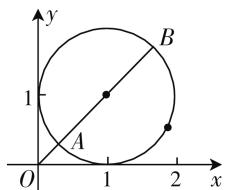
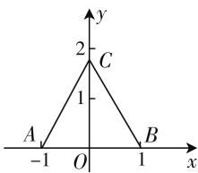

# 核心素养导向下高中数学平面向量单元总结教学设计研究实践\*

● 福建省莆田第一中学 林敏

平面向量既能借助坐标系,利用代数运算研究几何图形的性质,又能把代数的问题转化为几何性质进行研究,真正实现了高中数学数与形的统一.因此在讲授本单元知识时,除了按照课本章节知识进行授课以外,还应结合高考真题进行单元整体复习教学,下面主要从以下三个方面进行单元整体复习设计教学.

# 一、基础知识考核模块

平面向量知识是高考的热点和重点内容,考核的层次可作为基础知识考核,也可作为区分梯度的选填题的压轴题考核,还可与圆锥曲线或其他知识相结合,在大题中考核,故在教学上教师一定要指导学生把基础知识吃透,对于向量几何角度形的加、减、共线、数乘、数量积的运算和几何意义,以及向量代数角度的基底、坐标、模、数量积的运算能够游刃有余,信手拈来.纵观2020年新课标全国卷(Ⅰ)(Ⅱ)(Ⅲ)理数的考核均为基础知识类型的考核,如学生在上课过程中掌握了平面向量的基本知识及结构关系,这类型的考核应不算难题,下面依次分析.

例 1 （2020 年全国卷 I）设 a, b 为单位向量，且 $\left|a + b\right| = 1$ ，则 $\left|a - b\right| =$ \_\_\_\_.

解析:对于这类常规题目,学生在上课过程中对向量模的知识吃透,两边平方很容易得到 $a \cdot b$ 的数量积,所求只需要平方再开方可得答案.

$$
\mid \boldsymbol {a} + \boldsymbol {b} \mid^ {2} = 1 \Rightarrow \boldsymbol {a} ^ {2} + 2 \boldsymbol {a} \cdot \boldsymbol {b} + \boldsymbol {b} ^ {2} = 1 \Rightarrow \boldsymbol {a} \cdot \boldsymbol {b} = - \frac {1}{2},
$$

$$
\begin{array}{l} \left| \boldsymbol {a} - \boldsymbol {b} \right| = \sqrt {\left| \boldsymbol {a} - \boldsymbol {b} \right| ^ {2}} = \sqrt {\boldsymbol {a} ^ {2} - 2 \boldsymbol {a} \cdot \boldsymbol {b} + \boldsymbol {b} ^ {2}} = \\ \sqrt {3}. \end{array}
$$

例 2 （2020 年全国卷 II）已知单位向量 a, b 的夹角为 $45^{\circ}$ , ka - b 与 a 垂直, 则 k = \_\_\_\_.

解析: 此题主要考查的是向量垂直的充要条件: 数量积为 0.

$$
\begin{array}{r l} & {\text {故} (k \pmb {a} - \pmb {b}) \bullet \pmb {a} = 0 \Rightarrow k \pmb {a} ^ {2} - \pmb {a} \bullet \pmb {b} = 0 \Rightarrow k - \cos 4 5 ^ {\circ}} \\ & {= 0 \Rightarrow k = \frac {\sqrt {2}}{2}.} \end{array}
$$

例 3 （2020 年全国卷 Ⅲ）已知向量 a, b 满足 $\left|a\right|=5,\left|b\right|=6,a\cdot b=-6$ ，则 $\cos\langle a,a+b\rangle=$ （）.

A. $-\frac{31}{35}$

B. $-\frac{19}{35}$

C. $\frac{17}{35}$

D. $\frac{19}{35}$

解析: 此题考查向量的数量积, $a \cdot b = |a| \cdot |b| \cos\langle a, b \rangle \Rightarrow \cos\langle a, b \rangle = \frac{a \cdot b}{|a||b|}$ , 则有 $\cos\langle a, a + b \rangle = \frac{a(a + b)}{|a||a + b|} = \frac{a^2 + a \cdot b}{|a||a + b|}$ , 而 $|a + b| = \sqrt{(a + b)^2} = \sqrt{a^2 + 2a \cdot b + b^2} = 7$ , 故 $\cos\langle a, a + b \rangle = \frac{a^2 + a \cdot b}{|a||a + b|} = \frac{19}{35}$ .

观察发现:这3道题目均是对基础知识的考核,考核难度并不大,由此可见平面向量单元整体教学的第一步应是重视基础教学,只有打下牢固的基础,才能熟能生巧地提升学生的数学学科素养,故将这3道高考题作为教学设计的第一阶段,在第一阶段的基础上进去能力提升教学,全面提升学生数学抽象、直观想象等数学学科素养.

# 二、能力提升之——平面向量模的最值问题

在整体单元复习的第二阶段主要是在学生掌握基础知识的基础上,提升学生融会贯通及知识应用的能力,培养学生形成自己的知识体系,故选择如下例题与学生进行共同的学习研究,寻求多种解题方法,融合各章节的知识.

例 4 已知 a, b 为单位向量, $a \cdot b = 0$ , 若向量 c 满足, $|c - a - b| = 1$ , 则 $|c|$ 的取值范围是().

A. $\left[\sqrt{2}-1,\sqrt{2}+1\right]$

B. $\left[\sqrt{2}-1,\sqrt{2}+2\right]$

C. $\left[1,\sqrt{2}+1\right]$

D. $\left[1,\sqrt{2}+2\right]$

方法一:坐标法,利用代数运算研究几何图形的方法

因为 a, b 为单位向量，故可设 $a = (1, 0)$ , $b = (0, 1)$ , $c = (x, y)$ ，又因为 $|c - a - b| = 1$ ，即 $|(x, y) - (1, 0) - (0, 1)| = 1 \Rightarrow |(x - 1, y - 1)| = 1$ ，进一步化简得 $\sqrt{(x-1)^{2}+(y-1)^{2}}=1\Rightarrow(x-1)^{2}+(y-1)^{2}=1$ ，故 $(x,y)$ 在以 $(1,1)$ 为圆心，半径为 1 的圆上，如图 1 所示.

故 $|c|$ 的模最长为 $|OB|$ ，最短的模长为 $|OA|$ ，故转变为圆心到原点的距离加减半径的问题.

text_image

y
1
B
A
O
1
2
x

图1

圆心到原点的距离为 $\sqrt{2}$ ，故 $|OB| = \sqrt{2} + 1$ ， $|OA| = \sqrt{2} - 1$ .

故取值范围为 $\left[\sqrt{2}-1,\sqrt{2}+1\right]$ .

该方法主要是借助坐标系,建立代数关系,把几何问题转化为代数问题进行研究,最终利用数形结合把问题的本质转化为圆心到原点的距离加减半径的问题,方法在思想上容易接受,代数运算也不复杂,但是需要较高的直观想象学科素养,故学生需要扎实基础,力争厚积薄发.

# 方法二: 向量模不等式法

因为 $|\left|a\right| - |\boldsymbol{b}|\leqslant |\boldsymbol{a} - \boldsymbol{b}|\leqslant |\boldsymbol{a}| + |\boldsymbol{b}|$ ，则 $|c - a - b| = |c - (a + b)|$ ，转换为不等式有 $||c| - |a + b||\leqslant |c - (a + b)|\leqslant |c| + |a + b|$ 而 $|c - a - b| = 1$ ，且 $|a + b| = \sqrt{(a + b)^2} = \sqrt{2}$ ，代入上述不等式有 $|\left|c\right| - \sqrt{2} |\leqslant 1\leqslant |c| + \sqrt{2}$ ，进一步化简得 $\left\{ \begin{array}{l}|\left|c\right| - \sqrt{2} |\leqslant 1,\\ 1\leqslant |c| + \sqrt{2} \end{array} \Rightarrow \sqrt{2} -1\leqslant |c|\leqslant \sqrt{2} +1.\right.$

该方法主要是利用向量模的基本不等式, 把已知条件转化为向量模的基本不等式, 根据 a, b 为单位向量, 且 $a \cdot b = 0$ , 易求得 $|a + b| = \sqrt{2}$ , 最终转化为解不等式的问题. 解题思想比较巧妙, 学生对于向量模的基本不等式使用得比较少,使用该方法解题,目的也是强化学生向量模不等式的综合知识.

# 三、能力提升之——平面向量数量积的最值问题

在整体单元教学的第三阶段,进一步强化学生利用坐标法解决平面向量问题的综合能力.在高考的考核中,除了向量模的最值问题,向量数量积的最值问题也是高考的热点,解决向量数量积问题的主要方法也是坐标法,下面以2017年全国卷Ⅱ12题作为教学设计的精选例题进行研究.

例 5 已知 $\triangle ABC$ 是边长为 2 的等边三角形, P 为平面 ABC 内一点, 则 $\overrightarrow{PA} \cdot (\overrightarrow{PB} + \overrightarrow{PC})$ 的最小值是().

A.-2

B. $-\frac{3}{2}$

C. $-\frac{4}{3}$

D.-1

解析: 因为 $\triangle ABC$ 是等边三角形, 故最好以边长的中点为原点建立坐标系, 如图 2 所示.

则有 $A(-1,0)$ , $B(1,0)$ , $C(0,\sqrt{3})$ ，设 $P(x,y)$ ，则 $\overrightarrow{PA}=$ $(-1-x,-y),\overrightarrow{PB}=(1-x,$

$$
\begin{array}{l} {- y), \overrightarrow {P C} = (- x, \sqrt {3} - y), \text {故} \overrightarrow {P B} + \overrightarrow {P C} = (1 - 2 x, \sqrt {3}} \\ {- 2 y),} \end{array}
$$

text_image

y
2
C
1
A
-1 O 1 x

图2

即所求得：

$$
\begin{array}{l} \overrightarrow {P A} \cdot (\overrightarrow {P B} + \overrightarrow {P C}) = (- 1 - x, - y) \cdot (1 - 2 x, \sqrt {3} \\ - 2 y) = 2 x ^ {2} + x + 2 y ^ {2} - \sqrt {3} y - 1 = 2 \left(x + \frac {1}{4}\right) ^ {2} + \\ 2 \left(y - \frac {\sqrt {3}}{4}\right) ^ {2} - \frac {3}{2}. \\ \end{array}
$$

观察发现前面两个都是平方数, 即非负的, 只有 $\left(x + \frac{1}{4}\right)^{2} = 0, \left(y - \frac{\sqrt{3}}{4}\right)^{2} = 0$ 时, 数量积取得最小值 $-\frac{3}{2}$ .

平面向量作为沟通几何和代数的桥梁,在单元整体教学的设计中,首先应依次对应教材知识教学,其次学生在本单元的学习中主要获得利用坐标法解决数学问题的技能,这将极大提升学生的数形结合的数学思想,故在单元复习教学设计上选取以上五个例子进行教学,紧紧围绕高考考核核心内容开展教学,又把教学的难度和学生需达到的高度逐级递进,充分让学生的思维灵动起来. W