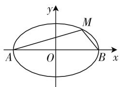

# 深探究 透理解 巧解决

—— 也说椭圆离心率教学

● 广东华侨中学 朱国璋

在圆锥曲线离心率的教学与考试中,有几个问题特别值得关注:一是确定性问题,即根据试题所给的条件,直接求离心率的值;二是动态变化性问题,即根据试题所给的条件求离心率的取值范围.在椭圆中,离心率的大小,反映椭圆的“扁圆”程度.对静态问题的处理学生觉得容易,动态问题的研究处理,学生往往不熟悉,遇到这类问题有点胆怯,不知如何下手.

教学中,如何启发学生掌握解决这类问题的基本思路和简便方法,也就是如何根据题设条件找到并构造一个a,b,c等量关系或不等量关系,进而化简整理得到结论?难点一,是如何解读题意,分析条件,特别是题目隐含条件的发现、解剖与应用,构建a,b,c之间的数量关系;难点二,是进一步化简变形,得到正确答案.

下面以椭圆教学为例,就离心率动态问题进行研究举例,供大家参考.

# 一、结论探究

如图 1 所示, 在以下证明中, 我们把“张角”定义为: M 对 A, B 两点的张角是指以 M 为顶点, MA, MB 为两边的角, 它的取值范围为 $[0, \pi]$ .

结论 1: 若有一椭圆 $\frac{x^{2}}{a^{2}} + \frac{y^{2}}{b^{2}} = 1 (a > b > 0)$ ，其长轴上的两顶点为 A, B，则椭圆上任一点（不含 A, B）对 A, B 的张角始终为钝角,且当 M 为短轴顶点时 $\theta$ 最大.

text_image

y
M
A O B x

图 1

结论2:若有一椭圆 $\frac{x^{2}}{a^{2}}+\frac{y^{2}}{b^{2}}=1(a>b>0)$ ，其短轴上的两顶点为A,B，则椭圆上任一点(不含A,B)对A,B的张角始终为锐角，且当M为长轴顶点时 $\theta$ 最大.

现对结论 1 进行证明：

由椭圆对称性,我们只需要讨论第一象限内椭圆上的点(包含 y 轴顶点) $M(x,y)$ ，如图1，则 $A(-a,0),B(a,0),0<y\leqslant b.$

因为 M 在椭圆上, 所以 $\frac{x^{2}}{a^{2}} + \frac{y^{2}}{b^{2}} = 1$ , 即 $x^{2} = a^{2} - \frac{a^{2}}{b^{2}} y^{2}$ . ①

显然 M 对 A, B 的张角 $\theta$ 是直线 AM 到 BM 的角，

则 $\tan\theta=\frac{\frac{y}{x-a}-\frac{y}{x+a}}{1+\frac{y^{2}}{x^{2}-a}}=\frac{2ay}{x^{2}+y^{2}-a^{2}}.$ ②

将 ① 代入 ②, 得 $\tan \theta = \frac{2ay}{y^2 - \frac{a^2}{b^2}y^2} = \frac{2a}{y\left(1 - \frac{a^2}{b^2}\right)}$ 显然 $\left(1-\frac{a^{2}}{b^{2}}\right)<0,2a>0,y>0$ ，则 $\tan\theta<0$ ，所以 $\theta$ 为钝角，由图形可知 $0<\theta<\pi$ .

易知 $\tan\theta$ 随 y 的增大而增大, 即 $\theta$ 随 y 的增大而增大. 当 y 取最大值 y=b 时, $\theta$ 有最大值, 此时 M 为短轴顶点.

当 y 无限接近“0”时， $\tan\theta$ 无限接近 $+\infty$ ，即 $\theta$ 无限接近直角，也就是说，当 M 与 A 或 B 重合时， $\angle MAB$ 或 $\angle MBA$ 可看成直角.

综上所述，椭圆上一点 $M$ （不含长轴顶点）对两长轴上顶点 $A, B$ 的张角 $\theta$ 始终为钝角，且当 $M$ 为短轴上顶点时，角 $\theta$ 最大；当 $M$ 无限接近 $A$ 或 $B$ 时， $\theta$ 无限接近直角.

有了以上结论,可以很快解决以下问题.

例 1 设椭圆 $\frac{x^{2}}{a^{2}}+\frac{y^{2}}{b^{2}}=1(a>b>0)$ 其长轴上的两顶点为 A, B, 若椭圆上存在一点 M 使 $\angle AMB=\frac{2\pi}{3}$ , 求该椭圆的离心率 e 的取值范围.

此题一般资料提供的解法如下：

不妨设 A, B 的坐标分别为 $(-a,0)$ , $(a,0)$ ，由对称性，可不妨设 M 点在 x 轴上方.

设 M 的坐标为 $(x, y)$ ,

则 $k_{A_{1}M}=\frac{y}{x+a}, k_{A_{2}M}=\frac{y}{x-a}.$

因为 $\angle A_{1}MA_{2} = \frac{2\pi}{3}$ 所以 $\frac{\frac{y}{x - a} - \frac{y}{x + a}}{1 + \frac{y^2}{x^2 - a^2}} = \tan$ $\frac{2\pi}{3}$ , 即 $\sqrt{3}(x^2 + y^2 - a^2) + 2ay = 0$ .

由 $\frac{x^{2}}{a^{2}}+\frac{y^{2}}{b^{2}}=1$ ，有 $x^{2}=a^{2}\left(1-\frac{y^{2}}{b^{2}}\right)$ ，

所以 $2ab^{2}y-\sqrt{3}c^{2}y^{2}=0.$

因为 y > 0，所以 $y = \frac{2ab^{2}}{\sqrt{3}c^{2}}$ .

由 $0 < y \leqslant b$ 知，所以 $2ab \leqslant \sqrt{3}c^2$ ，所以 $4a^{2}(a^{2}-c^{2}) \leqslant 3c^{2}$ ，所以 $3e^{4} + 4e^{4} - 4 \geqslant 0$ ，所以 $e^{2} \geqslant \frac{2}{3}$ ，所以 $e \geqslant \frac{\sqrt{6}}{3}$ ，所以 $e \in \left[\frac{\sqrt{6}}{3}, 1\right)$ .

用本文结论解法如下：

设短轴顶点对两长轴顶点的张角为 $\theta$ ，由结论1知， $\theta$ 为所有张角中的最大角，则只需满足， $\theta \geqslant \frac{2}{3}\pi$ ，即 $\frac{\theta}{2} \geqslant \frac{\pi}{3}$ .

由椭圆性质易知， $\tan \frac{\theta}{2} = \frac{a}{b}$ ，所以 $\tan \frac{\theta}{2} \geqslant \tan \frac{\pi}{3}$ ，即 $\frac{a}{b} \geqslant \sqrt{3}, a \geqslant \sqrt{3}b, a^2 \geqslant 3b^2, a^2 \geqslant 3(a^2 - c^2)$ ，所以 $\frac{c}{a} \geqslant \frac{\sqrt{6}}{3}$ .

又因为 $0 < \frac{c}{a} < 1$ ，所以 $\frac{\sqrt{6}}{3} \leqslant \frac{c}{a} < 1$ .

点评: 就本题而言, 学生若熟练掌握椭圆顶点张角的性质, 利用椭圆几何特征, 则可避开复杂的一般解法, 化繁为简, 巧妙处理. 学习中, 老师和学生可对学习进行总结反思, 由简单认识到深度探究, 获得一些可应用的结论, 利用结论解题, 可适当降低难度, 抓住关键, 快速突破, 高效作答. 解析几何中存在性问题一般可转化为临界情况, 极限思维, 学生经过分析就能发现 $\angle AMB$ 最大时即椭圆的顶点张角最大, 从而巧妙构建不等关系进行求解, 提高抽象思维的能力和

核心素养,解答过程也更为流畅简洁.

# 二、推广应用

此结论亦可推广椭圆上的点(不含两长轴顶点)对两焦点所成张角的问题,同理可证,椭圆上的点(不含长轴顶点)对两焦点所成的张角仍是点 M 在短轴顶点时最大.

例 2 若椭圆 $\frac{x^{2}}{a^{2}}+\frac{y^{2}}{b^{2}}=1(a>b>0)$ 上存在对其两个焦点张角为直角的点，试求该椭圆离心率的取值范围.

分析: 此题可以用例 1 的解法, 但比较麻烦, 运算量偏大, 费时费精力, 容易出错. 我们可以用上面结论快速准确解答.

由以上结论可知,要使满足题意的点存在,设短轴顶点对 $F_{1}, F_{2}$ 的张角 $\theta$ , 则只需 $\theta \geqslant \frac{\pi}{2}$ , 所以 $\frac{\theta}{2} \geqslant \frac{\pi}{4}$ 时, 能满足题目要求.

由椭圆的性质易知， $\tan \frac{\theta}{2} = \frac{c}{b}$ ，故 $\frac{c}{b} \geqslant 1$ ，即 $c \geqslant b$ ，所以 $c^2 \geqslant b^2, c^2 \geqslant a^2 - c^2$ ，即 $a^2 \leqslant 2c^2$ ，所以 $\frac{c^2}{a^2} \geqslant \frac{1}{2}$ ，即 $e \geqslant \frac{\sqrt{2}}{2}$ .

又因为 $e < 1$ ，所以 $\frac{\sqrt{2}}{2} \leqslant e \leqslant 1.$

点评:学生可利用推广的结论,由椭圆的对称性快速找到基本量a,b,c之间的联系,利用方程思想,转换为离心率e完成动态性问题的解答,简单直观.该做法易于理解,便于操作,尤其在处理练习考试中的填空与选择题,小题小做,小题巧做,找到入口,快速突破,既能锻炼学生思维,提高素养,又能在成功与喜悦中增强学生信心,培养学生学习数学的兴趣.

在教学、学习中,如果不深究,就很难透彻,不透彻就谈不上巧做巧答,从而很难升华,达到一定高度.有些问题按常规做法,计算量大,转化复杂,耗时长,容易出错,不利于练习考试,也不利于数学思维培养,只要学生熟悉性质,内化知识,深入探究,理解透彻,就能抓住重点,揭开神秘面纱,由表及里,找到由现象到本质的“捷径”,简化运算,提高素养,培养“数学眼光”,铺好成长之路.