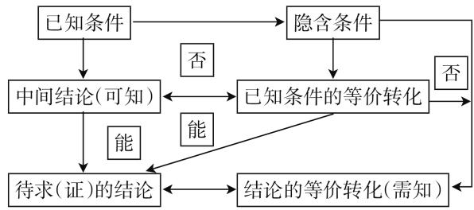
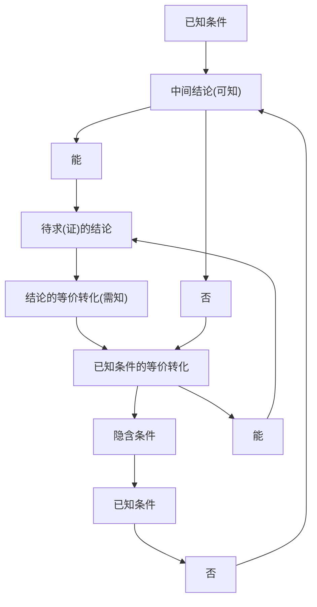
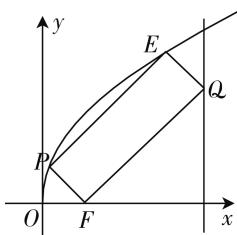
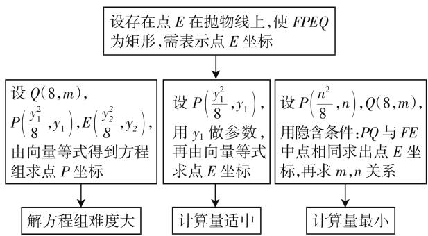
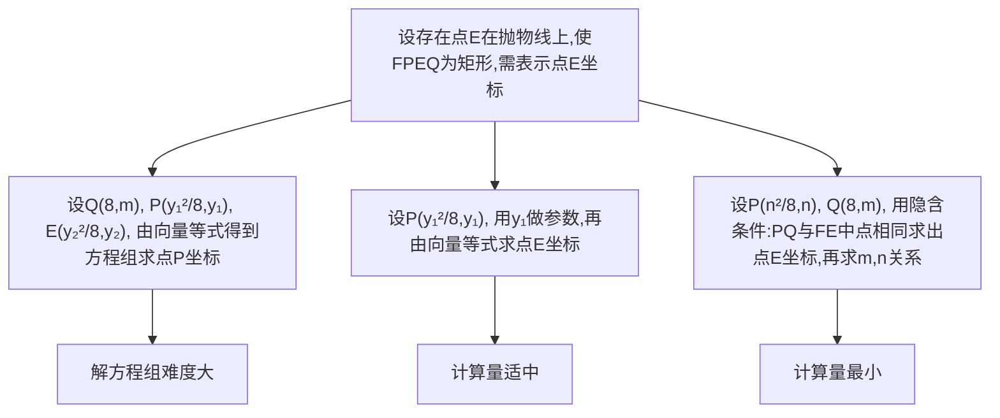
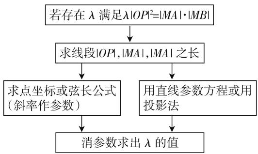
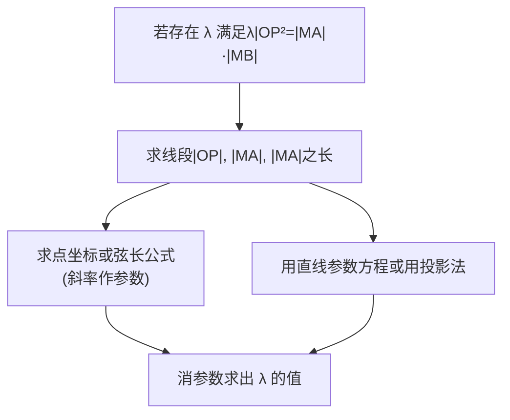

# 用思维导图解答压轴题——从通法到“秒杀”

—— 以解析几何为例

# ● 文卫星数学生态课堂公众号主持人 文卫星

应银川三沙源上游学校之邀,笔者于3月10日在该校上了一节高三复习课,课题是“用思维导图解答压轴题——从通法到‘秒杀’——以解析几何为例”.这里所谓“秒杀”是指其解法比通法要简单甚至简单许多,不是说一眼能看出答案,毕竟压轴题不能轻而易举解出.

题目在上课前一天发给学生预习并试做,发现三个题目都是最后一题有困难,因此上课主要分析思路是如何想到的,兼顾运算.由于在3月9日晚上为全体学生作讲座已经解释图1所示的“思维导图”,所以上课直接从例题开始.

flowchart

图 1

逛公园顺道看景,好风光驻足留影.

把条件翻成图式,关键处深挖搞清.

综合法由因导果,分析法执果索因.

两方法嫁接联姻,让难题无以遁形.

例 1 设常数 t > 2，在平面直角坐标系 xOy 中，已知点 $F(2,0)$ ，直线 l: x = t，曲线 $\Gamma: y^{2} = 8x (0 \leqslant x \leqslant t, y \geqslant 0)$ 。l 与 x 轴交于点 A，与 $\Gamma$ 交于 B。P，Q 点分别是曲线 $\Gamma$ 与线段 AB 上的动点。

(1)(2) 略.

(3) 设 t=8，是否存在以 FP, FQ 为邻边的矩形 FPEQ，使得点 E 在 $\Gamma$ 上？若存在，求点 P 的坐标；若不存在，说明理由.

分析:学生反映困难在于矩形条件不好用,因为设出点再利用对边相等列出式子无法计算.就此提出还可以怎么利用矩形条件?如图2,学生这时想到邻边垂直,可用邻边斜率之积等于-1,或 $\overrightarrow{FQ}\cdot\overrightarrow{FP}=0$ ,进一步追问由矩形条件还可以发现什么,有学生发现

向量等式: $\overrightarrow{FE} = \overrightarrow{FQ} + \overrightarrow{FP}$ .

这样就可以“把条件翻成等式”了,由此设出各点坐标可得方程组,解方程组可求出 P 点坐标.不过这种方法易想难算.如果选择点 P 的纵坐标作为参数,计算量相对要小许多.

text_image

y
E
Q
P
O
F
x

图2

如果进一步挖掘隐含条件会发现对角线顶点坐标之和相等,设出 P,Q 纵坐标即可表示 E 点坐标,再利用 FP 与 FQ 垂直即可得到两个参数之间关系.随着选择参数表示 E 点坐标方法不同,计算量各异.本题思维导图如图 3 所示.

flowchart

图 3

解法 1: 设 $Q(8, m)$ , $P\left(\frac{y_{1}^{2}}{8}, y_{1}\right)$ , $E\left(\frac{y_{2}^{2}}{8}, y_{2}\right)$ , 其中 $0 < y_{1}, y_{2} \leqslant 8$ .

因为 $F(2,0)$ ，所以 $\overrightarrow{FQ} = (6,m),\overrightarrow{FP} = \left(\frac{y_1^2}{8} -2,y_1\right),\overrightarrow{FE} = \left(\frac{y_2^2}{8} -2,y_2\right).$

因为 FPEQ 为矩形, 所以 $\left\{\begin{aligned}\overrightarrow{FE}&=\overrightarrow{FQ}+\overrightarrow{FP},\\\overrightarrow{FQ}&\cdot\overrightarrow{FP}=0,\end{aligned}\right.$ 即

$\left\{ \begin{array}{l} \frac{y_2^2}{8} - 2 = \frac{y_1^2}{8} - 2 + 6, \\ y_2 = y_1 + m, \\ 6\left(\frac{y_1^2}{8} - 2\right) + y_1m = 0, \end{array} \right.$ 解得 $m = \frac{12\sqrt{5}}{5}, y_1 = \frac{4\sqrt{5}}{5}, y_2$

$= \frac{16\sqrt{5}}{5}$ ，所以存在 $P\left(\frac{2}{5},\frac{4\sqrt{5}}{5}\right)$ 满足条件.

解三元二次方程组是学生的最大困难,很多同学没有消元意识(初中没有学过解二元二次方程组).教学中笔者进行具体演算.如果这里只讲思路,说解得就给出答案,其实是留下隐患,学生往往解不得.

解法 2: (秒杀) $P\left(\frac{n^{2}}{8}, n\right)$ , $Q(8, m)$ ，则 PQ 的中点为 $M\left(4 + \frac{n^{2}}{16}, \frac{m + n}{2}\right)$ ，从而可知 $E\left(6 + \frac{n^{2}}{8}, m + n\right)$ .

又 $\overrightarrow{FP} = \left(\frac{n^2}{8} - 2, n\right), \overrightarrow{FQ} = (6, m)$ ，由 $\overrightarrow{FP} \cdot \overrightarrow{FQ} = 6\left(\frac{n^2}{8} - 2\right) + m \cdot n = 0$ ，得 $m = \frac{48 - 3n^2}{4n}$ ，所以 $E\left(6 + \frac{n^2}{8}, \frac{48 + n^2}{4n}\right)$ ，于是 $\left(\frac{48 + n^2}{4n}\right)^2 = 8\left(6 + \frac{n^2}{8}\right)$ ，解得 $n^2 = \frac{16}{5}$ ，所以 $P\left(\frac{2}{5}, \frac{4\sqrt{5}}{5}\right)$ .

小结: 解法 2 虽然设两个参数, 但实际运算量最小 (书写量小, 前后步之间可以口算), 关键是挖掘隐含条件“对角线坐标之和相等”. 正是:

需要设参尽量少,深挖隐含很重要.

平时解题勤积累,关键时刻效益高.

例 2 焦点在 x 轴上的椭圆 $C: \frac{x^{2}}{a^{2}} + \frac{y^{2}}{b^{2}} = 1 (a > b > 0)$ 经过点 $(2, \sqrt{2})$ ，椭圆 C 的离心率为 $\frac{\sqrt{2}}{2}$ . $F_{1}, F_{2}$ 是椭圆的左、右焦点，P 为椭圆上任意一点.

(1) 略.

(2) 若点 M 为 $OF_{2}$ 的中点 (O 为坐标原点)，过 M 且平行于 OP 的直线 l 交椭圆 C 于 A, B 两点，是否存在实数 $\lambda$ ，使得 $\lambda |OP|^{2} = |MA||MB|$ ；若存在，求出 $\lambda$ 的值；若不存在，请说明理由.

flowchart

图4

分析:本题学生由于预习的时间有限,多数同学有思路,但没有来得及算.问一下同学的思路大多是直接求弦长,还要考虑斜率是否存在,计算量显然较大.

由于直线过点 $M(1,0)$ ，设直线的参数方程显然简单。若把 $\lambda|OP|^{2}=|MA|\cdot|MB|$ 转化线段之比，把线段长度投影到 y 轴上，则更简单。

解法 1: 依据题意知, $M(1,0)$ . 当直线 l 的斜率存在时, 设 $l: y = k(x - 1), A(x_{1}, y_{1}), B(x_{2}, y_{2})$ , 把 $y = k(x - 1)$ 代入 $\frac{x^{2}}{8} + \frac{y^{2}}{4} = 1$ , 得 $(1 + 2k^{2})x^{2} - 4k^{2}x + 2k^{2} - 8 = 0$ .

由 $\left\{\begin{aligned}y=kx,\\ \frac{x^{2}}{8}+\frac{y^{2}}{4}=1,\end{aligned}\right.$ 解得 $x_{p}^{2}=\frac{8}{2k^{2}+1}.$

则 $\left|OP\right|^{2}=x_{p}^{2}+y_{p}^{2}=(1+k^{2})x_{p}^{2}=\frac{8(k^{2}+1)}{2k^{2}+1}.$

又 $|MA| = \sqrt{1 + k^2} |x_1 - 1|$ , $|MB| = \sqrt{1 + k^2}$ • $|x_2 - 1|$ ，则 $\lambda = \frac{|MA||MB|}{|OP|^2}$

$$
\begin{array}{l} = \frac {(2 k ^ {2} + 1) \left| x _ {1} x _ {2} - (x _ {1} + x _ {2}) + 1 \right|}{8} \\ = \frac {\left| 2 k ^ {2} - 8 - 4 k ^ {2} + (2 k ^ {2} + 1) \right|}{8} = \frac {7}{8}. \\ \end{array}
$$

当直线 l 的斜率不存在时， $|OP|=2$ ， $|MA|=MB|=\frac{\sqrt{14}}{2}$ ，则 $\lambda=\frac{|MA||MB|}{|OP|^{2}}=\frac{7}{8}$ .

综上,存在实数 $\lambda=\frac{7}{8}$ 满足题意.

改进: $\lambda=\frac{|MA||MB|}{|OP|^{2}}=\frac{|x_{1}-1||x_{2}-1|}{x_{P}^{2}}=$ $\frac{\left|x_{1}x_{2}-(x_{1}+x_{2})+1\right|}{x_{P}^{2}}=\frac{7}{8}.$

受此启发可得解法 2:

解法2:(秒杀1)设直线l的方程为 $x=my+1$ ，代入椭圆方程 $x^{2}+2y^{2}=8$ ，得 $(m^{2}+2)y^{2}+2my-7=0,y_{1}\cdot y_{2}=-\frac{7}{m^{2}+2}$ .

直线 l 的方程为 x=my，代入椭圆方程 $x^{2}+2y^{2}=8$ ，得 $(m^{2}+2)y^{2}=8, y_{P}^{2}=\frac{8}{m^{2}+2}$ .

$$
\lambda = \frac {\mid M A \mid \bullet \mid M B \mid}{y _ {P} ^ {2}} = \frac {\mid y _ {1} \mid \bullet \mid y _ {2} \mid}{y _ {P} ^ {2}} = \frac {7}{8}.
$$

小结:对同一条直线(或平行直 (下转第63页)

的公式,最终通过不等式的求解来确定离心率的取值范围.

解析:设经过点 T 所作的圆 C 的两条切线分别为 TA, TB, 其中切点分别为 A, B, 连接 CA, CB, 则知 $CA \perp TA, CB \perp TB$ , 而由题可知, $TA \perp TB$ , 所以四边形 TACB 是正方形, 可得 $|CT| = \sqrt{2}a$ , 而圆心 $C(c, 0)$ 到双曲线 M 的渐近线 $bx \pm ay = 0$ 的距离为 $d = \frac{|bc|}{\sqrt{b^2 + a^2}} = b$ , 结合点 T 在双曲线 M 的渐近线上, 可知 $b \leqslant \sqrt{2}a$ . 又 b > a > 0, 则有 $a < b \leqslant \sqrt{2}a$ , 即 $1 < \frac{b}{a} \leqslant \sqrt{2}$ , 所以双曲线 M 的离心率 $e = \frac{c}{a} = \sqrt{1 + \frac{b^2}{a^2}} \in (\sqrt{2}, \sqrt{3}]$ .

故选择答案:B.

点评:充分抓住平面几何中“直线外一点与直线上一点的连线中,垂线段最短”这一几何性质来建立不等关系式,同时要注意题目条件中给出的不等信息,综合起来破解离心率的取值范围.

# 三、三角参数切入

根据题目条件引入三角参数,通过三角恒等变换或三角函数的图像与性质来确定对应三角关系式的取值范围,从而得以确定涉及离心率或对应参数的不等式,进而得以确定离心率的取值范围.

例 3 已知 P 为双曲线 $C: \frac{x^{2}}{a^{2}} - \frac{y^{2}}{b^{2}} = 1 (a > 0, b > 0)$ 上一点， $F_{1}, F_{2}$ 分别为双曲线 C 的左、右焦点，若 $\triangle PF_{1}F_{2}$ 的内切圆的直径为 a，则双曲线 C 的离心率的取值范围为 \_\_\_\_.

分析: 利用双曲线的焦点三角形的面积公式建立关系式, 结合双曲线的焦半径公式, 得以确定内切圆的半径的表达式,进而建立涉及点 P 的坐标的关系式,结合双曲线方程的三角换元思维来代换,通过三角函数的取值范围的确定得以确定相关参数的不等式,再结合双曲线的离心率公式来分析与处理.

解析:根据双曲线的对称性,只需要考虑点 P 在第一象限内的情况即可,设 $P(x_{0},y_{0})$ , $\triangle PF_{1}F_{2}$ 的内切圆 I 的半径为 r, 则 $\triangle PF_{1}F_{2}$ 的面积为 $S=\frac{1}{2}\left(\left|PF_{1}\right|+\left|PF_{2}\right|+\left|F_{1}F_{2}\right|\right)r=\frac{1}{2}\cdot\left|F_{1}F_{2}\right|\cdot y_{0}$ , 结合双曲线的焦半径公式, 整理可得 $(ex_{0}+a+ex_{0}-a+2c)\cdot r=2c\cdot y_{0}$ , 则有 $r=\frac{cy_{0}}{ex_{0}+c}=a\cdot\frac{y_{0}}{x_{0}+a}=\frac{a}{2}$ , 可得 $x_{0}+a=2y_{0}$ . 通过三角换元 $x_{0}=\frac{a}{\cos\theta}$ , $y_{0}=b\tan\theta$ , 则有 $\frac{a}{\cos\theta}+a=2b\tan\theta$ , 整理可得 $\frac{a}{b}=\frac{2\sin\theta}{1+\cos\theta}\in(0,2)$ , 即 2b>a, 所以双曲线 C 的离心率 $e=\frac{c}{a}=\sqrt{1+\frac{b^{2}}{a^{2}}}<\sqrt{1+\frac{1}{4}}=\frac{\sqrt{5}}{2}$ .

故填答案: $\left(\frac{\sqrt{5}}{2},+\infty\right)$ .

点评:巧妙引入参数,通过三角换元,把相应的参数关系式转化为三角关系式,利用三角函数的性质来确定其取值范围,进而为求解离心率的取值范围提供条件.这也是巧妙利用三角函数的有界性来解决圆锥曲线问题的典范.

其实,破解离心率的取值范围问题,关键就是充分分析与理解题目,借助“题目条件”合理切入,抓住“平面几何”数形直观,利用“三角参数”巧妙转化,结合“端点效应”特殊处理,有时一种策略独领风骚,有时多种策略齐心协力,从而有效转化,降低难度,从而得以破解离心率的取值范围问题. W

(上接第 55 页) 线) 上线段距离之积的等量关系, 可以转化为距离之比, 再用投影法转化为纵或横坐标之差的绝对值之比 (可视为由弦长公式引申的二级结论), 使计算变得简洁明了. 当然直线的参数方程也是很好的方法. 正是:

共线定积距离题,投影参数均适宜.

韦达定理都要用,一繁一简预先知.

本课小结:通过上述两例我们发现,解答压轴题是按照条件进行推理计算得到可知,如果可知不能直接得到结论,就需要对可知或结论进行等价转化,而挖掘隐含条件或利用由教材中直接引申的结论(称为二级结论)往往会使解题过程得到优化.用思维导图解答压轴题不是说一定能得满分,而是把自己的真实水平尽可能发挥出来.正是:

解答压轴用导图,不得满分尽量多.

已知可得不达标,通过结论来探索.

隐含条件要深挖,常见结论用处大.

综合分析诸要素,先通后简想秒杀! W