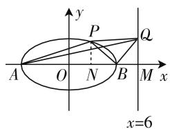
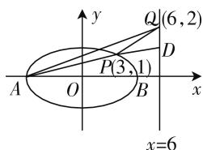
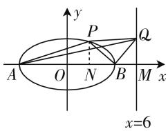
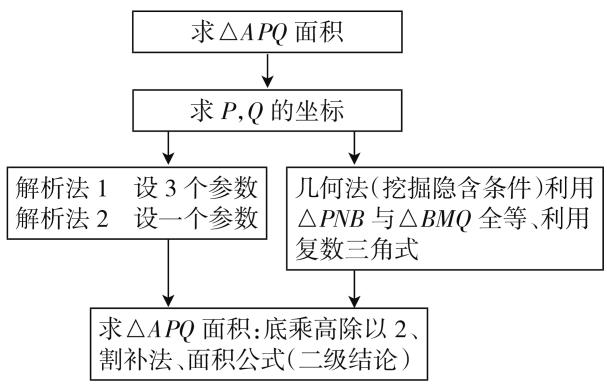
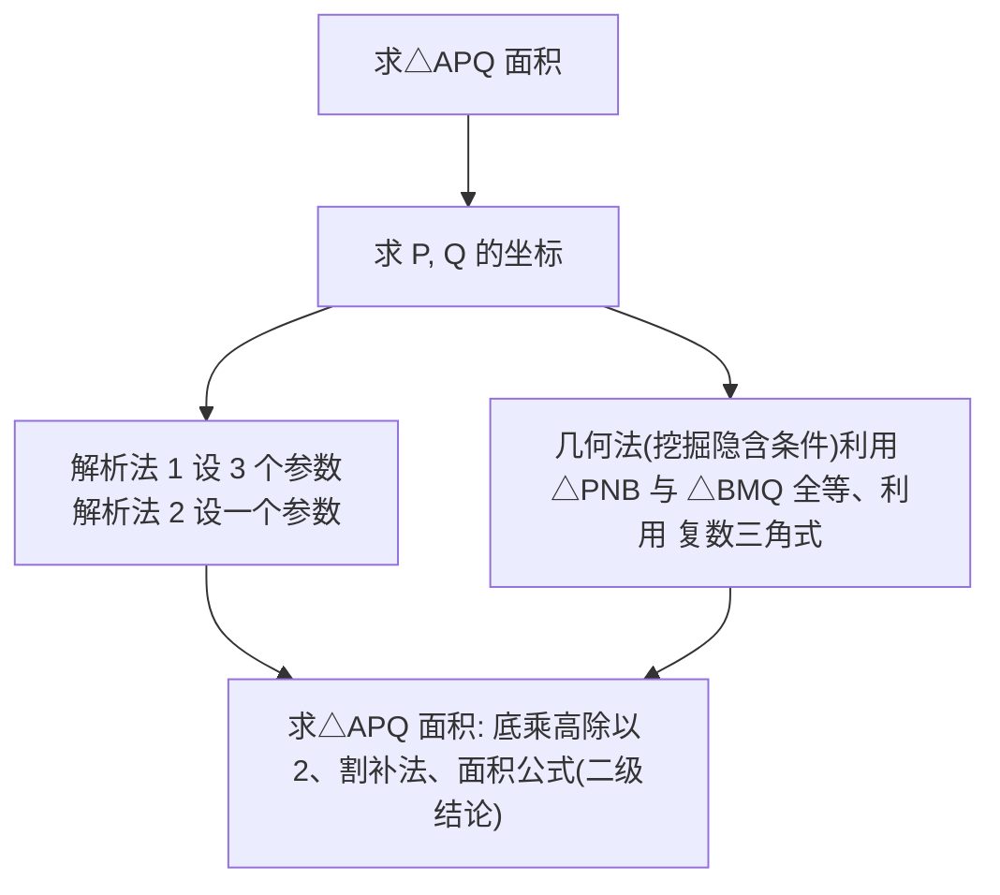

# 用思维导图解答压轴题

—— 以 2020 年全国卷 III 第 20 题为例

● 云南师范大学附属怒江民族中学 杨红梅  
● 云南师范大学附属怒江民族中学 孙利萍

文卫星老师在“解题压轴题要先通法后‘秒杀’”一文中给出解答高考数学压轴题的思维导图，现以2020年全国卷Ⅲ理科第20题(文科第21题)为例，说明思维导图的应用，以及如何做到先通法后“秒杀”.

例 已知椭圆 $C: \frac{x^2}{25} + \frac{y^2}{m^2} = 1 (0 < m < 5)$ 的离心率为 $\frac{\sqrt{15}}{4}, A, B$ 分别为 $C$ 的左、右顶点.

(1) 求 C 的方程;  
(2) 若点 P 在 C 上, 点 Q 在直线 x = 6 上, 且 $\left|BP\right| = \left|BQ\right|$ , $BP \perp BQ$ , 求 $\triangle APQ$ 的面积.

分析:(1)利用 $e^{2}=\frac{a^{2}-b^{2}}{a^{2}}=\frac{15}{16}$ 得椭圆方程为 $\frac{x^{2}}{25}+\frac{16y^{2}}{25}=1$ .(详细过程及步骤略)

(2) 思路1: (通性通法) 需要求 P, Q 的坐标, 若设点 $Q(6, t)$ , $P(m, n)$ , 利用 $\overrightarrow{BP} \cdot \overrightarrow{BQ} = 0$ 或 $k_{PB} \cdot k_{BQ} = -1$ , $|BP| = |BQ|$ 及点 P 在椭圆上解方程组可求得 P, Q 的坐标, 再利用三角形面积公式(有多种求法).

解法 1: 设点 $Q(6, t)$ , $P(m, n)$ , 又 $A(-5, 0)$ , $B(5, 0)$ , 所以由 $\overrightarrow{BP} \cdot \overrightarrow{BQ} = 0$ 或 $k_{PB} \cdot k_{BQ} = -1$ , 得 $t \cdot \frac{n}{m-5} = -1$ , ①

text_image

y
P
Q
A O N B M x
x=6

图1

由 $|BP|=|BQ|$ ，得 $(m-5)^{2}+n^{2}=t^{2}+1$ ，②

由 ①, 得 $t = \frac{5 - m}{n}$ , 代入 ②, 得 $(m - 5)^2 + n^2 = \left(\frac{5 - m}{n}\right)^2 + 1$ , 即 $(m - 5)^2 n^2 + n^4 = (5 - m)^2 + n^2$ . 整理得 $(m - 5)^2 (n^2 - 1) = n^2 (1 - n^2)$ , 所以 $n = \pm 1$ .

若 n=1，可得 $m+t-5=0, P(m,1)$ ，将 $P(m,1)$ 代入椭圆方程 $\frac{m^{2}}{25}+\frac{16y^{2}}{25}=1$ ，解得 $m=\pm3$ ，所以 $P(3,$

1), $Q(6,2)$ 或 $P(-3,1)$ , $Q(6,8)$ .

① 当 $P(3,1)$ , $Q(6,2)$ 时， $|AQ|=\sqrt{125}$ ，直线 AQ 的方程为 $2x-11y+10=0$ , $P(3,1)$ 到直线 AQ 的距离为 $d=\frac{5}{\sqrt{125}}$ ，所以 $S_{\triangle APQ}=\frac{1}{2}\cdot|AQ|\cdot d=\frac{1}{2}\times\sqrt{125}\times\frac{5}{\sqrt{125}}=\frac{5}{2}$ .  
② 当 $P(-3,1)$ , $Q(6,8)$ 时, $|AQ|=\sqrt{185}$ , 直线 AQ 的方程为 $8x-11+40=0$ , $P(-3,1)$ 到直线 AQ 的距离为 $d=\frac{5}{\sqrt{185}}$ , 所以 $S_{\triangle APQ}=\frac{1}{2}\cdot|AQ|\cdot d=\frac{1}{2}\times\sqrt{185}\times\frac{5}{\sqrt{185}}=\frac{5}{2}$ .

若 n = -1，同理可得 $\triangle APQ$ 的面积为 $\frac{5}{2}$ .

综上可知, $\triangle APQ$ 的面积为 $\frac{5}{2}$ .

评注1:如果由①得m-5=-nt,整体代入②解方程的计算量会略小一些.

评注 2: 用割补法求三角形面积更简单:

如图2,延长AP交直线x=6于点D.因为直线AP的方程为 $y=\frac{1}{8}(x+5)$ ，令x=6，

text_image

y
Q(6,2)
D
P(3,1)
A O B x
x=6

图2

得 $y=\frac{11}{8}$ ，所以 $\left|QD\right|=2-\frac{11}{8}$

$= \frac{5}{8}$ 所以 $S_{\triangle APQ} = S_{\triangle APD} - S_{\triangle PDQ} = \frac{1}{2} \cdot \frac{5}{8}(11 - 3) = \frac{5}{2}$ .

也可以这样割补：

$$
S _ {\triangle A P Q} = S _ {\triangle A Q M} - S _ {\triangle A B P} - S _ {\triangle B Q P} - S _ {\triangle B M Q} = \frac {1}{2} \cdot
$$

$$
\begin{array}{l} 1 1 \cdot | Q M | - \frac {1}{2} \cdot 1 0 \cdot 1 - \frac {1}{2} \cdot | B P | \cdot | B Q | - \frac {1}{2} \cdot 1 \\ \cdot | Q M | = \frac {5}{2}. \\ \end{array}
$$

或 $S_{\triangle APQ} = S_{\triangle AQM} - S_{\triangle APM} - S_{\triangle PMQ} = \frac{1}{2}\cdot 11\cdot$

$$
Q M - \frac {1}{2} \cdot 1 1 \cdot 1 - \frac {1}{2} \cdot M Q \cdot (6 - x _ {P}) = \frac {5}{2}.
$$

评注3: 解法1有3个参数, 如果能减少参数, 计算量可能会小一点. 比如, 设 $\angle QBM = \theta\left(\theta \in \left(0, \frac{\pi}{2}\right)\right)$ 为参数可得. 具体见解法2.

解法2：设 $\angle QBM = \theta (\theta \in (0,\frac{\pi}{2}))$ ，由已知可得 $|BM| = 1$ ，所以 $|BP| = |BQ| = \frac{|BM|}{\cos\theta} = \frac{1}{\cos\theta}$ ，且 $Q(6,\tan \theta)$

text_image

y
P
Q
A O N B M x
x=6

图3

又 $|BN|=|PB|\cos\left(\frac{\pi}{2}-\theta\right)=\tan\theta,\quad|PN|=$ $|PB|\sin\left(\frac{\pi}{2}-\theta\right)=1$ ，从而 $P(5-\tan\theta,1)$ .

因为 P 在椭圆上, 所以 $\frac{(5-\tan\theta)^{2}}{25}+\frac{16}{25}=1$ , 故 $\tan\theta=2$ 或 $\tan\theta=8$ , 所以 $P(3,1)$ , $Q(6,2)$ 或 $P(-3,1)$ , $Q(6,8)$ .

以下同解法 1. 当 P 在 x 轴下方同理可得.

思路2:(挖掘隐含条件)过P作 $PN\perp x$ 轴于N,则 $\triangle PNB\cong\triangle BMQ,\left|NB\right|=\left|QM\right|,\left|PN\right|=\left|BM\right|=1.$

解法 3: 如上分析可设 $P(m,1)$ ，代入椭圆方程 $\frac{x^{2}}{25} + \frac{16y^{2}}{25} = 1$ 解得 $m = \pm 3$ .

text_image

y
P
Q
A O N B M x
x=6

图4

当 $m = 3$ 时， $P(3,1), Q(6,2), A(-5,0)$ 时， $\overrightarrow{AP} = (8,1), \overrightarrow{AQ} = (11,2)$ ，所以 $S_{\triangle APQ} = \frac{1}{2} |x_1y_2 - x_2y_1| = \frac{5}{2}$ .

当 $m = -3$ 时， $P(-3,1), Q(6,8), A(-5,0)$ 时， $\overrightarrow{AP} = (2,1), \overrightarrow{AQ} = (11,8)$ ，所以 $S_{\triangle APQ} = \frac{1}{2} |x_1y_2 - x_2y_1| = \frac{5}{2}$ .

综上可知, $\triangle APQ$ 的面积为 $\frac{5}{2}$ .

评注 4: 对 $\triangle ABC$ ，若 $\overrightarrow{AB} = (x_{1}, y_{1}), \overrightarrow{AC} = (x_{2}, y_{2})$ ，则利用公式 $S_{\triangle ABC} = \frac{1}{2} |x_{1}y_{2} - x_{2}y_{1}|$ 求三角形面积回避了求三角形的底和高，节省了许多计算量.

思路 3: 如果利用复数的三角形式, 还有更简单的解法.

解法 4: 因为 $\left|BP\right|=\left|BQ\right|$ , $BP \perp BQ$ ，设点 $Q(6,t)$ ，又 $B(5,0)$ ，则 $\overrightarrow{BP}=(m-5,n)$ , $\overrightarrow{BQ}=(1,t)$ ，所以 $\overrightarrow{BQ}$ 对应复数为 $1+t_{i}$ , $\overrightarrow{BP}$ 对应复数为 $i(1+t_{i})=-t+i$ ，因此， $\overrightarrow{OP}=\overrightarrow{OB}+\overrightarrow{BP}=(5,0)+(-t,1)=(5-t,1)$ ，即 $P(5-t,1)$ ，代入椭圆方程得 t=2 或 t=8.

下同解法 3.

评注 5: 解法 3、解法 4 在求 P 的坐标时几乎都是可以口算, 只是由于复数的三角形式在现行教材中不要求, 解法 4 合理“不合法”, 解法 3 合理合法.

通过本例我们发现,挖掘隐含条件对简化解题非常重要.由此可知,所谓“秒杀”相对于通法来说是很简单,实际解题时是挖掘题目的隐含条件,或对已知条件以及结论作必要的转化,或利用教材中的结论适当延伸可得的结论,如本例中利用 $\triangle PNB\cong\triangle BMQ$ 和 $S_{\triangle ABC}=\frac{1}{2}\left|x_{1}y_{2}-x_{2}y_{1}\right|$ ,复数的三角形式则不能直接使用,但如果学生掌握在客观题中也能使用.

最后,给出第(2)题的思维导图:

flowchart

图5

由此我们看到通法是“秒杀”的基础,没有通法的“秒杀”是无源之水,解题教学一味追求“秒杀”是不可取的. W