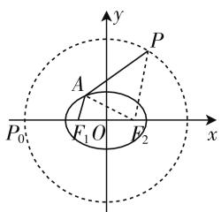

# 破解离心率取值范围问题的几种策略

● 甘肃省天水市第一中学 汪生武  
● 甘肃省天水市第一中学 马静

圆锥曲线中椭圆或双曲线的离心率的取值范围问题一直是圆锥曲线中的一个热点问题,也是历年高考中比较常见的一类问题,方式多样,变化多端,创新性强,难度较大.有些离心率的取值范围的求解问题让人感到异常困惑,力不从心,甚至产生一定的恐惧心理.本文结合实例,就破解离心率的取值范围问题的几种常见策略加以剖析与总结,以帮助大家突破学习难点和瓶颈.

# 一、题目条件切入

找出题目条件中给出的不等信息,如已知某些元素的取值范围、存在点或直线使得方程成立、判别式的取值范围等,进而列出不等式(组),通过转化化简得到涉及离心率的不等关系式,从而得以确定离心率的取值范围.

例 1 设椭圆 $C: \frac{x^{2}}{a^{2}} + \frac{y^{2}}{b^{2}} = 1 (a > b > 0)$ 的左、右焦点分别为 $F_{1}, F_{2}$ ，其焦距为 2c，O 为坐标原点，点 P 满足 $|OP| = 2a$ ，点 A 是椭圆 C 上的动点，且 $|PA| + |AF_{1}| \leqslant 3 |F_{1}F_{2}|$ 恒成立，则椭圆 C 离心率的取值范围是 \_\_\_\_.

分析:根据题目条件中不等式 $|PA|+|AF_{1}|\leqslant3|F_{1}F_{2}|$ 恒成立的信息,转化为相应的最值问题,再结合椭圆的定义、三角形的基本性质,分别通过双动点的变化规律加以确定相应的最值,从而建立对应的不等式来分析与求解.

解析：如图1所示，连接 $AF_{2}, PF_{2}$ ，设 $P_{0}(-2a,0)$ ，由于点P满足 $|OP|=2a$ ，可得点P的轨迹是以坐标原点O为圆心，以2a为半径的圆，由于 $|PA|+|AF_{1}|\leqslant3|F_{1}F_{2}|$ 恒成立，可得 $(|PA|+|AF_{1}|)_{\max}\leqslant3|F_{1}F_{2}|=6c$ ，根据椭圆的定义可知， $\left|AF_{1}\right|+\left|AF_{2}\right|=2a$ ，结合三角形的基本性质，可得 $\left|PA\right|+\left|AF_{1}\right|=\left|PA\right|+2a-\left|AF_{2}\right|=$

text_image

y
P
A
F₁ O F₂
x
P₀

图1

$|PA|-|AF_{2}|+2a\leqslant|PF_{2}|+2a$ ，当且仅当P，A， $F_{2}$ 三点共线时，等号成立。又 $|PF_{2}|\leqslant|P_{0}F_{2}|=2a+c$ ，所以 $(|PA|+|AF_{1}|)_{\max}=2a+c+2a=4a+c$ ，当且仅当P与 $P_{0}$ 重合且A位于椭圆C的右顶点时，等号成立，则有 $4a+c\leqslant6c$ ，即 $e=\frac{c}{a}\geqslant\frac{4}{5}$ 。又由椭圆离心率的性质知，0<e<1，所以 $\frac{4}{5}\leqslant e<1$ 。

故填答案: $\left[\frac{4}{5},1\right)$ .

点评:此类涉及双动点问题,要充分利用题目条件中的不等式恒成立的条件加以切入,建立起相应的不等式(组),进而达到破解的目的.要注意的是要充分考虑隐含条件——椭圆的离心率的取值范围为(0,1),双曲线的离心率的取值范围为 $(1,+\infty)$ .

# 二、平面几何切入

结合平面几何图形的性质,如三角形两边之和大于第三边、折线段大于或等于直线段、垂线段最短以及对称的性质中的最值等,进而列出不等式(组),结合圆锥曲线的几何性质用相关的参数a,b,c来表示,得到对应的不等式,通过转化化简得到涉及离心率的不等关系式,从而得以确定离心率的取值范围.

例 2 （燕博园 2020 届高三年级综合能力测试 (CAT)(一) 数学理科·11) 已知双曲线 $M: \frac{x^{2}}{a^{2}} - \frac{y^{2}}{b^{2}} = 1 (b > a > 0)$ 的焦距为 2c，若 M 的渐近线上存在点 T，使得经过点 T 所作的圆 $C: (x - c)^{2} + y^{2} = a^{2}$ 的两条切线互相垂直，则双曲线 M 的离心率的取值范围是（）.

A. $(1, \sqrt{2}]$ B. $(\sqrt{2}, \sqrt{3}]$   
C. $(\sqrt{2},\sqrt{5} ]$ D. $(\sqrt{3},\sqrt{5} ]$

分析:根据题目条件的分析得到四边形 TACB 是正方形,得到 $\left|CT\right|=\sqrt{2}a$ , 结合几何性质, 利用点 C 到渐近线的距离 d 与 $\left|CT\right|$ 之间的大小关系建立相应的不等式, 再结合题目条件通过参数的变形以及离心率的公式,最终通过不等式的求解来确定离心率的取值范围.

解析:设经过点 T 所作的圆 C 的两条切线分别为 TA, TB, 其中切点分别为 A, B, 连接 CA, CB, 则知 $CA \perp TA, CB \perp TB$ , 而由题可知, $TA \perp TB$ , 所以四边形 TACB 是正方形, 可得 $|CT| = \sqrt{2}a$ , 而圆心 $C(c, 0)$ 到双曲线 M 的渐近线 $bx \pm ay = 0$ 的距离为 $d = \frac{|bc|}{\sqrt{b^2 + a^2}} = b$ , 结合点 T 在双曲线 M 的渐近线上, 可知 $b \leqslant \sqrt{2}a$ . 又 b > a > 0, 则有 $a < b \leqslant \sqrt{2}a$ , 即 $1 < \frac{b}{a} \leqslant \sqrt{2}$ , 所以双曲线 M 的离心率 $e = \frac{c}{a} = \sqrt{1 + \frac{b^2}{a^2}} \in (\sqrt{2}, \sqrt{3}]$ .

故选择答案:B.

点评:充分抓住平面几何中“直线外一点与直线上一点的连线中,垂线段最短”这一几何性质来建立不等关系式,同时要注意题目条件中给出的不等信息,综合起来破解离心率的取值范围.

# 三、三角参数切入

根据题目条件引入三角参数,通过三角恒等变换或三角函数的图像与性质来确定对应三角关系式的取值范围,从而得以确定涉及离心率或对应参数的不等式,进而得以确定离心率的取值范围.

例 3 已知 P 为双曲线 $C: \frac{x^{2}}{a^{2}} - \frac{y^{2}}{b^{2}} = 1 (a > 0, b > 0)$ 上一点， $F_{1}, F_{2}$ 分别为双曲线 C 的左、右焦点，若 $\triangle PF_{1}F_{2}$ 的内切圆的直径为 a，则双曲线 C 的离心率的取值范围为 \_\_\_\_.

分析: 利用双曲线的焦点三角形的面积公式建立关系式, 结合双曲线的焦半径公式, 得以确定内切圆的半径的表达式,进而建立涉及点 P 的坐标的关系式,结合双曲线方程的三角换元思维来代换,通过三角函数的取值范围的确定得以确定相关参数的不等式,再结合双曲线的离心率公式来分析与处理.

解析:根据双曲线的对称性,只需要考虑点 P 在第一象限内的情况即可,设 $P(x_{0},y_{0})$ , $\triangle PF_{1}F_{2}$ 的内切圆 I 的半径为 r, 则 $\triangle PF_{1}F_{2}$ 的面积为 $S=\frac{1}{2}\left(\left|PF_{1}\right|+\left|PF_{2}\right|+\left|F_{1}F_{2}\right|\right)r=\frac{1}{2}\cdot\left|F_{1}F_{2}\right|\cdot y_{0}$ , 结合双曲线的焦半径公式, 整理可得 $(ex_{0}+a+ex_{0}-a+2c)\cdot r=2c\cdot y_{0}$ , 则有 $r=\frac{cy_{0}}{ex_{0}+c}=a\cdot\frac{y_{0}}{x_{0}+a}=\frac{a}{2}$ , 可得 $x_{0}+a=2y_{0}$ . 通过三角换元 $x_{0}=\frac{a}{\cos\theta}$ , $y_{0}=b\tan\theta$ , 则有 $\frac{a}{\cos\theta}+a=2b\tan\theta$ , 整理可得 $\frac{a}{b}=\frac{2\sin\theta}{1+\cos\theta}\in(0,2)$ , 即 2b>a, 所以双曲线 C 的离心率 $e=\frac{c}{a}=\sqrt{1+\frac{b^{2}}{a^{2}}}<\sqrt{1+\frac{1}{4}}=\frac{\sqrt{5}}{2}$ .

故填答案: $\left(\frac{\sqrt{5}}{2},+\infty\right)$ .

点评:巧妙引入参数,通过三角换元,把相应的参数关系式转化为三角关系式,利用三角函数的性质来确定其取值范围,进而为求解离心率的取值范围提供条件.这也是巧妙利用三角函数的有界性来解决圆锥曲线问题的典范.

其实,破解离心率的取值范围问题,关键就是充分分析与理解题目,借助“题目条件”合理切入,抓住“平面几何”数形直观,利用“三角参数”巧妙转化,结合“端点效应”特殊处理,有时一种策略独领风骚,有时多种策略齐心协力,从而有效转化,降低难度,从而得以破解离心率的取值范围问题. W

(上接第55页) 线) 上线段距离之积的等量关系, 可以转化为距离之比, 再用投影法转化为纵或横坐标之差的绝对值之比 (可视为由弦长公式引申的二级结论), 使计算变得简洁明了. 当然直线的参数方程也是很好的方法. 正是:

共线定积距离题,投影参数均适宜.

韦达定理都要用,一繁一简预先知.

本课小结:通过上述两例我们发现,解答压轴题是按照条件进行推理计算得到可知,如果可知不能直接得到结论,就需要对可知或结论进行等价转化,而挖掘隐含条件或利用由教材中直接引申的结论(称为二级结论)往往会使解题过程得到优化.用思维导图解答压轴题不是说一定能得满分,而是把自己的真实水平尽可能发挥出来.正是:

解答压轴用导图,不得满分尽量多.

已知可得不达标,通过结论来探索.

隐含条件要深挖,常见结论用处大.

综合分析诸要素,先通后简想秒杀! W