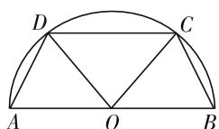
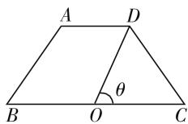
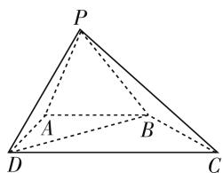

# 高中数学新课程、新教材、新高考、新教学访谈

● 华南师范大学数学科学学院 何小亚  
● 广东广播电视台袁媛

2012年11月，习近平主席提出具有全球视野的普世价值观——社会主义核心价值观：富强、民主、文明、和谐，自由、平等、公正、法治，爱国、敬业、诚信、友善。教育部于2013年委托北京师范大学和华南师范大学等五所高校研究学生发展的核心素养，最终于2016年9月13日正式发布了《中国学生发展核心素养》总体框架。[1]2017年9月24日，国务院针对文化软实力发展的需要和第八次课程改革存在的问题，颁布了《关于深化教育体制机制改革的意见》的中央文件。2018年1月16日教育部公布了《普通高中数学课程标准(2017年版)》，由此掀起了以核心素养为标志的第九次课程改革。为了让大众更好地了解、理解高中数学新课程、新教材、新高考、新教学的变化，华南师范大学的何小亚教授（回答者）接受了广东广播电视台记者、“袁媛工作室”主持人袁媛（提问者）的采访。

问题 1: 高中数学新课程标准的颁布带来了一系列的创新与突破, 其中特别注重对学生数学学科核心素养的培养, 那么, 高中数学核心素养的含义是什么? 它的内涵、表现、内容又是怎样的?

答:2013年笔者有幸参加了教育部重大委托项目《我国基础教育和高等教育阶段学生核心素养总体框架研究》.通过研究英国、美国等十个发达国家、三个先进组织(UNESCO、OECD、EU)和两个发达地区的“学生发展的核心素养”框架,我们得出学科核心素养(Key competencies)就是学科的一些关键能力.数学核心素养就是一些关键的数学能力.高中数学新课标指出,数学核心素养包括“数学抽象、逻辑推理、数学建模、运算能力、直观想象、数据分析”——简称“六核”.需要提醒大家的是,“六核”只是一些高中数学宏观的关键能力,它们不是操作性定义,不能直接套用作为中小学一节数学课的教学设计的框架,备课时仅作宏观参考.具体的操作性框架需要作进一步的研究.例如,数学抽象的操作性定义为:“在真实世界中利用理想化和数学表示提出数学问题、数学概念、数学原理，这个叫水平数学化（horizontal mathematization). 数学建模是一种很重要的水平数学化，可以将其单列出来讨论；二是在数学世界中提出更高级的数学问题、数学概念、数学原理，这个叫垂直数学化(vertical mathematization).”[2]

中小学数学课应该以体现数学素养三个层次的知识与技能、过程与方法、情感态度价值观这一框架的操作性定义进行教学设计，具体的内容请参考我主编的国家级本科教材《中学数学教学设计（第三版）》(科学出版社，2020年7月)第一章的内容. $^{[3]}$

问题 2: 新高中数学课程明确了教学理念是“实现人人都能获得良好的数学教育, 不同的人在数学上得到不同的发展”. 对此, 新课程如何体现数学学科的层次性? 对学习程度各异的学生分别有什么影响?

答:为了实现这一因材施教理念,数学新课程按照必修课程、选择性必修课程和选修课程设置.为高中毕业直接进入社会工作或者进入高职院校的学生,为参加不同类型学校的高考学生,为不同能力和兴趣的学生提供适合他们后续发展的课程.

问题 3: 新教材分成了必修、选择性必修、选修三大部分, 这三部分分别有什么新的侧重点? 结构设置有什么新亮点?

答:必修课是高中毕业的学业水平考试的内容要求,也是高考的基本内容要求.如果不参加高考的学生,可以只学此部分内容.

选择性必修课是供学生选择的课程,也是高考的内容要求.需要进入高等学校学习的学生,必须选择的学习内容.

选修课的目的是发现数学兴趣,发挥数学才能,明确奋斗目标,为各个高校招生提供选择依据.此部分内容不是全国统一高考的命题范围.

在内容设置上的新亮点：

1. 精简了一些必修和选修内容.  
2. 加强了数学应用的内容: 数学探究、数学建模

和数学文化.

3. 选修课程是各个中学自己选择开设的课程,供学生选择学习. 分为五类: A 是数理类, B 是经济、社会、化学、生物、机械类, C 是人文类, D 是体育、艺术类, E 是拓展、生活、地方课程, 大学数学的先修课程.

问题 4: 与旧教材相比, 新教材是否精简了内容, 学生和家长们都很关心, 少了哪部分内容? 考查的知识少了, 高考数学是不是更简单了? 学生的学习应该怎样调整?

答:数学新教材已被精简,加强了数学探究、数学建模、数学文化、数学应用的内容.删掉了过去必修3中的“算法初步”;必修5中的解三角形、不等式的大部分内容;选修2-2中的推理与证明;选修4-1几何证明选讲;选修4-4坐标系与参数方程;选修4-5不等式选讲.考查的知识点确实减少了,但高考的功能没有本质性的改变.各个地市的教研机构、学校的数学科组会按照数学新高考的变化作出相应的调整,家长不必为此担心.

问题 5: 新课标指出, 要提高数学教学的效率, 就要注重信息技术与数学课程的整合. 对于一线教师来说, 需要如何适应? 数学课怎样教才更高效?

答:无论什么时代,数学和数学教学的本质是核心,信息技术都是处于为二者服务的配角.要提高数学教学水平,数学教师首先要解决的问题是:数学和数学教学的本质是什么?数学教学还存在什么问题?数学教学的未来,路在何方?科学的数学教学设计标准是什么?这些学科的核心问题解决后,再来考虑信息技术在良好的数学概念图式、原理图式、认知策略图式的建构,以及数学探究、数学发现、数学问题解决等方面的融合问题,不能本末倒置地为技术而技术.那种查查什么、什么题库,看看题目答案的学习,是无法真正提高数学素养的!

关于数学及其教学的本质,可以参考我应人民日报海外版“科技名家笔谈”栏目的约稿《数学:大道至简,驾驭无穷》 $^{[4]}$ 以及《数学学与教的心理学》 $^{[5]}$ 一书的内容.

问题 6: 关于学习评价, 既要关注知识技能的习得, 更要关注数学核心素养的养成. 对此考试应该怎么考? 教材与考纲之间有什么变化关系?

答:未来的新课程标准下的高考,数学卷不再分文科卷和理科卷,而是文理合卷;也不再发布高考大纲,而是根据2020年1月6日教育部考试中心发布的《中国高考评价体系》、《中国高考评价体系说明》、课标和教材,按照“一核四层四翼”的新模式进行设计.一核就是立德树人、服务选拔、导向教学;四层就是必备知识、关键能力、学科素养、核心价值;四翼就是基础性、综合性、应用性、创新性.

与国际接轨的新中考、新高考必定以创新意识、问题解决为价值取向，避免机械记忆、专题模仿、套题训练，考查双基问题的求解，考查学生的数学探究、数学发现、创新意识和数学问题解决能力.

问题 7: 课标历来是课程改革的风向标, 从小学、初中再到高中, 数学教育、教学应该如何系统、合理地应对?

答:在“国家”这一政体没有消失之前,教育必然是为国家、为人民服务的.因此,课程改革必须不断适应国家和人民的需要.但与其余的学科相比,数学在历来的课程改革中变化是最小的,这就是教数学的幸福,因为数学是永恒的.请大家想一想,谁还记得毕达哥拉斯时代的国王、王后、律师、医生,他们早已灰飞烟灭,但毕达哥拉斯定理,也就是勾股定理,依然光芒万丈!

当然,为了适应以核心素养为标志的第九次课改,中小学的数学课程和教学必须体现四大理念,即:

育人理念:以人为本,提升素养,立德树人;

内容理念:以质为本,加强联系,精选内容;

教学理念:激发兴趣,启发思考,改进教学;

评价理念:聚焦素养,多元评价,促进发展.

在此,我呼吁广大的中小学师生们要达成共识:

(1) 数学是玩概念的,一定要深刻理解各个数学概念内涵的确定性和概括性以及外延的无限性,明确数学概念的三大作用:一是以概念的定义为标准判断一个对象是否是概念,解决对象的归属问题;二是对上位概念重新分类;三是化繁为简;  
(2) 理解数学定理、性质、公式和法则这些数学原理的变与不变,尤其是其威力无比的概括性,即:以一个有限的模式驾驭无穷的具体;  
(3) 提高阅读理解水平, 注重数学应用意识的养成;   
(4) 学会合情推理, 提高数学探究和问题解决能力.

最终学会:用数学眼光观察世界! 用数学思维思考世界,用数学语言描述世界!

问题 8:那么,什么是数学眼光?

答:数学眼光,就是观察数学世界和真实世界的一种意识,是在思考问题时数学方面的自觉意识、关注和习惯.它包括:数学视角下精确的眼光、严谨的眼光、简洁的眼光；概括的眼光、统一的眼光；数学化视角下理想化的眼光(将实体简化假设为几何模式或代数模式)、共性化的眼光(对共同属性的敏感和发现)；意识视角下的数学眼光：数的意识、符号的意识、空间观念、数据分析的意识，数学应用的意识. $^{[6]}$

问题 9:作为数学高考命题专家,文理合卷的数学新高考的命题有什么新的变化?

2021年2月2日，教育部在《关于做好2021年普通高校招生工作的通知》文件中指出：“要优化情境设计，增强试题开放性、灵活性，充分发挥高考命题的育人功能和积极导向作用，引导减少死记硬背和“机械刷题”现象。”文献[7]提供了2021高考命题六大要求和十项原则.

原则 1: “方向明确, 立意鲜明, 情景新颖, 贴近实际.”

我的理解:用贴近实际的新颖情境来包装考查内容.比如:

例 1 五声音阶是中国古乐的基本音阶, 故有成语“五音不全”, 中国古乐中的五声音阶依次为: 宫、商、角、徵、羽. 若从这五个音阶中任取两个音阶, 排成一个两个音阶的音序, 则这个音序中宫和羽至少有一个的概率为( ).

A. $\frac{1}{2}$

B. $\frac{7}{10}$

C. $\frac{9}{20}$

D. $\frac{11}{20}$

原则 2: “考查基础, 变换情景, 设问科学, 注重创新.”

我的理解:变换情景、设问考查基础知识和基本技能.比如:

例 2 如图 1, 有一生态农庄的平面图是一个圆心为点 O, 直径 AB 长为 2km 的半圆形, 其中, C, D 两点在半圆弧上满足 AD = BC. 现要铺设一条由线段 AB, BC, CD 和 DA 组

  
图1

成的观光通道 l. 如果此通道的建设成本是 k 元 / 米,那么需要准备的资金最多是 \_\_\_\_ 元.

原则 3: “入易出难, 路多口小, 层层设卡, 步步有难.”

“高考为了保证选拔功能,试题必须具有良好的区分度.较难的题目,考生一般入题较易,之后会发现解题的方法很多、路子很宽,但越走越窄,越来越难.试题层层设卡、环环相扣,每一问都要拦住一批考生,只有最优秀的才能走到底.”

我的理解:在多选题和解答题中落实,使考生容易上手,多种选择,三问设置.比如,

例 3 设函数 $f(x)=\frac{1+\sin2x}{1-2\sin^{2}x}$ ，则（）.

A. 函数 $f(x)$ 是周期为 $\pi$ 的函数  
B. 函数 $y=f\left(x-\frac{\pi}{4}\right)$ 为奇函数  
C. 函数 $f(x)$ 在区间 $\left(-\frac{3\pi}{4}, \frac{\pi}{4}\right)$ 上单调递增  
D. 函数 $f(x)$ 的零点为 $x = k\pi - \frac{\pi}{4}, k \in \mathbf{Z}$

例 4 如图 2, 等腰梯形 ABCD 中, $AD \parallel BC$ , AB = CD, BC 中点为 O, 连接 DO. 已知 DO = 2, BC = 2a (a > 0), 设 $\angle DOC = \theta$ , $\theta \in \left(0, \frac{\pi}{2}\right)$ , 梯形 ABCD 的面积为 $f(\theta)$ .

  
图2

(1) 求函数 $y = f(\theta)$ 的表达式；  
(2) 当 a=2 时, 求 $y=f(\theta)$ 的极值;  
(3) 若 $f(\theta) > 2\theta$ 对定义域内的一切 $\theta$ 都成立, 求 a 的取值范围.

原则 4: “材料在外, 答案在内, 考查思维, 体现能力.”

“高考命题不留教材版本痕迹,陌生甚至前沿的背景材料都是教科书里没有的,但考点知识都是课标要求内容.考生在考场上看题时间少,做题时间少,想题时间多,“想”就是思维,高考试题就是考查学生的思维品质、思维程序和思维方法,进而体现考生的关键能力和学科素养.”

我的理解:用基础知识解决新材料内容,少看多思,少做多思.例如,下面这道题很难画图思考,只能凭借想象力和数学定义来完成.

例 5 已知动圆 P 过点 $A(-\sqrt{2},0)$ 且与圆 $(x-\sqrt{2})^{2}+y^{2}=12$ 相内切. 求：

(1) 动圆的圆心 P 的轨迹 C 的方程.  
(2) 直线 l 过原点, 且与轨迹 C 有两个交点 M, N. 轨迹 C 上是否存在一点 Q, 使 $\triangle QMN$ 为正三角形, 若存在, 求出 Q 的坐标, 若不存在, 说明理由.

原则 5: “体现国情, 公平公正, 以生考熟, 直击软肋.”

“命题者在编制每一道试题时都要考虑我国的地域及民族等因素,努力做到对每一位考生都公平.所谓‘以生考熟’，就是用陌生的问题情境考查熟悉的知识，大家都没见过、没做过，老师也没讲过，这类问题能考查学生的能力，是考生的群体性‘软肋’。”

我的理解: 这就是我一直写文章(参见[8][9][10]) 倡导的问题解决(problem solving). 应试刷题, 只教会学生重复一个解题反应, 没有教会学生独立去创造一个反应——问题解决! 真正的问题(Problem) 是老师没讲过, 自己也没有练过, 没有现成模式和算法可直接套的问题. 比如下面的试题:

例6 已知曲线 $C$ 的方程为 $F(x, y) = 0$ ，集合 $T = \{(x, y) \mid F(x, y) = 0\}$ ，若对于任意的 $(x_1, y_1) \in T$ ，都存在 $(x_2, y_2) \in T$ ，使得 $x_1x_2 + y_1y_2 = 0$ 成立，则称曲线 $C$ 为 $\sum$ 曲线，下列方程所表示的曲线中，是 $\sum$ 曲线的是（ ）.

A. $|x| - |y| = 1$   
B. $y = e^{x} - 2$   
C. $y=\log_{2}x$   
D. $(2x-y+1)(|x-1|+|y-2|)=0$

原则 6: “起点很高, 高屋建瓴; 落点较低, 回归高考评价体系.”

我的理解: 此条原则的解释没有提到数学. 下面的例 7 就是很好体现此原则的一道真正创新的问题 (problem).

例 7 如果曲线 $\left|x\right|-\left|y\right|\leqslant1$ 与曲线 $\left|y\right|\leqslant1$ 所围成的平面区域的面积的三倍是 18，那么曲线 $\left|x-1\right|-\left|y+1\right|\leqslant1$ 与曲线 $\left|y+1\right|\leqslant1$ 所围成的平面区域的面积是 \_\_\_\_.

原则 7: “重点必考, 主干多考, 次点轮考, 补点选考.”

补点选考指的是补充说明的考点要选择性地考.

原则 8: “共性好考, 个性难考, 试题开放, 探究创新.”

我的理解:通过存在性问题和开放性问题(结构不良问题)的考查来实现.比如下面的两道试题:

$$
\begin{array}{l} \begin{array}{r l} & \text {   例   } 8 \quad \text {   如图   } 3, \text {   四棱锥   } P - \\ & A B C D \text {   中,   } A B \parallel D C, \angle A D C \\ & = \frac {\pi}{2}, A B = A D = \frac {1}{2} C D = 2, \end{array} \\ P D = P B = \sqrt {6}, P D \perp B C. \\ \end{array}
$$

(1) 求证: 平面 $PBD \perp$ 平面 PBC.

text_image

P
A
B
D
C

图3

(2) 在线段 PC 上是否存在点 M, 使得平面 ABM 与平面 PBD 所成锐二面角为 $\frac{\pi}{3}$ ? 若存在, 求 $\frac{CM}{CP}$ 的值; 若不存在, 说明理由.

例 9 在锐角三角形 ABC 中, 角 A, B, C 所对的边分别为 a, b, c. (请从三个条件中任选一个, 并完成解答)

① $b\sin\left(A-\frac{5\pi}{2}\right)+2c\sin\left(\frac{\pi}{2}+A\right)-a\cos B=0;$   
② $\cos2A-\sqrt{3}\sin A+2=0;$   
③ $\frac{b}{a} = \frac{\sqrt{3}\sin B}{\cos A + 1}.$

(1) 求 $\angle A$ ;

(2) 在(1)中条件下, 若 a=6, 求 $\triangle ABC$ 周长的取值范围.

原则 9: “小口切入, 深入挖掘, 小中见大, 思维穿透.”

“试题往往从比较小的一点切入,要求考生能排除干扰,小中见大,透过表面现象,从本质上去认识问题、分析问题、解决问题.这实际上是对思维穿透力及深刻性的考查,试卷中除了基础题以外,其余的都需要较大的思维量去穿透表面,触及本质.”

我的理解:受应试刷题的影响,多数的中小学数学教学偏重于“一做什么,二做什么,三做什么”的认知技能算法,不注重数学概念的深刻理解,抓不住数学原理的概括性和联系统一,忽略了数学结构的整体性理解.和大学数学这一五彩缤纷的数学大花园相比,竞赛数学的内容不过是万花丛中花一枝,而且数学竞赛玩的是各种解法的灵活技巧以及你的熟悉程度.许多教授发现,不少竞赛获奖学生进大学后很不适应大学数学的学与教,因为中学数学和竞赛数学玩的是范围极其狭窄的具体的解题算法、技巧,而大学数学玩的是概念、原理和建立在一般算法之上的更具概括性和普适性的数学结构.要实现中国数学的“强国梦”,必须让我们的大学新生适应大学数学的学习.为此,在中学数学教学中渗透、揭示算法之上的数学结构思想是十分必要的.因此,要充分发挥高考的“指挥棒”作用:数学高考必须加强联系性、整体性、统一性的考查,理解新概念、新规则,洞察新结构,突出数学结构的考查.比如下面的三道试题:

例 10 请研究椭圆 $\frac{x^{2}}{9} + \frac{y^{2}}{4} = 1$ 的内接六边形的面积的取值范围.

例 11 设 $A(x_{1},y_{1}), B(x_{2},y_{2})$ 是平面直角坐标系 xOy 上的两点，现定义由点 A 到点 B 的一种折线距离为 $\rho(A,B)=|x_{2}-x_{1}|+|y_{2}-y_{1}|$ .

对于平面 $xOy$ 上给定的不同的两点 $A(x_{1},y_{1})$ ， $B(x_{2},y_{2})$

(1) 若点 $C(x,y)$ 是平面 xOy 上的点, 试证明: $\rho(A,C)+\rho(C,B)\geqslant\rho(A,B).$   
(2) 在平面 $xOy$ 上是否存在点 $C(x, y)$ , 同时满足 ① $\rho(A, C) + \rho(C, B) = \rho(A, B)$ ; ② $\rho(A, C) = \rho(C, B)$ . 若存在, 请求出所有符合条件的点; 若不存在, 请予以证明.

例 12 对于任意的两个实数对 $(a,b)$ 和 $(c,d)$ ，规定： $(a,b)=(c,d)$ ，当且仅当a=c,b=d；运算“⊗”为： $(a,b)\otimes(c,d)=(ac-bd,bc+ad)$ ；运算“⊕”为： $(a,b)\oplus(c,d)=(a+c,b+d)$ 。设 $p,q\in R$ ，若 $(1,2)\otimes(p,q)=(5,0)$ ，则 $(1,2)\oplus(p,q)=$ \_\_\_\_。

原则 10: “掌握理论, 学以致用, 学科价值, 重在应用.”

我的理解:加强数学应用,用数学解决问题.高考中常考常新的是应用所学的概率统计知识去分析问题、解决问题.例如,利用模型选择随机变量的概率、分布列的期望、方差、独立性检验,正态分布、二项分布、样本估计总体进行分析决策.

120 分钟的数学高考是很难考查完整的数学建模过程,也只能是考考部分理想化了的应用题.比如下面的试题:

例 13 2021 年 6 月 14 号是中国传统节日“端午节”. 妈妈为梓杰和梓萱煮了 10 个粽子, 其中有六个是肉蛋粽, 4 个是八宝棕. 梓萱不喜欢肉蛋粽, 她现在随机抽取三次, 每次抽一个, 而且每次抽取后不放回. 问第一次抽到肉蛋粽后, 第二次和第三次都抽到八宝粽的概率是 \_\_\_\_.

问题 10: 在数学新课程、新教材、新高考的背景之下, 我国的中小学数学教学要作出什么调整?

答:为了适应新的数学课程标准、新教材和新的数学高考,我国的中小学数学教学应该作出相应的调整,我把它称为“数学新教学”,也就是“数学素养教学”.数学素养教学是指追求数学素养达成的教学.数学素养是指满足学生自身发展和社会发展所必备的数学方面的品格和能力,是数学的知识、能力和情感态度价值观的综合体. $^{[11]}$ 数学素养的构成要素为:数学化、数学运算、数学推理、数学意识、数学思想、数学情感态度价值观 $^{[12]}$ . 数学素养的表现水平可以分成三个层次:

知识与技能:知道什么,理解什么,会做什么;

过程与方法: 数学的思想、眼光、能力(包括“六核”的操作性定义)、思维品质、问题解决和数学活动经验);

情感态度价值观:数学信念、数学兴趣、数学具体内容的喜好感受.

数学素养教学的课堂教学设计方法,可以参照文献[2]揭示的标准实施.

# 参考文献：

[1] 林崇德. 21世纪学生发展核心素养研究 [M]. 北京: 北京师范大学出版社, 2016.  
[2] 何小亚. 追求数学素养达成的教学设计标准与案例 [J]. 中学数学研究 (上半月), 2019(12).  
[3] 何小亚, 姚静. 中学数学教学设计(第三版)[M]. 北京: 科学出版社, 2020.  
[4] 何小亚. 数学: 大道至简, 驾驭无穷 [N]. 人民日报海外版, 2020-09-28(9).  
[5] 何小亚. 数学学与教的心理学(第二版)[M]. 广州: 华南理工大学出版社, 2016.  
[6] 何小亚. 什么是数学的眼光? [R]. 广州: 2020 年广州大学第十一届数学教育学术研讨会大会报告, 2020-11-15.  
[7] 吕游. 重磅！2021 高考命题要求和命题原则出炉 [EB/OL]. https://baijiahao.baidu.com/s?id=1694308252402209573&wfr=spider&for=pc. 2021-03-15 22:24 吉林日报官方账号.  
[8] 何小亚. 2016 年数学高考全国 I 卷的认知分析和备考及命题建议 [J]. 中学数学研究 (上), 2016(10).  
[9] 何小亚. 数学高考命题和应试刷题的密战 [J]. 中学数学研究 (上), 2018(7).  
[10] 何小亚. 也谈谈高考美女维纳斯 [J]. 中学数学月刊, 2019(11).  
[11] 何小亚. 学生数学素养指标的理论分析 [J]. 数学教育学报, 2015, 24(1).  
[12] 何小亚. 数学核心素养指标之反思 [J]. 中学数学研究 (上半月), 2016(7).  
[13] 中华人民共和国教育部制定. 普通高中数学课程标准(2017年版)[M]. 北京: 人民教育出版社, 2018. F