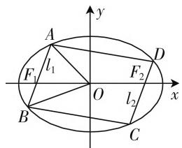

# “动”中求“静”，变中取“最”

—— 一道椭圆内接四边形面积题的探究

● 甘肃省民乐县第一中学 朵天举

圆锥曲线中的平面几何图形的面积的最值问题一直是高考数学的常见题型之一，也是备受命题者、老师与学生关注的焦点之一，难度中等偏上。此类问题通过点、直线、圆锥曲线的位置关系的变换来构造相应的三角形、四边形等平面几何图形，充分体现了解析几何中“动”与“静”的合理转化与完美统一，可以很好地考查学生的数学知识、数学方法和数学能力。

# 一、问题呈现

问题 （2020 届河南省高三适应性测试(4 月份)数学(理)试题·16) 如图 1, $F_{1}$ , $F_{2}$ 是椭圆 $E: \frac{x^{2}}{4} + y^{2} = 1$ 的两个焦点，过 $F_{1}$ 的直线 $l_{1}$ 与椭圆 $E$ 交于 $A, B$ 两点，过 $F_{2}$ 与 $l_{1}$ 平行的直线 $l_{2}$ 与椭圆E交于C，D两点（点A，D在x轴上方），则四边形ABCD面积的最大值为\_\_\_\_。

此题以椭圆为问题背景，借助两平行直线的位置关系的“动”态思维来确定“静”态情况下四边形 ABCD 面积的最大值问题. 合理沟通 “动” 态思维与 “静” 态思维的转化, 定值思维与最值思维的应用, 合理转化, 多思维多角度破解, 利用弦长公式、点到直线的距离公式、三角函数、基本不等式、函数与方程思想等知识来进行求解与突破.

text_image

y
A
l₁
F₁
O
l₂
x
B
C
D
F₂

图 1

# 二、问题破解

解法 1: (弦长公式法) 由题可知 $a = 2, b = 1, c = \sqrt{3}$ , 则 $F_{1}(-\sqrt{3}, 0), F_{2}(\sqrt{3}, 0)$ , 结合椭圆的对称性可知四边形 $ABCD$ 为平行四边形, 则 $S_{\square ABCD} = 4S_{\triangle OAB}$ , 设直线 $AB$ 的方程为 $x = my - \sqrt{3}, A(x_{1}, y_{1}), B(x_{2}, y_{2})$ , 联立 $\left\{\begin{aligned} x &= my - \sqrt{3}, \\ \frac{x^{2}}{4} + y^{2} &= 1, \end{aligned}\right.$ 整理可得 $(m^{2} + 4)y^{2} -$

$2\sqrt{3}my - 1 = 0$ ，则有 $y_{1} + y_{2} = \frac{2\sqrt{3}m}{m^{2} + 4}, y_{1}y_{2} = -\frac{1}{m^{2} + 4}$ ，由弦长公式可得 $|AB| = \sqrt{m^{2} + 1} \cdot |y_{1} - y_{2}| = \sqrt{m^{2} + 1} \cdot \sqrt{(y_{1} + y_{2})^{2} - 4y_{1}y_{2}} = \frac{4(m^{2} + 1)}{m^{2} + 4}.$

而坐标原点 $O$ 到直线 $AB$ 的距离为 $d = \frac{\sqrt{3}}{\sqrt{m^2 + 1}}$ ，所以 $S_{\square ABCD} = |AB| \times 2d = \frac{8\sqrt{3}\sqrt{m^2 + 1}}{m^2 + 4}$

$$
\begin{array}{l} = 8 \sqrt {3} \cdot \sqrt {\frac {m ^ {2} + 1}{(m ^ {2} + 1 + 3) ^ {2}}} \\ = 8 \sqrt {3} \cdot \sqrt {\frac {1}{(m ^ {2} + 1) + 6 + \frac {9}{m ^ {2} + 1}}} \\ \leqslant 8 \sqrt {3} \cdot \sqrt {\frac {1}{2 \sqrt {(m ^ {2} + 1) \times \frac {9}{m ^ {2} + 1}} + 6}} \\ = 8 \sqrt {3} \cdot \frac {1}{2 \sqrt {3}} = 4, \\ \end{array}
$$

当且仅当 $m^2 + 1 = \frac{9}{m^2 + 1}$ , 即 $m = \pm \sqrt{2}$ 时等号成立, 所以四边形ABCD面积的最大值为4.

故填答案:4.

点评:根据椭圆的对称性确定四边形 ABCD 为平行四边形,通过直线 AB 的方程的设置与椭圆方程的联立,结合函数与方程思维,通过韦达定理的应用,以及弦长公式、点到直线的距离公式的应用,结合平行四边形的面积的转化与确定,结合代数式的变形与基本不等式的应用,得以确定四边形 ABCD 面积的最大值.

解法2：（三角形面积转化法）由题可知 $a = 2, b = 1, c = \sqrt{3}$ ，则 $F_{1}(-\sqrt{3},0), F_{2}(\sqrt{3},0)$ ，结合椭圆的对称性可知四边形ABCD为平行四边形，则 $S_{\square ABCD} =$

$4S_{\triangle OAB}$ ，设直线AB的方程为 $x=my-\sqrt{3}$ ， $A(x_{1},y_{1})$ ，$B(x_{2},y_{2})$ ，联立 $\left\{\begin{aligned}x&=my-\sqrt{3},\\ \frac{x^{2}}{4}+y^{2}&=1,\end{aligned}\right.$ 整理可得 $(m^{2}+4)y^{2}$

$-2\sqrt{3}my-1=0$ ，则有 $y_{1}+y_{2}=\frac{2\sqrt{3}m}{m^{2}+4},y_{1}y_{2}=$

$$
- \frac {1}{m ^ {2} + 4}, \text {而} S _ {\triangle O A B} = S _ {\triangle O F _ {1} A} + S _ {\triangle O F _ {1} B} = \frac {1}{2} | O F _ {1} | \cdot
$$

$$
\mid y _ {1} - y _ {2} \mid = \frac {\sqrt {3}}{2} \mid y _ {1} - y _ {2} \mid = \frac {\sqrt {3}}{2} \sqrt {(y _ {1} + y _ {2}) ^ {2} - 4 y _ {1} y _ {2}}
$$

$$
= \frac {2 \sqrt {3} \sqrt {m ^ {2} + 1}}{m ^ {2} + 4}, \text {令} m ^ {2} + 1 = t \geqslant 1, \text {则} S _ {\triangle O A B} = \frac {2 \sqrt {3} \sqrt {t}}{t + 3}
$$

$$
= \frac {2 \sqrt {3}}{\sqrt {t} + \frac {3}{\sqrt {t}}} \leqslant \frac {2 \sqrt {3}}{2 \sqrt {\sqrt {t} \times \frac {3}{\sqrt {t}}}} = 1, \text {当且仅当} \sqrt {t} = \frac {3}{\sqrt {t}}, \text {即} t =
$$

3时等号成立，所以 $S_{\square ABCD} = 4S_{\triangle OAB}\leqslant 4$ ，即四边形ABCD面积的最大值为4.

故填答案:4.

点评:根据椭圆的对称性确定四边形 ABCD 为平行四边形,通过直线 AB 的方程的设置与椭圆方程的联立,结合函数与方程思维,通过韦达定理的应用,以及三角形面积的应用加以转化,引入对应的参数,结合代数式的变形与基本不等式的应用,得以确定四边形 ABCD 面积的最大值.

# 三、变式拓展

探究 1: 把以上问题一般化, 在一般性条件下, 四边形 ABCD 面积的最大值又是怎样的? 可得到以下两个对应的结论.

结论1: 设 $F_{1}, F_{2}$ 是椭圆 $E: \frac{x^{2}}{a^{2}} + \frac{y^{2}}{b^{2}} = 1 (a \geqslant \sqrt{2} b > 0)$ 的左焦点和右焦点，过 $F_{1}$ 的直线 $l_{1}$ 与椭圆 E 交于 A, B 两点，过 $F_{2}$ 与 $l_{1}$ 平行的直线 $l_{2}$ 与椭圆 E 交于 C, D 两点（点 A, D 在 x 轴上方），则四边形 ABCD 面积的最大值为 2ab.

证明:结合椭圆的对称性可知四边形ABCD为平行四边形,设直线AB的倾斜角为 $\alpha,\alpha\in(0,\pi)$ ,结合椭圆的焦半径公式可得 $|AB|=\frac{2ab^{2}}{a^{2}-c^{2}\cos^{2}\alpha}$ ,所以

$$
S _ {\square A B C D} = 2 c \mid A B \mid \sin \alpha = \frac {4 a c b ^ {2} \sin \alpha}{a ^ {2} - c ^ {2} \cos^ {2} \alpha} = \frac {4 a c b ^ {2} \sin \alpha}{b ^ {2} + c ^ {2} \sin^ {2} \alpha} =
$$

$$
\frac {4 a c b ^ {2}}{\frac {b ^ {2}}{\sin \alpha} + c ^ {2} \sin \alpha} \leqslant \frac {4 a c b ^ {2}}{2 \sqrt {\frac {b ^ {2}}{\sin \alpha} \times c ^ {2} \sin \alpha}} = 2 a b, \text {当且仅当}
$$

$\frac{b^{2}}{\sin\alpha}=c^{2}\sin\alpha$ ，即 $\sin\alpha=\frac{b}{c}$ 时等号成立，所以四边形 ABCD 面积的最大值为 2ab.

点评:在利用基本不等式确定最值问题时,要注意等号成立的条件.这也是该结论中对椭圆方程的限制条件.进而深入探究,当条件为 $\sqrt{2}b>a>b>0$ 时,四边形ABCD面积的最大值又是如何确定呢?

结论2:设 $F_{1},F_{2}$ 是椭圆 $E:\frac{x^{2}}{a^{2}}+\frac{y^{2}}{b^{2}}=1(\sqrt{2}b>a>b>0)$ 的左焦点和右焦点,过 $F_{1}$ 的直线 $l_{1}$ 与椭圆E交于A,B两点,过 $F_{2}$ 与 $l_{1}$ 平行的直线 $l_{2}$ 与椭圆E交于C,D两点(点A,D在x轴上方),则四边形ABCD面积的最大值为 $\frac{4cb^{2}}{a}$ .

证明:结合椭圆的对称性可知四边形 ABCD 为平行四边形,设直线 AB 的倾斜角为 $\alpha, \alpha \in (0, \pi)$ , 结合椭圆的焦半径公式可得 $|AB| = \frac{2ab^{2}}{a^{2} - c^{2}\cos^{2}\alpha}$ , 所以

$$
S _ {\square A B C D} = 2 c \mid A B \mid \sin \alpha = \frac {4 a c b ^ {2} \sin \alpha}{a ^ {2} - c ^ {2} \cos^ {2} \alpha} = \frac {4 a c b ^ {2} \sin \alpha}{b ^ {2} + c ^ {2} \sin^ {2} \alpha} =
$$

$\frac{4acb^2}{\frac{b^2}{\sin\alpha} + c^2\sin\alpha}\leqslant \frac{4acb^2}{b^2 + c^2} = \frac{4cb^2}{a}$ 当且仅当 $\sin \alpha = 1$ 时等号成立,所以四边形 ABCD 面积的最大值为 $\frac{4cb^{2}}{a}$ .

探究 2: 由结论 2 进一步深入探究, 在双曲线问题中是否也有类似的四边形 ABCD 面积的最值问题呢? 可得到以下一个对应的结论.

结论3: 设 $F_{1}, F_{2}$ 是双曲线 $E: \frac{x^{2}}{a^{2}} - \frac{y^{2}}{b^{2}} = 1 (a > 0, b > 0)$ 的左焦点和右焦点，过 $F_{1}$ 的直线 $l_{1}$ 与双曲线 E 交于 A, B 两点，过 $F_{2}$ 与 $l_{1}$ 平行的直线 $l_{2}$ 与双曲线 E 交于 C, D 两点（点 A, D 在 x 轴上方），则四边形 ABCD 面积的最大值为 $\frac{4cb^{2}}{a}$ .

结论 3 的证明过程可结合以上问题的破解过程,通过求导法来判断四边形 ABCD 面积的最值问题.

涉及圆锥曲线中的平面几何图形的面积的最值问题, 是数学知识的有机综合与交汇的一个好场所, 其背景生动, 内容丰富, 综合性较强, 因而趣味性也较强, 充分将相关知识有效地融为一体, 要求有较强的综合能力与应变能力, 充分考查数学能力, 提升发展思维与数学品质, 培养数学运算、逻辑推理等数学核心素养. F