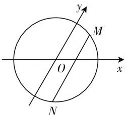

# “勇敢”诚可贵 “机智”价更高

——漫谈如何解高考解析几何解答题

● 安徽省望江中学 石丙新

在高考命题中,解析几何解答题一般位于压轴题的位置,主要考查考生的逻辑推理能力与代数运算能力,解答此类题,犹如大海航船,“舵”好比解题方法,“动力”好比运算能力.有了“舵”,没有动力,“船”依然不能向前;没有“舵”,看不清航向,也容易“翻船”.解析几何解答题离不开运算,害怕运算的“怯懦者”犹如船没有动力,无法“征服”这道题,因此,面对这类题,考生要做勇敢者.但“有勇无谋”同样难逃失败的厄运,因为有些试题思路想起来很顺,但做起来却很繁,繁得叫人难以做下去,结果无功而返.因此,我们说,做解析几何解答题“‘勇敢’诚可贵,‘机智’价更高”.

# 一、勇做新题“弄潮儿”

考点岁岁相似,考题却年年“变脸”,稳中有“变”,“变”中求“新”,已成为当今高考命题的重要思路.知识和能力并举的新颖综合题理所当然成为高考命题的一大特点.所谓试题新颖,归根到底是试题背景的新颖问题,设计这类问题的目的是考查考生在给定的陌生背景下能否用数学语言提出、分析和解决问题,能否从给定的信息中获取相应的数学知识并能运用它解决新问题.考生面对这类问题既要“勇敢”,又要冷静,沉着思考,勇敢答题.

例 1 如图 1, 平面斜坐标系中, $\angle xOy = 60^{\circ}$ , 平面上一点 P 关于斜坐标系的坐标是这样定义的: 过点 P 作两坐标轴的平行线交 Ox 于点 A, 交 Oy 于点 B, 则点 A 在 Ox 上的表示数为 x，点 B 在 Oy 上的表示数为 y.

text_image

y
M
O
x
N

图1

(1) 求以 O 为圆心, 1 为半径的圆在斜坐标系 xOy 中的方程.  
(2) 在斜坐标系中, 求直线 $x=\frac{1}{2}$ 截 (1) 中的圆所得弦长.  
(3) 在斜坐标系中, 求直线 $x = t (0 < t < 1)$ 交 (2)

中的圆于 M, N 两点, 试问: 当 t 为何值时, $\triangle MON$ 的面积取得最大值? 并求最大值.

解析:(1) 假设 Ox 方向上的单位向量为 i, Oy 方向上的单位向量为 j, 圆上动点 $P(x, y)$ , 则 $\overrightarrow{OP} = x\mathbf{i} + y\mathbf{j}$ . 因为 $|\overrightarrow{OP}| = 1$ , 从而有 $|x\mathbf{i} + y\mathbf{j}| = 1$ , 即 $(x\mathbf{i} + y\mathbf{j})^2 = 1$ , 展开有 $x^2 + 2xy\mathbf{i}\mathbf{j} + y^2 = 1$ , 进一步化简有 $x^2 + xy + y^2 = 1$ . 故以 O 为圆心的单位圆, 在斜坐标系 XOy 中的方程是 $x^2 + xy + y^2 = 1$ .

(2) 设直线 $x = \frac{1}{2}$ 与圆 $x^{2} + xy + y^{2} = 1$ 的两个交点为 $M\left(\frac{1}{2}, y_{1}\right), N\left(\frac{1}{2}, y_{2}\right)$ ，在方程 $x^{2} + xy + y^{2} = 1$ 中，令 $x = \frac{1}{2}$ ，得 $y^{2} + \frac{1}{2} y + \frac{3}{4} = 0$ ， $|MN| = |y_{1} - y_{2}| = \sqrt{\left(\frac{1}{2}\right)^{2} - 4 \times \left(-\frac{3}{4}\right)} = \frac{\sqrt{13}}{2}$ .  
(3) $S_{\triangle MON}=\frac{1}{2}t\times|MN|$ ，由(2)可知 $|MN|=|y_{1}-y_{2}|$ ，其中 $y_{1},y_{2}$ 为方程 $y^{2}+ty+t^{2}-1=0$ 的两根。故 $S_{\triangle MON}=\frac{1}{2}t\times\sqrt{4-3t^{2}}=\frac{1}{2}\sqrt{-3t^{4}+4t^{2}}=\frac{1}{2}\sqrt{-3\left(t^{2}-\frac{2}{3}\right)^{2}+\frac{4}{3}}$ ，当且仅当 $t=\frac{\sqrt{6}}{3}$ 时， $S_{\triangle MON}$ 有最大值为 $\frac{\sqrt{3}}{3}$ 。

点评:斜坐标系是高等数学的内容,但在高中数学的学习中,学生已学习了平面向量基本定理,这为我们理解斜坐标系奠定了基础.题设中的斜坐标系的定义其本质就是平面向量的基本定理.一方面,问题(1)(2)(3)都是需要在新的坐标系中解决;另一方面,弦长问题、面积问题也是平面直角坐标系中常见的问题,我们把平面直角坐标系中对弦长问题、面积问题的解决办法迁移到斜坐标系,从而使问题获得解决.

# 二、数学思想做“向导”

学习数学归根到底是学习数学的思想方法,掌握了基本的思想方法, 我们解起数学题来就会有章可循, 有“法”可依。“迎战”解析几何解答题的数学思想有数形结合思想、函数思想、不等式思想等, 用数学思想解题, 是“智者”的选择!

例 2 已知椭圆 $C: x^{2} + 2y^{2} = 8$ 和点 $P(4,1)$ ，过点 P 作直线交椭圆于 A, B 两点，在线段 AB 上取点 Q，使得 $\frac{AP}{PB} = -\frac{AQ}{QB}$ ，求动点 Q 的轨迹所在曲线的方程及点 Q 的横坐标的取值范围.

分析:本题属于轨迹问题,题目中出现多个动点,对此有些考生觉得无从下手.其实,我们应该想到轨迹问题的基本解法之一:参数法.首先选定参数,然后设法将点Q的坐标用参数来表示,最后消去参数就可得到所求轨迹方程.

解析：设 $A(x_{1},y_{1}),B(x_{2},y_{2}),Q(x,y)$ ，则由 $\frac{AP}{PB} = -\frac{AQ}{QB}$ ，可得 $\frac{4 - x_1}{x_2 - 4} = \frac{x - x_1}{x_2 - x}$ ，解得 $x =$ $\frac{4(x_1 + x_2) - 2x_1x_2}{8 - (x_1 + x_2)}.$ ①

设直线 AB 的方程为 $y=k(x-4)+1$ ，代入椭圆 C 的方程，消去 y 得出关于 x 的一元二次方程 $(2k^{2}+1)x^{2}+4k(1-4k)x+2(1-4k)^{2}-8=0.$ ②

所以 $\left\{ \begin{array}{l} x_{1} + x_{2} = \frac{4k(4k - 1)}{2k^{2} + 1}, \\ x_{1}x_{2} = \frac{2(1 - 4k)^{2} - 8}{2k^{2} + 1}. \end{array} \right.$

代入 ① 式, 化简得 $x = \frac{4k + 3}{k + 2}$ . ③

与 $y=k(x-4)+1$ 联立，消去 k 得 $(2x+y-4)(x-4)=0$ .

在 ② 式中, 由 $\Delta = -64k^2 + 64k + 24 > 0$ , 解得 $\frac{2 - \sqrt{10}}{4} < k < \frac{2 + \sqrt{10}}{4}$ , 结合 ③ 式可求得 $\frac{16 - 2\sqrt{10}}{9} < x < \frac{16 + 2\sqrt{10}}{9}$ .

故知点 Q 的轨迹方程为 $2x + y - 4 = 0$ , $\left(\frac{16-2\sqrt{10}}{9}<x<\frac{16+2\sqrt{10}}{9}\right)$ .

点评:在解方程组时通过消元会生成一个一元二次方程,于是想到利用它的判别式和根与系数的关系式(韦达定理).而解答此题的难点在于如何“引参”,焦点在于如何“用参”,重点在于如何“消参”,而“先引参、再用参、最后消参”的三步曲,正是求解某些解析几何综合问题的一条“绿色通道”.

# 三、智勇双全显身手

在解析几何中,如果解题方法选择不当,常常会导致无法“将计算进行到底”.“有思路,更有策略”,或许这是对高考解析几何题的最好“注解”.设而不求是解析几何求解中的常用方法,圆锥曲线问题往往涉及多个变量,一般可采用设而不求的解题策略.何谓“设而不求”?即是指我们无法求出给定的变量的值,而我们考虑的又是这些变量的整体,通过代数的手段,我们可以绕过给定变量具体的值能直接得到整体的大小或具体的形式,这是高中数学中的等价转化思想(或整体思想).圆锥曲线中的韦达定理和设点消点都是等价转化过程中的代数手段,通过对有关点的坐标采用设而不求的策略,能促使问题定向,简便化归,起到以简驭繁的解题效果.

例3 已知双曲线 $C: x^2 - \frac{y^2}{3} = 1$ ，过点 $P(0,4)$ 的直线 $l$ ，交双曲线 $C$ 于 $A, B$ 两点，交 $x$ 轴于 $Q$ 点（ $Q$ 点与 $C$ 的顶点不重合）。当 $\overrightarrow{PQ} = \lambda_1\overrightarrow{QA} = \lambda_2\overrightarrow{QB}$ ，且 $\lambda_1 + \lambda_2 = -\frac{8}{3}$ 时，求 $Q$ 点的坐标。

解析：设 $Q(q,0)$ , $A(x_{1},y_{1})$ . 由 $\overrightarrow{PQ} = \lambda_{1}\overrightarrow{QA}$ 得 $\overrightarrow{PA}=-(1+\lambda_{1})\overrightarrow{AQ}$ ，则 $\left\{\begin{aligned}x_{1}&=\frac{(1+\lambda_{1})q}{\lambda_{1}},\\ y_{1}&=-\frac{4}{\lambda_{1}}.\end{aligned}\right.$ 代入双曲线 $C$ 的方程可得 $\frac{(1 + \lambda_1)^2q^2}{\lambda_1^2} -\frac{16}{3\lambda_1^2} = 1$ ，整理可以得到 $(3q^{2} - 3)\lambda_{1}^{2} + 6q^{2}\lambda_{1} - 16 = 0$ ，同理 $(3q^{2} - 3)\lambda_{2}^{2} + 6q^{2}\lambda_{2}$ $-16 = 0,\lambda_{1},\lambda_{2}$ 为 $(3q^{2} - 3)\lambda^{2} + 6q^{2}\lambda -16 = 0$ 的两个根.这样 $\lambda_1 + \lambda_2 = -\frac{6q^2}{3q^2 - 3} = -\frac{8}{3}$ ，解得 $q^{2} = 4$ ，即 $Q(\pm 2,0)$

点评:题设中给出了四个点之间的关系,当点Q确定之后,A,B也随之而确定,即用 $\lambda_{1},\lambda_{2}$ 和q可以表示A,B的坐标,代入曲线的方程,可以得到以 $\lambda_{1},\lambda_{2}$ 为根的一个方程,利用韦达定理就可以求出q的值.

本文最后值得一提的是，在高考试题中，往往“机关重重，陷阱多多”，解析几何解答题也是如此，例如，直线与圆锥曲线仅有一个公共点，并非指直线与圆锥曲线相切，这需要考生有睿智的目光，要善于观察，更要善于思考，不是“走马看花”，而是看透“本质”，要做识破“陷阱”真英雄。例如，数学问题的隐含条件往往是解题的关键和突破口，通常有些学生只满足于对题设条件的浅层次分析，不能深入挖掘题中的隐含条件，解题时就必然会出错。W