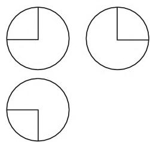
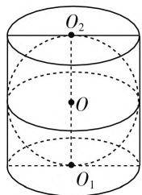
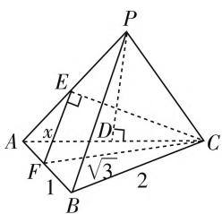

# “球”动高考,真题剖析

# ● 福建省漳州市第二中学 张妙安

球是最常见的一种几何体, 是历年高考命题中的热点问题之一. 涉及球的试题的考查形式多以选择题或填空题的形式出现, 且多与其他相关的简单几何体加以合理组合, 形成“切”、“接”、“补”等简单组合体. 下面通过近四年来全国高考中涉及“球”的试题的考点分析与研究, 并结合对应的考查特点的实例剖析, 总结规律, 以期对新一届的高考提供一点有参考价值的东西.

# 一、近四年来全国高考中涉及“球”的试题的考点分析

<table><tr><td>年份</td><td>卷型</td><td>题号</td><td>分值</td><td>涉及考点</td></tr><tr><td rowspan="3">2016年</td><td>全国I卷</td><td>理6文7</td><td>5</td><td>与球有关的三视图,球的体积与表面积</td></tr><tr><td>全国II卷</td><td>文4</td><td>5</td><td>正方体的外接球,球的表面积</td></tr><tr><td>全国III卷</td><td>理10文11</td><td>5</td><td>直三棱柱内的最大球,球的体积</td></tr><tr><td rowspan="5">2017年</td><td>全国I卷</td><td>文16</td><td>5</td><td>三棱锥的外接球,棱锥的体积,球的表面积</td></tr><tr><td>全国II卷</td><td>文15</td><td>5</td><td>长方体的外接球,球的表面积</td></tr><tr><td>全国III卷</td><td>理8文9</td><td>5</td><td>圆柱的外接球,圆柱的体积</td></tr><tr><td>江苏卷</td><td>6</td><td>5</td><td>圆柱的内切球,两者的体积比</td></tr><tr><td>天津卷</td><td>理10文11</td><td>5</td><td>正方体的外接球,球的体积</td></tr><tr><td>2018年</td><td>全国III卷</td><td>理10文12</td><td>5</td><td>三棱锥的外接球,棱锥的体积</td></tr><tr><td>2019年</td><td>全国I卷</td><td>理12</td><td>5</td><td>三棱锥的外接球,球的体积</td></tr></table>

通过以上近四年全国高考中涉及“球”的试题的考点分析与研究,可以看出涉及“球”的试题的考查规律:通过常见几何体(三棱锥、棱柱与圆柱)与球组成的“切”或“接”的简单组合体,考查求解空间几何体的表面积或体积问题.

# 二、高考中涉及“球”的试题的考查特点

高考中涉及“球”的试题的考查内容和形式主要体现在对球的结构特征、球的识图与画图、球与其他常见几何体的组合、球的表面积和体积等方面.

# 1. 与球有关的识图问题

例 1 （2016 年全国 I 卷理 6；文 7）如图 1，某几何体的三视图是三个半径相等的圆及每个圆中两条互相垂直的半径。若该几何体的体积是 $\frac{28}{3}\pi$ ，则它的表面积是（）。

natural_image

Three identical circles with quarter-circle cutouts, no text or symbols present

图1

A. $17\pi$

B. $18\pi$

C. $20\pi$

D. $28\pi$

分析:根据三视图先确定该几何体是球体截去 $\frac{1}{8}$ 个球后余下的部分,结合其对应的体积确定球的半径,再利用球的表面积与圆的面积公式求解对应的表面积即可.

解析:由三视图知该几何体是球体截去 $\frac{1}{8}$ 个球后余下的部分,设球的半径为R,则其体积为 $V=\frac{7}{8}\times\frac{4}{3}\pi R^{3}=\frac{28}{3}\pi$ ,解得R=2,则该几何体的表面积为 $S=\frac{7}{8}\times4\pi R^{2}+\frac{3}{4}\pi R^{2}=14\pi+3\pi=17\pi.$

故选择答案:A.

点评:本题主要考查了简单几何体的三视图、表面积与体积,关键是对三视图的识别与空间想象能力的考查,以及运算能力的考查等.在确定三视图中的有关体积或表面积问题时,一般要结合直观图的实物加以分析,通过构造各长度之间的相应关系式,并结合简单几何体的体积或表面积公式加以求解.

# 2. 与球有关的简单组合问题

例 2 （2017 年全国Ⅱ卷文 15）已知长方体的长，宽，高分别为 3,2,1，其顶点都在球 O 的球面上，则球 O 的表面积为 \_\_\_\_.

分析:利用长方体的外接球的性质可得长方体的体对角线是它的外接球的直径,通过求解 R 进而确定对应的球的表面积.

解析：设球 O 的半径为 R，则有 $2R = \sqrt{3^{2} + 2^{2} + 1^{2}} = \sqrt{14}$ ，解得 $R = \frac{\sqrt{14}}{2}$ ，那么球 O 的表面积为 $S = 4\pi R^{2} = 14\pi$ .

故填答案: $14\pi$ .

点评:与球有关的简单组合体问题主要涉及长方体、正方体,此类问题中,要抓住长方体、正方体与球的切、接关系,当球外接时,对应球的直径就是相应的长方体、正方体的体对角线长;当球内切时,对应的球的直径就是相应的正方体的边长.

# 3. 与球有关的“内切”问题

例 3 （2017年江苏卷6）如图2，圆柱 $O_{1}O_{2}$ 内有一个球 O，该球与圆柱的上、下面及母线均相切。记圆柱 $O_{1}O_{2}$ 的体积为 $V_{1}$ ，球 O 的体积为 $V_{2}$ ，则 $\frac{V_{1}}{V_{2}}$ 的值是 \_\_\_\_。

text_image

O₂
O
O₁

图2

分析: 根据题目条件, 先设出圆

柱底面圆的半径为 R，利用球内切于圆柱的性质特征，确定球的半径与圆柱的高，分别利用相应的体积公式加以求解，并确定比值即可.

解析:设圆柱底面圆的半径为 R, 则球的半径也是 R, 圆柱的高为 2R, 则 $V_{1}=\pi R^{2}\times2R=2\pi R^{3}, V_{2}=\frac{4}{3}\pi R^{3}$ , 那么 $\frac{V_{1}}{V_{2}}=\frac{3}{2}$ .

故填答案: $\frac{3}{2}$ .

点评: 正确识别空间几何体之间的位置关系, 建立对应的参数值的关系式, 进而用来求解对应的问题. 破解问题的关键是抓住球内切于圆柱的性质特征, 进而建立相应元素之间的大小关系, 为进一步的求解提供条件.

# 4. 与球有关的“外接”问题

例 4 （2019 年全国 I 卷理 12）已知三棱锥 P-ABC 的四个顶点在球 O 的球面上，PA = PB = PC， $\triangle ABC$ 是边长为 2 的正三角形，E, F 分别是 PA, AB 的中点， $\angle CEF = 90^{\circ}$ ，则球 O 的体积为（）.

text_image

P
E
x
A
D
√3
F
1
B
2
C

图3

A. $8\sqrt{6}\pi$

B. $4\sqrt{6}\pi$

C. $2 \sqrt{6} \pi$

D. $\sqrt{6}\pi$

分析:以三棱锥与球的位置关系为问题背景,利用相应线段的长度与角度的关系,确定三棱锥的准确信息,为进一步求解与应用提供条件.

解析: 设 PA = PB = PC = 2x，而 E, F 分别是 PA，AB 的中点，则有 $EF \parallel PB$ ，且 $EF = \frac{1}{2}PB = x$ 。又 $\triangle ABC$ 是边长为 2 的正三角形，可得 $CF = \sqrt{3}$ 。又 $\angle CEF = 90^{\circ}$ ，可得 $CE = \sqrt{3 - x^{2}}$ 。在 $\triangle AEC$ 中，由余弦定理，可得 $\cos \angle EAC = \frac{x^{2} + 4 - (3 - x^{2})}{2 \times x \times 2} = \frac{2x^{2} + 1}{4x}$ 。作 $PD \perp AC$ 交 AC 于点 D，则 D 为 AC 的中点。在 $\triangle APD$ 中， $\cos \angle PAD = \frac{AD}{PA} = \frac{1}{2x}$ ，则有 $\frac{2x^{2} + 1}{4x} = \frac{1}{2x}$ ，整理有 $2x^{2} = 1$ ，解得 $x = \frac{\sqrt{2}}{2}$ ，则有 PA = PB = PC = 2x = $\sqrt{2}$ 。又 AB = BC = AC = 2，则知 PA, PB, PC 两两垂直，把三棱锥 P-ABC 补形成对应的正方体，则正方体的外接球即为三棱锥的外接球，设球 O 的半径为 R，则有 $2R = \sqrt{2 + 2 + 2} = \sqrt{6}$ ，解得 $R = \frac{\sqrt{6}}{2}$ ，所以球 O 的体积为 $V = \frac{4}{3}\pi R^{3} = \sqrt{6}\pi$ 。

故选择答案:D.

点评:结合空间几何体中对应的三角形问题,通过解三角形法思维,利用余弦定理来转化相应三角形中对应的线段长度与角度的关系,进而得以求解相应的线段长度,进一步转化与确定球的半径,达到求解的目的.

# 三、对新一年高考的一点感想与预测

在涉及“球”的知识考查中, 常见的题型主要包括: 几何体的外接球、球的基本性质、与球有关的三视图问题, 涉及球的几何特征、识图与画图能力以及基本思想方法等, 考查的关键是根据球的概念与特征, 结合球与其他相关几何体之间的组合、截面等相关问题, 通过空间想象能力, 把空间几何问题转化为平面几何问题, 最终根据平面几何中的相关知识来处理有关球的相关问题. 其实, 这也是涉及“球”的试题基本考查方向, 预测也是新一年高考中的热点与动向所在. 因此, 在复习过程中, 有针对性仔细研读考纲, 把握涉及“球”的试题的动向, 熟悉相应的考查热点, 做到心中有数, 百战不殆. F