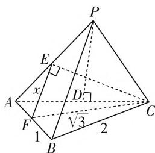
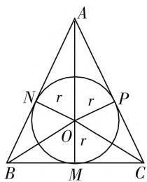

# 与球联姻,切接组合

# ● 江苏省扬州市第一中学 张鹏

与球联姻问题主要涉及球的组合体问题，包括与球相关的切、接组合问题，是历年高考命题的热点之一，也是难点和易失分点。其中内切球是指球内切多面体与旋转体，解答时首先要找准切点，通过作截面来解决，特别地，如果内切的是多面体，则作截面时主要抓住多面体过球心的对角面来作；外接球是指一个多面体的几个顶点都在球面上的问题，解答时关键是抓住外接的特点，即球心到多面体的顶点的距离等于球的半径。下面结合实例，就与球联姻的相关组合类型加以剖析，阐述破解策略，提升解题能力。

# 一、正方体与球的组合问题

例 1 （2020 年高考数学天津卷第 5 题）若棱长为 $2\sqrt{3}$ 的正方体的顶点都在同一球面上，则该球的表面积为（）.

A. $12\pi$

B. $24\pi$

C. $36\pi$

D. $144\pi$

分析:根据题目条件可以确定该球是正方体的外接球,利用正方体的外接球的直径等于正方体的体对角线长建立关系式,进而确定球的半径,即可求解球的表面积.

解析:设球的半径为 R, 结合正方体的外接球的直径等于正方体的体对角线长, 则有 $2R = \sqrt{3}a = 6$ , 可得 R = 3, 所以该球的表面积为 $S = 4\pi R^{2} = 36\pi$ .

故选择答案:C.

点评:对于正方体与球的组合问题,关键是掌握以下两点:(1)正方体的外接球的直径等于正方体的体对角线长;(2)正方体的内切球的直径等于正方体的棱长.

# 二、长方体与球的组合问题

例 2 （2017 年高考数学全国 II 卷文科第 15 题）长方体的长，宽，高分别为 3,2,1，其顶点都在球 O 的表面，则球 O 的表面积为 \_\_\_\_.

分析:根据题目条件可以确定该球是长方体的外接球,利用长方体的体对角线长是它的外接球的直径建立关系式,进而确定球的半径,即可求解球的表面积.

解析:设球O的半径为R,利用长方体的外接球的性质,可得长方体的体对角线长是它的外接球的直径,则有 $2R=\sqrt{3^{2}+2^{2}+1^{2}}=\sqrt{14}$ ,解得 $R=\frac{\sqrt{14}}{2}$ ,那么球O的表面积为 $S=4\pi R^{2}=14\pi$ .

故填答案: $14\pi$ .

点评:对于长方体与球的组合问题,关键是掌握以下两点:(1)长方体的外接球的直径等于长方体的体对角线长;(2)长方体有内切球时,此时长方体就是特殊的正方体,对应内切球的直径等于正方体的棱长.

# 三、棱锥与球的组合问题

例 3 （2019 年高考数学全国 I 卷理科第 12 题）已知三棱锥 P-ABC 的四个顶点在球 O 的球面上，PA = PB = PC， $\triangle ABC$ 是边长为 2 的正三角形，E, F 分别是 PA, AB 的中点， $\angle CEF = 90^{\circ}$ ，则球 O 的体积为（）.

A. $8\sqrt{6}\pi$

B. $4\sqrt{6}\pi$

C. $2 \sqrt{6} \pi$

D. $\sqrt{6}\pi$

分析:根据题目条件可以确定该球是三棱锥的外接球,利用条件将三棱锥 P-ABC 补形成对应的正方体,转化为正方体的外接球即为三棱锥的外接球,合理转化,巧妙应用.

解析: 设 PA = PB = PC
=2x，而 E, F 分别是 PA, AB的中点,则有 $EF \parallel PB$ , 且 $EF = \frac{1}{2}PB = x$ . 又 $\triangle ABC$ 是边长为 2 的正三角形, 可得 $CF = \sqrt{3}$ . 又 $\angle CEF = 90^{\circ}$ , 可得 $CE = \sqrt{3 - x^{2}}$ . 在 $\triangle AEC$ 中, 由余弦定理,

text_image

P
E
x
A
D
√3
1
B
2
C

图1

可得 $\cos\angle EAC=\frac{x^{2}+4-(3-x^{2})}{2\times x\times2}=\frac{2x^{2}+1}{4x}$ . 作 PD⊥AC 交 AC 于点 D，则知 D 为 AC 的中点，如图 1，在 $\triangle APD$ 中， $\cos\angle PAD=\frac{AD}{PA}=\frac{1}{2x}$ ，则有 $\frac{2x^{2}+1}{4x}=\frac{1}{2x}$ ，整理有 $2x^{2}=1$ ，解得 $x=\frac{\sqrt{2}}{2}$ ，则有 PA=PB=PC=2x= $\sqrt{2}$ . 又 AB=BC=AC=2，则知 PA, PB, PC 两两垂直，把三棱锥 P-ABC 补形成对应的正方体，则正方体的外接球即为三棱锥的外接球，设球 O 的半径为 R，则有 $2R=\sqrt{2+2+2}=\sqrt{6}$ ，解得 $R=\frac{\sqrt{6}}{2}$ ，所以球 O 的体积为 $V=\frac{4}{3}\pi R^{3}=\sqrt{6}\pi$ .

故选择答案:D.

点评:对于棱锥与球的组合问题,关键是掌握以下两点:(1)棱锥的内切球的半径r的求解可以利用等体积法来解决,即 $V_{棱锥}=\frac{1}{3}\cdot S_{棱锥}\cdot r$ (其中 $S_{棱锥}$ 表示棱锥的表面积),还可以通过几何法来处理;(2)棱锥的外接球的半径r的求解往往可以利用几何法来处理.

# 四、棱柱与球的组合问题

例 4 （2016 年高考数学全国Ⅲ卷文科第 11 题，理科第 10 题）在封闭的直三棱柱 $ABC-A_{1}B_{1}C_{1}$ 内有一个体积为 V 的球，若 $AB \perp BC, AB = 6, BC = 8, AA_{1} = 3$ ，则 V 的最大值是（）.

A. $4\pi$ B. $\frac{9}{2}\pi$ C. $6\pi$ D. $\frac{32}{3}\pi$

分析:根据题目条件可以确定该球是直三棱柱的内切球,利用条件确定直三棱柱的底面三角形的内切圆半径与高,通过比较数据来确定相切的条件,进而确定球的半径,为确定球的体积的最大值提供支持.

解析:由于 $AB \perp BC, AB = 6, BC = 8$ ，可得 AC = 10，则知 $\triangle ABC$ 的内切圆半径 $r = \frac{6 + 8 - 10}{2} = 2$ 。又 $AA_{1} = 3$ ，要使得球的体积 V 最大，必须球的半径 R 最大，对比以上数据，可知该球与上下底面均相切，则有 $R = \frac{1}{2} AA_{1} = \frac{3}{2}$ ，此时球的体积为 $V = \frac{4}{3} \pi R^{3} = \frac{9}{2} \pi$ 。

故选择答案:B.

点评:对于棱柱与球的组合问题,关键是掌握以下两点:(1)棱柱的内切球问题中要注意球与棱柱的哪些面相切,两个平行切面之间的距离就是球的直径;(2)棱柱的外接球问题要借助几何法、补形法等加以综合与应用.

# 五、圆锥与球的组合问题

例 5 （2020 年高考数学全国Ⅲ卷文科第 16 题，理科第 15 题）已知圆锥的底面半径为 1，母线长为 3，则该圆锥内半径最大的球的体积为 \_\_\_\_。

分析: 根据题目条件可以确定该球是圆锥的内切球, 用球与圆锥内切时的轴截面三角形所对应的等面积法来确定圆锥的内切球的半径, 也可以利用勾股定理来转化求解. 数形结合, 化立体为平面来处理.

text_image

A
N r r P
O r
B M C

图2

解析: 易知该圆锥内半径最大的球为圆锥的内切球，球与圆锥内切时的轴截面如图2所示，其中 $BC = 2, AB = AC = 3$ ，且 $M$ 为 $BC$ 边的中点，内切圆的圆心为 $O$ ，设内切圆的半径为 $r$ ，由于 $AM = \sqrt{3^2 - 1^2} = 2\sqrt{2}$ ，可得 $S_{\triangle ABC} = \frac{1}{2}\times 2\times 2\sqrt{2} =$ $2\sqrt{2}$ ，则有 $S_{\triangle ABC} = S_{\triangle AOB} + S_{\triangle BOC} + S_{\triangle AOC} = \frac{1}{2} (AB+$ $BC + AC)r = 4r = 2\sqrt{2}$ ，解得 $r = \frac{\sqrt{2}}{2}$ 所以所求球的体积为 $V = \frac{4}{3}\pi r^3 = \frac{\sqrt{2}}{3}\pi .$

故填答案: $\frac{\sqrt{2}}{3}\pi.$

点评:对于圆锥与球的组合问题,关键是掌握以下两点:(1)圆锥的内切球的半径可以利用球与圆锥内切时的轴截面所对应的等面积法来求解;(2)圆锥的外接球问题要注意圆锥的顶点与底面圆是在球心的同侧还是异侧,有时要分类讨论,不要遗漏.

解决与球联姻的组合体问题,破解时有规律可遵循,有方法可掌握,关键是要找准切、接点,通过切、接点与球心作出截面,转化为圆的切、接问题,化立体几何为平面几何,进而结合相关的平面几何知识来分析与处理.同时还要注意,球化为圆的问题体现了转化与化归的思想,适当的“割补形状”体现了化整为零、积零为整的数学思想,体积和表面积都是半径的函数关系,这又体现了函数思想.F