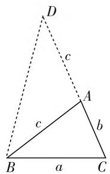

# 二倍角三角形的创新及其应用

# ● 江苏省无锡市第三高级中学 史敏洁

在解三角形问题中,经常会在题目中碰到诸如“ $a^{2}=b(b+c)$ ”这个条件,其实这个条件就等价于A=2B,不妨把这样的特殊三角形称之为“二倍角三角形”.本文结合“二倍角三角形”这个结论的推导,并结合实例剖析其应用.

# 一、结论及证明

结论: 在 $\triangle ABC$ 中, 三个内角 A, B, C 的对边分别为 a, b, c, 若 $a^{2} = b(b + c)$ , 则有 A = 2B 成立.

证明 1: (平面几何法) 由 $a^{2}=b(b+c)$ ，可得 $BC^{2}=AC\cdot(AC+AB)$ ，如图 1，延长 CA 至点 D，使得 AD=AB=c，连接 DB，则有 $\angle D=\angle DBA$ ，可得 $\angle BAC=\angle D+\angle DBA=2\angle D$ ，而由 $\frac{BC}{AC}=\frac{DC}{BC}$ ，可得 $\triangle BCA\sim\triangle DCB$ ，则有 $\angle B=\angle D$ ，所以 $\angle BAC=2\angle D=2\angle B$ ，即有 A=2B 成立.

text_image

D
c
A
b
C
a
B

图1

证明 2: (余弦定理 + 正弦定理法 1) 由 $a^{2}=b(b+c)$ ，结合余弦定理 $a^{2}=b^{2}+c^{2}-2bc\cos A$ ，可得 b=c-2b $\cos A$ ，结合正弦定理可得：

$$
\begin{array}{l} \sin B = \sin C - 2 \sin B \cos A \\ = \sin (A + B) - 2 \sin B \cos A \\ = \sin A \cos B + \cos A \sin B - 2 \sin B \cos A \\ = \sin A \cos B - \cos A \sin B = \sin (A - B). \\ \end{array}
$$

而 $A, B \in (0, \pi)$ , 则有 $B = A - B$ , 即有 $A = 2B$ 成立.

证明3:(余弦定理+正弦定理法2)由 $a^{2}=b(b+c)$ ，可得 $a=\frac{b(b+c)}{a}=\frac{2bc(b+c)}{2ac}=2b\cdot\frac{bc+c^{2}}{2ac}=2b\cdot\frac{a^{2}-b^{2}+c^{2}}{2ac}=2b\cos B$ ，结合正弦定理有 $\sin A=2\sin B\cos B=\sin 2B$ ，而 $A,B\in(0,\pi)$ ，则有A=2B成立.

证明 4: (正弦定理法) 由 $a^{2}=b(b+c)$ ，结合正弦定理可得 $\sin^{2}A=\sin B(\sin B+\sin C)$ ，则有：

$$
\begin{array}{l} \sin B \sin C = \sin^ {2} A - \sin^ {2} B \\ = \frac {1 - \cos 2 A}{2} - \frac {1 - \cos 2 B}{2} = \frac {\cos 2 B - \cos 2 A}{2} \\ = \frac {\cos [ (A + B) - (A - B) ] - \cos [ (A + B) + (A - B) ]}{2} \\ = \sin (A + B) \sin (A - B) = \sin C \sin (A - B). \\ \end{array}
$$

而 $A, B, C \in (0, \pi)$ ，则有 $B = A - B$ ，即有 $A = 2B$ 成立.

# 二、结论的应用

借助“二倍角三角形”的条件“ $a^{2}=b(b+c)$ ”，可以快速确定角之间的关系A=2B，进而结合题目中其他的相关条件，可以用来解决一些相关的三角形问题.

# 1. 角的取值问题

例 1 在 $\triangle ABC$ 中, 三个内角 A, B, C 的对边分别为 a, b, c, 若 $a^{2} - b^{2} = bc$ , $\sin A = \sqrt{3} \sin B$ , 则角 A 的值为 \_\_\_\_.

分析:根据题目条件结合“二倍角三角形”的性质得 A=2B，通过条件中的关系式并利用二倍角公式的转化确定 $\cos B$ 的值，进而即可求解角 B 的大小，从而得以求解角 A 的值.

解析:由 $a^{2}-b^{2}=bc$ ，可得 $a^{2}=b(b+c)$ ，结合“二倍角三角形”的性质可得 A=2B，结合 $\sin A=\sqrt{3}\sin B$ ，可得 $\sin A=\sin2B=2\sin B\cos B=\sqrt{3}\sin B$ ，则有 $\cos B=\frac{\sqrt{3}}{2}$ ，而 $B\in(0,\pi)$ ，可得 $B=\frac{\pi}{6}$ ，则有 A=2B= $\frac{\pi}{3}$ .

故填答案: $\frac{\pi}{3}$ .

点评:借助“二倍角三角形”的性质得到两角之间的二倍角关系,通过角之间的关系与已知三角关系式的综合,利用三角恒等变换及三角形的性质即可确定相应的角的大小问题.当然,本题也可以借助正弦定理,把三角关系式转化为边的关系式,再借助余弦定理来求解角的大小问题.

# 2. 三角关系式的最值问题

例 2 在 $\triangle ABC$ 中, 三个内角 A, B, C 的对边分别为 a, b, c, 若 $a^{2}=b(b+c)$ , 则 $\frac{1}{\tan B}-\frac{1}{\tan A}+2\sin A$ 的最小值是 \_\_\_\_.

分析:根据题目条件结合“二倍角三角形”的性质得A=2B,通过三角关系式 $\frac{1}{\tan B}-\frac{1}{\tan A}+2\sin A$ 的变形与转化,再利用基本不等式即可确定相应的最值.

解析:由 $a^{2}=b(b+c)$ ，结合“二倍角三角形”的性质可得 A=2B，则有 $\frac{1}{\tan B}-\frac{1}{\tan A}+2\sin A$

$$
\begin{array}{l} = \frac {\sin A \cos B - \cos A \sin B}{\sin A \sin B} + 2 \sin A \\ = \frac {\sin (A - B)}{\sin A \sin B} + 2 \sin A = \frac {\sin B}{\sin A \sin B} + 2 \sin A \\ = \frac {1}{\sin A} + 2 \sin A \geqslant 2 \sqrt {\frac {1}{\sin A} \cdot 2 \sin A} = 2 \sqrt {2}. \\ \end{array}
$$

当且仅当 $\frac{1}{\sin A} = 2\sin A$ ，即 $\sin A = \frac{\sqrt{2}}{2}$ ，亦即 $A = \frac{\pi}{4}$ 时，等号成立，所以 $\frac{1}{\tan B} -\frac{1}{\tan A} +2\sin A$ 的最小值是2 $\sqrt{2}$ ，此时 $A = 2,B = \frac{\pi}{4}$

故填答案: $2\sqrt{2}$ .

点评:借助“二倍角三角形”的性质得到两角之间的二倍角关系,结合角之间的关系,借助三角函数中的相关公式加以转化,进而转化为涉及一个角的同名三角函数关系式,再结合关系式的特征,采取相应的方式来确定最值.

# 3. 三角关系式的取值范围问题

例 3 （2019 届山东省潍坊市高三上学期期末考试·16）在锐角 $\triangle ABC$ 中，三个内角 A, B, C 的对边分别为 a, b, c，若 $a^{2} - c^{2} = bc$ ，则 $\frac{1}{\tan C} - \frac{1}{\tan A}$ 的取值范围是 \_\_\_\_。

分析:根据题目条件结合“二倍角三角形”的性质得 A=2C，并利用条件确定角 A 的取值范围，通过三角关系 $\frac{1}{\tan C}-\frac{1}{\tan A}$ 的变形与转化，结合角 A 的取值范围所对应的三角函数值来确定相应的取值范围问题.

解析:由 $a^{2}-c^{2}=bc$ ，可得 $a^{2}=c(b+c)$ ，结合“二倍角三角形”的性质可得 A=2C，在锐角 $\triangle ABC$ 中，由于 $B=\pi-A-C=\pi-\frac{3}{2}A\in\left(0,\frac{\pi}{2}\right)$ ，可得 $A\in$ $\left(\frac{\pi}{3}, \frac{2\pi}{3}\right)$ , 而 $A \in \left(0, \frac{\pi}{2}\right)$ , 则有 $A \in \left(\frac{\pi}{3}, \frac{\pi}{2}\right)$ , 则有 $\frac{1}{\tan C} - \frac{1}{\tan A} = \frac{\sin A \cos C - \cos A \sin C}{\sin A \sin C} = \frac{\sin (A - C)}{\sin A \sin C} = \frac{\sin C}{\sin A \sin B} = \frac{1}{\sin A} \in \left(1, \frac{2\sqrt{3}}{3}\right)$ .

故填答案: $\left(1,\frac{2\sqrt{3}}{3}\right)$ .

点评:借助“二倍角三角形”的性质得到两角之间的二倍角关系,结合角之间的关系,进而有效确定相关角的取值范围,并借助三角函数中的相关公式加以转化,利用三角函数的图像与性质来确定给定区间的三角函数关系式的取值范围问题.

# 4. 边长关系式的取值范围问题

例 4 在锐角 $\triangle ABC$ 中, 三个内角 A, B, C 的对边分别为 a, b, c, 若 $a^{2}=b(b+c)$ , 则 $\frac{c}{b}$ 的取值范围是 \_\_\_\_.

分析:根据题目条件结合“二倍角三角形”的性质得 A=2B，并利用条件确定角 B 的取值范围，通过正弦定理及三角恒等变换公式的转化，把边长关系式转化为相应的三角关系式，再借助条件来确定相应的取值范围问题.

解析:由 $a^{2}=b(b+c)$ ，结合“二倍角三角形”的性质可得 A=2B，在锐角 $\triangle ABC$ 中，由于 $C=\pi-A-B=\pi-3B\in\left(0,\frac{\pi}{2}\right)$ ，可得 $B\in\left(\frac{\pi}{6},\frac{\pi}{3}\right)$ ，而 $2B=A\in\left(0,\frac{\pi}{2}\right)$ ，则有 $B\in\left(0,\frac{\pi}{4}\right)$ ，所以 $B\in\left(\frac{\pi}{6},\frac{\pi}{4}\right)$ ，根据正弦定理有 $\frac{c}{b}=\frac{\sin C}{\sin B}=\frac{\sin(A+B)}{\sin B}=\frac{\sin3B}{\sin B}$

$$
\begin{array}{l} = \frac {\sin 2 B \cos B + \cos 2 B \sin B}{\sin B} = \frac {2 \sin B \cos^ {2} B + \cos 2 B \sin B}{\sin B} \\ = 2 \cos^ {2} B + \cos 2 B = 2 \cos 2 B + 1, \\ \end{array}
$$

由 $B \in \left(\frac{\pi}{6}, \frac{\pi}{4}\right)$ , 可得 $2B \in \left(\frac{\pi}{3}, \frac{\pi}{2}\right)$ , 则 $\cos 2B \in \left(0, \frac{1}{2}\right)$ , 可得 $2\cos 2B + 1 \in (1, 2)$ , 所以 $\frac{c}{b}$ 的取值范围是 $(1, 2)$ .

故填答案:(1,2).

点评:借助“二倍角三角形”的性质得到两角之间的二倍角关系,结合角之间的关系,进而有效确定相关角的取值范围,而对应的边长关系式问题要根据条件,通过正弦定理、余弦定理等方式转化为相应的三角函数关系式,再利用三角函数的图像与性质来确定给定区间的三角函数关系式的取值范围问题.