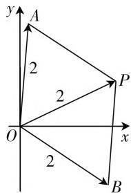

# 关于高考复数题型的剖析

# ● 甘肃省庆阳市庆阳第二中学 慕全兴

高考中的复数试题一般出现在选择题或填空题中,以基础题出现,主要考查复数的基本概念、分类、相等条件、四则运算、几何意义及交汇综合等,属于容易题或中档题.

# 一、复数的概念

复数的基本概念的考查主要包括虚数、纯虚数、复数的实部和虚部等概念.

例 1 （2020 年高考数学江苏卷第 2 题）已知 i 是虚数单位，则复数 $z=(1+i)(2-i)$ 的实部是 \_\_\_\_.

分析:通过两复数的乘法运算加以转化与化简,利用复数的基本概念来确定相应复数的实部.

解析:由于 $z=(1+i)(2-i)=3+i$ , 其实都是 3.

故填答案:3.

点评:通过复数的基本概念与基本运算来综合考查与应用,破解的关键是根据复数的四则运算把复数转化为 $z=a+bi(a,b\in\mathbb{R})$ 的形式,根据复数的相关概念加以正确判断.

# 二、复数的基本运算

复数的基本运算的考查主要包括复数的代数形式的四则运算,以及基本运算的技能与技巧等.

例 2 （2020 年高考数学全国Ⅱ卷文科第 2 题）(1 - i) $^{4}$ =() .

A.-4

B. 4

C. -4i

D. 4i

分析:借助复数的四则运算及基本公式 $(1\pm i)^{2}=\pm2i$ 来综合应用.

解析: $(1-i)^{4}=(-2i)^{2}=-4.$

故选择答案:A.

点评: 复数的基本运算的考查主要是借助复数代数形式的四则运算来实现:(1) 复数的加减运算按“合并同类项”进行;(2) 复数的乘法运算按“多项式的乘法”法则进行;(3) 复数的除法运算按“分母实数化”进行.

# 三、复数的分类

根据复数的概念,对复数 $z=a+bi(a,b\in\mathbf{R})$ 加以合理分类:(1) 当且仅当 b=0 时,复数 z 是实数;(2) 当且仅当 $b \neq 0$ 时, 复数 $z$ 是虚数; (3) 当 $a = 0$ 且 $b \neq 0$ 时, 复数 $z$ 是纯虚数.

例 3 （2020 年高考数学浙江卷第 2 题）已知 $a \in R$ ，若 $a - 1 + (a - 2)\mathrm{i}(\mathrm{i}$ 为虚数单位）是实数，则 $a = (\quad)$ .

A.1

B.-1

C. 2

D.-2

分析:根据复数的分类建立相应的关系式,进而得以确定参数的值.

解析:由于 $a-1+(a-2)$ i 是实数, 可得 a-2=0, 解得 a=2.

故选择答案:C.

点评: 解决复数的分类问题时, 一定要注意一个复数 $z=a+bi(a,b\in\mathbb{R})$ 是纯虚数的条件是: a=0 且 $b\neq0$ , 一个复数是实数的条件是: b=0, 经常会出现条件的遗漏或重复而导致错误.

# 四、复数的几何意义

复数的几何意义的考查主要通过复数与复平面内的点的一一对应关系来链接，包括复数的几何意义，复数四则运算的几何意义在对应平面图形中的应用等.

例 4 （2020 年高考数学北京卷第 2 题）在复平面内，复数 z 对应的点的坐标是 $(1,2)$ ，则 $i \cdot z = (\quad)$ .

A. $1 + 2i$

B. $-2+i$

C. 1 - 2i

D. -2-i

分析:根据复数的几何意义确定复数z,并结合复数的四则运算加以应用.

解析:根据复数的几何意义,可得 $z=1+2i$ ,那么 $i\cdot z=i(1+2i)=-2+i$ .

故选择答案:B.

点评:通过复数的几何意义与基本运算来综合考查与应用,破解的关键是借助复数的几何意义确定相应的复数.复数、复平面内的点及复数所对应的向量三者之间存在一一对应关系.

# 五、复数的模及应用

复数的模、复数所对应的点到坐标原点的距离、复数所对应的向量的模这三者是一致的，考查时主要通过相互之间的转化与应用来解决问题.

例 5 （2020 年高考数学全国 I 卷理科第 1 题）若 $z = 1 + i$ ，则 $\left| z^{2} - 2z \right| = (\quad)$ .

A. 0

B. 1

C. $\sqrt{2}$

D. 2

分析:结合题目条件,根据复数的四则运算或复数的模的性质加以转化与化简,进而得以确定复数的模问题.

解法1:由于 $z=1+i$ ，则 $z^{2}-2z=(1+i)^{2}-2(1+i)=-2$ ，所以 $|z^{2}-2z|=|-2|=2.$

故选择答案:D.

解法2:由于 $|z^{2}-2z|=|z|\cdot|z-2|=|1+i|\cdot|-1+i|=\sqrt{2}\times\sqrt{2}=2.$

故选择答案:D.

点评:通过复数的四则运算、模的性质与模的公式来综合考查与应用,关键是综合复数的相关概念、四则运算、模的公式与性质等来考查复数的模问题,要加以注意.

# 六、共轭复数及应用

共轭复数的几何特征是:互为共轭复数的点关于实轴对称;代数特征是:互为共轭复数的虚部互为相反数.共轭复数的考查是高考中的一大重要考点,是复数中比较重要且具有独特性质的一个知识点.

例 6 （2020 年高考数学全国 Ⅲ 卷文科第 2 题）若 $\bar{z}(1+i)=1-i$ ，则 $z=(\quad)$ .

A. $1 - \mathrm{i}$

B. $1 + i$

C. -i

D. i

分析:根据题目条件加以转化,通过复数的除法运算确定复数 $\bar{z}$ ,再利用共轭复数的代数特征来确定复数z.

解析: 由于 $\bar{z}(1+i)=1-i$ ，可得 $\bar{z}=\frac{1-i}{1+i}=\frac{(1-i)^{2}}{(1+i)(1-i)}=\frac{-2i}{2}=-i$ ，所以 z=i.

故选择答案:D.

点评:通过复数的共轭与基本运算来综合考查与应用,破解此类问题的关键是抓住共轭复数的概念与性质:复数 $z = a + bi (a, b \in \mathbf{R})$ 的共轭复数是 $\overline{z} = a - bi$ .

# 七、复数的交汇应用

复数中涉及相关的概念、运算及几何意义等，通过对复数的概念创新、运算创新等，结合复数的相关知识，是高考中创新与交汇的一大亮点.

例 7 （2020 年高考数学全国 II 卷理科第 15 题）
设复数 $z_{1}, z_{2}$ 满足 $\left|z_{1}\right|=\left|z_{2}\right|=2, z_{1}+z_{2}=\sqrt{3}+i$ ，则

$$
\mid z _ {1} - z _ {2} \mid = \underline {{{\quad}}}.
$$

分析:根据复数本身所具备的“数”的特征与“形”的直观,可以从代数思维或几何思维等相关角度切入,借助不同的方法得以破解相关的复数综合与交汇问题.

解法1:(待定系数法)由题意可设 $z_{1}=a+bi(a,b\in\mathbf{R})$ ，由 $z_{1}+z_{2}=\sqrt{3}+i$ ，可得 $z_{2}=(\sqrt{3}-a)+(1-b)i$ ，则 $\left\{\begin{aligned}|z_{1}|^{2}&=a^{2}+b^{2}=4,\\|z_{2}|^{2}&=(\sqrt{3}-a)^{2}+(1-b)^{2}=4,\end{aligned}\right.$ 整理可得 $\left\{\begin{aligned}a^{2}+b^{2}&=4,\\ \sqrt{3}a+b&=2,\end{aligned}\right.$ 所以 $\left|z_{1}-z_{2}\right|^{2}=(2a-\sqrt{3})^{2}+(2b-1)^{2}=4(a^{2}+b^{2})-4(\sqrt{3}a+b)+4=12$ ，解得 $|z_{1}-z_{2}|=2\sqrt{3}$ .

故填答案: $2\sqrt{3}$ .

解法2：（几何意义法）由于 $z_{1} + z_{2} = z_{3} = \sqrt{3} +\mathrm{i}$ ，在复平面内，设复数 $z_{1},z_{2},z_{3}$ 所对应的点分别为 $A$ ， $B,P$ （起点均为坐标原点 $O$ )，如图2，根据复数的几何意义可知， $|z_1 + z_2|$ 和 $|z_1 - z_2|$ 是以平面向量 $\overrightarrow{OA}$ 和 $\overrightarrow{OB}$ 为两邻边的平行四边形的两条对角线的长，由于 $|z_1| =$ $|z_{2}|=|z_{3}|=2$ ，则知平行四边形OAPB是边长为2，一条对角线为2的菱形，所以该菱形的另一条对角线的长为 $|z_{1}-z_{2}|=2\sqrt{3}$ .

text_image

y
A
2
P
2
O
x
2
B

图1

故填答案: $2\sqrt{3}$ .

解法3：（公式法）因为 $z_{1} + z_{2} = \sqrt{3} +\mathrm{i}$ ，所以 $\left|z_1 + z_2\right| = 2$ ，而 $\left|z_1\right| = \left|z_2\right| = 2$ ，结合公式 $\left|z_1 + z_2\right|^2$ $+|z_{1} - z_{2}|^{2} = 2(|z_{1}|^{2} + |z_{2}|^{2})$ ，可得 $\left|z_1 - z_2\right|^2 =$ $2(|z_1|^2 +|z_2|^2) - |z_1 + z_2|^2 = 2(2^2 +2^2) - 2^2 =$ 12，解得 $\left|z_1 - z_2\right| = 2\sqrt{3}.$

故填答案: $2\sqrt{3}$ .

点评:以复数为问题背景,结合两相关复数的模及两复数的和的模来求解两复数的差的模问题,合理实现两者之间的转化与应用问题,达到知识的交汇与方法的融合.

复数是每年高考中的一个基本考点,具体解题突破时,复数的概念是复数理论的基础,在解题活动中它经常是思维的突破口;围绕复数的代数形式的四则运算,体现了复数知识的广泛联系性和普遍渗透性;复数概念及其复数的几何意义等,为我们从几何角度处理复数问题或几何问题复数化等提供了更为广阔的空间. $^{F}$