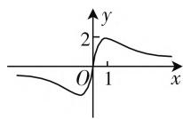
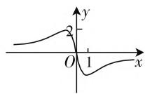
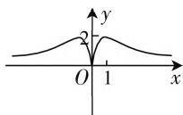
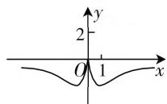

# 函数奇偶性,高考妙应用

# ● 江苏省宜兴市官林中学 韩旭东

函数的奇偶性是历年高考中的必考知识点之一，反映了函数图像的对称性情况，体现了函数中“数”与“形”之间的和谐统一，是进行数学分析、数学应用与数学研究的一大有力工具，合理联系起函数部分的知识体系与数学综合应用。下面结合2020年高考真题，就高考中函数奇偶性的巧妙应用，通过相关的实例剖析，总结类型，以方便全面复习，抛砖引玉，以期对高三数学复习与备考提供些许帮助。

# 一、结合奇偶性确定函数值

奇函数中,关于定义域对称的自变量所对应的函数值互为相反数;偶函数中,关于定义域对称的自变量所对应的函数值相等.有时给出的函数解析式中,其中一部分解析式具有奇偶性,此时通过合理构造函数,巧妙利用奇偶性来转化.

例 1 （2020 年高考数学江苏卷第 7 题）已知 $y = f(x)$ 是奇函数，当 $x \geqslant 0$ 时， $f(x) = x^{\frac{2}{3}}$ ，则 $f(-8)$ 的值是 \_\_\_\_.

分析: 结合奇函数的定义 $f(-x) = -f(x)$ ，得到相应的关系式 $f(-8) = -f(8)$ ，从而得以求解函数值.

解析: 由于 $y = f(x)$ 是奇函数, 则知 $f(-8) = -f(8) = -8^{\frac{2}{3}} = -4$ .

故填答案: -4.

点评:结合函数奇偶性的定义及对应条件下的函数的解析式来进行合理转化,利用指数幂运算来进行函数值的求解与确定.破解此类问题的关键是正确掌握函数的奇偶性及其关系,注意解析式中的符号,不要产生混淆.

# 二、结合奇偶性判断函数图像

函数的奇偶性与图像的对称性之间形成对称关系: 奇函数的图像关于坐标原点对称, 偶函数的图像关于 y 轴对称. 判断函数的图像往往都是在函数奇偶性的基础上,再结合最高最低点、平衡点、特殊点等来分析与处理.

例 2 （2020 年高考数学天津卷第 3 题）函数 $y = \frac{4x}{x^{2} + 1}$ 的图像大致为（）.

  
A.

  
B.

  
C.

  
D.

分析:结合函数奇偶性的定义,利用函数的解析式来判断已知函数的奇偶性,通过函数奇偶性所对应的图像的对称性来排除相关的选项;再结合 $f(1)$ 的正负取值情况排除相关的选项,从而得以正确判断.

解析: 由于 $f(-x)=\frac{4(-x)}{(-x)^{2}+1}=-\frac{4x}{x^{2}+1}=-f(x)$ ，则知函数 $y=\frac{4x}{x^{2}+1}$ 是奇函数，其图像关于坐标原点对称，由此可以排除选项 C、D；

取特殊值 x=1，可得 y=2>0，由此可以排除选项 B.

故选择答案:A.

点评:结合函数的奇偶性来判断函数的图像问题,往往通过函数的解析式,先确定函数的定义域,结合函数奇偶性的定义确定其相应的奇偶性,从而确定函数图像的对称性,再结合函数的其他基本性质(单调性、值域等)、特殊点处的取值情况(正负值、零点等)等来综合分析与判断.

# 三、结合奇偶性交汇单调性

函数的奇偶性与单调性是函数的两个重要的基本性质,两者之间关系非常密切,经常形影不离,相辅相成,两者之间有联系又有区别,珠联璧合,是历年高考数学中的常见基本题型之一.

例 3 （2020 年高考数学全国 II 卷文科第 10 题）
设函数 $f(x)=x^{3}-\frac{1}{x^{3}}$ ，则 $f(x)$ ( ).

A. 是奇函数, 且在 $(0, +\infty)$ 上单调递增  
B. 是奇函数, 且在 $(0, +\infty)$ 上单调递减  
C. 是偶函数, 且在 $(0, +\infty)$ 上单调递增  
D. 是偶函数, 且在 $(0, +\infty)$ 上单调递减

分析:根据题目条件,在函数的定义域关于坐标原点对称的前提下,结合 $f(-x)$ 与 $f(x)$ 的关系来判断函数的奇偶性;进一步根据幂函数的单调性的判定,以及复合函数的性质来确定函数的单调性.

解析: 因为函数 $f(x)=x^{3}-\frac{1}{x^{3}}$ 的定义域为 $\{x \mid x \neq 0\}$ ，其定义域关于坐标原点对称，而 $f(-x)=(-x)^{3}-\frac{1}{(-x)^{3}}=-\left(x^{3}-\frac{1}{x^{3}}\right)=-f(x)$ ，所以函数 $f(x)$ 为奇函数.

又由于函数 $y = x^3$ 在 $(0, +\infty)$ 上单调递增，函数 $y = \frac{1}{x^3} = x^{-3}$ 在 $(0, +\infty)$ 上单调递减，所以函数 $f(x) = x^3 - \frac{1}{x^3}$ 在 $(0, +\infty)$ 上单调递增.

故选择答案:A.

点评:借助函数性质讨论,综合函数的奇偶性与单调性来确定函数的相关性质的判定与应用问题.函数的奇偶性与单调性的糅合与交汇问题,设问背景创新新颖,是知识联合与应用的合理渗透,变化多端,情景各异,是高考数学中常考常新的基本题型之一,备受高考命题者的青睐.

# 四、结合奇偶性求解不等式

借助函数的奇偶性,在求解抽象不等式等其他方面都有很好的应用.结合函数的奇偶性,抽象问题特殊化,借助特殊与一般、抽象与具体之间的关系,函数性质,合理转化,分类讨论,双剑合璧,特殊应用,密切联合.

例 4 （2020 年高考数学新高考 I 卷(山东卷)第 8 题）若定义在 R 上的奇函数 $f(x)$ 在 $(-∞,0)$ 上单调递减，且 $f(2)=0$ ，则满足 $xf(x-1)\geqslant0$ 的 x 的取值范围是（）.

A. $\left[-1,1\right]\cup\left[3,+\infty\right)$

B. $\left[-3,-1\right]\cup\left[0,1\right]$

C. $[-1,0] \cup [1, +\infty)$

D. $[-1,0] \cup [1,3]$

分析:根据题目条件确定函数 $f(x)$ 在对应区间上的单调性及零点,进而结合单调性的性质来确定函数值正负情况下的自变量的取值情况,利用抽象不等式的转化,通过不等式组的建立来转化与求解,得以求解抽象不等式.

解析: 因为定义在 R 上的奇函数 $f(x)$ 在 $(-∞, 0)$ 上单调递减，且 $f(2)=0$ ，所以 $f(x)$ 在 $(0, +∞)$ 上也是单调递减，且 $f(-2)=0, f(0)=0$ .

所以当 $x \in (-\infty, -2) \cup (0, 2)$ 时， $f(x) > 0$ ；当 $x \in (-2, 0) \cup (2, +\infty)$ 时， $f(x) < 0$ .

所以由 $xf(x - 1)\geqslant 0$

可得 $\left\{\begin{aligned}x&<0,\\ -2&\leqslant x-1\leqslant0\text{或}x-1\geqslant2\end{aligned}\right.$

或 $\left\{\begin{aligned}x&>0,\\ 0&\leqslant x-1\leqslant2\text{或}x-1\leqslant-2\end{aligned}\right.$ 或x=0,

解得 $-1 \leqslant x \leqslant 0$ 或 $1 \leqslant x \leqslant 3$ .

所以满足 $xf(x - 1) \geqslant 0$ 的 $x$ 的取值范围是 $[-1,0] \cup [1,3]$ .

故选择答案:D.

点评:以抽象函数为问题背景,结合函数的奇偶性来确定抽象不等式的解集问题.破解时往往要抓住抽象函数的基本性质,或逻辑推理,或构造特殊函数模型,借助函数的单调性,以及函数图像在x轴的上半部分与下半部分所表示的含义加以推理与分析,分类讨论,数形结合.抽象问题具体化,合理转化是破解问题的关键所在.

历年高考数学对函数进行的重点考查都离不开函数的奇偶性,此类试题以幂函数、指数函数、对数函数或抽象函数等为问题背景,以小题(选择题或填空题)的形式出现在试卷中,综合相关的函数运算、函数的图像与性质等相关知识,有时单独考查,有时综合应用,难度属于较易型或中等型. F