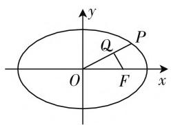
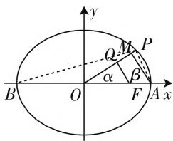

# 多思维切入,多方法并举

—— 一道椭圆离心率题的破解

● 江苏省宜兴中学 储小亚

椭圆或双曲线的离心率问题是圆锥曲线中最常见的一种题型，也是历年高考、自主招生、竞赛中比较常见的热点问题之一。此类问题创新性强，新颖多样，变化多端，是数学知识交汇与融合的一大场所。同时由于圆锥曲线的特殊地位，链接起平面几何、平面向量、函数、三角函数等相关知识，切入点多样，是数学中“一题多解”、“一题多思”、“一题多变”的理想载体，对于全面理解与掌握数学知识与数学方法，提升思维品质与数学能力，比单纯追求题目数量的“刷题”显得更为重要。

# 一、问题呈现

问题 （2020届浙江省宁波市镇海中学高三下学期3月高考模拟测试数学试题·17）如图1，椭圆 $\Gamma : \frac{x^2}{a^2}$ $+\frac{y^{2}}{b^{2}}=1(a>b>0)$ 的离心率为 e, F 是 $\Gamma$ 的右焦点, P 是 $\Gamma$ 上第一象限内任意一点, $\overrightarrow{OQ}=\lambda\overrightarrow{OP}(\lambda>0), \overrightarrow{FQ}\cdot\overrightarrow{OP}=0$ , 若 $\lambda<e$ , 则 e 的取值范围是 \_\_\_\_.

text_image

y
Q
P
O
F
x

图1

此题以椭圆为问题背景,结合条件中对应平面向量的线性关系与数量积来设置问题,结合参数的限制条件来确定椭圆的离心率 e 的取值范围问题.对于椭圆中涉及平面向量的知识应用问题,往往可以从以下角度切入:(1)通过平面向量的坐标运算,直接将平面向量问题坐标化,利用坐标运算构建相应的不等关系式;(2)通过平面向量的几何运算,将平面向量问题转化为平面几何问题,利用平面几何知识构建相应的不等关系式.通过不等式恒成立的转化与应用,结合椭圆中参数的齐次不等关系式的转化与求解,进而得以确定离心率 e 的取值范围问题.

# 二、问题破解

# 思维视角一:代数思维

解法1：（角度参数法1）设 $\angle FOQ = \theta, \theta \in \left(0, \frac{\pi}{2}\right)$ ，则知 $P(a\cos \theta, b\sin \theta)$ ，由 $\overrightarrow{OQ} = \lambda \overrightarrow{OP} (\lambda > 0)$ ，可得 $Q(\lambda a\cos \theta, \lambda b\sin \theta)$ ，结合 $\overrightarrow{FQ} \cdot \overrightarrow{OP} = 0$ ，可得 $(\lambda a\cos \theta - c) \cdot a\cos \theta + \lambda b\sin \theta \cdot b\sin \theta = 0$ ，整理化简可得 $\lambda = \frac{ac\cos\theta}{a^2\cos^2\theta + b^2\sin^2\theta} < e = \frac{c}{a}$ ，即 $a^2\cos \theta < a^2\cos^2\theta + (a^2 - c^2)(1 - \cos^2\theta)$ ，则有 $e^2 = \frac{c^2}{a^2} < \frac{1}{1 + \cos\theta}$ 恒成立，而 $\theta \in \left(0, \frac{\pi}{2}\right)$ ，由上式恒成立，则知 $e^2 \leqslant \frac{1}{2}$ ，解得 $e \in \left(0, \frac{\sqrt{2}}{2}\right]$ .

故填答案: $\left(0,\frac{\sqrt{2}}{2}\right]$ .

解法2：（角度参数法2）设 $\angle FOQ = \theta, \theta \in \left(0, \frac{\pi}{2}\right)$ ，结合 $\overrightarrow{FQ} \cdot \overrightarrow{OP} = 0$ ，则知 $Q(c\cos^2\theta, c\cos\theta\sin\theta)$ ，其中 $c = \sqrt{a^2 - b^2}$ ，由 $\overrightarrow{OQ} = \lambda \overrightarrow{OP} (\lambda > 0)$ ，可得 $P\left(\frac{c\cos^2\theta}{\lambda}, \frac{c\cos\theta\sin\theta}{\lambda}\right)$ ，代入椭圆 $\Gamma$ 的方程，可得 $\frac{c^2\cos^4\theta}{a^2} + \frac{c^2\cos^2\theta\sin^2\theta}{b^2} = \lambda^2 < e^2 = \frac{c^2}{a^2}$ ，整理可得 $\frac{b^2}{a^2} > \frac{\cos^2\theta}{1 + \cos^2\theta}$ ，则有 $e^2 = \frac{c^2}{a^2} < \frac{1}{1 + \cos^2\theta}$ 恒成立，而 $\theta \in \left(0, \frac{\pi}{2}\right)$ ，由上式恒成立，则知 $e^2 \leqslant \frac{1}{2}$ ，解得 $e \in \left(0, \frac{\sqrt{2}}{2}\right]$ .

故填答案: $\left(0,\frac{\sqrt{2}}{2}\right]$ .

解法 3: (坐标法) 设 $P(x, y), x \in (0, a)$ , 结合 $\overrightarrow{OQ} = \lambda \overrightarrow{OP} (\lambda > 0)$ , 可得 $Q(\lambda x, \lambda y)$ , 由 $\overrightarrow{FQ} \cdot \overrightarrow{OP} = 0$ , 可得 $(\lambda x - c) \cdot x + \lambda y \cdot y = 0$ , 整理化简可得 $\lambda =$

$\frac{cx}{x^2 + y^2} < e = \frac{c}{a}$ , 即 $\frac{cx}{x^2 + b^2\left(1 - \frac{x^2}{a^2}\right)} < \frac{c}{a}$ , 亦即 $c^2 x^2$ $-a^3 x + a^2 b^2 > 0$ ，那么 $(x - a)(c^2 x - ab^2) > 0$ 对任意的 $x \in (0, a)$ 恒成立，由于 $x - a < 0$ ，则有 $c^2 x - ab^2 < 0$ 对任意的 $x \in (0, a)$ 恒成立，所以 $c^2 a - ab^2 \leqslant 0$ ，即 $2c^2 \leqslant a^2$ ，则知 $e^2 \leqslant \frac{1}{2}$ ，解得 $e \in \left(0, \frac{\sqrt{2}}{2}\right]$ .

故填答案: $\left(0,\frac{\sqrt{2}}{2}\right]$ .

点评:代数法中的坐标思想体现了平面向量的坐标运算与圆锥曲线方程之间的和谐统一,是破解此类问题最常见的一种解题策略.其破解的主要依据就是通过角度参数或坐标参数的介入,利用条件转化为关于某一个量(角度参数的三角函数关系或横坐标的关系式等)的不等式恒成立问题,进而得以破解与应用.

# 思维视角二:解析几何思维

解法4:(直线方程法)设直线OP的方程为 $y=kx(k>0)$ ，代入椭圆方程可得 $P\left(\frac{ab}{\sqrt{b^{2}+k^{2}a^{2}}},\frac{kab}{\sqrt{b^{2}+k^{2}a^{2}}}\right)$ ，结合 $\overrightarrow{OQ}=\lambda\overrightarrow{OP}(\lambda>0)$ ，可得 $Q\left(\frac{\lambda ab}{\sqrt{b^{2}+k^{2}a^{2}}},\frac{\lambda kab}{\sqrt{b^{2}+k^{2}a^{2}}}\right)$ ，由 $\overrightarrow{FQ}\cdot\overrightarrow{OP}=0$ ，可得 $k_{FQ}=-\frac{1}{k}$ ，即 $\frac{\lambda kab}{\lambda ab-c\sqrt{b^{2}+k^{2}a^{2}}}=-\frac{1}{k}$ ，化为 $\lambda=\frac{c\sqrt{b^{2}+k^{2}a^{2}}}{ab(1+k^{2})}<e=\frac{c}{a}$ ，整理可得 $\frac{a^{2}}{b^{2}}<2+k^{2}$ ，其对任意的k>0恒成立，由 $2+k^{2}>2$ ，可得 $a^{2}\leqslant2b^{2}$ ，即 $a^{2}\leqslant2(a^{2}-c^{2})$ ，可得 $c\leqslant\frac{\sqrt{2}}{2}a$ ，即 $0<e\leqslant\frac{\sqrt{2}}{2}$ .

故填答案: $\left(0,\frac{\sqrt{2}}{2}\right]$ .

解法5:(轨迹法1)设 $\overrightarrow{OM}=e\overrightarrow{OP}$ ，设 $M(x,y)$ ，则 $P\left(\frac{x}{e},\frac{y}{e}\right)$ ，代入椭圆 $\Gamma$ 的方程，化简可得 $\frac{x^{2}}{a^{2}}+\frac{y^{2}}{b^{2}}=e^{2}$ ，由 $\overrightarrow{FQ}\cdot\overrightarrow{OP}=0$ ，可知点Q的轨迹是以OF为直径的圆 $\left(x-\frac{c}{2}\right)^{2}+y^{2}=\frac{c^{2}}{4}$ ，联立 $\left\{\left(x-\frac{c}{2}\right)^{2}+y^{2}=\frac{c^{2}}{4},\right.$ $\left.\begin{aligned}&\left(\frac{x-\frac{c}{2}}{a^{2}}+\frac{y^{2}}{b^{2}}=e^{2},\right.\end{aligned}\right.$

消元并整理可得 $x^{2} - \frac{a^{2}}{c} x + b^{2} = 0$ ，则有 $(x - c) \cdot (x - \frac{b^{2}}{c}) = 0$ ，由于 $\lambda < e$ ，所以圆 $\left(x - \frac{c}{2}\right)^2 + y^2 = \frac{c^2}{4}$ 在椭圆 $\frac{x^2}{a^2} + \frac{y^2}{b^2} = e^2$ 内，则知 $\frac{b^2}{c} \geqslant c$ ，所以 $2c^2 \leqslant a^2$ ，则知 $e^2 \leqslant \frac{1}{2}$ , 解得 $e \in \left(0, \frac{\sqrt{2}}{2} \right]$ .

故填答案: $\left(0,\frac{\sqrt{2}}{2}\right]$ .

点评:解析几何法主要体现利用解析几何中的相关知识来破解与转化,也是解决圆锥曲线相关问题的一种方法技巧.其破解的关键就是合理利用解析几何中的点、直线、曲线及轨迹等来应用,合理借助平面向量与圆锥曲线的相关知识来转化与应用,结合不等式恒成立问题,进而得以破解与应用.

# 思维视角三:几何思维

解法6：（斜率转化法）如图2所示，设椭圆 $\Gamma$ 的右顶点为 $A$ ，过点 $A$ 作 $AM / / FQ$ ，交 $OP$ 于点 $M$ ，由于 $\lambda < e$ ，所以 $\frac{OQ}{OP} < \frac{OF}{OA} = \frac{OQ}{OM}$ ，于是 $OP>$

text_image

y
Q M P
α β
B O F A x

图2

OM, 则知 $\angle OPA < \frac{\pi}{2}$ , 于是 $\alpha + \beta > \frac{\pi}{2}$ , 可得 $\cos (\alpha + \beta) < 0$ , 则有 $\cos \alpha \cos \beta - \sin \alpha \sin \beta < 0$ , 整理并化简可得 $\tan \alpha \tan \beta > 1$ , 即 $k_{OP} \cdot k_{AP} < -1$ , 又 $k_{BP} \cdot k_{AP} = e^2 - 1$ , 则知 $\frac{k_{BP}}{k_{OP}} < 1 - e^2$ , 设 $P(x, y), x \in (0, a)$ , 则有 $\frac{x}{x + a} < 1 - e^2$ , 则知 $xe^2 < a(1 - e^2)$ 对任意的 $x \in (0, a)$ 恒成立, 则有 $ae^2 < a(1 - e^2)$ , 所以 $e^2 \leqslant \frac{1}{2}$ , 解得 $e \in \left(0, \frac{\sqrt{2}}{2}\right]$ .

故填答案: $\left(0,\frac{\sqrt{2}}{2}\right]$ .

点评: 几何法体现了平面向量的“形”的特征, 借助圆锥曲线方程的性质及平面向量的关系式, 利用平面几何知识加以合理转化, 进而把对应问题转化为平面几何中的相关问题, 通过三角形相似的特征, 并综合利用圆锥曲线、平面向量的相关知识来合理转化不等式恒成立问题, 进而得以破解与应用.

涉及离心率的值或取值范围的求解问题,一直是圆锥曲线部分知识考查中的一个重点与难点.破解此类问题的关键是根据代数关系或几何关系建立关于参数 a、b、c 的等式或不等式,从而进一步转化为离心率的值或取值范围的求解.而建立关于参数 a、b、c 的等式或不等式的常见方法有:圆锥曲线的定义转化法,几何关系过渡法,点在曲线上代入法等,同时要结合圆锥曲线自身的几何性质加以综合分析与求解.