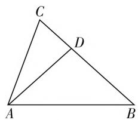
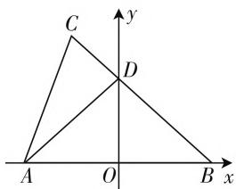
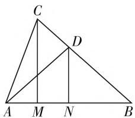

# 多思维切入,多方法破解

—— 一道解三角形问题的求解

# ● 江苏省宜兴市第二高级中学 杨文英

解三角形问题一直是模拟考试、会考、高考、自主招生考试及竞赛题中的“常客”，此类问题背景活泼多样，交汇性强，融合度高，能有效“串联”起解三角形、函数与方程、三角函数、平面几何、解析几何、不等式、平面向量等相关知识，切入角度多样，破解思维多变，解决方法有时也多种多样，是有效考查数学知识、数学思想、数学能力等方面的一个理想场所，倍受各方关注.

# 一、问题呈现

问题 （2020届江苏省泰州市高三5月份调研测试题·14）在 $\triangle ABC$ 中，点 $D$ 在边 $BC$ 上，且满足 $AD = BD, 3\tan^2 B - 2\tan A + 3 = 0$ ，则 $\frac{BD}{CD}$ 的取值范围为 \_\_\_\_.

此题以三角形为背景,结合边长关系与三角函数关系式的给出,来确定与三角形有关的线段比值的取值范围.要想顺利解决此题,需要我们灵活运用解三角形中的正弦定理、三角函数中的公式、函数与性质等相关知识将条件(或目标)进行合理转化, 同时也可以通过函数与方程(包括不等式)、建系中的坐标及平面几何中的引高等方法将条件(或目标)“换”一个“系统”来表示与转化, 从而得以巧妙破解, 进而使得此题在多种思维、多种解法中呈现出不一样的“精彩”.

text_image

C
D
A
B

图1

# 二、问题破解

# 思维视角一: 解三角形思维

解法 1: 因为 AD = BD，所以 $\angle DAB = \angle B$ 。在 $\triangle ACD$ 中，由正弦定理可得 $\frac{AD}{\sin C} = \frac{CD}{\sin \angle CAD}$ ，所以

$$
\begin{array}{l} \frac {B D}{C D} = \frac {A D}{C D} = \frac {\sin C}{\sin \angle C A D} \\ = \frac {\sin (\pi - A - B)}{\sin (A - B)} = \frac {\sin (A + B)}{\sin (A - B)} \\ \end{array}
$$

$$
= \frac {\sin A \cos B + \cos A \sin B}{\sin A \cos B - \cos A \sin B}.
$$

又因为 $3\tan^2 B - 2\tan A + 3 = 0$ ，所以 $2\cdot \frac{\sin A}{\cos A} = 3\left(\frac{\sin^2B}{\cos^2B} +1\right) = \frac{3}{\cos^2B}.$

所以 $\frac{BD}{CD} = \frac{\sin A\cos B + \cos A\sin B}{\sin A\cos B - \cos A\sin B}$

$$
\begin{array}{l} = \frac {\frac {\sin A}{\cos A} \cdot \cos B + \sin B}{\frac {\sin A}{\cos A} \cdot \cos B - \sin B} = \frac {\frac {3}{2 \cos^ {2} B} \cdot \cos B + \sin B}{\frac {3}{2 \cos^ {2} B} \cdot \cos B - \sin B} \\ = \frac {3 + 2 \sin B \cos B}{3 - 2 \sin B \cos B} = \frac {3 + \sin 2 B}{3 - \sin 2 B} = - 1 + \frac {6}{3 - \sin 2 B}. \\ \end{array}
$$

又点 $D$ 在边 $BC$ 上，则知 $0 < 2B < \pi$ ，则有 $0 < \sin 2B \leqslant 1$ ，所以 $\frac{BD}{CD} = -1 + \frac{6}{3 - \sin 2B} \in (1,2]$ .

故填答案:(1,2].

点评:根据条件,通过线段之间的转化,利用正弦定理,将边的关系转化为角的关系,利用齐次式的变形与转化,再利用三角关系式的转化与消元,结合三角恒等变换得到关于 $\sin2B$ 的三角关系式,利用三角函数的图像与性质来确定对应的取值范围问题.

# 思维视角二: 函数与方程思维

解法 2: 在 $\triangle ABC$ 中, 令 $\angle DAC = \alpha$ , 因为 AD = BD, 则 $\angle BAD = \angle B$ 且 A > B, $\frac{BD}{CD} = \frac{AD}{CD}$ , 在 $\triangle ACD$ 中, 由正弦定理, 令 $\lambda = \frac{AD}{CD} = \frac{\sin C}{\sin \alpha}$

$$
\begin{array}{l} = \frac {\sin (\pi - A - B)}{\sin (A - B)} = \frac {\sin (A + B)}{\sin (A - B)} \\ = \frac {\sin A \cos B + \cos A \sin B}{\sin A \cos B - \cos A \sin B} = \frac {\tan A + \tan B}{\tan A - \tan B}. \\ \end{array}
$$

整理可得 $(\lambda - 1)\tan A = (\lambda + 1)\tan B$ ，又点 $D$ 在边 $BC$ 上，则知 $0 < 2B < \pi$ ，即 $0 < B < \frac{\pi}{2}$ ，则 $D$ 不可能

为 $BC$ 的中点，故 $\lambda \neq 1$ ，所以 $\tan A = \frac{\lambda + 1}{\lambda - 1}\tan B.$ 由 $3\tan^2 B - 2\tan A + 3 = 0$ ，可知 $\tan A > 0$ ，故 $\tan B > 0$ 即 $\frac{\lambda + 1}{\lambda - 1} >0$ ，解得 $\lambda <   - 1$ 或 $\lambda >1.$

将 $\tan A = \frac{\lambda + 1}{\lambda - 1}\tan B$ 代入 $3\tan^2 B - 2\tan A + 3 = 0$ ，可得 $3\tan^2 B - \frac{2(\lambda + 1)}{\lambda - 1}\tan B + 3 = 0$ ，由于关于 $\tan B$ 的一元二次方程有实数根，则知判别式 $\Delta = 4\left(\frac{\lambda + 1}{\lambda - 1}\right)^2 - 4\times 3\times 3\geqslant 0$ ，即 $2\lambda^2 -5\lambda +2\leqslant 0$ ，解得 $\frac{1}{2}\leqslant \lambda \leqslant 2.$ 综合可得 $1 < \lambda \leqslant 2$ ，即 $\frac{BD}{CD}$ 的取值范围是(1,2].故填答案：(1,2].

点评:根据条件,通过线段之间的转化,利用正弦定理,将边的关系转化为角的关系,利用齐次式的变形与转化,通过引入参数,结合待定系数法,通过确定 $\tan A$ 与 $\tan B$ 的正负取值情况来求解不等式,在关于 $\tan B$ 的一元二次方程有实数根的条件下结合判别式的转化来求解不等式,从而得以确定对应的取值范围问题.

# 思维视角三:坐标思维

解法 3: 由 AD = BD，则以 AB 的中点 O 为坐标原点，AB 所在直线为 x 轴建立如图 2 所示的平面直角坐标系 xOy. 不妨设 $BD = \lambda, CD = 1$ ，则 $\frac{BD}{CD} = \lambda, B(\lambda \cos B, 0)$ ，$D(0, \lambda \sin B), A(-\lambda \cos B, 0)$ . 由 $\overrightarrow{BD} = \lambda \overrightarrow{DC}$ , 可得 $C(-\cos B, \lambda \sin B + \sin B)$ , 所以 $\tan A = k_{AC} = \frac{(\lambda + 1) \sin B}{(\lambda - 1) \cos B} = \frac{\lambda + 1}{\lambda - 1} \tan B$ . 由 $3 \tan^2 B - 2 \tan A + 3 = 0$ , 可得 $\tan A = \frac{3 \tan^2 B + 3}{2}$ . 又点 $D$ 在边 $BC$ 上, 则知 $0 < 2B < \pi$ , 即 $0 < B < \frac{\pi}{2}$ , 所以 $\frac{\lambda + 1}{\lambda - 1} = \frac{3}{2} \left( \tan B + \frac{1}{\tan B} \right) \geqslant \frac{3}{2} \times 2\sqrt{\tan B \times \frac{1}{\tan B}} = 3$ , 当且仅当 $\tan B = \frac{1}{\tan B}$ , 即 $\tan B = 1$ , 亦即 $B = \frac{\pi}{4}$ 时等号成立, 解得 $1 < \lambda \leqslant 2$ , 即 $\frac{BD}{CD}$ 的取值范围是 (1, 2].

text_image

C
y
D
A O B x

图2

故填答案:(1,2].

点评:根据条件,合理建立对应的平面直角坐标系,引入线段比的参数,进而确定对应点的坐标,结合平面向量的线性关系得到点C的坐标,利用直线的斜率公式来确定 $\tan A$ 的值,并利用条件关系式的转化与消元,结合基本不等式的应用与分式不等式的求解来确定对应的取值范围问题.

# 思维视角四: 平面几何思维

解法 4: 如图 3 所示, 过点 C 作 $CM \perp AB$ , 垂足为 M, 取 AB 的中点 N, 连接 DN. 令 $\lambda = \frac{BD}{CD} > 0$ , 因为 $CM \parallel DN$ , 所以 $\frac{BD}{CD} =$

text_image

C
D
A M N B

图3

$\frac{BN}{MN} = \lambda$ ，那么有 $\frac{BM}{AM} = \frac{BN + MN}{BN - MN} = \frac{\frac{BN}{MN} + 1}{\frac{BN}{MN} - 1} = \frac{\lambda + 1}{\lambda - 1}$ $= \frac{\tan A}{\tan B}$ . 由 $3\tan^2 B - 2\tan A + 3 = 0$ ，可得 $3\tan^2 B - \frac{2(\lambda + 1)}{\lambda - 1}\tan B + 3 = 0.$ 又点 $D$ 在边 $BC$ 上，则知 $0 < 2B$ $< \pi$ ，即 $0 < B < \frac{\pi}{2}$ ，所以 $2 \cdot \frac{\lambda + 1}{\lambda - 1} = 3\left(\tan B + \frac{1}{\tan B}\right) \geqslant 3 \times 2\sqrt{\tan B \times \frac{1}{\tan B}} = 6$ ，当且仅当 $\tan B = \frac{1}{\tan B}$ ，即 $\tan B = 1$ ，亦即 $B = \frac{\pi}{4}$ 时等号成立，则有 $\frac{\lambda + 1}{\lambda - 1} \geqslant 3$ ，解得 $1 < \lambda \leqslant 2$ ，即 $\frac{BD}{CD}$ 的取值范围是(1,2].

故填答案:(1,2].

点评:根据条件,结合平面几何图形的直观,利用辅助线的构造,通过底边AB上的线段之间的关系,将线段比的参数表示为 $\tan A$ 和 $\tan B$ 的关系式,并利用条件关系式的转化与消元,实现参数与 $\tan B$ 的分离,结合基本不等式的应用与分式不等式的求解来确定对应的取值范围问题.

在解三角形问题中,经常可以借助解三角形思维、函数与方程思维、坐标思维、平面几何思维等相关思维方式切入,从“数”的角度运算,从“形”的角度直观,从角度多层次来分析与处理问题.此类问题通过数学知识的交汇与融合,数学知识与方法的融会贯通,能有效培养良好的数学思维品质,提升解题能力,拓展数学应用,真正达到“在解中学”、“在学中悟”、“在悟中不断提升”的思维习惯,以不变应万变,提升解题思维与解题能力,培养核心素养.W