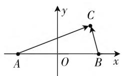
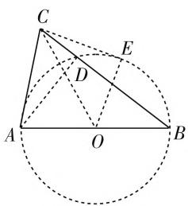

# 小题大做,以小搏大

——2020年全国Ⅲ卷(文)第6题

● 江苏省南通市海门四甲中学 施振伟

轨迹方程的求解或轨迹的确定是平面解析几何中的一个基本问题与热点问题，此类问题以平面解析几何为大背景，合理交汇与融合平面向量、平面几何、函数与方程、三角函数、解三角形、不等式、圆锥曲线等众多的相关知识，充分体现高考命题“在知识交汇处设置创新问题”的指导思想，考查学生的数学知识、数学方法和数学能力，有效实现高考的合理性区分与针对性选拔的功能。

# 一、真题呈现

高考真题 （2020年高考数学全国Ⅲ卷文科第6题）在平面内，A, B 是两个定点，C 是动点，若 $\overrightarrow{AC} \cdot \overrightarrow{BC} = 1$ ，则点 C 的轨迹为（）.

A. 圆

B. 椭圆

C. 抛物线

D. 直线

此题以平面解析几何为问题背景,借助两定点与一动点这一“动”一“静”的和谐统一,以及平面向量的数量积关系式的给出,进而来确定动点的轨迹问题.问题简单明了,切入方便快捷,破解思维多样,难度简单适中,适合各层次的学生.

# 二、真题破解

# 思维视角一:坐标思维

解法 1: (建系法) 设 $\left|AB\right|=2a(a>0)$ ，以 AB 的中点 O 为坐标原点，建立如图 1 所示的平面直角坐标系，则 $A(-a,0), B(a,0)$ 。设 $C(x,y)$ ，可得 $\overrightarrow{AC} = (x + a, y), \overrightarrow{BC} = (x - a, y)$ ，那么 $\overrightarrow{AC} \cdot \overrightarrow{BC} = (x + a)(x - a) + y^2 = x^2 + y^2 - a^2 = 1$ ，整理可得 $x^2 + y^2 = a^2 + 1$ ，所以点 $C$ 的轨迹是以 $AB$ 的中点 $O$ 为圆心， $\sqrt{a^2 + 1}$ 为半径的圆.

故选择答案:A.

  
图1

点评:根据题目条件,建立合适的平面直角坐标系,利用平面向量的坐标运算与数量积公式加以转化,进而确定动点的坐标所满足的关系式,有效确定动点的轨迹.利用建系法处理此类问题是一种常规方法,也是首选方法,化平面向量的数量积为坐标问题,借助代数运算来分析与转化,方程视角,通俗易懂.

# 思维视角二:平面向量思维

解法2:(平面向量的线性运算法)设线段AB的中点为O, $|AB|=2a(a>0)$ ,可得 $1=\overrightarrow{AC}\cdot\overrightarrow{BC}=\overrightarrow{CA}\cdot\overrightarrow{CB}=(\overrightarrow{CO}+\overrightarrow{OA})\cdot(\overrightarrow{CO}+\overrightarrow{OB})=(\overrightarrow{CO}+\overrightarrow{OA})\cdot(\overrightarrow{CO}-\overrightarrow{OA})=|\overrightarrow{CO}|^{2}-|\overrightarrow{OA}|^{2}=|\overrightarrow{CO}|^{2}-a^{2}$ ，则有 $|\overrightarrow{CO}|^{2}=a^{2}+1$ ，即 $|\overrightarrow{CO}|=\sqrt{a^{2}+1}$ ，所以点C的轨迹是以AB的中点O为圆心， $\sqrt{a^{2}+1}$ 为半径的圆.

故选择答案:A.

点评:根据题目条件,通过平面向量关系式的转化,结合线段中点的介入,利用平面向量的线性运算加以转化与应用,结合平面向量的线性转化,并结合圆的定义来确定动点的轨迹.平面向量的线性运算法是以基底法为基础,借助线性运算加以合理转化与应用,是破解此类问题比较常见的一类技巧方法.

# 思维视角三: 解三角形思维

解法 3: (余弦定理法) 设线段 AB 的中点为 O, $\left|AB\right|=2a(a>0)$ ，当动点 C 不在直线 AB 上时，结合平面向量的余弦定理，可得 $1=\overrightarrow{AC}\cdot\overrightarrow{BC}=\overrightarrow{CA}\cdot\overrightarrow{CB}$

$$
\begin{array}{l} = | \overrightarrow {C A} | | \overrightarrow {C B} | \cos \angle A C B \\ = | \overrightarrow {C A} | | \overrightarrow {C B} | \cdot \frac {| \overrightarrow {C A} | ^ {2} + | \overrightarrow {C B} | ^ {2} - | \overrightarrow {A B} | ^ {2}}{2 | \overrightarrow {C A} | | \overrightarrow {C B} |} \\ = \frac {\left| \overrightarrow {C A} \right| ^ {2} + \left| \overrightarrow {C B} \right| ^ {2} - \left| \overrightarrow {A B} \right| ^ {2}}{2} \\ = \frac {2 (\mid \overrightarrow {C O} \mid^ {2} + \mid \overrightarrow {O A} \mid^ {2}) - \mid \overrightarrow {A B} \mid^ {2}}{2} \\ = | \overrightarrow {C O} | ^ {2} - a ^ {2}; \\ \end{array}
$$

当动点 C 在直线 AB 上时，可得 $1 = \overrightarrow{AC} \cdot \overrightarrow{BC} = \overrightarrow{CA} \cdot \overrightarrow{CB} = (|\overrightarrow{CO}| + a)(|\overrightarrow{CO}| - a) = |\overrightarrow{CO}|^{2} - a^{2}$ .

综上分析，可得 $|\overrightarrow{CO}|^2 = a^2 + 1$ ，即 $|\overrightarrow{CO}| = \sqrt{a^2 + 1}$ ，所以点 $C$ 的轨迹是以 $AB$ 的中点 $O$ 为圆心， $\sqrt{a^2 + 1}$ 为半径的圆.

故选择答案:A.

点评:根据题目条件,通过平面向量关系式的转化,利用动点是否在定直线上加以分类讨论,借助平面向量的余弦定理,以及平面向量的中线定理等进行转化,通过平面向量的运算,并结合圆的定义来确定动点的轨迹.利用余弦定理法处理此类问题的前提是能够确定相应的三角形,因而要加以分类讨论,也是平面向量与解三角形密切联系的一种转化与应用.

# 思维视角四: 平面几何思维

解法 4: (圆的切割线转化法) 设线段 AB 的中点为 O, $\left|AB\right|=2a(a>0)$ ，当动点 C 不在直线 AB 上时，以线段 AB 为直径作圆 O，交 BC 于点 D，连接 AD, OC，则有 $AD \perp BC$ ，过点 C 作圆 O 的切线 CE，切点为 E，连接 OE，则 $OE \perp CE$ ，如图2, 根据平面向量的投影, 可得 $1 = \overrightarrow{AC} \cdot \overrightarrow{BC} = \overrightarrow{CA} \cdot \overrightarrow{CB} = |CD| \cdot |CB| = |CE|^2 = |\overrightarrow{CO}|^2 - |\overrightarrow{OE}|^2 = |\overrightarrow{CO}|^2 - a^2$ ;

text_image

Geometric diagram showing a triangle ABC inscribed in a circle with auxiliary points D, E, and center O, including dashed lines indicating construction or proof.

图2

当动点 C 在直线 AB 上时，可得 $1 = \overrightarrow{AC} \cdot \overrightarrow{BC} = \overrightarrow{CA} \cdot \overrightarrow{CB} = (|\overrightarrow{CO}| + a)(|\overrightarrow{CO}| - a) = |\overrightarrow{CO}|^{2} - a^{2}$ .

综上分析，可得 $|\overrightarrow{CO}|^2 = a^2 + 1$ ，即 $|\overrightarrow{CO}| = \sqrt{a^2 + 1}$ ，所以点 $C$ 的轨迹是以 $AB$ 的中点 $O$ 为圆心， $\sqrt{a^2 + 1}$ 为半径的圆.

故选择答案:A.

点评:根据题目条件,通过平面向量关系式的转化,利用动点是否在定直线上加以分类讨论,结合平面向量的投影的几何意义,以及平面几何中的圆的性质,切割线定理,勾股定理等相关知识,并结合圆的定义来确定动点的轨迹.平面几何法处理平面向量问题,也是平面向量的“形”的特征的重要体现,数形结合,直观处理.

# 思维视角五:极端思维

解法 5: (极端位置法) 由于 A, B 是平面内的两个定点, 取极端位置 —— A, B 重合, 两点合二为一, 此时 $\overrightarrow{AC} \cdot \overrightarrow{BC} = |\overrightarrow{AC}|^2 = 1$ ，则点 $C$ 的轨迹为以 $A$ 为圆心，1 为半径的圆.

故选择答案:A.

点评:根据题目条件,以特殊代表一般,取平面内的两个定点A,B的极端位置——A,B重合,达到两点合二为一来分析与处理问题,并把特殊情况下得到的结论反馈到题目中去,选择与之相符合的结论,从而得以巧妙破解.极端位置法处理一些问题具有非常巧妙有效的效果,只是有时容易因为问题的特殊性而导致错误.

# 三、变式拓展

探究 1: 根据以上高考真题及其破解过程, 可以将此类问题进一步加以合理总结与归纳, 得以深入拓展, 可以得到以下相关的一般性结论.

结论 1: 在平面内, A, B 是两个定点, C 是动点, 若 $\overrightarrow{AC} \cdot \overrightarrow{BC} = k$ , 且满足 $\frac{1}{4} |\overrightarrow{AB}|^{2} + k > 0$ , 则点 C 的轨迹以线段 AB 的中点为圆心的圆.

证明:设线段 AB 的中点为 O, $\left|AB\right|=2a(a>0)$ , 可得 $k=\overrightarrow{AC}\cdot\overrightarrow{BC}=\overrightarrow{CA}\cdot\overrightarrow{CB}=(\overrightarrow{CO}+\overrightarrow{OA})\cdot(\overrightarrow{CO}+\overrightarrow{OB})=(\overrightarrow{CO}+\overrightarrow{OA})\cdot(\overrightarrow{CO}-\overrightarrow{OA})=\left|\overrightarrow{CO}\right|^{2}-\left|\overrightarrow{OA}\right|^{2}=\left|\overrightarrow{CO}\right|^{2}-a^{2}$ ，则有 $\left|\overrightarrow{CO}\right|^{2}=a^{2}+k=\frac{1}{4}\left|\overrightarrow{AB}\right|^{2}+k>0$ ，即 $\left|\overrightarrow{CO}\right|=\sqrt{\frac{1}{4}\left|\overrightarrow{AB}\right|^{2}+k}$ ，所以点 C 的轨迹是以 AB 的中点 O 为圆心， $\sqrt{\frac{1}{4}\left|\overrightarrow{AB}\right|^{2}+k}$ 为半径的圆.

点评:根据该结论,以上高考真题中,k=1,则点C的轨迹是以AB的中点O为圆心, $\sqrt{\frac{1}{4}\left|\overrightarrow{AB}\right|^{2}+k}=\sqrt{a^{2}+1}$ 为半径的圆.

# 四、解后反思

结合典型高考真题的“小题大做”，继承与发扬优秀高考真题的本质，通过合理的分析、学习、借鉴与应用，进行多角度思考、分析、解决、变式、拓展、总结与归纳，从而借题发挥，探索破解问题的一般性规律与策略方法，真正达到“做一题，通一类，会一片”的“以小搏大”的良好目的，避免不必要的“题海战术”，实现数学教学与学习的优化，提升数学能力，培养数学核心素养。F