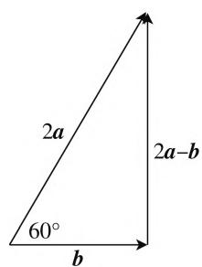
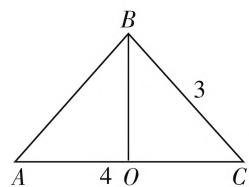
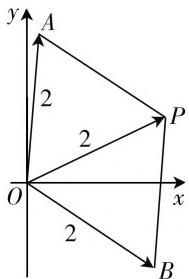

# 巧构平面几何,妙解高考问题

# 甘肃省民乐县职业教育中心学校 张成仁

平面几何图形具有“形”的直观性与特殊性，是大家所熟知的基本平面图形之一，基础性好，直观形象，与高中数学中的平面向量、解三角形、复数、解析几何等具有相同的几何特性，也是这些相关知识的几何意义与图形基础。在解决这些相关的高考问题时，借助平面几何图形（角、三角形、平面四边形或圆等），利用平面几何的性质来数形结合，直观操作，解决问题更加直观，方向感强，效益性高。

# 一、平面几何在平面向量中的应用

平面向量自身含有角、三角形、平面四边形、圆等相关的平面几何内涵，其中线性运算涉及三角形法则或平行四边形法则，模涉及圆，夹角涉及角等，利用平面几何所具备的平面几何这一“形”的特征，为相关问题的破解提供条件.

例 1 （2020 年高考数学全国 II 卷文科第 5 题）已知单位向量 a, b 的夹角为 $60^{\circ}$ ，则在下列向量中，与 b 垂直的是（）.

$$
\mathrm{A.} a + 2 b \quad \mathrm{B.} 2 a + b \quad \mathrm{C.} a - 2 b \quad \mathrm{D.} 2 a - b
$$

分析:借助单位向量的长度及向量的夹角,结合平面向量的加、减法运算,通过平面几何的作图分析,结合直角三角形的性质可以直观判断 2a-b 与 b 垂直,从而得以正确判断.

解析:如图1所示,由于单位向量a,b的夹角为 $60^{\circ}$ ,结合直角三角形的性质,可知2a-b与b垂直.

故选择答案:D.

点评:结合三角形的构造,把对应的平面向量的夹角、模及加或减运算等问题转化为三角形的边、角的关系，借助几何直观，利用平面几何的性质特征，可以快捷转化相应的边、角等相关问题，直观形象，效果良好。借助平面几何的图形特征来处理平面向量问题，解答更直观，更可行。

text_image

2a
60°
b
2a-b

图1

# 二、平面几何在解三角形中的应用

解三角形自身含有平面几何的丰富内涵, 是平面几何知识的深入与拓展. 利用平面几何知识, 将复杂的解三角形问题借助平面几何图形的直观, 进行合理的切割、补形等操作, 转化为特殊的三角形模型——直角三角形、等腰三角形或等边三角形等, 利用平面几何的相关知识来解决解三角形的相关问题.

例 2 （2020 年高考数学全国Ⅲ卷文科第 11 题）在 $\triangle ABC$ 中， $\cos C = \frac{2}{3}$ ，AC = 4，BC = 3，则 $\tan B = (\quad)$ .

A. $\sqrt{5}$

B. $2\sqrt{5}$

C. $4\sqrt{5}$

D. $8\sqrt{5}$

分析:作出相应的三角形直观图形,先确定点 B 在 AC 上的射影 O, 结合三角函数的定义及三角形的性质特征来确定三角形的形状, 结合三角函数的定义及正切的二倍角公式的应用来求解对应的三角函数值.

解析:如图2所示,点B在AC上的射影为O,结合三角函数的定义有 $\cos C=\frac{OC}{BC}=\frac{2}{3}$ ,可得OC=2,那么OB= $\sqrt{BC^{2}-OC^{2}}=\sqrt{5}$ ,而OA=$AC - OC = 2 = OC$ ，即 $O$ 为 $AC$ 的中点，故 $\triangle ABC$ 是以 $B$ 为顶点的等腰三角形，结合三角函数的定义有 $\tan \frac{B}{2} = \frac{OC}{OB} = \frac{2}{\sqrt{5}}$ ，利用二倍角公式可得 $\tan B =$ $\frac{2\tan\frac{B}{2}}{1 - \tan^2\frac{B}{2}} = 4\sqrt{5}.$

text_image

B
3
A 4 O C

图2

故选择答案:C.

点评: 构造平面几何模型, 抓住三角形的直观图形, 利用条件来确定具体三角形的形状与特征, 为进一步求解相应的三角形提供条件. 构造平面几何模型在解三角形相关问题中可以快速确定相应的边、角等要素，从而达到有效，直观，快速确定解三角形中的相关几何量的目的，为问题的破解奠定基础。

# 三、平面几何在复数中的应用

复数自身含有平面几何的内涵, 复数的几何意义、复数的相关概念及复数的四则运算等方面都有平面几何的影子. 借助平面几何知识, 可以将复数这一代数问题转化为对应的平面几何问题, “数” 向“形”的合理转化, 从而有效利用平面几何知识来处理一些复数的相关问题.

例 3 （2020 年高考数学全国 II 卷理科第 15 题）设复数 $z_{1}, z_{2}$ 满足 $\left|z_{1}\right| = \left|z_{2}\right| = 2, z_{1} + z_{2} = \sqrt{3} + i$ ，则 $\left|z_{1} - z_{2}\right| =$ \_\_\_\_.

分析:根据题目条件合理构造特殊的平面几何图形——平行四边形(菱形)来处理,抓住复数的几何意义,结合菱形的性质,数形结合,直观形象,破解起来简单巧妙,避免复杂的代数运算.

解析:由于 $z_{1} + z_{2} = z_{3} = \sqrt{3} + i$ ，则有 $\left|z_{1}\right| = \left|z_{2}\right| = \left|z_{3}\right| = 2$ ，如图3所示，在复平面内，构造特殊的平面几何图形——平行四边形，设复数 $z_{1}, z_{2}, z_{3}$ 所对应的点分别为 A, B, P（起点均为坐标原点 O），由复数的几何意义可知， $\left|z_{1} + z_{2}\right|$ 和 $\left|z_{1} - z_{2}\right|$ 是以平面向量 $\overrightarrow{OA}$ 和 $\overrightarrow{OB}$ 为两邻边的平行四边形的两条对角线的长，由于平行四边形 OAPB 是边长为 2，一条对角线长为 2 的菱形，所以该菱形的另一条对角线长为 $\left|z_{1}-z_{2}\right|=2\sqrt{3}$ .

text_image

y
A
2
P
2
O
x
2
B

图3

故填答案: $2\sqrt{3}$ .

点评:结合复数的几何意义,合理构造与之对应的平面几何图形,借助特殊平面几何图形这一基本数学模型,从复数的几何意义角度出发,数形结合,直观想象,可以直观形象地处理相关问题,特别是在选择题和填空题中,显得更加有效、更加快捷.

# 四、平面几何在解析几何中的应用

解析几何中的点、直线、圆、圆锥曲线等相关知识是在平面直角坐标系背景中的平面几何问题，是平面几何的延伸。借助平面几何中的平行、垂直、三角形、圆等相关知识，有效沟通平面几何与解析几何问题之间的联系，是平面几何综合应用的提升与拓展。

例 4 （2020 年高考数学天津卷第 18 题）已知椭圆 $\frac{x^{2}}{a^{2}} + \frac{y^{2}}{b^{2}} = 1 (a > b > 0)$ 的一个顶点为 A(0, -3)，右焦点为 F，且 $|OA| = |OF|$ ，其中 O 为原点.

（Ⅰ）求椭圆的方程；

（Ⅱ）已知点 C 满足 $3\overrightarrow{OC}=\overrightarrow{OF}$ ，点 B 在椭圆上（B 异于椭圆的顶点），直线 AB 与以 C 为圆心的圆相切于点 P，且 P 为线段 AB 的中点。求直线 AB 的方程。

分析:(Ⅰ)根据条件确定相应参数的值,进而得以确定椭圆的方程;(Ⅱ)根据条件,利用平面向量的线性关系得到点C的坐标,以及 $|CA|$ 的值,利用圆的切线的性质,以及中点的性质,确定点B是以C为圆心、 $|CA|$ 为半径的圆与椭圆的交点,联立方程组得以确定点B的坐标,通过直线的斜率的确定得以求解直线AB的方程.

解析:(Ⅰ)由已知可得 b=3, 记半焦距为 c, 由 $\left|OA\right|=\left|OF\right|$ , 可得 c=b=3. 由 $a^{2}=b^{2}+c^{2}$ , 可得 $a^{2}=18$ , 所以椭圆的方程为 $\frac{x^{2}}{18}+\frac{y^{2}}{9}=1$ .

（Ⅱ）由 $3\overrightarrow{OC} = \overrightarrow{OF}$ ，得点 $C$ 的坐标为 $(1,0)$ ，而 $A(0, -3)$ ，则 $|CA| = \sqrt{10}$ 。因为直线 $AB$ 与以 $C$ 为圆心的圆相切于点 $P$ ，且 $P$ 为线段 $AB$ 的中点，所以 $AB \perp CP$ ， $|CA| = |CB|$ ，所以点 $B$ 是以 $C$ 为圆心、 $|CA|$ 为半径的圆 $(x - 1)^2 + y^2 = 10$ 与椭圆 $\frac{x^2}{18} + \frac{y^2}{9} = 1$ 的交点。由方程组 $\left\{ \begin{array}{l} (x - 1)^2 + y^2 = 10, \\ \frac{x^2}{18} + \frac{y^2}{9} = 1, \end{array} \right.$ 消去 $y$ ，可得 $x^2 - 4x = 0$ ，解得 $x = 0$ 或 $x = 4$ 。因为 $B$ 是异于椭圆的顶点，所以 $x = 4$ ，代入椭圆 $\frac{x^2}{18} + \frac{y^2}{9} = 1$ ，可得 $y = \pm 1$ ，即 $B(4, -1)$ 或 $B(4,1)$ ，所以直线 $AB$ 的方程为 $y = \frac{-1 + 3}{4 - 0} x - 3$ 或 $y = \frac{1 + 3}{4 - 0} x - 3$ ，即 $y = \frac{1}{2} x - 3$ 或 $y = x - 3$ 。

点评:巧妙借助平面几何中圆的一些几何性质,确定圆的图形或方程,相关线段之间的乘积关系或比例关系等来解决一些相关问题.借助平面几何思维与知识,合理地把圆的知识与圆锥曲线中的相关问题加以合理链接,从而得以求解解析几何中的相关问题.借助平面几何中的圆的方程、几何性质、定义等来处理解析几何问题,思路巧妙,解法简单,简化运算,提升效益.W