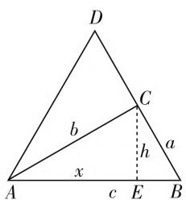

# 思维显身手,方法现本质

—— 一道解三角形题的探究

● 江苏省宜兴中学 朱卫萍

以三角形为载体的解三角形最值问题,形式直观,背景新颖,创新性强,活泼多样,知识交汇点多,思维方式多变,破解方法多样,一直是历年高考与竞赛命题中的热点之一,有很好的选拔性与区分度,倍受关注.

# 一、问题呈现

问题 （2020 届江苏省南通市高三考前卷（四）·14）在 $\triangle ABC$ 中， $2BC^{2} + AB^{2} = 2AC^{2}$ ，且 BC 延长线上的点 D 满足 DA = DB，则 $\angle DAC$ 的最大值为 \_\_\_\_.

此题以三角形为问题背景,借助解三角形中正弦定理与余弦定理的灵活运用,从三角函数思维、解三角形思维、坐标思维及平面几何思维等角度切入,综合三角形的几何特征、三角恒等变换公式、三角函数的图像与性质,以及基本不等式等来考查最值问题.

# 二、问题破解

# 思维视角一:三角函数思维

解法1:(三角函数有界性法)记 $\triangle ABC$ 中内角A,B,C所对应的边分别为a,b,c,由 $2BC^{2}+AB^{2}=2AC^{2}$ ,可得 $c^{2}=2b^{2}-2a^{2}$ ,即 $b^{2}-a^{2}=\frac{1}{2}c^{2}$ .由BC延长线上的点D满足DA=DB,可知 $B=\angle DAB$ ,所以 $\angle DAC=B-A$ .由 $b^{2}-a^{2}=\frac{1}{2}c^{2}$ ,结合正弦定理可得 $\sin^{2}B-\sin^{2}A=\frac{1}{2}\sin^{2}C$ .而 $\sin^{2}B-\sin^{2}A=\sin^{2}B-\sin^{2}A\sin^{2}B-\sin^{2}A+\sin^{2}A\sin^{2}B=\sin^{2}B(1-\sin^{2}A)-\sin^{2}A(1-\sin^{2}B)=\sin^{2}B\cos^{2}A-\sin^{2}A\cos^{2}B=(\sin B\cos A+\cos B\sin A)(\sin B\cos A-\cos B\sin A)=\sin(B+A)\sin(B-A)=\frac{1}{2}\sin^{2}C$ ,由于 $\sin(B+A)=$

$\sin C > 0$ ，则知 $\sin (B - A) = \frac{1}{2}\sin C\leqslant \frac{1}{2}$ 当且仅当 $C$ $= \frac{\pi}{2}$ 时等号成立，此时 $\angle DAC = B - A = \frac{\pi}{6}$ ，所以 $\angle DAC$ 的最大值为 $\frac{\pi}{6}$

故填答案: $\frac{\pi}{6}$ .

解法2：(三角恒等变换＋基本不等式法1)记 $\triangle ABC$ 中内角 $A,B,C$ 所对应的边分别为 $a,b,c$ ，由 $2BC^{2}+AB^{2}=2AC^{2}$ ，可得 $c^{2}=2b^{2}-2a^{2}$ .由 $BC$ 延长线上的点 $D$ 满足 $DA=DB$ ，可知 $B=\angle DAB$ ，所以 $\angle DAC=B-A$ .由 $c^{2}=2b^{2}-2a^{2}$ ，结合正弦定理可得 $2\sin^{2}B-2\sin^{2}A=\sin^{2}C$ ，即 $2(\sin B+\sin A)(\sin B-\sin A)=\sin^{2}C$ ，利用和差化积公式有 $2\times2\sin\frac{B+A}{2}\cdot\cos\frac{B-A}{2}\times2\cos\frac{B+A}{2}\sin\frac{B-A}{2}=\sin^{2}C$ ，即 $2\sin(B+A)\sin(B-A)=\sin^{2}C=\sin^{2}(B+A)$ .由 $\sin(B+A)>0$ ，可得 $2\sin(B-A)=\sin(B+A)$ ，展开有 $2(\sin B\cos A-\cos B\sin A)=\sin B\cos A+\cos B\sin A$ ，整理化简可得 $\tan B=3\tan A$ ，显然 $A$ 为锐角，而 $\tan(B-A)=\frac{\tan B-\tan A}{1+\tan B\tan A}=\frac{2\tan A}{1+3\tan^{2}A}=\frac{2}{\frac{1}{\tan A}+3\tan A}\leqslant\frac{2}{2\sqrt{\frac{1}{\tan A}\times 3\tan A}}=\frac{\sqrt{3}}{3}$ ，当且仅当 $\frac{1}{\tan A}=3\tan A$ ，即 $\tan A=\frac{\sqrt{3}}{3}$ ，亦即 $A=\frac{\pi}{6}$ 时等号成立，此时 $\angle DAC=B-A=\frac{\pi}{6}$ ，所以 $\angle DAC$ 的最大值为 $\frac{\pi}{6}$ .

故填答案: $\frac{\pi}{6}$ .

点评:根据题目条件,通过三角形中边长之间的关系,结合正弦定理的转化,利用同角三角函数基本关系式、和差化积公式、二倍角公式等加以三角恒等变换,通过三角函数的有界性转化,或结合基本不等式的应用来确定对应的最值问题,进而得以求解对应角的最大值问题.

# 思维视角二: 解三角形思维

解法3:(解三角形+基本不等式法1)记 $\triangle ABC$ 中内角 $A,B,C$ 所对应的边分别为 $a,b,c$ ,由 $2BC^{2}+AB^{2}=2AC^{2}$ ,可得 $2a^{2}+c^{2}=2b^{2}$ .由 $BC$ 延长线上的点 $D$ 满足 $DA=DB$ ,可知 $B=\angle DAB$ ,所以 $\angle DAC=B-A$ ,结合余弦定理 $b^{2}=a^{2}+c^{2}-2ac\cos B$ ,则有 $2a^{2}+2c^{2}-4ac\cos B=2b^{2}=2a^{2}+c^{2}$ ,整理有 $c=4a\cos B$ ,结合正弦定理 $\sin C=4\sin A\cos B$ ,显然 $B$ 为锐角,则知 $\sin C=\sin(A+B)=4\sin A\cos B$ ,展开有 $\sin A\cos B+\cos A\sin B=4\sin A\cos B$ ,整理化简可得 $\tan B=3\tan A$ ,显然 $A$ 为锐角,而 $\tan(B-A)=\frac{\tan B-\tan A}{1+\tan B\tan A}=\frac{2\tan A}{1+3\tan^{2}A}=\frac{2}{\frac{1}{\tan A}+3\tan A}\leqslant\frac{2}{2\sqrt{\frac{1}{\tan A}\times 3\tan A}}=\frac{\sqrt{3}}{3}$ ,当且仅当 $\frac{1}{\tan A}=3\tan A$ ,即 $\tan A=\frac{\sqrt{3}}{3}$ ,亦即 $A=\frac{\pi}{6}$ 时等号成立,此时 $\angle DAC=B-A=\frac{\pi}{6}$ ,所以 $\angle DAC$ 的最大值为 $\frac{\pi}{6}$ .

故填答案: $\frac{\pi}{6}$ .

点评:根据题目条件,通过三角形中边长之间的关系,结合正弦定理、余弦定理的转化,结合三角恒等变换的应用,进而得以确定角A、B的正切值之间的关系,结合所求角的正切值的转化,并借助基本不等式来确定对应的最值问题,进而得以求解对应角的最大值问题.回归解三角形本质,自然流畅.

# 思维视角三:平面几何思维

解法4:(平面几何+基本不等式法1)记 $\triangle ABC$ 中内角A,B,C所对应的边分别为a,b,c,由 $2BC^{2}+AB^{2}=2AC^{2}$ ,可得 $c^{2}=2b^{2}-2a^{2}$ .由BC延长线上的点D满足DA=DB,可知 $B=\angle DAB$ ,所以 $\angle DAC=B-A$ .

text_image

D
C
b
h
a
x
A
c
E
B

图1

如图1所示，过点 $C$ 作 $CE \perp AB$ 交 $AB$ 于点 $E$ ，设 $AE = x, CE = h$ ，则 $BE = c - x$ ，结合勾股定理可得 $\left\{ \begin{array}{l} b^{2} = x^{2} + h^{2}, \\ a^{2} = (c - x)^{2} + h^{2}, \end{array} \right.$ 两式相减 $b^{2} - a^{2} = 2cx - c^{2} = \frac{1}{2} c^{2}$ ，所以 $x = \frac{3}{4} c$ 。由于 $\tan A = \frac{h}{x} = \frac{4h}{3c}, \tan B = \frac{h}{c - x} = \frac{4h}{c}$ ，则知 $\tan B = 3\tan A$ ，显然 $A$ 为锐角，而 $\tan (B - A) = \frac{\tan B - \tan A}{1 + \tan B\tan A} = \frac{2\tan A}{1 + 3\tan^2A} = \frac{2}{\frac{1}{\tan A} + 3\tan A} \leqslant \frac{2}{2\sqrt{\frac{1}{\tan A} \times 3\tan A}} = \frac{\sqrt{3}}{3}$ ，当且仅当 $\frac{1}{\tan A} = 3\tan A$ ，即 $\tan A = \frac{\sqrt{3}}{3}$ ，亦即 $A = \frac{\pi}{6}$ 时等号成立，此时 $\angle DAC = B - A = \frac{\pi}{6}$ ，所以 $\angle DAC$ 的最大值为 $\frac{\pi}{6}$ 。

故填答案: $\frac{\pi}{6}$ .

# 三、变式拓展

探究 1: 保留三角形中相关边长之间的关系, 改变相关的条件, 改求解相应角的最大值问题为条件, 进而探求相关的问题, 得到以下相应的变式问题.

变式1:(2020届广东省华南师大附中、实验中学、广雅中学、深圳中学高三上期末联考·16)在 $\triangle ABC$ 中,角A,B,C所对的边分别为a,b,c, $2b^{2}=2a^{2}+c^{2}$ ,当 $\tan(B-A)$ 取最大值时,角A的值为\_\_\_\_.

该问题的解决过程可以直接结合以上问题的破解过程,即可确定 $A=\frac{\pi}{6}$ .

故填答案: $\frac{\pi}{6}$ .

# 四、解后反思

以三角形为载体的最值或取值范围问题一直是解三角形问题中的重点与难点之一，既有“数”的表达形式，又有“形”的直观存在，交汇性强，融合度高，新颖创新。充分体现新课标大纲中在“知识点交汇处”命题的指导思想，能有效且巧妙地把平面几何、解三角形、三角函数、函数与方程、不等式、导数等相关知识加以合理整合，可以很好地考查数学知识、数学方法与数学能力，提升数学品质，培养数学核心素养。F