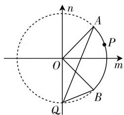

# 抓住实质,链接高考,探究拓展

—— 一道函数最值题的破解

● 江苏省横林高级中学 丁丽琳

函数的基本性质是历年高考数学中的必考知识点与热点之一,特别是函数的奇偶性,其反映了函数解析式的对应关系、函数图像的对称性情况等,体现了函数中“数”与“形”两者之间的密切联系与和谐统一.在实际解题过程中,往往要对条件中给出的函数解析式进行必要的变形与恒等转化,这个过程可以很好考查考生的数学知识与数学能力,从而在此基础上确定其中的相应函数解析式的奇偶性,为进一步的分析与求解提供条件,实现“数”与“形”的合理转化与应用.

# 一、问题呈现

问题 （2021届湖北省武汉市部分学校高三起点质量检测数学试卷·15）设函数 $f(x)=\ln\frac{1+\sin x}{2\cos x}$ 在区间 $\left[-\frac{\pi}{4},\frac{\pi}{4}\right]$ 上的最小值和最大值分别为 m 和 M，则 $m+M=$ \_\_\_\_.

此题巧妙把对数函数、三角函数加以交汇与复合，求解复合函数在给定区间上的最小值和最大值的和的定值。根据函数解析式的特征，可以从解析式内涵入手，利用三角恒等变换来处理；可以从解析式结构入手，利用直线斜率的几何意义来处理；还可以从函数性质实质入手，利用函数基本性质来处理等。方法多样，精彩纷呈。

# 二、问题破解

解法1:(三角恒等变换法)由于 $x\in\left[-\frac{\pi}{4},\frac{\pi}{4}\right]$ ，
可得 $\frac{x}{2}\in\left[-\frac{\pi}{8},\frac{\pi}{8}\right]$ ，从而 $\sin\frac{x}{2}+\cos\frac{x}{2}=$ $\sqrt{2}\sin\left(\frac{x}{2}+\frac{\pi}{4}\right)>0,\tan\frac{x}{2}\in\left[-\tan\frac{\pi}{8},\tan\frac{\pi}{8}\right]$

由于 $f(x) = \ln \frac{1 + \sin x}{2\cos x}$

$$
= \ln \frac {\sin^ {2} \frac {x}{2} + \cos^ {2} \frac {x}{2} + 2 \sin \frac {x}{2} \cos \frac {x}{2}}{2 \left(\cos^ {2} \frac {x}{2} - \sin^ {2} \frac {x}{2}\right)}
$$

$$
\begin{array}{l} = \ln \frac {\left(\sin \frac {x}{2} + \cos \frac {x}{2}\right) ^ {2}}{2 \left(\cos \frac {x}{2} + \sin \frac {x}{2}\right) \left(\cos \frac {x}{2} - \sin \frac {x}{2}\right)} \\ = \ln \frac {\cos \frac {x}{2} + \sin \frac {x}{2}}{\cos \frac {x}{2} - \sin \frac {x}{2}} - \ln 2 = \ln \frac {1 + \tan \frac {x}{2}}{1 - \tan \frac {x}{2}} - \ln 2 \\ = \ln \left(\frac {2}{1 - \tan \frac {x}{2}} - 1\right) - \ln 2. \\ \end{array}
$$

又 $\tan \frac{\pi}{8} = \frac{\sin\frac{\pi}{8}}{\cos\frac{\pi}{8}} = \frac{2\sin^2\frac{\pi}{8}}{2\sin\frac{\pi}{8}\cos\frac{\pi}{8}} = \frac{1 - \cos\frac{\pi}{4}}{\sin\frac{\pi}{4}} =$

$\sqrt{2} - 1$ ，可得 $\sqrt{2} - 1 = \frac{2}{1 + \tan \frac{\pi}{8}} - 1 \leqslant \frac{2}{1 - \tan \frac{x}{2}} - 1$

$$
\leqslant \frac {2}{1 - \tan \frac {\pi}{8}} - 1 = \sqrt {2} + 1, \text {所以} \ln (\sqrt {2} - 1) - \ln 2 \leqslant
$$

$$
\ln \left(\frac {2}{1 - \tan \frac {x}{2}} - 1\right) - \ln 2 \leqslant \ln (\sqrt {2} + 1) - \ln 2, \text {即} m =
$$

$$
\ln (\sqrt {2} - 1) - \ln 2, M = \ln (\sqrt {2} + 1) - \ln 2, \text {从而} m + M =
$$

$$
\ln (\sqrt {2} - 1) - \ln 2 + \ln (\sqrt {2} + 1) - \ln 2 = \ln [ (\sqrt {2} - 1) (\sqrt {2}
$$

$$
+ 1) ] - 2 \ln 2 = \ln 1 - 2 \ln 2 = - \ln 4.
$$

故填答案: $-\ln4.$

解法 2: (直线斜率直观法)

由于 $f(x) = \ln \frac{1 + \sin x}{2\cos x} =$

$$
\ln \frac {1 + \sin x}{\cos x} - \ln 2 =
$$

$\ln\frac{\sin x-(-1)}{\cos x-0}-\ln2,$ 如图 1 所

text_image

n
A
P
O
m
B
Q

图1

示,在平面直角坐标系 mOn 中,代数式 $\frac{\sin x-(-1)}{\cos x-0}$ 表示动点 $P(\cos x, \sin x)$ 与定点 $Q(0, -1)$ 的连线的斜率，其中动点 $P(\cos x, \sin x)$ 的轨迹是单位圆 $m^2 + n^2 = 1$ 上的劣弧 $AB, A\left(\frac{\sqrt{2}}{2}, \frac{\sqrt{2}}{2}\right), B\left(\frac{\sqrt{2}}{2}, -\frac{\sqrt{2}}{2}\right)$ 在单位圆 $m^2 + n^2 = 1$ 上，结合图形，可知当动点 $P$ 为点 $A$ 时，直线 $PQ$ 的斜率的最大值为 $\frac{\frac{\sqrt{2}}{2} - (-1)}{\frac{\sqrt{2}}{2} - 0} = \sqrt{2} + 1$ ; 当动

点 $P$ 为点 $B$ 时，直线 $PQ$ 的斜率的最小值为

$$
\frac {- \frac {\sqrt {2}}{2} - (- 1)}{\frac {\sqrt {2}}{2} - 0} = \sqrt {2} - 1.
$$

所以 $m = \ln (\sqrt{2} - 1) - \ln 2, M = \ln (\sqrt{2} + 1) - \ln 2,$ 从而 $m + M = \ln (\sqrt{2} - 1) - \ln 2 + \ln (\sqrt{2} + 1) - \ln 2 =$ $\ln [(\sqrt{2} - 1)(\sqrt{2} + 1)] - 2\ln 2 = \ln 1 - 2\ln 2 = -\ln 4.$

故填答案: $-\ln 4$ .

解法 3: (奇函数性质推理法) 由于 $f(x)=\ln\frac{1+\sin x}{2\cos x}=\ln\frac{1+\sin x}{\cos x}-\ln2$ ，即 $f(x)+\ln2=\ln\frac{1+\sin x}{\cos x}$ ，而 $f(-x)+\ln2+f(x)+\ln2=\ln\frac{1-\sin x}{\cos x}+\ln\frac{1+\sin x}{\cos x}=\ln\frac{1-\sin^{2}x}{\cos^{2}x}=\ln\frac{\cos^{2}x}{\cos^{2}x}=\ln1=0$ ，可得 $f(-x)+\ln2=-[f(x)+\ln2]$ ，所以函数 $f(x)+\ln2$ 为奇函数，可知函数 $f(x)+\ln2$ 在区间 $\left[-\frac{\pi}{4},\frac{\pi}{4}\right]$ 上的最小值与最大值的和为 0，所以函数 $f(x)=\ln\frac{1+\sin x}{2\cos x}$ 在区间 $\left[-\frac{\pi}{4},\frac{\pi}{4}\right]$ 上的最小值和最大值的和为 $-\ln2-\ln2+0=-2\ln2=-\ln4$ ，即 $m+M=-\ln4$ 。

故填答案： $-\ln4.$

# 三、高考链接

以上模拟题的设计意图直接来源于2012年高考数学新课标全国卷文科第16题的函数问题，借助函数解析式的变形与转化，抓住本质，利用函数的奇偶性性质来巧妙处理与解决对应的函数的最小值和最大值的和的定值.

高考真题 （2012年高考数学新课标全国卷文科·16）设函数 $f(x)=\frac{(x+1)^{2}+\sin x}{x^{2}+1}$ 的最大值为 M，最小值为 m，则 $m + M =$ \_\_\_\_.

解析: 由于函数 $f(x)=\frac{(x+1)^{2}+\sin x}{x^{2}+1}=1+\frac{2x+\sin x}{x^{2}+1}$ ，令函数 $g(x)=\frac{2x+\sin x}{x^{2}+1}$ ，则函数 $g(x)$ 为奇函数，可知函数 $g(x)$ 的最大值与最小值的和为 0，所以函数 $f(x)=\frac{(x+1)^{2}+\sin x}{x^{2}+1}$ 的最大值与最小值的和为 $1+1+0=2$ ，即 $m+M=2$ 。

故填答案:2.

# 四、变式拓展

探究 1: 保留题目条件, 改变函数的自变量的取值区间, 从而得以变式与拓展. 相应知识点和能力的考查基本一致, 难度相当.

变式 1: 设函数 $f(x)=\ln\frac{1+\sin x}{2\cos x}$ 在区间 $\left(-\frac{\pi}{2},\frac{\pi}{2}\right)$ （或 $\left(-\frac{\pi}{2},\frac{\pi}{2}\right)$ 的一个非空且关于原点对称的子集）上的最小值和最大值分别为 m 和 M，则 $m+M=$ \_\_\_\_.

答案: $-\ln4$ . 具体的破解过程可以参照以上模拟题的解析方法, 这里不多加以叙述.

探究 2: 保留题目条件, 改变函数解析式中的相关系数, 从而得以变式与拓展. 相应知识点和能力的考查基本一致, 难度相当.

变式2: 设函数 $f(x)=\ln\frac{1+\sin x}{\lambda\cos x}(\lambda>0)$ 在区间 $\left(-\frac{\pi}{2},\frac{\pi}{2}\right)$ （或 $\left(-\frac{\pi}{2},\frac{\pi}{2}\right)$ 的一个非空且关于原点对称的子集）上的最小值和最大值分别为 m 和 M，则 $m+M=$ \_\_\_\_.

答案: $-2\ln\lambda$ . 具体的破解过程可以参照以上模拟题的解析方法, 这里不多加以叙述.

历年高考数学对函数进行的重点考查往往都离不开函数的奇偶性，其是解决函数相关问题中进行数学分析、数学应用与数学研究的一大有力工具，能有效且合理地联系起函数部分的知识体系与数学综合应用，合理转化，有机链接，巧妙过渡。因而在实际教学过程中，要熟练掌握函数的奇偶性的性质与特征，挖掘常见的此类函数题型的命题意图，为进一步熟练理解与掌握函数的奇偶性打下伏笔，进而不断提升解题能力，提高解题技巧，培养数学核心素养。W