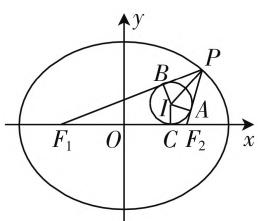
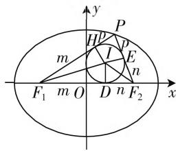

# 椭圆巧应用,内心显身手

# ● 福建省晋江市养正中学 王白仪

椭圆的焦点三角形一般是指以椭圆的两个焦点 $F_{1}, F_{2}$ 和椭圆上与焦点同轴的两个顶点外的任意一点P为顶点所构成的三角形. 特别地, 涉及椭圆的焦点三角形的内心问题, 背景简单, 交汇性强, 内涵丰富, 变化多端, 具有一定的难度、深度与广度, 极具融合性、思考性、挑战性和选拔性, 在近年高考及自主招生中经常出现, 是挑战与考查学生的数学知识、思维方式和数学能力的一个好场所, 也让我们充分领悟到了数学的和谐之美.

# 一、内心的性质问题

利用椭圆的焦点三角形的内心的基本性质,可以用来破解涉及内心的半径、线段的距离、夹角等相关的问题.破解的关键就是充分利用内心的基本性质,合理建立相应的关系式来分析与求解.

例 1 （2019 年北京大学自主招生数学试题 • 7）设 P 为椭圆 $E: \frac{x^{2}}{25} + \frac{y^{2}}{16} = 1$ 上的任意一点， $F_{1}$ 、 $F_{2}$ 为椭圆 E 的左、右焦点，I 为 $\triangle PF_{1}F_{2}$ 的内心，若内切圆的半径为 1，求 IP 的长度.

分析:作出对应的椭圆图形与相应的内切圆,利用平面几何的相关性质,结合椭圆的定义、内切圆的性质建立相关边长的关系式,再通过直角三角形中的勾股定理来分析与求解,即可达到目的.

解析:由题中椭圆 $E:\frac{x^{2}}{25}+\frac{y^{2}}{16}=1$ ，可得 a=5, b=4, c=3。设 $\left|PF_{1}\right|=m,\left|PF_{2}\right|=n$ ，如图 1 所示，根据椭圆的定义可得 $\left|PF_{1}\right|+\left|PF_{2}\right|=m+n=2a=10$ 。

text_image

y
P
B
A
F₁ O C F₂ x

图1

设内切圆 I 与 $\triangle PF_{1}F_{2}$ 的各边的切点分别为 A、B、C，结合内切圆的性质，可知 $\left|AP\right|=\left|BP\right|=\frac{1}{2}(m$

$$
+ n - 2 c) = 2.
$$

因为内切圆的半径 $r = |IA| = 1$ ，所以在Rt△PAI中，利用勾股定理可得 $|IP| = \sqrt{|AP|^2 + r^2} = \sqrt{5}$

点评:破解本题的方法技巧比较多,而结合图像加以直观分析,利用平面几何的性质,通过内切圆的相关性质来确定线段AP的长度,利用解直角三角形中的勾股定理来确定线段的长度.借助平面几何法来解决椭圆问题的关键是作出相应的几何图形,巧妙利用平面几何的相关性质来直观分析,简化过程,巧妙破解.

# 二、内心的轨迹问题

利用椭圆的焦点三角形的内心的基本性质,可以用来破解涉及内心的轨迹方程、参数的取值范围等相关的问题. 破解的关键就是充分利用内心的基本性质,合理引入参数并能巧妙代换与应用.

例 2 （2020 年浙江省名校高考数学仿真试卷（一）·16）已知 $F_{1}$ 、 $F_{2}$ 为椭圆 $C: \frac{x^{2}}{4} + \frac{y^{2}}{3} = 1$ 的左、右焦点，点 P 在椭圆 C 上移动时， $\triangle PF_{1}F_{2}$ 的内心 I 的轨迹方程为 \_\_\_\_.

分析:设出相应点的坐标,利用两点间的距离公式,以及椭圆的定义分别确定 $\left|PF_{1}\right|$ 与 $\left|PF_{2}\right|$ 的值,结合三角形的内心的基本性质建立起三角形的边长、面积等相关元素之间的关系式,从而得以相应的变换公式,代入椭圆方程即可得以确定内心I的轨迹方程.

解析:由题中椭圆 $C:\frac{x^{2}}{4}+\frac{y^{2}}{3}=1$ ，可得 a=2, b= $\sqrt{3}$ , c=1, $F_{1}(-1,0)$ , $F_{2}(1,0)$ .

设点 $P(x,y),I(m,n), - 2 <   x <   2,y\neq 0$ ，则有 $|PF_1| = \sqrt{(x + 1)^2 + y^2} = \sqrt{(x + 1)^2 + 3 - \frac{3x^2}{4}} =$

$$
\left| \frac {x}{2} + 2 \right| = 2 + \frac {x}{2}.
$$

结合椭圆的定义, 可得 $\left|PF_{2}\right|=2a-\left|PF_{1}\right|=4-\left(2+\frac{x}{2}\right)=2-\frac{x}{2}$ .

而 $\left|F_{1}F_{2}\right|=2c=2,\left|PF_{1}\right|+\left|PF_{2}\right|+\left|F_{1}F_{2}\right|=2a+2c=6$ ，结合I为 $\triangle PF_{1}F_{2}$ 的内心，及三角形的内心的性质,可得 $\left\{\begin{aligned}&2+\frac{x}{2}=m+1+2-\frac{x}{2}-(1-m),\\&\frac{1}{2}\times|n|\times6=\frac{1}{2}\times2\times|y|,\end{aligned}\right.$

解得 $\left\{\begin{aligned}x=2m,\\ y=3n,\end{aligned}\right.$ 代入椭圆C的方程，整理可得 $\triangle PF_{1}F_{2}$ 的内心I的轨迹方程为 $m^{2}+3n^{2}=1(n\neq0)$ ，即 $x^{2}+3y^{2}=1(y\neq0)$ .

故填答案: $x^{2}+3y^{2}=1(y\neq0)$ .

点评:巧妙借助椭圆的焦点三角形的内心的基本性质来建立起焦点三角形的边长、面积等相关元素之间的关系式,这是破解本题的关键所在.若借助焦点三角形的内角平分线定理及椭圆的焦半径公式来处理,就显得复杂难操作,没有真正利用焦点三角形的内心的基本性质.

# 三、内心的应用问题

利用椭圆的焦点三角形的内心的基本性质,可以用来破解涉及内心的一些基本应用问题,包括直线的斜率、三角形的面积等相关问题.破解的关键就是充分利用内心的基本性质,交汇直线的基本概念、三角形的基本元素等,综合起来破解相应的综合应用问题.

例 3 已知 $F_{1}, F_{2}$ 为椭圆 $C: \frac{x^{2}}{a^{2}} + \frac{y^{2}}{b^{2}} = 1 (a > b > 0)$ 的左、右焦点，其离心率 $e = \frac{1}{3}$ ，P 是椭圆 C 上除长轴顶点外的任意一点，设 $\triangle PF_{1}F_{2}$ 的内切圆的圆心为 I，若直线 $IF_{1}, IF_{2}$ 的斜率均存在且分别为 $k_{1}, k_{2}$ ，则 $k_{1}k_{2}$ 的值为 \_\_\_\_.

分析:利用三角形的内心的几何意义与基本性质,结合椭圆的定义等条件建立参数之间的关系,再利用海伦公式及三角形的内切圆的性质分别得到椭圆的焦点三角形的面积,进而构造关系式,再利用直线的斜率公式及图形直观分析加以转化,从而得以求解.

解析: 设 $\triangle PF_{1}F_{2}$ 的内切圆的圆心 I 在对应三边上的投影分别为 D、E、H，如图 2 所示.

根据三角形的内心的几何意义与基本性质，可设 $|F_1D| = |F_1H| = m, |F_2D| = |F_2E| = n, |PE| = |PH| = p$ ，内切圆 $I$ 的半径为 $r$ .

text_image

y
P
H²
m
I
E
n
F₁ m O D n F₂ x

图 2

结合椭圆的定义, 可得 $\left|PF_{1}\right|+\left|PF_{2}\right|=m+n+2p=2a$ , 又 $\left|F_{1}F_{2}\right|=m+n=2c$ , 整理可得 p=a-c, 利用海伦公式可得 $\triangle PF_{1}F_{2}$ 的面积 $S=\sqrt{(m+n+p)mnp}$ .

利用三角形的内切圆的性质，可得 $S = \frac{1}{2} (|PF_{1}| + |PF_{2}| + |F_{1}F_{2}|) r = (m + n + p)r$ ，则有 $\sqrt{(m + n + p)mnp} = (m + n + p)r$ ，整理可得 $mn p = (m + n + p)r^{2}$ ，结合直线的斜率公式及图形直观分析，可得 $k_{1}k_{2} = -\tan \angle IF_{1}D \cdot \tan \angle IF_{2}D = -\frac{r}{m} \cdot \frac{r}{n} = -\frac{r^{2}}{mn} = -\frac{p}{m + n + p} = -\frac{a - c}{a + c} = \frac{c - a}{c + a} = \frac{e - 1}{e + 1} = \frac{\frac{1}{3} - 1}{\frac{1}{3} + 1} = -\frac{1}{2}.$

故填答案: $-\frac{1}{2}$ .

点评:巧妙利用椭圆的焦点三角形的内心的几何意义与基本性质,可以建立起对应边长、面积等元素之间的关系,充分利用图形直观,有效综合平面解析几何的相关知识,进而充分利用三角形的内心的几何意义与基本性质来破解相关的综合应用问题.

涉及椭圆的焦点三角形的内心问题,可以通过多种形式加以变化与应用,多姿多彩,创新新颖,极富美感.破解涉及焦点三角形的内心问题的关键就是充分利用焦点三角形的内心的基本性质,有效利用解析几何、平面几何、三角函数等相关知识加以综合,值得我们不断深入学习,探究分析,拓展思维,提升应用,从而不断开拓学生的解题境界,提升学生的解题能力,养成良好的数学品质,培养数学核心素养.W