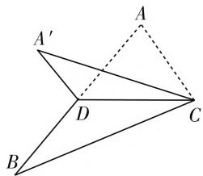

# 渗透探究意识,提升数学能力

# 浙江省台州市路桥中学 朱映颖

随着新课标高考的不断推进,针对高考数学评价体系总结归纳成六个字“一核四层四翼”,其中“四翼”是指基础性、综合性、应用性、创新性.而我们的数学教学的根本目的就是切实落实新课标精神,通过不断地学习基础性知识,加以合理的综合与应用,进而结合创新问题加以深入探究和解决,是一个培养探究意识、锻炼数学思维、发展数学能力等的过程,真正激发兴趣,培养核心素养.

合理渗透探究意识,深入思维的深度、广度,有效实现能力立意,从而能够培养学生敏锐的洞察力、灵活的发散思维能力、严密的逻辑推理能力,以及自觉应用数学知识解决实际问题的数学能力等.而数学中的探究意识主要包括过程性探究、方法性探究、思维性探究与操作性探究等,下面结合实例就渗透探究意识加以合理展开,通过不断的探究来有效提升数学能力,抛砖引玉.

# 一、过程性探究

过程性探究是结合问题的破解过程来总结规律，充分体现学习过程与解题过程，符合学生学习与思维的一般性过程。过程性探究也是探究意识中比较常见的一类，通过问题的破解过程来发现问题、总结规律，进而形成数学能力。

例 1 （全国大联考 2020 届高三第六次联考数学理科·16）在 $\triangle ABC$ 中，角 A、B、C 的对边分别为 a、b、c，若 $\sin A + \sin B = \sqrt{3} \sin C$ ，且 c = 1，则 $\triangle ABC$ 面积的最大值为 \_\_\_\_.

分析:根据条件并利用正弦定理化角为边,结合边之间的定值关系,借助椭圆模型,利用椭圆的定义来确定对应点的轨迹,利用椭圆中参数之间的关系,利用图形直观,数形结合来确定三角形的面积的最大值问题.通过数学建模加以合理构建,进而合理进行图形直观,利用定底边所对应的高的最值来确定三角形面积的最值问题.

解析:由 $\sin A + \sin B = \sqrt{3} \sin C$ ，且 c = 1，结合正弦定理可得 $a + b = \sqrt{3}c = \sqrt{3} > 1$ ，根据椭圆的定义，可知点 C 在以 A、B 为焦点的椭圆上运动，而此椭圆的长轴长为 $\sqrt{3}$ ，焦距为1，可得短半轴长为 $\sqrt{\left(\frac{\sqrt{3}}{2}\right)^{2}-\left(\frac{1}{2}\right)^{2}}=\frac{\sqrt{2}}{2}$ ，由图形直观可知当点C为椭圆的短轴的端点时， $\triangle ABC$ 面积的最大值为 $\frac{1}{2}\times1\times\frac{\sqrt{2}}{2}=\frac{\sqrt{2}}{4}$ ，此时 $a=b=\frac{\sqrt{3}}{2}$ .

故填答案: $\frac{\sqrt{2}}{4}$ .

# 二、方法性探究

方法性探究是引导学生利用不同思维方法来破解问题的一种探究性过程，充分体现思维的发散性，以及数学不同知识之间的联系与转化。借助不同方法的分析，拓展思维，优选更为良好、快捷的方法来处理与解决问题，从而提升解题效益。

例 2 （2020 届浙江省杭州市第二中学高三 12 月月考数学试题 · 17）设函数 $f(x) = \left| \ln x + a \right| + \left| x + b \right| (a, b \in \mathbb{R})$ ，当 $x \in [1, e]$ 时，记 $f(x)$ 的最大值为 $M(a, b)$ ，则 $M(a, b)$ 的最小值为 \_\_\_\_.

分析: 此题是一道双绝对值、双参数函数的嵌套最值问题, 题目较为简单, 创新新颖, 内涵丰富. 破解时可以根据题目条件中的绝对值不等式所对应的基本初等函数的图像与性质问题, 通过函数的单调性的性质加以转化, 也可以根据题目条件中给出的函数 $g(x) = \ln x + a, h(x) = x + b$ 是单调的, 求解函数 $f(x)$ 的最大值的最小值问题.

解法 1: (函数单调性法) 根据函数 $f(x) = |\ln x + a| + |x + b|$ 中 $\ln x + a$ 和 $x + b$ 的单调性可知, $f(x)$ 的最大值必在区间[1,e]的端点处取得.

可得 $\left\{\begin{aligned}M(a,b)&\geqslant f(1),\\ M(a,b)&\geqslant f(\mathrm{e}).\end{aligned}\right.$

则有 $\left\{\begin{aligned}M(a,b)&\geqslant|a|+|b+1|,\\ M(a,b)&\geqslant|a+1|+|b+e|. \end{aligned}\right.$

结合不等式的性质，可得 $2M(a,b)\geqslant |a| + |b + 1| + |a + 1| + |b + e|$ ，由绝对值不等式的性 质，可得 $|a| + |b + 1| + |a + 1| + |b + \mathrm{e}| \geqslant |a - (a + 1)| + |b + 1 - (b + \mathrm{e})| = 1 + |1 - \mathrm{e}| = \mathrm{e}$ .

$$
\left(\mid a \mid + \mid b + 1 \right| = \left| a + 1 \right| + \left| b + e \right|,
$$

当且仅当 $\left\{\begin{aligned}a(a+1)&\leqslant0,\\ (b+1)(b+\mathrm{e})&\leqslant0,\end{aligned}\right.$

即 $\left\{\begin{aligned}-1&\leqslant a\leqslant0,\\-\mathrm{e}&\leqslant b\leqslant-1,\\a+b&=-1-\frac{\mathrm{e}}{2}\end{aligned}\right.$ 时等号成立.

所以 $M(a,b) \geqslant \frac{e}{2}.$

故填答案: $\frac{e}{2}$ .

解法2:(值域宽度转化法)设函数 $g(x)=\ln x+a$ , $h(x)=x+b$ , $x\in[1,e]$ , 对于函数 $g(x)=\ln x+a$ , 其在区间 $x\in[1,e]$ 上的值域宽度为 $g(e)-g(1)=1+a-a=1$ , 则知 $\left|\ln x+a\right|$ 的最大值的最小值为 $\frac{1}{2}$ ;

对于函数 $h(x) = x + b$ ，其在区间 $x\in [1,\mathrm{e}]$ 上的值域宽度为 $h(\mathrm{e}) - h(1) = \mathrm{e} + b - (1 + b) = \mathrm{e} - 1$ ，则知 $|x + b|$ 的最大值的最小值为 $\frac{\mathrm{e} - 1}{2}$

所以函数 $f(x) = |\ln x + a| + |x + b|(a, b \in R)$ 在区间 $x \in [1, \mathrm{e}]$ 上的最大值的最小值为 $\frac{1}{2} + \frac{\mathrm{e} - 1}{2} = \frac{\mathrm{e}}{2}$ ，即 $M(a, b) \geqslant \frac{\mathrm{e}}{2}$ ，当且仅当 $a = -\frac{1}{2}, b = -\frac{\mathrm{e} + 1}{2}$ 时等号成立.

故填答案: $\frac{e}{2}$ .

# 三、思维性探究

思维性探究是在充分理解问题的基础上,结合问题的理解程度的深浅,转化数学问题的方式的“化学反应”结果,正确的思维及合理的转化方式等直接决定着解决问题能否成功,在分析问题、解决问题的一个重要环节,正确全面考查学生的数学能力.

例 3 （2020 届广东省湛江市普通高考测试（二）理科数学第 16 题第 2 空）若 $(1 + x)^{10} = a_{0} + a_{1}x + a_{2}x^{2} + a_{3}x^{3} + \cdots + a_{10}x^{10}$ ，则 $a_{1} + 2a_{2} + 3a_{3} + \cdots + 10a_{10} =$ \_\_\_\_.

分析: 直接利用二项式定理及其相关知识来求解, 代数运算量大, 关系式变形巧妙性强, 比较难解决. 通过对原恒等式与所求结论之间的对比分析, 深入思维探究, 巧妙借助导数应用, 可以转化思维, 避免复杂的计算, 从而转化为思维的探究过程.

解析:结合恒等式 $(1+x)^{10}=a_{0}+a_{1}x+a_{2}x^{2}+a_{3}x^{3}+\cdots+a_{10}x^{10}$ ，通过两边同时对x进行求导，有 $10(1+x)^{9}=a_{1}+2a_{2}x+3a_{3}x^{2}+\cdots+10a_{10}x^{9}$ ，对比所求的结论，令x=1，可得 $a_{1}+2a_{2}+3a_{3}+\cdots+10a_{10}=10\times(1+1)^{9}=5120$ .

故填答案:5120.

# 四、操作性探究

操作性探究是在头脑空间想象能力、直观想象素养等不足以全面考虑清楚相关数学问题的类型或情

况时,动手操作、直观想象等不失为一种更为有效且可行的手段与捷径,动手操作更加直观形象,问题一网打尽.

例 4 （2015 年高考数学浙江卷理科第 8 题）如图 1, 已知 $\triangle ABC, D$ 是 AB 的中点, 沿直线 CD 将 $\triangle ACD$ 折成$\triangle A^{\prime}CD$ ，所成二面角 $A^{\prime} - CD - B$ 的平面角为 $\alpha$ ，则（）

text_image

A'
A
D
C
B

图1

A. $\angle A^{\prime}DB\leqslant \alpha$

B. $\angle A^{\prime}DB\geqslant \alpha$

C. $\angle A^{\prime}CB\leqslant \alpha$

D. $\angle A^{\prime}CB\geqslant \alpha$

分析: 结合 $\triangle ACD$ 沿直线 CD 的翻折角度的变化带动点的变化进行动手操作, 通过直观想象, 利用翻折的极端位置入手, 结合特殊位置时对应的角度变化情况来合理排除, 有效进行操作性探究, 直接操作, 缩小选择面, 计算简便, 方便迅速找到答案.

解析:随着 $\triangle ACD$ 沿直线 CD 的翻折过程加以直观想象,在翻折前, $\triangle ACD$ 沿直线 CD 的翻折角度大小 $\rightarrow0^{\circ}$ ,直观有 $\alpha\rightarrow180^{\circ}$ ,则知 $\angle A^{\prime}CB<\alpha$ ,可以排除选项 D;在翻折后, $\triangle ACD$ 沿直线 CD 的翻折角度大小 $\rightarrow180^{\circ}$ ,直观有 $\alpha\rightarrow0^{\circ}$ ,则知 $\angle A^{\prime}CB\geqslant\alpha$ ,可以排除选项 C;而此时 $\angle A^{\prime}DB\geqslant0^{\circ}$ ,当且仅当 AC=BC 时 $\angle A^{\prime}DB=0^{\circ}$ 成立,可以排除选项 A.

故选择答案:B.

通过实例合理渗透探究意识，打破僵化、教条的应试教育，通过引导学生的主体参与，提升主体能动性，有了更多的分析、思考、探索、总结的时间和空间，进一步完善相关数学的知识体系，形成良好的认知结构，有效提高教学与学习的质量与效益，不断拓展数学基础知识的积累与联系，加强数学思想方法的提炼和总结，逐步实现数学学习从“学会”到“会学”，并不断过渡到“会用”的数学学习新境界，促进学生分析力、理解力、思考力、应用力和创新力等方面的提升，形成数学能力，提升数学品质，发展核心素养.