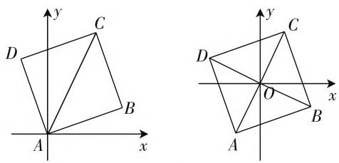

# 立足学科素养,破解试题之“新”\*

—— 对统测卷基于高考评价体系的分析

● 江苏省苏州市第四中学 陈广山

从教育部《普通高中课程标准(2017年版)》的颁布，到2019年《中国高考评价体系》的出台，再经过2020年新高考卷（本文以山东卷为例，以下简称新高考卷）的实践，伴随着高考改革的不断深化，“进一步提升学生综合素质，着力发展学生的核心素养”“价值引领、素养导向、能力为重、知识为基”等新理念深入人心。2021年1月由教育部命题考试中心统一命题，江苏、河北、辽宁、福建、湖北、湖南、广东和重庆八个省、市高三百多万名学生参加的全国统一考试模拟演练数学学科试卷（以下简称统测卷）出炉，基于其命题的权威性、演练的目的性、参与的广泛性等原因，试题的导向性不言而喻。

2020 年新高考卷让人耳目一新,而今年的统测卷又让人眼前一亮. 2021 年将有更多省份进入新高考,分析 2020 年新高考卷与 2021 年统测卷的异同,特别是关注 2021 年统测卷的新特点,有助于理解全国高考命题与评价变化,有助于一线教师进一步认清新理念落地方式,对课堂教学中数学学科素养的落实和课堂教学模式的建构有引导作用.

# 一、统测卷和新高考卷的比较分析

# 1. 试题结构

两份试卷满分 150 分, 考试时长 120 分钟, 共 22 题, 都是 1～8 题为单选题, 9～12 题多选题, 13～16 为填空题, 17～22 题为解答题. 总体上看, 统测卷在填空选择题的难度比新高考卷有所降低, 更多的考查较为基础的能力和素养, 既保证了学生全卷的整体得分, 又为解答题深入思考赢得了更充裕的时间.

值得注意的是,多选题评分规则的变化.统测卷多选题的评分规则是“全部选对的得5分，部分选对的得2分，有选错的得0分”，即部分选对的得分由新高考卷得3分减少为得2分。这个变化减少了考生把多选题当单选题做的可能性，使得不同考生必须选择不同的解题策略，增加了试题选拔性，使区分度更适宜，符合《中国高考评价体系》中进一步优化试卷结构的要求。

2. 试题内容

<table><tr><td rowspan="2">主干知识</td><td colspan="3">2020年新高考卷</td><td colspan="3">2021年统测卷</td></tr><tr><td>题号</td><td>分值</td><td>占比</td><td>题号</td><td>分值</td><td>占比</td></tr><tr><td>三角</td><td>10,15,17</td><td>20</td><td>13.3%</td><td>12,18</td><td>17</td><td>11.3%</td></tr><tr><td>数列</td><td>14,18</td><td>17</td><td>11.3%</td><td>17</td><td>10</td><td>6.7%</td></tr><tr><td>概率统计</td><td>3,5,12,19</td><td>27</td><td>18.0%</td><td>2,6,16,19</td><td>27</td><td>18.0%</td></tr><tr><td>立体几何</td><td>4,16,20</td><td>22</td><td>14.7%</td><td>11,13,20</td><td>22</td><td>14.7%</td></tr><tr><td>函数与导数</td><td>6,8,21</td><td>22</td><td>14.7%</td><td>8,9,15,22</td><td>25</td><td>16.7%</td></tr><tr><td>解析几何</td><td>9,13,22</td><td>22</td><td>14.7%</td><td>4,7,14,21</td><td>27</td><td>18.0%</td></tr></table>

2020年新高考卷就开始对必备知识进行调整，比如删除了三视图，线性规划，算法初步等，突出了对主干知识的考查。从新高考卷和统测卷的统计表中可以看出，六大主干知识总分恰好都为130分，在主干内容的考查上可谓一脉相承。因此教学时专注主干知识，重视基本知识、基本方法，重视教材、典型例题，突出基础性，杜绝在偏、怪、繁、难上浪费宝贵时间。另一方面，从统计表中看，数列、三角的占比似乎有所下降，事实究竟如何？我们不妨看这道题。

例 1 （统测卷第 6 题） $(1+x)^{2}+(1+x)^{3}+\cdots+(1+x)^{9}$ 的展开式中 $x^{2}$ 的系数是（）.

A. 60

B. 80

C. 84

D. 120

从设问中，发现涉及二项式定理，可以考虑各项中 $x^{2}$ 的系数和，因此可得 $x^{2}$ 的系数为 $\mathrm{C}_2^2 +\mathrm{C}_3^2 +\mathrm{C}_3^2$ $+\dots +\mathrm{C}_{9}^{2} = \mathrm{C}_{2}^{2} + (\mathrm{C}_{4}^{3} - \mathrm{C}_{3}^{3}) + (\mathrm{C}_{5}^{3} - \mathrm{C}_{4}^{3}) + \dots +(C_{10}^{3}$ $-\mathrm{C}_{9}^{3}) = \mathrm{C}_{10}^{3} = 120$ ，这里的求和类似于数列求和中的裂项相消.另一种思路，由代数式的形式结构直接联想到数列求和，故而先求和，再化简得 $\frac{(1 + x)^2[(1 + x)^8 - 1]}{x}$ ，即问题等价于求 $(1 + x)^{10}$

的展开式中 $x^{3}$ 的系数. 可以看出, 本题入口宽, 在知识点的交汇处命题, 需要考生灵活运用所学知识, 加强了试题的综合性; 另一方面, 方法不同解题效率不同, 体现了对学科素养的一种考查. 而三角函数与导数的综合考查更是在统测卷的第22题中得到了充分体现, 同时也体现三角函数知识应用的广泛性. 看来, 不是数列和三角在试卷中的占比减少, 而是增加了考查的综合性, 提高了能力的要求.

# 3. 试题情境

《中国高考评价体系》明确指出：“应用性要求以贴近时代、贴近社会、贴近生活的生活实践或学习探索问题情境为载体”。新高考卷涉及生活实践中的题目有3、4、5、6、12、15、17共7题，统测卷中有2、16、19、20共4题，适当减少了生活实践情境题的个数和阅读量，给了学生更充分的思考时间，更有利于提高试卷的区分度。从另一维度看，统测卷中凸显了“复杂的情境活动”，减少的只是“简单的情境活动”。

统测卷第20题，以国家重大标志性工程——北京大兴国际机场的特点为背景，谈到几何中空间弯曲性的刻画，引导学生用数学的眼光观察世界，同时体现我国日益强大的科技水平和综合国力，提升民族自豪感，把立德树人的核心任务融入考试评价过程。解答本题，情境活动复杂，学生首先需要在文字阅读中获取信息，在情境中学习探索，发挥空间想象能力，进行严密论证，创造性地得出到所有顶点的面角之和，最后用符号语言表达出来。这种结合情境，在有限的时间内创造性地解决问题的能力如何培养给教师课堂教学提出了新的研究课题，当然，若本题能和高中所学知识结合更紧密些，或许就可以成为考查数学素养的典范。

# 4. 试题类型

统测卷明显的一个新特点是有一道结论开放的试题(统测卷第15题)，而少了新高考卷的结构不良问题(新高考卷第17题)，说明在试题命制上绝不会拘泥于原有的试题类型，在试题的创新性上也不会停止脚步，只要能考查学生的学科素养和关键能力，只要具备区分和选拔功能，这样的题型就会出现，这也符合高考评价体系中“创新性要求创设合理情境，设置新颖的试题呈现方式和设问方式……”这一理念.

# 二、基于学科素养的视角赏析统测卷

“学科素养”指的是在正确的思想观念指导下，合理运用科学的思维方法，有效整合学科相关知识，运用学科相关能力，高质量地认识问题、分析问题、解决问题的综合品质，从数学学科的角度看包括理性思维、数学应用、数学探究、数学文化等.

例 2 （统测卷第 3 题）关于 x 的方程 $x^{2} + ax + b = 0$ ，有下列四个命题：

甲: x = 1 是方程的根;

乙:x=3 是方程的根;

丙:该方程的两根之和为 2;

丁:该方程的两根异号.

如果只有一个假命题,则该命题是().

A. 甲

B. 乙

C. 丙

D. 丁

本题考查的重点应该不在一元二次方程的根这个知识上，而是以基础知识为载体，考查了阅读理解、信息整理、逻辑推理等能力，重在逻辑思维能力的考查上。统测卷中对学科素养考查的范例还有很多，不妨再从下面这道题一探究竟。

例 3 （统测卷第 14 题）若正方形的一条对角线所在直线的斜率为 2，则该正方形的两条邻边所在直线的斜率分别为 \_\_\_\_，\_\_\_\_。

读题后首先绘图,需要思考坐标系如何建立.如果以顶点 A 为坐标原点建系,则易于想到把直线的斜率与倾斜角联系起来,从而将问题转化为研究直线 AB、AD 与直线 AC 的倾斜角之间的关系;如果以正方形的中心 O 为原点建系,则会更容易想到通过点的坐标表示斜率.

解法一:如图1左图,设对角线AC的倾斜角为 $\alpha$ ,则 $\tan\alpha=2$ ,且直线AB、AD的倾斜角分别为 $\alpha+\frac{\pi}{4}$ , $\alpha$

$$
- \frac {\pi}{4}, \text {又} \tan \left(\alpha + \frac {\pi}{4}\right) = - 3, \tan \left(\alpha - \frac {\pi}{4}\right) = \frac {1}{3}.
$$

所以正方形两斜边的斜率分别为 $-3, \frac{1}{3}$ .

解法二: 如图 1 右图所示, 不妨设点 $C(1,2)$ , 则 $A(-1,-2)$ , $B(2,-1)$ , $D(-2,1)$ .

text_image

Two coordinate diagrams showing a quadrilateral ABCD in the first and its transformed version with points A, B, C, D, and O labeled.

图1

所以正方形两斜边的斜率分别为 $-3, \frac{1}{3}$ .

本题题干简洁、素材熟稔、难度不大，但情境新颖、设计巧妙、思想深刻。可以看出，两种不同的解法是由建系位置的不同导致斜率刻画方法的不同产生的。第一种方法以倾斜角刻画斜率，问题转化为典型的应用两角和与差的三角函数公式求值问题；第二种方法是用直线上点的坐标以定义刻画斜率，这个方法过程更简洁，解答更迅速。有没有更多的学生考虑到图形的对称性，从审美的、系统的角度组织调动相关知识，通过联想类比想到第二种建系方法？这取决于新授求圆锥曲线标准方程时，教师有没有充分让学生探究何处建系可使方程更简单，从而积累丰富的活动经验；取决于平时教学中有没有让学生感受到数学的真善美，进行数学文化的渗透；取决于学生的学科素养水平。学习时感受美，交流时鉴赏美，解题时创造美，在教学和考试评价中都要明确“立德树人”这一核心任务。

# 三、对数学课堂教学的思考和建议

通过上面的分析比较,无论在考查内容还是在考查要求方面,统测卷与新高考卷相比,既一脉相承,但又有新特点,充分体现了对评价体系中“一核”“四层”“四翼”的进一步落实与探索,对教学有重要的指导意义.

# 1. 坚持数学本质的教学

统测卷通过情境的创新、设问方式的改变、试卷结构和题型的进一步优化，引导学生丢掉机械刷题、不求甚解套题型的学习方法，引导教师丢掉淡化本质而追求技巧和结论的教学方式，要重视知识的生成过程,重视暴露思维的教学,由教“解题”转化为教“解决问题”,由教“解决问题”转化为教“如何想到这样解决问题”,重视素养的真正提升.

例 4 （统测卷第 21 题）双曲线 $C: \frac{x^{2}}{a^{2}} - \frac{y^{2}}{b^{2}} = 1 (a > 0, b > 0)$ 的左顶点为 A，右焦点为 B，动点 B 在 C 上。当 $BF \perp AF$ 时， $|AF| = |BF|$ 。

(1) 求 C 的离心率;  
(2) 若 B 在第一象限, 证明: $\angle BFA = 2\angle BAF$ .

这道解答题以双曲线为载体,由于平时很少刷到这种题,一些学生不适应,心理上产生波动,影响了答题.事实上,解答第(2)题仅仅涉及双曲线的基本量,关键是用直线的斜率刻画相关角,体现的是解析几何最本质的思想,把要证明的结论转化为证明三角恒等式,这与2018年全国新课标1卷理科数学第19题几乎一致.因此,只有把握数学本质这个“根”,才能在新情境中引出解法这个“活水”的到来,正如华罗庚先生所说:“消化,只有消化后,我们才会灵活应用”.

# 2. 重视提供有价值的探究性问题

习近平总书记指出：“纵观人类发展历史，创新始终是一个国家、一个民族发展的重要力量，也始终是推动人类社会进步的重要力量。”为了适应新时代对人才的需求，两份试卷主动对接新课标和评价体系的要求，通过设置新情境和增加开放性，注重数学探究的价值引领。因此，在课堂教学中，教师要重视以情境为载体，提供有价值的问题，引导学生经历“实验—观察—猜想—证明”的探究过程，积累数学活动经验，培养创新精神。

# 3. 构建互联网 + 背景下的数学课堂新模式

2015年，李克强总理首次提出“互联网+”行动计划，中共中央、国务院印发《中国教育现代化2035》及《教育信息化2.0行动计划》等文件，可见在新课程新理念推出的同时，新时代呼唤新媒体新技术与教育教学相结合，呼唤教育工作者在实践中创新课堂教学模式，以适应新时代对人才的需求。笔者认为，“互联网+背景下的数学课堂”是指在信息时代背景下，教师把新技术形态与数学课堂进一步深度融合，为学生创建智能化、情境化、互动性的学习生态，引导学生发现问题、分析问题和解决问题，促进学生数学素养提升的高效课堂，重点在“互联网+”背景下高中数学教师的“教”与学生的“学”模式的创新探索。这一教学模式的构建,是高考评价体系在数学教学中落地的有力举措.

首先，与传统教学相比，“互联网+”背景下的课堂可以由课中更便捷有效地向课前、课后延展，同时提供了更具有个性化的教学，为素养的形成提供了更广阔的空间。例如，课前，先利用互联网平台布置学习任务，再利用线上收集的课前导学案答题数据或者云平台中讨论交流的数据分析学情，有针对性地制定课堂教学方案；课中，利用互联网交互工具及时分析学生情况，调整教学策略，推送焦点问题，进行讨论，突破重难点；课后，教师结合课堂观察和学生作业情况的大数据分析利用互联网平台给学生提供个性化的练习题和探究性素材。高考评价体系中“更高质量、更加公平、更具个性的教育”在这个模式下更容易实现。

其次，信息时代，学生能从各种渠道获得新方法和信息，数学在生活中的应用比比皆是，为课堂教学提供了真实的源源不断的问题情境。例如，2020年3月27日CCTV新闻联播中报道：“……世卫组织总干事谭德塞26日表示，从全球的情况来看，新冠肺炎大流行的病例正呈现指数级增长。新冠肺炎全球累计确诊病例数量达到10万例经过了67天，从10万例增加到20万例只有11天，再到30万例仅用了四天，到40万例只用了不到两天。”新冠疫情呈指数级增长，什么是指数级增长，有什么特点，这对判断疫情发展变化和控制疫情有什么作用？在指数函数的引入环节，教师结合这些鲜活的数据，提出贴近生活的问题，更易激发学生探究的欲望。

最后,新技术、新媒体的出现和使用,使得学生

学习形式更丰富，讨论更充分，更能突出学生的主体地位，为深度学习搭建了重要平台。例如，在新授求双曲线的标准方程学生化简 $|\sqrt{(x + c)^2 + y^2} - \sqrt{(x - c)^2 + y^2}| = 2a$ 时，受绝对值、根号、字母等因素影响，往往不能独立完成，一部分学生开展合作学习，一部分学生到互联网上寻找帮助。交流讨论时，网上搜索的学生提出疑惑：“网上说：由椭圆标准方程推导过程知， $|\sqrt{(x + c)^2 + y^2} - \sqrt{(x - c)^2 + y^2}| = 2a$ 平方去根号化简的结果为 $(c^2 - a^2)x^2 - a^2y^2 = a^2(c^2 - a^2)$ 。这与推导椭圆标准方程时 $\sqrt{(x + c)^2 + y^2} + \sqrt{(x - c)^2 + y^2} = 2a$ 化简的结果完全一致，代数式不同，为什么化简结果却相同？化简结果相同，但两个曲线标准方程的形式却又不同，这又是为什么？”其实该生的问题指向了“推导双曲线的标准方程要分析和借鉴椭圆方程的推导方法，并比较它们的异同”这一关键问题；但更关键的是，在这种开放多元的学习模式下，学生需要阅读和整合各种渠道获得的信息，进行独立性和批判性的思考，并进行表达、沟通，成为掌握知识、创造知识的主人。

# 参考文献：

[1] 为建设世界科技强国而奋斗——在全国科技创新大会、两院院士大会、中国科协第九次全国代表大会上的讲话[M]. 北京: 人民出版社, 2016.

[2] 教育部考试中心. 中国高考评价体系 [M]. 北京: 人民教育出版社, 2019. W

(上接第9页) 制作和使用:一是节约问题板书的时间,二是让学生对函数概念发展300多年历史有宏观的认识,进一步体会一代代数学家智慧的结晶,感受他们严谨治学的科学精神.

# 参考文献：

[1] 郭华. 教学即“讲理”——兼论变异教学理论在教学中的运用 [J]. 教育学报, 2013, 9(5).  
[2] 翁开庆. 数学教育概论 [M]. 成都: 四川大学出版

社，2007.

[3] 奥苏伯尔. 教育心理学——认知观点 [M]. 余星南, 宋钧, 译. 北京: 人民教育出版社, 1994.  
[4] 章建跃，李增沪. 普通高中教科书必修（第一册）[M]. 北京：人民教育出版社，2019.  
[5] 李鹏奇. 函数概念 300 年 [J]. 自然辩证法研究, 2001, 17(3).  
[6] 中华人民共和国教育部. 普通高中数学课程标准 (2017 年版) [S]. 北京: 人民教育出版社, 2018. F