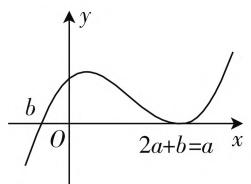
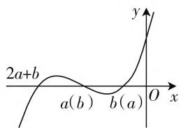

# 背景创新新颖,解法精彩纷呈

# ● 新疆阿克苏地区第二中学 刘曾红

2020年高考过后，数学风云变幻，创新新颖无限，解法精彩纷呈。特别对于2020年高考数学浙江卷第9题的函数与不等式的综合创新题，背景简单，设置新颖，内涵丰富，灵活多变，思维众多，实属难得，是一道创新性极强的精品试题，具有非常好的学习、观摩、研究价值。

# 一、真题呈现

高考真题 （2020年高考数学浙江卷第9题）已知 $a, b \in \mathbf{R}$ 且 $ab \neq 0$ ，若 $(x - a)(x - b)(x - 2a - b) \geqslant 0$ 在 $x \geqslant 0$ 上恒成立，则（ ）.

$$
\mathrm{A.} a <   0 \quad \mathrm{B.} a > 0 \quad \mathrm{C.} b <   0 \quad \mathrm{D.} b > 0
$$

此题是一道函数与方程思想高度融合的题目,借助不等式恒成立来巧妙设置,进而确定参数的取值情况.破解时,可以借助三次函数思维,利用三次函数的图像与性质来数形结合;可以借助不等式思维,利用不等式的性质或不等式组的求解来分类讨论;可以借助特殊值思维,分门别类,特殊值排除处理.诸多基本的数学思想方法在此问题中展现得淋漓尽致,解法精彩纷呈.

# 二、真题破解

# 思维视角一:三次函数思维

解法1：（三次函数的图像与性质分析法）因为 $ab \neq 0$ ，所以 $a \neq 0$ 且 $b \neq 0$ ，设三次函数 $f(x) = (x - a)(x - b)(x - 2a - b)$ ，则 $f(x)$ 的零点为 $x_{1} = a, x_{2} = b, x_{3} = 2a + b$ ，结合三次函数的图像与性质，当 $a > 0$ 时，则 $x_{1} > 0, x_{2} < x_{3}$ ，要使 $f(x) \geqslant 0$ ，如图1，必有 $2a + b = a$ 且 $b < 0$ ，即 $b = -a$ 且 $b < 0$ ，所以 $b < 0$ ；

text_image

y
b
O
2a+b=a
x

图1

text_image

2a+b
a(b)
b(a)
O
x
y

图 2

当 $a < 0$ 时，则 $x_{1} < 0, x_{2} > x_{3}$ ，如图2，要使$f(x)\geqslant 0$ ，必有 $b <   0$

综上分析,一定有 b < 0.

故选择答案:C.

点评:根据三次函数的图像与性质,通过a>0与a<0两种情况加以分类讨论,结合不等式在给定区间上恒成立,转化为三次函数在给定区间 $[0,+\infty)$ 上恒成立问题,数形结合,直观分析.

解法2:(三次函数的图像与性质排除法)设三次函数 $f(x)=(x-a)(x-b)(x-2a-b)$ ，可得 $f(x)$ 的图像与x轴有三个交点，即 $f(x)$ 有三个零点a,b, $2a+b$ 且 $f(0)=-ab(2a+b)$ ，由题意知， $f(0)\geqslant0$ 在 $x\geqslant0$ 上恒成立，则 $ab(2a+b)\leqslant0$ ，当a<0,b<0时，可得 $2a+b<0$ , $ab(2a+b)\leqslant0$ 恒成立.

排除选项 B, D.

我们考虑零点重合的情况, 即中间和右边的零点重合, 左边的零点在负半轴上, 则有 a=b 或 $a=2a+b$ 或 $b=b+2a$ 三种情况, 此时 a=b<0 显然成立.

若 $b = b + 2a$ ，则 $a = 0$ 不成立.

若 $a = 2a + b$ ，即 $a + b = 0$ ，可得 $b < 0, a > 0$ 且 $a$ 和 $2a + b$ 都在正半轴上，符合题意.

综上分析, $b<0$ 恒成立.

故选择答案:C.

点评:根据三次函数的图像与性质,确定三次函数 $f(x)$ 的零点,根据 $f(0)\geqslant0$ 在 $x\geqslant0$ 上恒成立,讨论a,b所满足的不等式,通过当a<0,b<0时满足条件来排除对应的选项;再通过分析零点重合时参数的关系来确定参数的取值情况.引入函数,排除选项.

解法3:(函数结构分析法)设三次函数 $f(x)=(x-a)(x-b)(x-2a-b)$ ，可得 $f(x)$ 的图像与 x 轴有三个交点，即 $f(x)$ 有三个零点 a, b, $2a+b$ 且 $f(0)=-ab(2a+b)$ ，由题意知， $f(0)\geqslant0$ 在 $x\geqslant0$ 上恒成立，则 $ab(2a+b)\leqslant0$ ，当 a<0, b<0 时，则有 $2a+b<0$ ，此时三次函数 $f(x)$ 的三个零点均为负数，显然 $ab(2a+b)\leqslant0$ 成立.

除以上情况外，由于 $f(x) \geqslant 0$ 在 $x \geqslant 0$ 上恒成立，则函数 $f(x)$ 必须含有一个恒大于等于0的项，且另外一项在 $x \geqslant 0$ 上恒大于0，根据函数结构 $f(a) = f(b) = f(2a + b) = 0$ ，则 $f(x)$ 中这个恒大于等于0的项必为二次项 $(x - r)^2$ （其中 $r \in \{a, b\}$ ），当 $r = b = 2a + b$ 时，可得 $a = 0$ ，这与条件 $ab \neq 0$ 矛盾，舍去。

当 $r = a = 2a + b$ 时，可得 $a + b = 0$ ，即 $b = -a$ 此时 $f(x) = (x - a)^2 (x + a)$ ，只有当 $a > 0$ ，才能满足 $f(x) \geqslant 0$ 在 $x \geqslant 0$ 上恒成立，此时 $b = -a < 0$ .

综上分析,一定有 b < 0.

故选择答案:C.

点评:根据不等式恒成立的条件,令x=0确定参数所满足的不等式,当a<0,b<0时满足条件;并结合不等式恒成立,确定函数的结构特征,通过分类讨论,利用三次函数中对应的二次平方项的分析来确定参数的取值情况.感知函数结构,巧妙合理分析.

# 思维视角二: 不等式思维

解法4:(不等式性质分析法)由于 $(x-a)(x-b)(x-2a-b)\geqslant0$ 在 $x\geqslant0$ 上恒成立,令x=0,可得 $(-a)(-b)(-2a-b)\geqslant0$ ,即 $ab(2a+b)\leqslant0$ ,所以a,b不可能同时为正,必有一个为负,当a<0,b<0时,则有 $2a+b<0$ ,显然 $ab(2a+b)\leqslant0$ 成立.

当 $a < 0, b > 0$ 时，结合 $ab(2a + b) \leqslant 0$ ，则有 $2a + b \geqslant 0$ ，此时使得 $(x - a)(x - b)(x - 2a - b) \geqslant 0$ 在 $x \geqslant 0$ 上恒成立，则必有 $2a + b = b$ ，解得 $a = 0$ ，这与条件 $a < 0$ 矛盾，舍去.

当 $a > 0, b < 0$ 时，结合 $ab(2a + b) \leqslant 0$ ，则有 $2a + b \geqslant 0$ ，此时使得 $(x - a)(x - b)(x - 2a - b) \geqslant 0$ 在 $x \geqslant 0$ 上恒成立，则必有 $2a + b = a$ ，可得 $b = -a$ ，符合条件.

综上分析,一定有 b < 0.

故选择答案:C.

点评:根据不等式恒成立的条件,令x=0确定参数所满足的不等式,通过参数a,b必有一个为负进行分类讨论,结合不等式性质及不等式恒成立的条件加以分析,逻辑推理,条理清晰.

# 思维视角三: 特殊值思维

解法 5: (特殊值分析法) 取特殊值 $a, b \in \{-1, 1\}$ , 当 $a = b = -1$ 时, 则有 $(x - a)(x - b)(x - 2a - b) = (x + 1)(x + 1)(x + 3) \geqslant 0$ , 其在 $x \geqslant 0$ 上恒成立, 此时 $a < 0$ 且 $b < 0$ .

当 $a = 1, b = -1$ 时，则有 $(x - a)(x - b)(x - 2a - b) = (x - 1)^2 (x + 1) \geqslant 0$ ，其在 $x \geqslant 0$ 上恒成立，此时 $a > 0$ 且 $b < 0$ .

至此,可以排除选项 A,B.

当 $a = -1, b = 1$ 时，则有 $(x - a)(x - b)(x - 2a - b) = (x - 1)(x + 1)^2 \geqslant 0$ ，其在 $x \geqslant 0$ 上不恒成立，此时 $a < 0$ 且 $b > 0$ .

至此,可以排除选项 D.

故选择答案:C.

点评:根据题目条件引入特殊值 $a, b \in \{-1, 1\}$ ，结合两者的不同取值情况代入对应的不等式，结合不等式在给定区间上是否恒成立及此时参数的正负情况来排除对应的选项。特殊值处理，巧妙化解决。

# 三、解后反思

此类具有“浙江卷”特殊味道的高考题，考生若能成功“翻译”题目条件，答案并不难选出；即便不能成功“翻译”题目条件，特殊值法也能巧妙迅速破解。解答此题时，形象的直觉思维能够绕开抽象推理的鸿沟。

此类问题的一个重要特征就是:不以繁杂运算与复杂推理来区分考生的不同层次水平,而是为具有深度的数学思维的考生有意留出一扇可以跳跃且隐藏在题目条件背后的“龙门”,对于那些数学功底扎实、思维层次高的考生,心中有“图”,灵活“运动”,心中有“数”,自由“组合”,均能完美破解.因而,在平时数学教学与学习过程中,要重视数学基本功底的训练,重视数学思维层面的提升,做典型题,研究问题的通解通性,将基本功底融入到解题活动中去,将基本方法上升至思维方法的层面.F