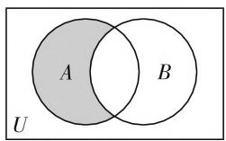

# 问诊试题失误,提升命题水平

# ● 安徽省合肥市第四中学 郑良

# 一、问题提出

解题高手未必是命题能手,解题能力弱的教师一般命题能力也不强.笔者曾将一学期使用某名校高三单元检测卷中遇到的典型命题错误归类整理并结合教学实践给出命题思考形成文献[1](该文被人大复印资料《高中数学教与学》2020年第4期全文转载).笔者在组织和参与教研活动时,发现命题中的诸多问题,通过讨论交流及时纠正了这些错误,命题中的这些问题相对隐蔽难以被发现,反映了师生思维的痛点.下面展示命题过程中出现的部分曲折,以引起命题教师的注意,避免在命题中出现类似失误.

# 二、试题命制问题呈现

# 1. 无中生有, 自相矛盾

试题 1: 设全集 U = R, 集合 $A = \{x \mid 2^{x} < 2\}$ , $B = \{x \mid y = \ln(x - 1)\}$ , 则图 1 中的阴影部分所表示的集合为().

  
图1

A. $\{x \mid x \geqslant 1\}$

B. $\{x\mid0\leqslant x<1\}$

C. $\{x \mid 0 < x \leqslant 1\}$

D. $\{x\mid x <   1\}$

点评: 图1中的阴影部分对应的运算关系为 $A \cap (\complement_{U} B)$ ，易得 $A = \{x \mid x < 1\}, B = \{x \mid x > 1\}$ ，故 $A \cap (\complement_{U} B) = \{x \mid x < 1\}$ ，答案为 D。事实上 $A \cap B = \varnothing$ 与图1中 $A \cap B \neq \varnothing$ 矛盾，代数与几何表述不一致，出现了科学性错误。其实，本题图1所表示的运算关系易于表达，直接用符号表述即可。“图文并茂”的出版物要求内容丰富、文字精彩、图片精美，两者搭配合理均衡、彼此呼应、相得益彰，给阅读者以美的享受。一般来说，一些科学的原理、概念用文字表达可能相对抽象，但用图（或表）来描述则显直观、生动形象，从而帮助读者加深对其科学内涵的理解，甚至达到“一图胜千言”的效果。精美的配图给阅读者以亲切感，使问题一目了然，有效降低问题的抽象性，强化感性认知，促进直观想象，启迪形象思维，有助于引领问题解决的方向。美国数学家斯蒂恩说过：“如果一个待定的问题可以转化为一个图形，那么思想就整体地把握了问题，而且能创造性地思索问题的解法。”因此解题的基本流程是：通过审题,画出符合条件的图形,然后将文字叙述、符号表示的信息集中到图形中,当出现求解困难时再回视并挖掘文字、符号等语言信息,充分利用图形表征的直观性.读图、识图、用图是学生必备的能力.

命题时要注意图文的合理搭配,除本身的科学性(图题吻合、图文呼应等)与艺术性(美化和点缀)外,还要充分考虑配图对试题考查功能的影响.例如,通过配图,降低了学生对数学情境理解与数学建模的难度,限制了学生想象力的培养和发展.若配图不合理,就可能会对学生产生形的误导,干扰学生的解题思路.但也要注意配图应为示意图,避免图形的“精确”让学生用测量代替思考.试题配图时,一定要考虑配图的必要性.学生自己能动脑解决的问题,再去引导还有可能会束缚学生的思维,因此配图的核心依据应是学生具体的认知需求.教师要引导学生尊重试题文本条件与信息,通过阅读理解题目文字、符号条件信息后自主构图分析,而不能养成依赖试题所配图形的习惯.如何理解试题中的“如图所示”?即:怎样理解配图中的各对象内部及相互之间的位置关系?一种是图形给定的几何对象间的位置关系,例如,点在线段上;另一种是图形只给出位置关系的一种静止状态.无论如何都要通过文字或符号语言加以说明,进而规避解题者主观理解上的差异,实现命题者与解题者认识上的统一.

当然对于代数方面同样不可忽视,例如,在考查函数的单调性时曾有如下试题:

设 $f(x)$ 是定义在 R 上的增函数, $f(xy)=f(x)+f(y)$ , $f(3)=1$ , 则不等式 $f(x)+f(-2)>1$ 的解集为 \_\_\_\_.

通过赋值,可得 $f(1)=f(-1)=f(0)=0$ , $f(x)$ 是偶函数,这与“ $f(x)$ 是定义在 R 上的增函数”相矛盾,即满足题设条件的函数 $f(x)$ 不存在.

# 2. 认知不同, 出现歧义

试题 2: 已知集合 $A=\{x \mid x^{2}+\sqrt{m}x+1=0\}$ ，若 $A \cap R = \varnothing$ ，则实数 m 的取值范围是（）.

A. $\{m \mid m < 4\}$

B. $\{m\mid m > 4\}$

C. $\{m\mid 0\leqslant m <   4\}$

D. $\{m\mid 0\leqslant m\leqslant 4\}$

点评:命题者本意为“在 $\sqrt{m}$ 有意义的前提下使得方程 $x^{2}+\sqrt{m}x+1=0$ 没有实数根”,但多数学生会对 $m \in \mathbf{R}$ 分为 $m < 0$ 与 $m \geqslant 0$ 两种情况进行分类讨论. 问题根源在于命题者与学生对已知方程中 $\sqrt{m}$ 的不同理解. “皮之不存, 毛将焉附”, 对象既已出现就要保证其有意义. 例如, 用列举法表示的含参数的集合中每个对象互不相同; 又如, 表示区间右端点的实数一定比表示 (同一) 区间左端点的实数大. 教学时要对学生强调这些基本规则, 对于非考查点的注解要尽可能详实 (如规避词语的多意性等), 避免学生因为没有相关经验出现思维偏移的情况, 使学生公平地进入命题者设定的轨道, 落实考查目标.

# 3. 思维狭窄, 目标落空

试题 3: 某同学用“五点法”画函数 $f(x)=A\sin(\omega x+\varphi)\left(A>0,\omega>0,|\varphi|<\frac{\pi}{2}\right)$ 在某一个周期内的图像时，列表如下：

<table><tr><td> $\omega x + \varphi$ </td><td>0</td><td> $\frac{\pi}{2}$ </td><td> $\pi$ </td><td> $\frac{3\pi}{2}$ </td><td> $2\pi$ </td></tr><tr><td> $x$ </td><td> $m$ </td><td> $\frac{\pi}{3}$ </td><td> $n$ </td><td> $\frac{5\pi}{6}$ </td><td> $p$ </td></tr><tr><td> $A\sin(\omega x + \varphi)$ </td><td>0</td><td>5</td><td>0</td><td>-5</td><td>0</td></tr></table>

(I) 求出实数 m, n, p;

(Ⅱ) 求出函数 $f(x)$ 的解析式；

(Ⅲ) 略.

点评:命题教师认为“已知三角函数的图像求解析式”类型试题毫无新意,本题数据以表格形式给出,立意新颖、构思巧妙.命题者本意让学生在第(I)小题利用三角函数的图像与性质(根据三角函数的周期性知, $m,\frac{\pi}{3},n,\frac{5\pi}{6},p$ 成等差数列)求解m,n,p,多数学生会利用 $z=\omega x+\varphi$ 与x的线性关系(特殊化)先求出 $\omega,\varphi$ 的值后代入方程求解,以上第(I)小题的解答只是命题者一厢情愿而已.这不是“智者千虑,必有一失”,而是命题者思维狭窄,不能从多角度审视问题.那些被创意改变的试题,到底“创”在何方?文献[2]认为:(1)“创”在内容,思维改变;(2)“创”在情境,独特真实;(3)“创”在问题,引发思考;(4)“创”在配图,画面新颖.试题的创新重在学生思维方式的改变、促进学生思维能力的提升.

# 三、命题思考

# 1. 明确意义, 端正态度

试题命制的意义在于能够真实地检测出学生的学习水平,通过对测试结果的分析与反馈来促进师生的教与学方式,及时对相关问题查缺补漏,并在命题与检测中实现教学相长.当前试题命制与试卷(作业等)批改是检验学生学习效果的重要方式,但多数教师却把它们作为一种形式化的体力劳动(而非智力活动). 每次布置命题任务后, 多数教师通过网络(组卷网站、QQ群)快速生成(拿来主义或简易拼接)试卷, 但此类“快餐”究竟有多少营养? 营养是否均衡? 是否易于学生消化吸收? 命题是教师的职责, 是教学的重要组成部分. 试题1是道错题, 它不仅浪费考生的宝贵时间, 更会让基础扎实、思维深刻的学生因为“想得更深”“思考更全面”而备受“伤害”, 他们会在解题进程的前进与后退上徘徊, 在感性与理性的认识上彷徨, 不利于培养学生的逻辑思维能力与严谨的生活习惯. 教师要有高度的责任感, 面对泛滥的资源要保持冷静, 对教辅和各类搜题工具提供的解答等要具备一定的甄别能力, 用自己的学识与理性精神对各类辅助工具扬长避短、为我所用. 笔者认为, 经常(过度)使用辅助工具, 就会造成操作流程的模式化, 从而导致加工实践能力的衰退, 思维能力的退化等. 因此建议教师多在教材例题与习题、高考真题、经典名题等方面下功夫, 力争实现慢火出真味. 叶澜教授曾说: “一个教师写一辈子教案难以成为名师, 但若写三年反思则有可能成为名师.” 相信命题者若能坚持写三年命题心得也有可能成为命题的行家里手.

# 2. 科学谨慎, 求真务实

教育家陶行知强调“千教万教，教人求真”，试卷出现错误本身就是不好的言传身教。命题是一项严肃而辛苦的工作，处处需要严谨、科学、规范。我们除了要对命题怀有敬畏心、严苛的态度，还要有驾驭命题的本领。例如，对试题的文字表述、基本图形的画法规范等了然于胸。纸上得来终觉浅，绝知此事要躬行。命题时不能想当然地类比，一定要有详细的解答，规范的表达，它是想得明白、说得清楚的外显形式。试题考查自然万物一般规律中的某些特殊规律，而试题的改编方式常常有从特殊到（相对）一般、从一般到特殊、从特殊到特殊等，我们要弄清原问题解决的一般原理、思想方法，进而谨慎地作出改变，否则就会出现“差以毫厘，谬以千里”。教学中笔者鼓励学生尝试命题，使其体会命题过程的艰辛，熟悉命题的基本套路，深刻理解常见的解题方法，洞悉问题背后的深层原因，规范学习行为，进而提高综合能力。

# 3. 打磨调试, 精益求精

试卷初步完成后,不少教师认为大功告成.其实只是完成了素材的简单积累和粗线勾勒,还需要对其进行深加工,即通过逐点质疑来画龙点睛.例如,情境创设是否合理?试题表述能否优化?试题的一般结论如何?与同类(知识点、思想方法等)试题相比有何优势?标点符号是否准确?参考答案设置指向是否明确?整张试卷布局是否合理等.测试完成后,我们还要跟踪实测的数据指标,试题是否达到了预期效果?通过学生、教师等各方面的反馈及时反思总结成功的经验与失败的教训,针对不足重新命制系列试题,并尝试持续地增添与优化.不断完善的试题库不仅记录了自己成长的足迹,更是提高了自己的专业素养.如试题2中的“默认”尽管不影响解题,但它的确是命题的科学性问题.又如试题3中学生利用线性方程组求解而使命题愿望落空就是教师考虑问题不够精细的表现.

# 4. 把握学情, 正确导向

班杜拉的自我效能理论认为：“多次的失败会降低个体的自我效能感，多次成功的体验则会提高个体的自我效能感。”数学中有一些重要内容、思想方法、规则是需要学生经历较长的认识过程，逐步认识和掌握的。命题教师如果不能准确把握学情，就会导致一些“超前”题甚至废题，严重打击学生学习数学的积极性，加剧“两极分化”。比较常见的是命题教师用拔高的思想方法考查当前的学习内容，面对考试结果师生都备受打击。不同类型的考试考查目标也不相同，例如，阶段性考试的目的是为了检测学生某个阶段对相关内容的落实情况，而非像选拔性考试来区分等级。对于试题2，尚不明确试题的基本规则的高一新生难免会出现认知上的不同，命题者应及时向任课教师了解情况并作出针对性处理。其实，“对象既已出现即视其有意义”在义务教育阶段也早已涉及，由此可见，教师对很多规范不够重视. 章建跃博士认为真正的数学题“应该满足一些基本条件, 例如, 反映数学本质, 与重要的数学概念和性质相关, 不纠缠于细枝末节, 体现基础知识的联系性, 解题方法自然、多样, 具有发展性, 表述形式简洁、流畅且好懂等”. 又如, 通过信息技术手段能够使问题得以解决, 但信息技术只是辅助教学的手段之一, 借助其获得结论而通过逻辑推理实现思维的发展与提高. 信息技术手段在命题与教学中的滥用值得每位教师警惕.

命题是一项精细的技术活，也是一门遗憾的艺术，它与教学相辅相成。“学贵有疑，小疑则小进，大疑则大进；疑者，觉悟之基也。”一线教师要有质疑的意识与精神，努力提高质疑能力和拓展解决途径。命题研究得到的一道几十个字的题目，题目背后对数学的理解、教学的理解、学生的理解、文字提炼等，这些远非一日之功，“功夫重在命题之外”并不是一句戏言。

# 参考文献：

[1] 郑良. 高中数学试题命制的常见失误分析与命题思考 [J]. 中学数学 (上), 2020(1).  
[2] 雷鸣. 创意试题, “创” 在何处 [J]. 中学地理教学参考 (上半月), 2019(2).  
[3] 李秀文. 商榷“问题”题例, 提升“命题”水平 [J]. 中学数学 (下), 2014(12). F

(上接第4页) 设 $AB$ 的方程为 $x = m + ty$ ，与椭圆 $\frac{x^2}{a^2} + \frac{y^2}{b^2} = 1$ 联立得到 $(b^2 t^2 + a^2)y^2 + 2b^2 mty + b^2m^2 - a^2b^2 = 0$ .

设 $A(x_{1},y_{1}),B(x_{2},y_{2})$ ，则 $\left\{ \begin{array}{l}y_{1} + y_{2} = \frac{-2b^{2}mt}{a^{2} + b^{2}t^{2}},\\ y_{1}y_{2} = \frac{b^{2}m^{2} - a^{2}b^{2}}{a^{2} + b^{2}t^{2}}. \end{array} \right.$

$$
\begin{array}{l} k _ {A N} + k _ {B N} = \frac {y _ {1}}{x _ {1} - n} + \frac {y _ {2}}{x _ {2} - n} = \\ \frac {y _ {1} x _ {2} + y _ {2} x _ {1} - n (y _ {1} + y _ {2})}{(x _ {1} - n) (x _ {2} - n)}, \text {因为} y _ {1} x _ {2} + y _ {2} x _ {1} - n (y _ {1} \\ + y _ {2}) = y _ {1} (m + t y _ {2}) + y _ {2} (m + t y _ {1}) - n \left(y _ {1} + y _ {2}\right) = \\ 2 t y _ {1} y _ {2} + (m - n) (y _ {1} + y _ {2}) = \frac {2 t (b ^ {2} m ^ {2} - a ^ {2} b ^ {2})}{b ^ {2} t ^ {2} + a ^ {2}} - \\ \begin{array}{r l} & {\frac {2 b ^ {2} m t (m - n)}{b ^ {2} t ^ {2} + a ^ {2}} = 0, \text {即} k _ {A N} + k _ {B N} = 0, \text {所以直线} A N \text {和}} \\ & {B N \text {与} x \text {轴所成的角相等}.} \end{array} \\ \end{array}
$$

这个性质也可以推广到双曲线中,证明方法与椭圆基本一致.

性质3: 若点 $M(m,0)$ 与 $N(n,0)$ 满足 $mn=a^{2}$ ，这样的点称为双曲线 $\frac{x^{2}}{a^{2}}-\frac{y^{2}}{b^{2}}=1(a>0,b>0)$ 的一对“伴侣点”，过点 M 与坐标轴不平行的直线交椭圆于 A, B 两点，则直线 AN 和 BN 与 x 轴所成的角相等.

至此,对于圆锥曲线,“伴侣点”都有类似的性质,这个性质在高考中也有比较大的应用价值.

例 设椭圆 $C: \frac{x^{2}}{2} + y^{2} = 1$ 的右焦点为 F，过 F 的直线 l 与 C 交于 A, B 两点，点 M 的坐标为 $(2,0)$ .

(1) 当 l 与 x 轴垂直时, 求直线 AM 的方程;  
(2) 设 O 为坐标原点, 证明: $\angle OMA = \angle OMB$ .

这道题的第(2)问,其实就是考查“伴侣点”的性质,如果学生对上述性质了解的话,就很容易找到解决问题的思路.

走向深度的数学解题教学,不仅能够完成解决问题的目标,而且还能够在解题的过程中获得新的结论、新的思想方法,其最大的价值在于将外在的教学材料,通过思维操作与加工转化为促使学生发展的内在精神力量. $^{F}$