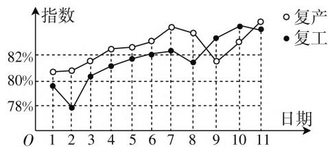

# 高考命题新导向,试题特点呈“四化”

# ● 江苏省海安高级中学 吉海波

新高考数学坚决落实“立德树人”的根本任务，建立文理不分科的数学学科统一考试体系，2020年在山东、海南两个省份为试点实行综合改革后的首次高考，后继将不断全面铺开、完善、推进，针对考试基本内容、试题结构模式、试卷类型创新及整体难度把握等改革方面都进行了探索试验与创新应用，为全面推进奠定了坚实的基础。特别在高考命题方面，呈现新的导向性，试题特点呈现出“四化”，充分对接普通高校人才选拔功能，实现新高考数学改革的方向性、时代性、科学性、应用性等，有效发挥高考数学对中学数学教学与学习的引领与导向作用。

# 一、试题背景的情境化

试题背景的情境化主要表现在数学试题的设置充分结合当下时代生活、热门话题、数学文化等情境，链接问题情境与数学知识之间的关联，合理引导学生关注生活，关注民生，倡导时代主旋律.

例 1 （2020 年高考数学新高考Ⅱ卷(海南卷)第9题）我国进入新冠肺炎疫情常态化防控，各地有序推进复工复产，下面是某地连续 11 天复工复产指数折线图(图 1)，下列说法正确的是()。

A. 这 11 天复工指数和复产指数均逐日增加  
B. 这 11 天期间, 复产指数的增量大于复工指数的增量  
C. 第 3 天至第 11 天复工复产指数均超过 80%  
D. 第 9 天至第 11 天复产指数的增量大于复工指数的增量

line

| 日期 | 复产 (%) | 复工 (%) |
|---|---|---|
| 1 | 80.5 | 79.5 |
| 2 | 80.8 | 77.5 |
| 3 | 81.5 | 80.5 |
| 4 | 82.5 | 81.5 |
| 5 | 83.0 | 82.0 |
| 6 | 83.5 | 82.5 |
| 7 | 84.0 | 82.8 |
| 8 | 83.5 | 81.5 |
| 9 | 82.0 | 83.5 |
| 10 | 83.0 | 84.5 |
| 11 | 84.0 | 85.0 |

图1

分析:结合当下我国抗击新冠肺炎疫情中的真实素材设计问题情境,链接统计中的折线图加以综合与应用,通过统计图表的分析并结合各选项中的内容加以正确判断.

解析:由统计中的折线图可知,这11天的复工指数和复产指数有增有减,故A错误;

通过折线图中折线的变化情况可知这11天期间，复产指数的增量并没有大于复工指数的增量，故B错误；

第 3 天至第 11 天复工复产指数均超过 80%，故 C 正确；

第 9 天至第 11 天复产指数的增量大于复工指数的增量, 故 D 正确.

故选择答案: CD.

点评:合理融合现实生活中的真实情境,整合统计中的图表知识加以交汇与综合,通过复工复产指数折线图来数形结合,结合所表示的函数的认知和理解,结合指数增量这一特定的名称的理解与观测来考查数学知识与数学能力等.

# 二、设问方式的多样化

设问方式的多样化主要表现在数学试题的设置在原来选择题、填空题与解答题的基础上进行尝试、改革与创新，增加多选题、结构不良试题等创新题型，类型更加丰富多彩，有效增强了考试的信度、效度与区分度.

例 2 （2020 年高考数学新高考 I 卷（山东卷），新高考 II 卷（海南卷）第 17 题）在 ① $ac = \sqrt{3}$ ，② $c \sin A = 3$ ，③ $c = \sqrt{3} b$ 这三个条件中任选一个，补充在下面问题中。若问题中的三角形存在，求 c 的值；若问题中的三角形不存在，说明理由。

问题:是否存在 $\triangle ABC$ ,它的内角A,B,C的对边分别为a,b,c,且 $\sin A=\sqrt{3}\sin B,C=\frac{\pi}{6}$ ,\_\_\_\_?

注:如果选择多个条件分别解答,按第一个解答计分.

分析:借助结构不良问题的创新设置,以解三角形为问题背景,给出三个条件,自主任选一个条件加以补充问题,并在所补充问题的基础上进而加以合理分析与解答.

解析: 由 $\sin A = \sqrt{3} \sin B$ 及正弦定理, 可得 $a = \sqrt{3} b$ , 根据余弦定理可得 $c^{2} = a^{2} + b^{2} - 2ab \cos C = 3b^{2} + b^{2} - 2\sqrt{3} b^{2} \times \frac{\sqrt{3}}{2} = b^{2}$ , 即 b = c, 于是 $B = C = \frac{\pi}{6}$ , $A = \frac{2\pi}{3}$ , 若选择 ① $ac = \sqrt{3}$ , 则有 $\left\{\begin{aligned}a &= \sqrt{3}b = \sqrt{3}c, \\ ac &= \sqrt{3},\end{aligned}\right.$ 解得 c = 1, 所以这样的 $\triangle ABC$ 存在, 且 c = 1.

若选择 ② $c\sin A=3$ ，由 $A=\frac{2\pi}{3}$ 解得 $c=2\sqrt{3}$ ，所以这样的 $\triangle ABC$ 存在，且 $c=2\sqrt{3}$ .

若选择 ③ $c=\sqrt{3}b$ ，这与 b=c 矛盾，所以这样的 $\triangle ABC$ 不存在.

点评: 结合解三角形这一数学知识作为问题背景, 尝试通过结构不良试题的创新设置, 以数学开放性问题的面孔出现, 极具开放性, 对学生数学知识与数学能力的考查起到重要作用, 特别对于创新意识与创新应用的考查是深远的且有意义的.

# 三、思维方法的多元化

思维方法的多元化主要表现在数学试题的设置满足不同层次学生对同一数学问题,从不同层次角度切入与分析的要求,结合学生对同一数学问题或知识的掌握程度的不同,从不同的思维角度来处理,实现思维方法的多元化.

例 3 （2020 年高考数学新高考Ⅰ卷(山东卷)第 13 题, 新高考Ⅱ卷(海南卷)第 14 题）斜率为 $\sqrt{3}$ 的直线过抛物线 C: $y^{2}=4x$ 的焦点, 且与 C 交于 A, B 两点, 则 $|AB|=$ \_\_\_\_.

分析:这里以熟知的圆锥曲线的焦点弦长的计算来设置问题,对于不同层次的学生都有很好的思维方法,一般的学生以弦长公式法来处理,用时较多;中等的学生以定义转化法来处理,效果良好;优秀的学生以焦点弦公式法来处理,更加简单快捷.

解法1:(弦长公式法)由抛物线 $C:y^{2}=4x$ ，可知C的焦点为 $F(1,0)$ ，而直线AB过焦点F且斜率为 $\sqrt{3}$ ，则直线AB的方程为 $y=\sqrt{3}(x-1)$ ，将直线AB的方程代入抛物线 $C:y^{2}=4x$ ，化简整理可得 $3x^{2}-10x+3=0$ ，解得 $x_{1}=\frac{1}{3}$ 或 $x_{2}=3$ ，结合抛物线的弦长公

式，可得 $|AB| = \sqrt{1 + k^2} |x_1 - x_2| = \sqrt{1 + 3} \cdot \left|\frac{1}{3} - 3\right| = \frac{16}{3}$ .

故填答案: $\frac{16}{3}$ .

解法2:(定义转化法)由抛物线 $C:y^{2}=4x$ ，可知C的焦点为 $F(1,0)$ ，p=2，而直线AB过焦点F且斜率为 $\sqrt{3}$ ，则直线AB的方程为 $y=\sqrt{3}(x-1)$ ，将直线AB的方程代入抛物线 $C:y^{2}=4x$ ，化简整理可得 $3x^{2}-10x+3=0$ ，解得 $x_{1}=\frac{1}{3}$ 或 $x_{2}=3$ （或直接利用韦达定理得到 $x_{1}+x_{2}=\frac{10}{3}$ ），结合抛物线的定义，可得 $|AB|=|AF_{1}|+|BF_{1}|=x_{1}+\frac{p}{2}+x_{2}+\frac{p}{2}=x_{1}+x_{2}+p=\frac{1}{3}+3+2=\frac{16}{3}$ .

故填答案: $\frac{16}{3}$ .

解法 3: (焦点弦公式法) 由于直线 AB 过抛物线 C: $y^{2}=4x$ 的焦点且斜率为 $\sqrt{3}$ , p=2, 可得直线 AB 的倾斜角 $\theta=\frac{\pi}{3}$ , 结合抛物线的焦点弦的长度公式, 可得

$$
\mid A B \mid = \frac {2 p}{\sin^ {2} \theta} = \frac {4}{\left(\frac {\sqrt {3}}{2}\right) ^ {2}} = \frac {1 6}{3}.
$$

故填答案: $\frac{16}{3}$ .

点评:新高考数学试卷中通过熟知的基本知识来设置试题,可以通过不同的思维方法来分析与破解,合理区分不同层次学生的理解、掌握与熟悉情况,从熟练掌握、用时情况及代数运算等角度进行多元化,实现试卷的区分性与选拔性.

新高考数学试题能有效明确数学学科在新高考中的地位和作用,确定考核目标和考查要求,把握改革精神,创新题型设计,优化试卷结构,确定难度调控策略,满足高校各专业对考生数学基本知识和数学能力的要求,达到很好的稳定与创新、稳定与改革、继承与创新等的过渡与改革,真正全面推进高考综合改革,促进数学命题与核心素养、课程标准等之间的有机联系,正确引领中学数学教学的全面深入与发展. F