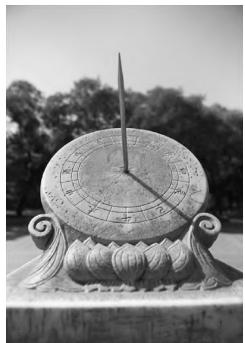
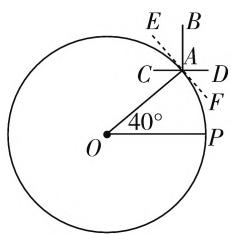
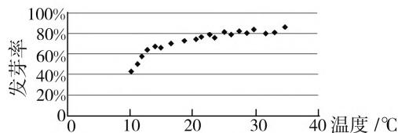

# 高考多措并举,凸呈关键能力

# ● 江苏省淮安市楚州中学 王 晶

关键能力是我们在现实生活中工作与学习时认识问题、分析问题、解决问题等必须具备的基本能力与素养，特别对于进入普通高等院校的学习者来说，更是面对相关学科的对应生活实践或学习探究过程、解决问题及终身学习时所必备的。对于数学学科，结合高考评价的整体框架体系，综合《数学课程标准》中科学提出的学科核心素养，归纳总结出以下相应的逻辑思维、运算求解、空间想象、数学建模和创新应用等五项关键能力。这五项基本关键能力是对以往高考数学学科能力结构的继承和发展，并根据高考测量的实际确定的，既具有理论基础，又具备可操作性，在高考数学命题中得以充分体现。

# 一、逻辑思维能力

逻辑思维能力是包括数学学习在内的现实生活中的一种重要思维能力,是我们的终身学习与发展必须具有的特殊功能.

例 1 （2020 年高考数学全国Ⅲ卷理科第 12 题）已知 $5^{5} < 8^{4}, 13^{4} < 8^{5}$ ，设 $a = \log_{5}3, b = \log_{8}5, c = \log_{13}8$ ，则（）.

A. $a < b < c$

B. b < a < c

C. b < c < a

D. c < a < b

分析:结合指数式与对数式的相互转化,综合对数运算,指数函数与对数函数的图像与性质等,合理通过作商比较法与指数式的大小关系的应用,合理过渡,巧妙转化,从而得以正确判断.

解析:由题意可知 $a, b, c \in (0,1)$ ，由于 $\frac{a}{b} = \frac{\log_{5}3}{\log_{8}5} = \frac{\lg 3}{\lg 5} \cdot \frac{\lg 8}{\lg 5} < \frac{1}{(\lg 5)^{2}} \cdot \left( \frac{\lg 3 + \lg 8}{2} \right)^{2} = \left( \frac{\lg 3 + \lg 8}{2 \lg 5} \right)^{2} = \left( \frac{\lg 24}{\lg 25} \right)^{2} < 1$ ，则有 a < b；

由 $b = \log_85$ ，可得 $8^{b} = 5$ ，由 $5^{5} < 8^{4}$ ，可得 $8^{5b} < 8^{4}$ ，则有 $5b < 4$ ，解得 $b < \frac{4}{5}$

由 $c = \log_{13}8$ ，可得 $13^{c} = 8$ ，由 $13^{4} < 8^{5}$ ，可得 $13^{4} <$ $13^{5c}$ , 则有 $4 < 5c$ , 解得 $c > \frac{4}{5}$ .

综上所述， $a < b < c$

故选择答案:A.

点评:借助逻辑思维能力的应用,结合指数式的大小关系来比较对数式的大小,涉及对数运算、基本不等式、对数式与指数式的互化,以及指数函数单调性的应用,很好地考查了推理论证与数学运算等能力.

# 二、运算求解能力

运算求解能力是在明晰运算对象的基础上的一种演绎推理能力,依据运算法则来分析与解决数学问题,是解决数学问题的基本手段和基本工具之一,更是新课标中创新性指出的六大核心素养之一.

例 2 （2020 年高考数学江苏卷第 8 题）已知 $\sin^{2}\left(\frac{\pi}{4}+\alpha\right)=\frac{2}{3}$ ，则 $\sin2\alpha$ 的值是 \_\_\_\_.

分析:结合条件中的平方形式,确定与之相应的运算技巧,直接利用二倍角公式的变形公式(降幂公式),合理有效选择对应的运算方法,结合诱导公式加以转化,从而得以求解三角函数值.

解析:由于 $\sin^{2}\left(\frac{\pi}{4}+\alpha\right)=\frac{2}{3}$ ，结合二倍角公式的变形，可得 $\sin^{2}\left(\frac{\pi}{4}+\alpha\right)=\frac{1}{2}\left[1-\cos\left(\frac{\pi}{2}+2\alpha\right)\right]=\frac{1}{2}(1+\sin2\alpha)=\frac{2}{3}$ ，解得 $\sin2\alpha=\frac{1}{3}$ .

故填答案: $\frac{1}{3}$ .

点评:借助运算求解能力的应用,通过二倍角公式的变形加以转化,合理确定运算技巧,选择配套的运算方法,对公式进行变形与转化,从而合理降幂,巧妙转化,简化过程,正确应用,提高效益.

# 三、空间想象能力

空间想象能力是数学学科中最有鲜明特色的一项基本关键能力,是学生学习数学学科的相关知识所必须具备的能力,特别是涉及空间立体几何问题的数学教学与学习中所必须具备的,且是高考数学考试着力培养且重点考查的一项关键能力.

例 3 （2020 年高考数学新高考 I 卷(山东卷)第 4 题）日晷是中国古代用来测定时间的仪器，利用与晷面垂直的晷针投射到晷面的影子来测定时间。把地球看成一个球(球心记为 O)，地球上一点 A 的纬度是指 OA 与地球赤道所在平面所成角，点 A 处的水平面是指过点 A 且与 OA 垂直的平面，在点A 处放置一个日晷, 若晷面与赤道所在平面平行, 点 A 处的纬度为北纬 $40^{\circ}$ , 则晷针与点 A 处的水平面所成角为().

natural_image

Black-and-white photo of an old sandar with a central dial and ornate base, set against trees and sky (no visible text or symbols)

图1

A. $20^{\circ}$

B. $40^{\circ}$

C. $50^{\circ}$

D. $90^{\circ}$

分析: 通过日晷仪器这一创新立体空间几何模型, 进行合理模型化与抽象化, 巧妙地把球体中的知识转化为平面几何问题, 合理融合立体几何与平面几何等相关知识, 很好地考查了空间想象能力, 以及数学建模与创新应用.

解析: 如图 2 所示, 把立体几何中的空间问题平面几何化. 由题知, 将一个日晷放置在点 A 处, 结合晷面与赤道所在平面平行, 则知晷面 CD 与赤道所在的平面 OP 互相平行, 且此时晷针为线段 AB, 同时点 A 处的水平面为 $EF$ ，由于 $CD \parallel OP$ ，可得 $\angle CAO = \angle AOP = 40^{\circ}$ ，结合平面几何中的垂直关系，可得 $\angle BAE = \angle CAO = 40^{\circ}$ ，即为晷针与点 $A$ 处的水平面所成角.

text_image

E
B
A
C
D
F
O
40°
P

图2

故选择答案:B.

点评:借助空间想象能力的应用,抓住创新模型,以中国古代用来测定时间的仪器——日晷来巧妙设置几何问题,实现应用模型、立体几何、平面几何之间的有机联系,巧妙地把数学文化与立体几何、平面几何等知识加以融合.

# 四、数学建模能力

数学建模能力是借助不断学习、深入、适应、模仿、套用、改进并创新，不断改进方法与方式，建立起与问题相吻合的数学基本模型,借助数学概念的提取、掌握与应用,数学知识的过渡、理解与综合,以及数学基本模型的构建、交汇与应用,融会贯通.

例 4 （2020 年高考数学全国 I 卷文科、理科第 5 题）某校一个课外学习小组为研究某作物种子的发芽率 y 和温度 x（单位：℃）的关系，在 20 个不同的温度条件下进行种子发芽实验，由实验数据 $(x_{i}, y_{i}) (i=1, 2, \cdots, 20)$ 得到下面的散点图。由此散点图，在 $10^{\circ}C$ 至 $40^{\circ}C$ 之间，下面四个回归方程类型中最适宜作为发芽率 y 和温度 x 的回归方程类型的是（）。

A. $y = a + bx$

B. $y = a + bx^{2}$

C. $y = a + b e^{x}$

D. $y = a + b\ln x$

line

| 温度 (℃) | 发芽率 (%) |
| :--- | :--- |
| 10 | 45 |
| 12 | 60 |
| 14 | 68 |
| 16 | 72 |
| 18 | 75 |
| 20 | 78 |
| 22 | 80 |
| 24 | 82 |
| 26 | 83 |
| 28 | 84 |
| 30 | 85 |
| 32 | 86 |
| 34 | 87 |

图3

分析:根据题目条件中图表——散点图的分布规律,从而提取发芽率y和温度x之间的数据信息,借助数学建模,结合散点图分布的图像规律加以选择合适的函数模型,作出正确的判断.

解析:根据题目中散点图的分布规律,以及基本初等函数的图像与性质可知,20个不同的实验数据 $(x_{i},y_{i})$ 大体分布在一个相关函数图像上或者其图像附近位置,结合选项中一次函数、二次函数、指数函数与对数函数的解析式,根据曲线的大体分布规律可知,比较吻合对数函数的解析,其相应的函数关系式是 $y=a+b\ln x$ .

故选择答案:D.

点评:借助数学建模能力的应用,结合图表中的数据信息加以合理分析,综合散点图分布的图像规律及基本初等函数模型的应用,加以合理分析与规律总结,从而作出合理的数据分析与判断.

关键能力是高水平人才培养体系所必须培养的、支撑我们终身学习与发展，以及适应时代创新要求的基本能力，是认识现实问题、发展数学学科素养、培育数学核心素养、养成良好品质等所必须具备的基本能力基础。借助高考数学试题命制的多措并举，合理融合相应的数学学科关键能力，充分体现数学学科核心素养的精细化、具体化及创新体现。F