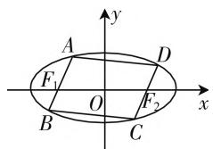
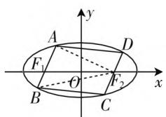

# 主动建构,有效学习

——从一道解析几何题谈起

● 江苏省常熟外国语学校 校雪琴

笔者在平时的教学中发现,不少数学教师在教学时还存在着或多或少的“灌输”现象,即使实施探究性学习过程,往往也存在“形式”之嫌,缺乏深度挖掘和动态探究,造成了“只见树木不见森林”的现象.下面笔者通过对一道解析几何题的探究性学习,谈谈如何促进学生有意义的数学学习.

# 一、引入问题

# 1. 提出问题

如图 1, 已知椭圆 $E: \frac{x^{2}}{4} + y^{2} = 1$ , 且平行四边形 ABCD 为椭圆 E 的内接平行四边形, 其一组对边分别过它的两个焦点, 则该平行四边形面积的最大值为 \_\_\_\_.

text_image

y
A
D
F₁
O
F₂
x
B
C

图1

此题是以椭圆为载体，以探究平行四边形的一般情况为思想的填空题，看似简单明了，实际上却构造精巧、内涵丰富，从学生解答的结果可以看出的确具有相当大的“区别度”。全班50人仅有6名学生给出正确答案“4”，20多名学生选择了放弃解答，其余学生则得出了“ $2\sqrt{3}$ ”的错误结果。据了解，选填“ $2\sqrt{3}$ ”的学生仅考虑到 $AB \perp F_{1}F_{2}$ 时的情况，也就是平行四边形ABCD为矩形时。

# 2. 思路导向

师:如何表示平行四边形 ABCD 的面积?请小组合作讨论,并展示.

生1:常用方法:①S=底×高;② $S=AB\cdot BC\cdot\sin\angle ABC$ ;③ $S=\frac{1}{2}AC\cdot BD\cdot\sin\alpha(\alpha$ 是AC,BD的夹角).

text_image

y
A
D
F₁
O
F₂
x
B
C

图2

生2:如图2所示,连接 $AF_{2}$ , $BF_{2},S_{平行四边形ABCD}=2S_{\triangle ABF_{2}}=2(S_{\triangle AF_{1}F_{2}}+S_{\triangle BF_{1}F_{2}})=$

$$
\begin{array}{l} F _ {1} F _ {2} \cdot (| y _ {A} | + | y _ {B} |) = F _ {1} F _ {2} \cdot | y _ {A} - y _ {B} | = \\ 2 \sqrt {3} | y _ {A} - y _ {B} |. \end{array}
$$

生3:我认为可以连接AO,BO,则 $S_{平行四边形ABCD}=4S_{\triangle ABO}=2F_{1}O\cdot(|y_{A}|+|y_{B}|)=2F_{1}O\cdot|y_{A}-y_{B}|=2\sqrt{3}|y_{A}-y_{B}|$ .

师:很不错,三位学生给出的求导方法都各不相同,生1所给为常用公式,生2和生3尽管方法本质类似,不过思路却有所不同,方法很便捷.下面结合此题的条件,请思考“该如何求 $S_{平行四边形ABCD}$ 的最大值”?

# 3. 呈现多解

生 4: 设直线 $AB: y = k(x + \sqrt{3})(k \neq 0)$ ，且 $A(x_{1}, y_{1}), B(x_{2}, y_{2})$ .

根据 $\left\{\begin{aligned}y&=k(x+\sqrt{3}),\\ \frac{x^{2}}{4}&=y^{2}=1,\end{aligned}\right.$ 可得 $\left(\frac{1}{k}y-\sqrt{3}\right)^{2}+4y^{2}-4=0$ ，即 $(4k^{2}+1)y^{2}-2\sqrt{3}ky-k^{2}=0$ ，所以 $\left\{\begin{aligned}y_{1}+y_{2}&=\frac{2\sqrt{3}k}{4k^{2}+1},\\ y_{1}y_{2}&=-\frac{k^{2}}{4k^{2}+1},\end{aligned}\right.$ 所以 $(y_{1}-y_{2})^{2}=(y_{1}+y_{2})^{2}-4=0$

$$
4 y _ {1} y _ {2} = \frac {1 2 k ^ {2}}{(4 k ^ {2} + 1) ^ {2}} + \frac {4 k ^ {2}}{4 k ^ {2} + 1} = \frac {1 6 k ^ {2} (k ^ {2} + 1)}{(4 k ^ {2} + 1) ^ {2}}.
$$

设 $k^2 = t, t > 0$ ，所以 $(y_1 - y_2)^2 = \frac{16t(t + 1)}{(4t + 1)^2}$ .

设 $f(t) = \frac{16t^2 + 16t}{(4t + 1)^2}$ , 令 $f'(t) = \frac{16(1 - 2t)}{(4t + 1)^3} = 0$ , 可得 $t = \frac{1}{2}$ , 所以当 $k^2 = \frac{1}{2}$ , 即 $k = \pm \frac{\sqrt{2}}{2}$ 时, $(y_1 - y_2)^2$ 取得最大值 $\frac{4}{3}$ , 所以 $S_{\text{平行四边形ABCD}}$ 的最大值是 4.

师:生 4 是通过什么来求解的?

生 5:他是令直线 AB 的斜率为自变量,再通过建构 $(y_{1}-y_{2})^{2}$ 目标函数的方法进行求解的.

师:那么,他的解法可否存在不足之处?

生6:他考虑得不够全面,遗漏了直线 $AB\perp F_{1}F_{2}$ 此情况的存在.当 $AB\perp F_{1}F_{2}$ 时,AB=1,S平行四边形ABCD= $2\sqrt{3}$ .所以 $S_{平行四边形ABCD}$ 的最大值是4.

师: 是否在存在其他方法设直线 AB 的方程呢? 请思考.

生 7: 我是通过设直线 AB: $x = my - \sqrt{3}$ 这种方法, 既可以减少解决过程中的烦琐运算, 还可以有效避开讨论. 据 $\left\{\begin{aligned}x&=my-\sqrt{3},\\ \frac{x^{2}}{4}&+y^{2}=1,\end{aligned}\right.$ 可得 $(m^{2}+4)y^{2}-2\sqrt{3}my-$

1 = 0，所以 $\left\{ \begin{array}{l} y_{1} + y_{2} = \frac{2\sqrt{3}m}{m^{2} + 4}, \\ y_{1}y_{2} = -\frac{1}{m^{2} + 4}, \end{array} \right.$ 所以 $(y_{1} - y_{2})^{2}$

$$
= (y _ {1} + y _ {2}) ^ {2} - 4 y _ {1} y _ {2} = \left(\frac {2 \sqrt {3} m}{m ^ {2} + 4}\right) ^ {2} + \frac {4}{m ^ {2} + 4} =
$$

$$
\frac {1 6 (m ^ {2} + 1)}{(m ^ {2} + 4) ^ {2}}.
$$

设 $m^2 + 1 = t, t \geqslant 1$ ，所以 $(y_1 - y_2)^2 = \frac{16t}{(t + 3)^2} = \frac{16}{t + \frac{9}{t} + 6} \leqslant \frac{16}{12} = \frac{4}{3}$ ，当且仅当 $t = 3$ ，也就是 $m = \pm \sqrt{2}$

时,取得“=”,所以 $S_{平行四边形ABCD}$ 的最大值是 4.

师:根据以上两种不同解法可以判断出只有深入挖掘和思考才能探究出最便捷的解题方法.因此,在原题的基础上,我们可否再进行使问题一般化的探索?

# 二、深度探究

问题呈现:已知椭圆 $E:\frac{x^{2}}{a^{2}}+\frac{y^{2}}{b^{2}}=1(a>b>0)$ ，且平行四边形 ABCD 为椭圆 E 的内接平行四边形，其一组对边分别过它的两个焦点（见图 2），该平行四边形面积的最大值 S= \_\_\_\_.

生8: 设 $A(x_{1}, y_{1}), B(x_{2}, y_{2})$ . 据上可知 $S_{ABCD} = 2S_{\triangle ABF_{2}} = 2c \cdot |y_{1} - y_{2}|$ .

设直线 $AB: x = my - c$ . 据 $\left\{ \begin{array}{l} x = my - c, \\ \frac{x^2}{a^2} + \frac{y^2}{b^2} = 1, \end{array} \right.$ 可得 $(a^2 + b^2m^2)y^2 - 2b^2cmy - b^4 = 0$ .

所以 $\left\{\begin{aligned}y_{1}+y_{2}&=\frac{2b^{2}cm}{a^{2}+b^{2}m^{2}},\\ y_{1}y_{2}&=-\frac{b^{4}}{a^{2}+b^{2}m^{2}},\end{aligned}\right.$ 所以 $(y_{1}-y_{2})^{2}$

$$
\begin{array}{l} = (y _ {1} + y _ {2}) ^ {2} - 4 y _ {1} y _ {2} = \frac {4 b ^ {4} c ^ {2} m ^ {2}}{(a ^ {2} + b ^ {2} m ^ {2})} + \frac {4 b ^ {4}}{a ^ {2} + b ^ {2} m ^ {2}} = \\ \frac {4 a ^ {2} b ^ {4} (m ^ {2} + 1)}{(a ^ {2} + b ^ {2} m ^ {2}) ^ {2}}. \end{array}
$$

设 $m^2 + 1 = t, t \geqslant 1$ ，所以 $(y_1 - y_2)^2 = \frac{4a^2b^4t}{(c^2 + b^2t)^2} = \frac{4a^2b^4}{b^4t + \frac{c^4}{t} + 2b^2c^2}$ .

设 $f(t) = b^{4}t + \frac{c^{4}}{t} (t\geqslant 1)$ ，易得：

① 若 $\frac{c^2}{b^2} \geqslant 1$ ，也就是 $\frac{\sqrt{2}}{2} \leqslant e < 1$ ，当 $t = \frac{c^2}{b^2}$ 时， $f(t)$ 有最小值， $(y_1 - y_2)^2$ 取得最大值 $\frac{a^2b^2}{c^2}$ ，所以 $S_{\text{平行四边形}ABCD}$ 的最大值是 $2ab$ ；

② 若 $0 < \frac{c^2}{b^2} < 1$ ，也就是 $0 < e < \frac{\sqrt{2}}{2}$ ，当 $t = 1$ 时， $f(t)$ 有最小值， $(y_1 - y_2)^2$ 取得最大值 $\frac{4b^4}{a^2}$ ，所以 $S_{\text{平行四边形}ABCD}$ 的最大值是 $\frac{4b^2c}{a} = \frac{4b^2\sqrt{a^2 - b^2}}{a}$ .

综上, $S=\left\{\begin{aligned}&2ab,\frac{\sqrt{2}}{2}\leqslant e<1,\\&\frac{4b^{2}\sqrt{a^{2}-b^{2}}}{a},0<e<\frac{\sqrt{2}}{2}.\end{aligned}\right.$

# 三、教学启示

# 1. 课堂教学, 应将时间留给学生, 将方法教给学生

在这节课的教学中, 笔者通过流畅式教学设计, 让学生去观察、思考、探讨、交流、归纳、创造……让学生来表演, 让学生去张扬, 教师不占、不抢, 而是及时点拨, 给予释疑. 在这种平等和谐的教学过程中, 让学生有时间去探索, 从而提高他们的能力, 熏陶他们的数学情感, 兴趣自然而来, 还愁学不好数学吗? 还担心不会解题吗?

# 2. 课堂教学,应引领学生思维走向深度

数学课堂教学,若仅仅停留在对习题逐题剖析的层面,则很难达到事半功倍的效果,只有深度发掘才能实现习题的“再创造”,才能将题目本身的最大教育价值发挥殆尽.学生的思维经历“再创造”的过程,不仅可以对数学问题探究的一般规律有所认识,还可以打开视野和思维,透过一道例题探究到这一类题的全貌,从而引领学生的思维逐步走向深处.W