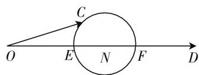
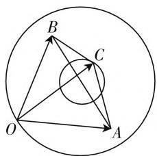

# 代数与几何齐飞,技能共素养一色

—— 一道向量题的探究

● 江苏省无锡市北高级中学 吴承瑜

平面向量同时兼备“数”的因素与“形”的思维，为破解此类问题指明方向，往往可以从这两个角度切入，从“数”的角度入手，利用代数视角，通过代数运算或坐标表示等形式来解决；从“形”的角度入手，利用几何视角，通过几何特征或图形直观等形式来处理。同时在破解时还要抓住平面向量的定义、性质、公式等，合理交汇，综合应用，从而达到巧妙转化，正确破解的目的。

# 一、问题呈现

【问题】(2020届浙江省义乌市高三数学第一次模拟(11月)考试·15)已知平面向量a,b,c满足 $a\cdot b=\frac{7}{4}$ ， $|a-b|=3,(a-c)\cdot(b-c)=-2$ ，则 $|c|$ 的取值范围是\_\_\_\_.

通过复杂的三个平面向量之间的关系,借助平面向量的数量积、线性运算及模等形式,求解相关向量的模的取值范围问题.破解时,可以借助题目条件,从“数”的角度入手,结合定义、性质等综合应用;也可以从“形”的角度入手,数形结合,巧妙转化;还可以通过极化恒等式思维,数形结合,合理破解.

# 二、问题破解

方法 1: 夹角性质法.

根据题目条件先求得 $\left|a+b\right|$ 的值，再结合平面向量的数量积公式加以展开已知关系式，得到 $c^{2}$ 的表达式，利用夹角的引入 $(a+b$ 与 c 的夹角为 $\theta)$ 与性质应用，结合三角函数的图像与性质来建立相应的不等式，再通过求解二次不等式来达到目的.

解析:由于 $a \cdot b = \frac{7}{4}$ , $|a - b| = 3$ , 可得 $|a + b| = \sqrt{(a - b)^2 + 4a \cdot b} = 4$ , 结合 $(a - c) \cdot (b - c) = -2$ , 可得 $c^2 = (a + b) \cdot c - a \cdot b - 2 = |a + b| \cdot |c| \cos \theta - \frac{7}{4} - 2 = 4 |c| \cos \theta - \frac{15}{4}$ , 设 $a + b$ 与 c 的夹

角为 $\theta$ ，所以 $\cos \theta = \frac{c^2 + \frac{15}{4}}{4|c|} = \frac{|c|^2 + \frac{15}{4}}{4|c|}\in [-1,1]$

则有 $-1 \leqslant \frac{|c|^2 + \frac{15}{4}}{4|c|} \leqslant 1$ ，解得 $\frac{3}{2} \leqslant |c| \leqslant \frac{5}{2}$ .

故填答案: $\left[\frac{3}{2},\frac{5}{2}\right]$ .

方法 2: 数形结合法.

根据题目条件先求得 $|a+b|$ 的值,再结合平面向量的数量积公式加以展开已知关系式,利用整体思维与配方法的应用加以转化,再利用数形结合法的应用,结合平面几何的性质,通过点的轨迹的几何性质来达到目的.

解析:由于 $a \cdot b = \frac{7}{4}$ ， $|a - b| = 3$ ，可得 $|a + b| = \sqrt{(a - b)^2 + 4a \cdot b} = 4$ ，结合 $(a - c) \cdot (b - c) = -2$ ，可得 $c^2 - (a + b) \cdot c + a \cdot b = c^2 - (a + b) \cdot c + \frac{7}{4} = -2$ ，配方并整理可得 $\left[c - \frac{1}{2}(a + b)\right]^2 - \frac{1}{4}(a + b)^2 = -\frac{15}{4}$ ，则有 $\left[c - \frac{1}{2}(a + b)\right]^2 = \frac{1}{4}(a + b)^2 - \frac{15}{4} = \frac{1}{4}$ ，设 $\overrightarrow{OC} = c, \overrightarrow{OD} = a + b$ ，则有 $|\overrightarrow{OD}| = |a + b| = 4$ ，取线段OD的中点为N，如图1所示，则知点C在以N为圆心，半径为 $\frac{1}{2}$ 的圆周上，所以 $\frac{3}{2} = |OE| \leqslant |OC| \leqslant |OF| = \frac{5}{2}$ ，即 $\frac{3}{2} \leqslant |c| \leqslant \frac{5}{2}$ .

故填答案: $\left[\frac{3}{2},\frac{5}{2}\right]$ .

text_image

O
E
N
F
D
C

图1

方法 3: 极化恒等式法.

根据题目条件作出相应的图形与对应的平面向量，并借助线段中点的确定，结合极化恒等式的应用加以确定线段的长度问题，再利用极化恒等式的应用来破解相关线段长度的取值问题，数形结合来达到目的.

解析:如图2所示,设 $\overrightarrow{OA}=a,\overrightarrow{OB}=b,\overrightarrow{OC}=c$ ，由于 $|a-b|=|\overrightarrow{OA}-\overrightarrow{OB}|=|\overrightarrow{BA}|=3$ ，则知 $|AB|=3$ ，取线段AB的中点为D，结合极化恒等式，可得 $a\cdot b=\frac{1}{4}(a+b)^{2}-$

text_image

B
C
O
A

图2

$\frac{1}{4} (\pmb {a} - \pmb {b})^2 = \overrightarrow{OD^2} -\overrightarrow{DA^2} = |\overrightarrow{OD}|^2 -|\overrightarrow{DA}|^2 =$ $|OD|^2 -\frac{9}{4} = \frac{7}{4}$ ，则有 $|OD| = 2$ ，又结合极化恒等式，可得 $(\pmb {a} - \pmb {c})\cdot (\pmb {b} - \pmb {c}) = \overrightarrow{CA}\cdot \overrightarrow{CB} = \frac{1}{4} (\overrightarrow{CA} +\overrightarrow{CB})^2 -$ $\frac{1}{4} (\overrightarrow{CA} -\overrightarrow{CB})^2 = \overrightarrow{CD^2} -\overrightarrow{DA^2} = |\overrightarrow{CD}|^2 -|\overrightarrow{DA}|^2 =$ $|CD|^2 -\frac{9}{4} = -2$ ，则有 $|CD| = \frac{1}{2}$ ，数形结合可得 $\frac{3}{2} = |OD| - |CD|\leqslant |OC|\leqslant |OD| + |CD| = \frac{5}{2},$ 即 $\frac{3}{2}\leqslant |c|\leqslant \frac{5}{2}.$

故填答案: $\left[\frac{3}{2},\frac{5}{2}\right]$ .

点评:根据题目条件,有效借助平面向量的夹角性质或数量积性质来转化,结合三角函数的图像与性质或数量积的性质来转化,利用二次不等式的求解来处理;或借助数形结合思维来处理,或利用极化恒等式来应用,通过平面几何性质及平面向量的相关条件加以数形结合,从几何层面与关系式的应用等方面加以综合.无论借助哪种方法,都可以达到巧妙处理、合理破解的目的.

# 三、变式拓展

探究 1: 保留题目条件, 把问题所要求解的 “|c| 的取值范围” 变为求解 “|c| 的最小值” 或 “|c| 的最大值”, 方法与原问题一致, 得以有效变式.

变式 1: 已知平面向量 a, b, c 满足 $a \cdot b = \frac{7}{4}$ ， $|a - b| = 3, (a - c) \cdot (b - c) = -2$ ，则 $|c|$ 的最小值是 \_\_\_\_.

答案: $\frac{3}{2}$ .

变式2: 已知平面向量 a, b, c 满足 $a \cdot b = \frac{7}{4}$ ， $|a - b| = 3, (a - c) \cdot (b - c) = -2$ ，则 $|c|$ 的最大值是 \_\_\_\_.

答案: $\frac{5}{2}$ .

点评:以上两变式的解析过程可以直接参考原问题的破解方法,无论当中的哪一种方法都可以直接求解 $|c|$ 的最值,从而得以解决问题.

探究 2: 保留题目中的部分条件与所要求解的结果, 把对应向量的数量积的值加以改变, 将“ $(a-c)\cdot(b-c)=-2$ ”变为“ $(a-c)\cdot(b-c)=0$ ”, 破解思维相似, 得以有效变式.

变式 3: 已知平面向量 a, b, c 满足 $a \cdot b = \frac{7}{4}$ ， $|a - b| = 3, (a - c) \cdot (b - c) = 0$ ，则 $|c|$ 的取值范围是 \_\_\_\_.

解析:由于 $a \cdot b = \frac{7}{4}$ , $|a - b| = 3$ , 可得 $|a + b| = \sqrt{(a - b)^2 + 4a \cdot b} = 4$ , 结合 $(a - c) \cdot (b - c) = 0$ 可得 $c^2 = (a + b) \cdot c - a \cdot b = (a + b) \cdot c - \frac{7}{4} = (a + b) \cdot c - \frac{7}{4}$ , 所以 $|c|^2 + \frac{7}{4} = (a + b) \cdot c \leqslant |a + b| \cdot |c| = 4 |c|$ , 即 $|c|^2 - 4 |c| + \frac{7}{4} \leqslant 0$ , 解得 $\frac{1}{2} \leqslant |c| \leqslant \frac{7}{2}$ .

故填答案: $\left[\frac{1}{2},\frac{7}{2}\right]$ .

点评: 其实该变式中, 涉及“ $a \cdot b$ ”、“ $|a - b|$ ”、“ $(a - c) \cdot (b - c)$ ”的值问题, 可以改变其中的任意一个或是多个, 都可以有效变式, 破解思维方式也可以参考原问题的思维方式.

# 四、解后反思

结合一道模拟卷中的典型平面向量问题,通过认真分析题意,仔细研究内容,从不同思维视角、不同知识方法等方面来破解,并在此基础上,深入探究,拓展应用,形成解题的思维习惯与破解方式,从而真正拓展能力,提升素养,培养思维品质,达到数学技能与学科素养的完善统一. $^{F}$