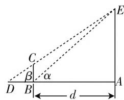

# 例析高中生运算能力的培养

# ● 江苏省西亭高级中学 张彬

运算能力是数学学科基本特征的反映, 是学习数学的“童子功”, 也是新课程标准所关注的核心能力. 运算能力的培养是各个学段数学学科的重要内容, 也是高考必考的一种能力. 运算能力如此重要, 为什么学生总是无法胜任呢? 在日常教学中, 教师在学生的计算上也是煞费苦心, 但计算错误却仍然是无法脱离的“苦海”. 纵观历年高考情形, 考生因运算失利的例子数不胜数. 事实上, 这与平时的教与学活动中不当的解题方法和不注重运算能力的培养有着很大的关系.

# 一、运算能力的现状分析

高中数学运算形式繁多,它主要表现为运算法则、性质、公式的灵活运用,并与理解能力、记忆能力、推理能力和想象力等其他认知能力相互渗透,交织为一种综合能力.运算是思维的载体,运算能力是思维能力的一种表现,也是数学素养的一种显现.

高中数学内容繁多，概念、公式、法则众多，易遗忘，也易混淆，还有一些学生以死记硬背为主，在运用时死套公式，这些都是造成运算错误的主要原因。也有一些教师将运算理解为一种技能，借助“刷题”的方式进行训练，尽管大量做题可以促进运算技能的形成，而在新的问题情境产生时学生依然会思维卡壳，无法较好地解决问题。由此可见，运算能力这一关键能力的提升源自学生的内化感悟，离不开思维的过程，并非重复训练即可形成的。一些教师尽管关注到了学生运算技能，但在具体教学过程中却重结果而轻过程，导致了学生算理理解的缺失，算法选择的轻视，尽管技能已经形成，却依然无法内化为运算能力。

# 二、运算能力的培养

# 1. 审题仔细

审题是完善解题路径的基础,指引着正确解题的方向,决定着运算的正确率.仔细审题,可以理清题目的特点和运算间的关系,既可以确定解题方向,又能进一步思考是否存在更灵活、更合理的解题方法,从而选择最佳解题策略,这也充分体现了数学运算中蕴含着目标意识.在解题的过程中,加强学生对题目解读的训练,可以逐步完善认真解题的重要性,促进学生数学思维步入深刻,并充分调动学生审题的积极性,为学生更好地解决问题提供重要支持.同时,审题对观察能力的培养,思维能力的发展也具有重要意义.

例 1 如图 1 所示, 某检测小组正在测量电视塔 AE 的高度 H (单位: m), 经测量, 垂直于地面的标杆 BC 的高度 h = 4m, 且仰角 $\angle ABE = \alpha$ , $\angle ADE = \beta$ .

text_image

D
B
C
β
α
d
A
E

图1

(1) 在第一轮检测中, 该小组测得数据为 $\tan\alpha = 1.24, \tan\beta = 1.20$ , 请根据这组数据计算 H 的值.  
(2) 经过多轮检测并分析后, 发现若将标杆到电视塔的距离 d (单位: m) 调整到 $\alpha$ 与 $\beta$ 之差较大, 在一定程度上可以提高测量的精确度. 那么当 H = 125m 时, 试求出令 $\alpha - \beta$ 最大的 d 值.

解:(1) $\frac{H}{AD}=\tan\beta\Rightarrow AD=\frac{H}{\tan\beta};$

同理, $AB=\frac{H}{\tan\alpha},BD=\frac{h}{\tan\beta}.$

又因为 $AD - AB = DB, \frac{H}{\tan\beta} - \frac{H}{\tan\alpha} = \frac{h}{\tan\beta}$ , 可得 $H = \frac{h\tan\alpha}{\tan\alpha - \tan\beta} = \frac{4\times 1.24}{1.24 - 1.20} = 124\mathrm{m}$ .

(2) 因为 $\tan\alpha=\frac{H}{d},\tan\beta=\frac{H}{AD}=\frac{h}{DB}=\frac{H-h}{d}$ ，所

$$
\text {以} \tan (\alpha - \beta) = \frac {\tan \alpha - \tan \beta}{1 + \tan \alpha \tan \beta} = \frac {\frac {H}{d} - \frac {H - h}{d}}{1 + \frac {H}{d} \cdot \frac {H - h}{d}} =
$$

$$
\frac {h d}{d ^ {2} + H (H - h)} = \frac {h}{d + \frac {H (H - h)}{d}}.
$$

$d+\frac{H(H-h)}{d}\geqslant2\sqrt{H(H-h)}$ （当且仅当 $d=\sqrt{H(H-h)}=\sqrt{125\times121}=55\sqrt{5}m$ 时取等号).所以当 $d=55\sqrt{5}m$ 时， $\alpha-\beta$ 最大.

分析:本题中不仅考查了解三角形的知识,还应用到了两角差的正切与基本不等式.应用问题一直是高考的常见题型之一,是学生能否锁定高分的重要突破口.审题是解决应用问题的关键,数学应用题大都是对生活问题的再加工,具有一定的实际背景,把好审题关才能把握住关键词句,牢牢抓住数量关系,选好合理的解题方法,从而进一步优化运算,提升解题的正确率.

# 2. 有理有据

运算能力本身也是学习能力的一种表现. 这就要求学生在解题时需从题目的阅读着手, 再理清题目的思路, 然后过渡到解题过程, 最后才是完善解题路径. 其中的每个步骤都是对学生能力的考查, 只有做到脚踏实地、有理有据、步步为营才能真正意义上提高解题质量.

例2 设 $\alpha$ 为锐角, 若 $\cos \left(\alpha + \frac{\pi}{6}\right) = \frac{4}{5}$ , 试求出 $\sin \left(2\alpha + \frac{\pi}{12}\right)$ 的值.

解：由 $\cos \left(\alpha +\frac{\pi}{6}\right) = \frac{4}{5}$ ，可得 $\cos \left(2\alpha +\frac{\pi}{3}\right) =$ $2\cos^2\left(\alpha +\frac{\pi}{6}\right) - 1 = \frac{7}{25}.$

又有 $\cos \left(2\alpha +\frac{\pi}{3}\right) > 0$ ，可得 $\sin \left(2\alpha +\frac{\pi}{3}\right) = \frac{24}{25},$ 所以 $\sin \left(2\alpha +\frac{\pi}{12}\right) = \sin \left[\left(2\alpha +\frac{\pi}{3}\right) - \frac{\pi}{4}\right] =$ $\sin \left(2\alpha +\frac{\pi}{3}\right)\cos \frac{\pi}{4} -\cos \left(2\alpha +\frac{\pi}{3}\right)\sin \frac{\pi}{4} = \frac{17\sqrt{2}}{50}.$

分析:本题重点考查了两角和与差的三角公式和二倍角公式的灵活运用,其中包含了大量的运算.公式、定理、法则的活用才是解决本题的关键,加深对公式的理解,从而能够准确建立解题路径.细心运算则是提高解题正确率的保障,只有做到一丝不苟,才能提高运算的有效性,真正意义上形成运算能力.

# 3. 数形结合

“数学结合”是一种重要的数学思想方法，同时也是高考重点考查方向。在计算教学中，巧妙运用数形结合，可以帮助学生亲历探究过程，明晰算理，促进算法的融会贯通，从而发现计算规律，提高运算能力，发展思维水平。

例 3 定义在区间 $\left(0,\frac{\pi}{2}\right)$ 上的函数 $y=6\cos x$ 的图像与 $y=5\tan x$ 的图像相交于点P，过点P作 $PP_{1}\perp x$ 轴于点 $P_{1}$ ，且直线 $PP_{1}$ 与 $y=\sin x$ 的图像交于点 $P_{2}$ ，那么线段 $P_{1}P_{2}$ 的长为\_\_\_\_.

解:画出函数图像,易得线段 $P_{1}P_{2}$ 的长就是 $\sin x$ 的值,且 x 满足 $6\cos x = 5\tan x$ ,可得 $\sin x = \frac{2}{3}$ ,所以线段 $P_{1}P_{2}$ 的长为 $\frac{2}{3}$ .

分析:从上面的解析可以看出,解决本题的关键在于对线段 $P_{1}P_{2}$ 的理解,而直观的图形即可弱化繁杂的计算.在这里,数形的巧妙转化可化为学生思维的脚手架,从而大大减少计算量.这类借助数形结合弱化计算的试题在历年高考中比比皆是,这就要求高中学生在有限的答题时间内不能沉浸于埋头苦算,更需注重思想方法的运用,增加解答过程的“含金量”.

高考中对运算能力的考查是多角度、多方位和多层次的，很多试题都需要通过灵活的处理才能形成正确的解题路径，这就需要在平时训练中关注到运算方法，合理选择回避运算的解题思路，无法回避运算时则需思考运算的准确性、合理性和简捷性，从而在高考中发挥较高水平，立于不败之地。当然，运算能力这一核心素养的形成不是一蹴而就的，需要广大数学教师对运算能力具有全面而深刻的理解，并在长期的训练中一以贯之，在引导学生数学思考和问题解决的过程中，促进学生思维的发展，使之形成规范化思考问题的品质。

# 参考文献：

[1] 蒋智东. 从提高学生运算能力的角度谈数学核心素养的培养——以高三复习为例 [J]. 中学数学 (上), 2016(11).  
[2] 潘兴发. 基于核心素养视角下初中数学教学中培养学生运算能力的路径研究 [J]. 课程教育研究, 2019(19). W