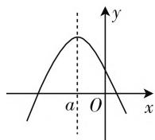
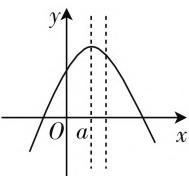
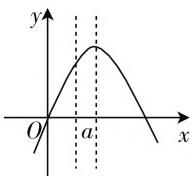
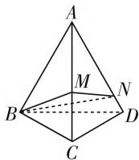
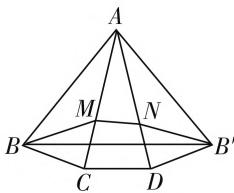
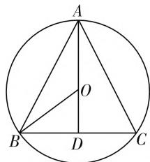

# 例谈常见最值问题求解方法

# ● 江苏省海门市四甲中学 姜红霞

最值问题几乎涉及数学的各个分支,是考试重点考查的知识点之一,有一些基础题,也有一些小综合的中档题,更有一些以难题的形式出现.它经常与二次函数、三角函数、一元二次方程、不等式及某些几何知识紧密联系.下面举例来谈一谈常见的最值问题求解方法.

# 题型一、函数的最值问题

函数的最值问题是考试中“出镜率”最高的最值问题,这类问题一般都可转化为基本函数的最值问题,尤其是二次函数.求解函数最值的方法灵活多样,有配方法,均值不等式法,函数单调性法,判别式法等.

例 1 已知函数 $f(x) = -x^{2} + 2ax + 1 - a$ 在 $0 \leqslant x \leqslant 1$ 时有最大值 2，求 a 的值.

解析: 当对称轴 x=a<0 时, 如图 1(1) 所示, 当 x=0 时, y 有最大值, $y_{\max}=f(0)=1-a$ , 所以 1-a=2, 即 a=-1, 且满足 a<0, 所以 a=-1.

  
图1(1)

  
图1(2)

  
图 1(3)

当对称轴 $0 \leqslant a \leqslant 1$ 时，如图1(2)所示，当 $x = a$ 时， $y$ 有最大值， $y_{\max} = f(a) = -a^2 + 2a^2 + 1 - a = a^2 - a + 1$ ，所以 $a^2 - a + 1 = 2$ ，解得 $a = \frac{1 \pm \sqrt{5}}{2}$ .

因为 $0 \leqslant a \leqslant 1$ ，所以 $a = \frac{1 \pm \sqrt{5}}{2}$ （舍去）.

当对称轴 a > 1 时，如图 1(3) 所示，当 x = 1 时，y 有最大值， $y_{\max} = f(1) = 2a - a = 2$ ，所以 a = 2，且满足 a > 1，所以 a = 2。

综上可得，a 的值为 -1 或 2.

点评:本题中的二次函数,虽开口方向已经确定,定义域也已经确定,但对称轴却不定,随着参数的变化而变化.随着对称轴的移动,函数的单调性在发生变化,而函数的最大值与函数的单调性有关,所以需分类讨论,分类讨论的原则是由函数在所给出的区间内的单调性决定,解答本题分三种情况进行讨论.

# 题型二、三角函数中的最值问题

求解三角函数的最值问题,必须熟悉三角函数的各种公式,尤其是三角函数恒等变换公式,利用公式对三角函数的解析式化简,必须熟练掌握三角函数的图像与性质,尤其是三角函数的有界性和三角函数图像的应用,必须学会换元,将三角函数最值问题转化为其他基本函数的最值问题.

例 2 求函数 $y = -2\cos^{2}x + 2\sin x + 3$ 的值域.

解析: 原式化为 $y = -2(1 - \sin^{2}x) + 2\sin x + 3 = 2\sin^{2}x + 2\sin x + 1 = 2\left(\sin x + \frac{1}{2}\right)^{2} + \frac{1}{2}$ .

令 $t = \sin x$ ，则 $y = 2\left(t + \frac{1}{2}\right)^2 +\frac{1}{2},t\in [-1,1]$ 由二次函数的图像可知，当 $t = -\frac{1}{2}$ 时， $y_{\mathrm{min}} = \frac{1}{2}$ ；当 $t$ $= 1$ 时， $y_{\mathrm{max}} = 5$

点评:形如 $y=a\sin^{2}x+b\cos x+c$ 的函数, 可利用同角三角函数关系式 $\sin^{2}x+\cos^{2}x=1$ 将其“不同名化同名”, 使其只含一种三角函数, 然后实施换元手段, 将其转化为二次函数的最值问题来求解: 设 $t=\sin x$ , 于是原函数可化为 $y=at^{2}+bt+c$ , 最后求在闭区间 $t\in[-1,1]$ 上的二次函数的最值即是原函数的最值.

# 题型三、解析几何中的最值问题

最值问题是高考解析几何中命题的一大趋势,也是一个亮点.常用的探究方法有两种:几何法;代数法.

(1) 几何法: 当题目的条件与结论的几何意义比较明显时, 可考虑充分利用几何图形的性质来解决, 例如, 圆的几何性质在最值问题中的应用十分广泛; 而对于圆锥曲线来说, 它们的统一定义可将距离转化, 根据图像特点可以快速确定最值的位置.

(2) 代数法: 当题目的条件与结论中隐含着某种明确的函数关系时, 可考虑建立目标函数, 把解析几何的最值问题转化为函数的最值问题.

例 3 已知在平面直角坐标系 xOy 中的一个椭圆, 它的中心在原点, 左焦点为 $F(-\sqrt{3}, 0)$ , 右顶点为 $D(2, 0)$ , 设点 A 的坐标是 $\left(1, \frac{1}{2}\right)$ .

(1) 求椭圆的方程;   
(2) 过原点 O 的直线交椭圆于点 B, C, 求 $\triangle ABC$ 面积的最大值.

解析:(1)设椭圆的方程为 $\frac{x^{2}}{a^{2}}+\frac{y^{2}}{b^{2}}=1(a>b>0)$ ，由题意，得 $a=2,c=\sqrt{3}$ ，所以 $b^{2}=1$ 。所以椭圆方程为 $\frac{x^{2}}{4}+y^{2}=1$ 。

(2) 若直线 BC 的斜率不存在, 此时 BC 所在的直线垂直于 x 轴, 易得 $S_{\triangle ABC} = 1$ ; 若直线 BC 的斜率存在, 设直线 BC 所在的方程为 y = kx, 并设 $B(x_{2}, y_{2})$ , $C(x_{3}, y_{3})$ , 由 $\left\{\begin{aligned} y &= kx, \\ x^{2} + 4y^{2} &= 4, \end{aligned}\right.$ 可得 $x^{2} = \frac{4}{4k^{2} + 1}$ . $x_{2} = \frac{2}{\sqrt{4k^{2} + 1}}$ , $x_{3} = \frac{-2}{4k^{2} + 1}$ , 所以 $|BC| = \sqrt{k^{2} + 1} \cdot |x_{2} - x_{3}| = \sqrt{1 + k^{2}} \cdot \frac{4}{\sqrt{1 + 4k^{2}}}$ . 又 A 到直线 y = kx 的距离 $d = \frac{|k - \frac{1}{2}|}{\sqrt{1 + k^{2}}}$ , 于是 $S_{\triangle ABC} = \frac{1}{2} |BC| \cdot d = \frac{1}{2} \sqrt{1 + k^{2}} \cdot \frac{4}{\sqrt{1 + 4k^{2}}} \cdot \frac{|k - \frac{1}{2}|}{\sqrt{1 + k^{2}}} = \frac{|2k - 1|}{\sqrt{1 + 4k^{2}}}$ , $S_{\triangle ABC}^{2} = \frac{4k^{2} - 4k + 1}{4k^{2} + 1} = 1 - \frac{4k}{4k^{2} + 1}$ .

① 当 k=0 时, $S^{2}=1$ ;  
② 当 k > 0 时, $S^{2} < 1$ ;  
③ 当 $k < 0$ 时， $S^2 = 1 + \frac{4}{4(-k) + \left(-\frac{1}{k}\right)} \leqslant 1+$

$\frac{4}{2\sqrt{4}} = 2.$ 当且仅当 $4(-k) = -\frac{1}{k}$ ，即 $k = -\frac{1}{2}$ 时取“＝”.

综上所述， $\triangle ABC$ 面积的最大值为 $\sqrt{2}$ .

点评:对于直线与圆锥曲线的位置关系问题,通用方法是将直线 $y=kx+b$ 代入方程,化为关于 x(或关于 y) 的一元二次方程,设出交点坐标,利用韦达定理和判别式等知识来解决相关的问题.本题是利用韦达定理建立面积的函数表达式,然后利用不等式求最值.

# 题型四、立体几何中的最值问题

立体几何中的最值问题的求解,通常离不开图形变换,或平移,或旋转,或展开,将立体图形平面化,再用平面几何知识加以解决.有时也可采用函数法,将它转化为函数或三角函数的最值问题.

例 4 如图 2(1) 所示, 三棱锥 A-BCD 的底面 BCD 是正三角形, 三条侧棱 AB, AC, AD 的长均为 1, $\angle BAC = 30^{\circ}$ , M, N 两点分别位于棱 AC 与 AD 上, 试求 $BM + MN + NB$ 的最小值.

  
图2(1)

text_image

A
M N
B B'
C D

图2(2)

解析: 将三棱锥 A-BCD 的侧面沿 AB 展开在同一平面上, 如图 2(2), 对比展开前后的变化, 知 $AB = AC = AD = AB'$ , $BC = CD = DB'$ , 且 $\angle CAD = \angle BAC = \angle DAB' = 30^\circ$ .

故 $\angle BAB' = \angle BAC + \angle CAD + \angle DAB' = 90^\circ$ .

由图2(2)可知: 当B,M,N,B'四点共线时BM+MN+NB'取到最小值.

在 $\triangle ABB'$ 中，因为 $AB = AB' = 1, \angle BAB' = 90^\circ$ 所以 $BB' = \sqrt{2}$ ，即 $BM + MN + NB$ 的最小值为 $\sqrt{2}$ .

点评: 求空间几何体表面距离的最小值问题的解题思路是: 将空间几何体设法展开, 把立体问题转化为平面问题, 将空间中的曲(折)线化成平面中的直线, 然后再利用平面几何的知识去解决.

# 题型五、实际问题中的最值问题

在生产和生活实际中，常需要解决“成本最低”、“利润最大”、“产出最多”、“效益最高”、“用料最省”、“容积最大”、“耗时最短”等应用性问题，这些问题通常称为优化问题，而导数则是解决这一类问题不可缺少的“利器”.

例 5 如图 3 是一张半径为 1 米的圆形铁皮, 工人师傅需要剪一块顶角是锐角的等腰三角形 ABC, 已知 AB = AC, BC 边上的高为 AD, O 是圆心, 为了使三角形的面积最大, 工人师傅设计了以下两种方案：

text_image

A
O
B
D
C

图3

(1) 方案1: 设 $\angle OBC$ 为 $\theta$ , 用 $\theta$ 表示 $\triangle ABC$ 的面积 $S(\theta)$ ;

方案2: 设 $\triangle ABC$ 的高 AD 为 h, 用 h 表示 $\triangle ABC$ 的面积 $S(h)$ .

(2) 请你从问题(1)的两个方案中选择一种方案, 求出 $\triangle ABC$ 面积的最大值.

解析：（1）方案1：由题意得 $\angle OBC = \theta, \theta \in \left(0, \frac{\pi}{2}\right)$ ，分析知 $AD$ 过点 $O$ ，因为 $AD \perp BC$ ，所以 $BD = \cos \theta, OD = \sin \theta$ ，所以 $AD = 1 + \sin \theta, S(\theta) = \frac{1}{2} BC \cdot AD = \cos \theta + \sin \theta \cos \theta, \theta \in \left(0, \frac{\pi}{2}\right)$ .

方案2: 分析知AD过点 $O, h \in (1,2)$ ，设BD=x，则 $OD = \sqrt{1 - x^2}$ ，所以 $\sqrt{1 - x^2} = h - 1$ ，得 $x = \sqrt{2h - h^2}$ ，所以 $S(h) = h\sqrt{2h - h^2}, h \in (1,2)$ .

(2) 选择方案1: 由(1)知 $S(\theta) = \cos \theta + \sin \theta \cos \theta$ , $\theta \in \left(0, \frac{\pi}{2}\right)$ , $S'(\theta) = -\sin \theta + \cos^2 \theta - \sin^2 \theta = 1 - 2 \sin^2 \theta - \sin \theta$ .

由 $S^{\prime}(\theta) = 0$ ，得 $\sin \theta = \frac{1}{2}$ 其中 $\sin \theta = -1$ 舍去，

所以 $\theta=\frac{\pi}{6}$ .

当 $0 < \theta < \frac{\pi}{6}$ 时， $S'(\theta) > 0$ ；当 $\frac{\pi}{6} < \theta < \frac{\pi}{2}$ 时， $S'(\theta) < 0$ .

所以当 $0 < \theta < \frac{\pi}{6}$ 时， $S(\theta)$ 为增函数；当 $\frac{\pi}{6} < \theta < \frac{\pi}{2}$ 时， $S(\theta)$ 为减函数.

所以 $S(\theta)$ 的最大值为 $S\left(\frac{\pi}{6}\right)=\frac{3\sqrt{3}}{4}$ ，即三角形面积最大为 $\frac{3\sqrt{3}}{4}$ .

点评:对于实际问题,首先应该选择恰当的数学模型,然后选择合适的数学方法求解.问题(1)中把同一问题用不同的变量建立数学模型,体会不同数学模型在解题中的作用.而在(2)中又要在两个函数模型中选一个来解决优化问题,这就要求学生有较高的推理能力,并能采取合理的方法解决问题.

最值问题仍将是近年高考命题的热点,题型仍将呈现多样化,题量、分值将保持较高比例,应用题的背景将更贴近学生的实际生活,最优化的问题所占的比例加大,圆锥曲线是考查定值问题的热点地带. W

# (上接第48页)

# (三) 反向排除法

在解决排列组合综合问题时,一般会将问题分为两个部分,先将符合条件的元素挑选出来,再按要求进行排序,这是正向的计数方法.如果这样正向思考较为复杂,可以逆向思考,反向排除.

案例 3 从正方体 $ABCD-A_{1}B_{1}C_{1}D_{1}$ 中任意选取两条面对角线, 能形成 $60^{\circ}$ 空间角的对角线组共有多少种不同的情况?

解析: 在正方体中, 每个面都有 2 条对角线, 因此一共有 12 条对角线, 任意选取 2 条, 一共有 $C_{12}^{2}=66$ (种) 不同的选法. 在这 12 条对角线中, 能够形成的空间位置关系有平行、垂直及互成 $60^{\circ}$ 角三种情况. 互成 $60^{\circ}$ 角的两条对角线, 考虑起来比较复杂, 而平行及垂直两种空间位置关系相对容易确定, 因此可以反向考虑. 对于任意一个面而言, 另一个面只存在相邻与相对两种情形, 而要满足平行或垂直, 只有在相对的两个面上才存在, 因此相对两个面上的 4 条对角线, 共有 $C_{4}^{2}=6$ (种) 组合, 平行的对角线有 2 对, 垂直的对角线有 4 对, 因此在正方体中平行或垂直的对角线共有 $3C_{4}^{2}=18$ (对). 综上所述, 能够形成 $60^{\circ}$ 角的对角线共有 $C_{12}^{2}-3C_{4}^{2}=48$ (对).

总结:无论是正向思考还是反向排除,计数过程都需要保证不重复、不遗漏,按照特定的规律进行,否则极易出现问题,导致最终的结果出现错误.

# 三、结束语

排列组合问题与现实生活联系紧密,题型多样,对学生解题思路的要求较高.在解决排列组合问题时,首先需要仔细审题,区分问题是排列问题还是组合问题.在此基础上选用合适的解题方法进行求解.

# 参考文献：

[1] 苗春兰. 高中数学排列组合问题中的数学思想探究 [J]. 中学数学(上), 2019(6).  
[2] 厉瀛虹. 高中数学排列组合解题技巧研究 [J]. 数理化解题研究, 2019(22).  
[3] 陈爽. 排列组合中的求异思维 [J]. 高中数理化, 2019(1). W